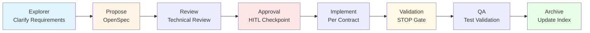
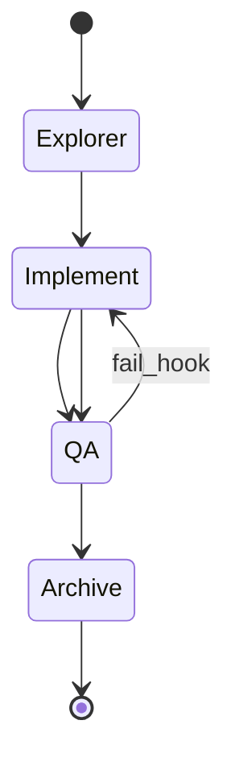
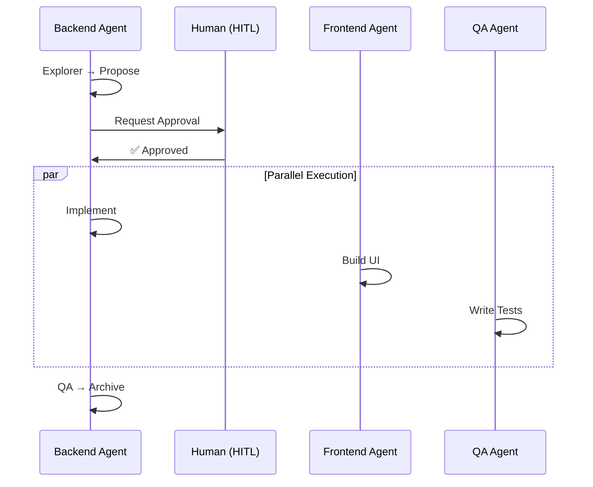
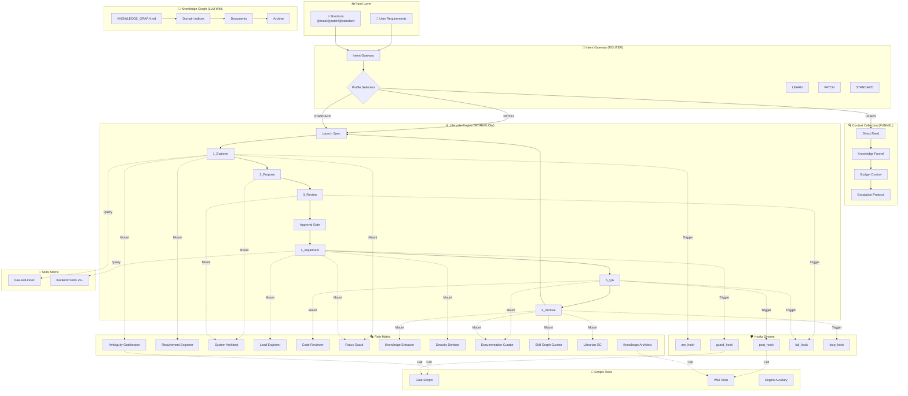
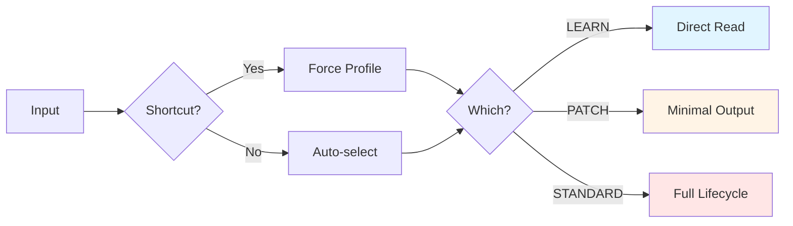
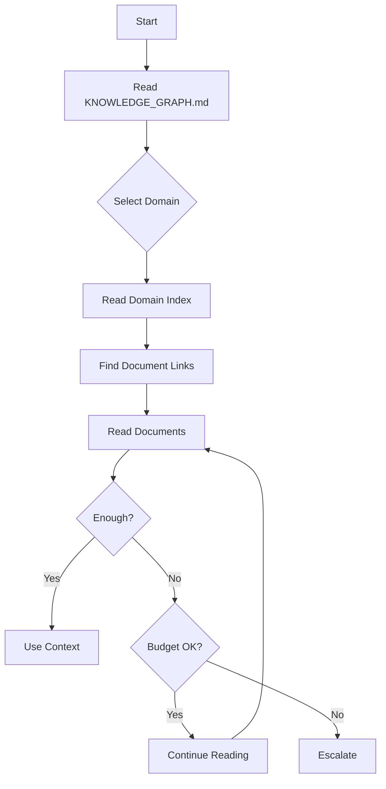
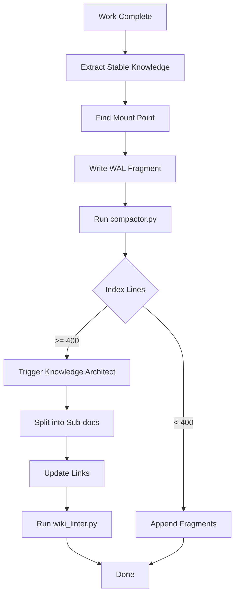
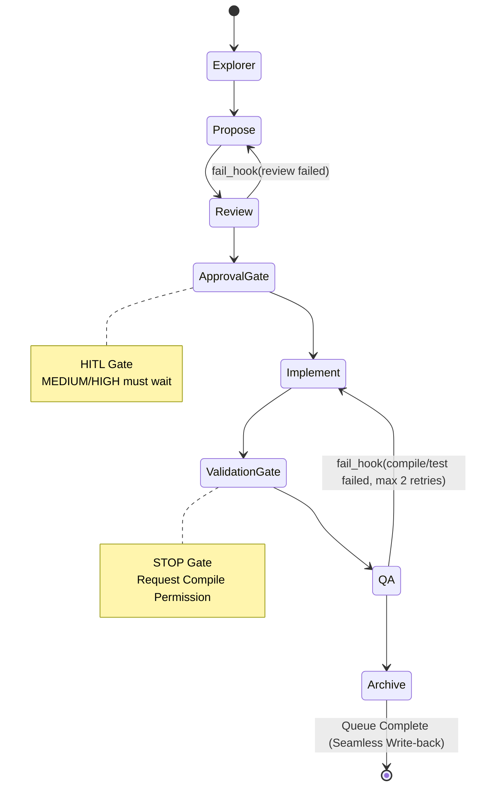
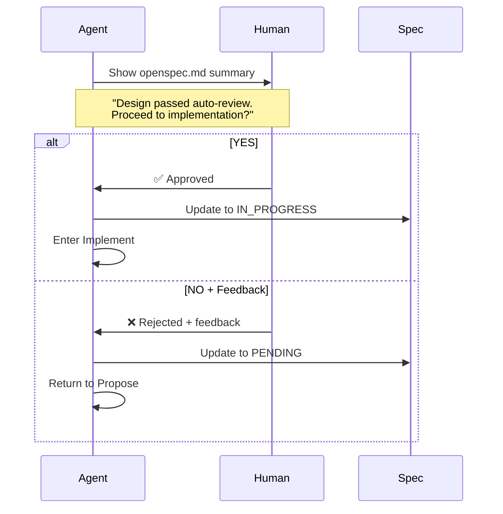
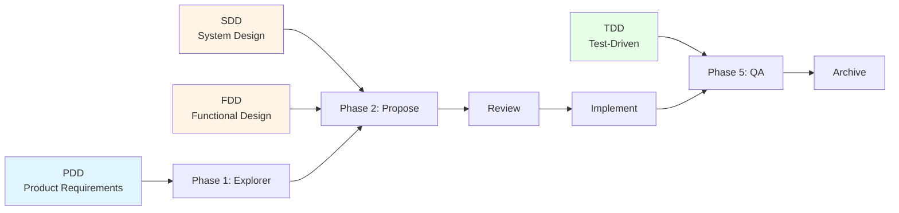

<div align="center">

# Backend Agent Development System<br/>Engineering Manual + Onboarding

### A Comprehensive Guide to Agent-Driven Engineering for Backend Development

[](ENGINEERING_MANUAL.md)
[](README.md)
[](ENGINEERING_MANUAL_zh.md)

**Sustainable • Interruptible • Self-Correcting • Anti-Bloat**

## ⚠️ Critical Positioning Statement

> **This is NOT a traditional development framework or human-facing tool.**
>
> **It is a pure LLM-native specification harness designed exclusively for autonomous execution by large language models.**
>
> From day one, this system was architected to be **driven entirely by AI agents**, not humans. Every component—from the Intent Gateway to the Lifecycle State Machine, from the Knowledge Graph to the Skills Matrix—is engineered as executable protocol for LLMs to self-navigate, self-correct, and self-evolve.
>
> **If you're evaluating this with "human developer tool" standards, you will fundamentally misunderstand its design philosophy.** This is infrastructure for machine-to-machine coordination in software engineering workflows.

[Quick Start](#0-quick-start-3-minutes) | [Architecture](#1-architecture-overview) | [Usage Scenarios](#01-how-to-use-multi-scenario-examples)

---

**Language Versions**: [English (this file)](ENGINEERING_MANUAL.md) | [中文版工程手册](ENGINEERING_MANUAL_zh.md)

</div>

---

This directory defines an **Agent-driven engineering workflow** for **backend development**: achieving a sustainable, interruptible, self-correcting, and anti-bloat development closed-loop through "Intent Gateway + Lifecycle State Machine + Knowledge Graph (LLM Wiki) + Skills + Hook Correction + Role Matrix".

This document serves as both an engineering specification manual and a quick onboarding guide for newcomers.

**Target Audience**: Large Language Models (LLMs) and AI Agents executing backend engineering tasks autonomously. Human readers should understand this as an executable protocol specification, not a traditional user manual.

## 0. Quick Start (3 Minutes)

**Step 1 (Must-Read Rule Entry)**\
Read: [Project-Level Rules](AGENTS.md).

**Step 2 (Drill Down from Knowledge Graph, No Blind Search)**\
Read: [Knowledge Graph Root](.agents/llm_wiki/KNOWLEDGE_GRAPH.md), then drill down layer by layer through indices to your target domain (API / Data / Domain / Architecture / Specs / Preferences).

**Step 3 (Run One Minimal Closed-Loop)**\
Follow: [Lifecycle State Machine](.agents/workflow/LIFECYCLE.md) to complete one task: Explorer → Propose → Review → Approval Gate (HITL) → Implement → QA → Archive.

## 0.1 How to Use (Multi-Scenario Examples)

This section provides typical "follow-along" playbooks. The rules remain consistent: first drill down from the [Knowledge Graph Root](.agents/llm_wiki/KNOWLEDGE_GRAPH.md) to domain indices, then produce contracts and phased deliverables, and finally write back to indices and archive Specs during the Archive phase.

### Scenario A: New Query API (No Schema Changes)

- **Goal**: Add a read-only endpoint (new DTO/Controller/Service) without table structure changes.
- **Drill-down Reading**: sitemap → schema/openspec_schema → wiki/api/index (optionally read domain/index and preferences/index if needed).
- **Lifecycle Path**: Explorer → Propose → Review → Approval Gate (HITL) → Implement → QA → Archive.
- **Key Deliverables**:
  - Explorer: Scope/impact/exception branch list (including non-goals).
  - Propose: OpenSpec (endpoint signature, input/output parameters, error codes, example JSON, acceptance criteria).
  - Implement: Code changes (implemented per contract), no over-engineering.
  - QA: Unit tests and key use case evidence.
- **Archive Write-back**: Extract stable API fragments into corresponding wiki/api/ index; move Spec to archive.



### Scenario B: New API + Schema Changes

- **Goal**: Add new endpoint while creating/modifying table structures and indexes.
- **Drill-down Reading**: sitemap → schema/openspec_schema → wiki/data/index + wiki/api/index.
- **Lifecycle Path**: Explorer → Propose → Review → Approval Gate (HITL) → Implement → QA → Archive.
- **Key Deliverables**:
  - Propose: OpenSpec freezes both API and Data contracts simultaneously.
  - Review: Focus on SQL risk checks, index utilization, authorization risks.
  - QA: Add regression tests covering core queries and boundary conditions.
- **Archive Write-back**: Extract table structure to wiki/data/; endpoints to wiki/api/.

### Scenario C: Bug Fix (Reproduce First, Then Add Tests)

- **Goal**: Fix defects ensuring reproducibility, regressability, and traceability.
- **Drill-down Reading**: sitemap → wiki/testing/index → preferences/index.
- **Lifecycle Path**: Explorer → Implement → QA → Archive.
- **Key Deliverables**:
  - Explorer: Minimal reproduction path, root cause hypothesis.
  - QA: First add failing test, then fix, finally add regression evidence.



### Scenario EPIC: Massive Refactoring or Cross-Domain Feature

- **Goal**: Handle massive features spanning multiple domains or framework migrations.
- **Lifecycle Path**: Forces System Architect to produce a micro-task breakdown in `openspec.md` during Propose.
- **Key Deliverables**: Sub-agent dispatch list; strictly restricts the main Agent from direct coding.

### Scenario DEBUG: Deep Troubleshooting & RCA

- **Goal**: Investigate unknown root causes (e.g., production 500 errors) through deep hypothesis and verification.
- **Lifecycle Path**: Intent downgraded to Audit, Profile downgraded to PATCH.
- **Key Deliverables**: Allows high-frequency terminal commands (e.g., log reading, tests) up to 5 times, but FORBIDS business code modification until RCA is found.

### Scenario EPIC: Massive Refactoring or Cross-Domain Feature

- **Goal**: Handle massive features spanning multiple domains or framework migrations.
- **Lifecycle Path**: Forces System Architect to produce a micro-task breakdown in `openspec.md` during Propose.
- **Key Deliverables**: Sub-agent dispatch list; strictly restricts the main Agent from direct coding.

### Scenario DEBUG: Deep Troubleshooting & RCA

- **Goal**: Investigate unknown root causes (e.g., production 500 errors) through deep hypothesis and verification.
- **Lifecycle Path**: Intent downgraded to Audit, Profile downgraded to PATCH.
- **Key Deliverables**: Allows high-frequency terminal commands (e.g., log reading, tests) up to 5 times, but FORBIDS business code modification until RCA is found.

### Scenario EPIC: Massive Refactoring or Cross-Domain Feature

- **Goal**: Handle massive features spanning multiple domains or framework migrations.
- **Lifecycle Path**: Forces System Architect to produce a micro-task breakdown in `openspec.md` during Propose.
- **Key Deliverables**: Sub-agent dispatch list; strictly restricts the main Agent from direct coding.

### Scenario DEBUG: Deep Troubleshooting & RCA

- **Goal**: Investigate unknown root causes (e.g., production 500 errors) through deep hypothesis and verification.
- **Lifecycle Path**: Intent downgraded to Audit, Profile downgraded to PATCH.
- **Key Deliverables**: Allows high-frequency terminal commands (e.g., log reading, tests) up to 5 times, but FORBIDS business code modification until RCA is found.

### Scenario D: Performance/SQL Optimization

- **Goal**: Optimize performance without changing external behavior.
- **Lifecycle Path**: Explorer → Propose → Review → Approval Gate → Implement → QA → Archive.
- **Key Deliverables**: Document constraints, bottlenecks, solutions, rollback strategies.

### Scenario E: Refactoring

- **Goal**: Improve maintainability without requirement drift.
- **Lifecycle Path**: Explorer → Propose → Review → Approval Gate → Implement → QA → Archive.
- **Key Point**: Cross-domain modifications require explicit authorization.

### Scenario F: Parallel Collaboration

- **Goal**: Backend-led delivery with frontend/QA parallel work after contract freeze.
- **Key Point**: Freeze OpenSpec at Approval Gate for parallel frontend/QA work.



### Scenario G: Knowledge Write-back & Anti-Bloat

- **Goal**: Extract specs into stable indices, control index size.
- **Principle**: New knowledge must find mount point; unmountable content archived.
- **Rule**: Index > 500 lines → split into subdirectory indices.

### Scenario H: Optional Health Check Toolbox

- **Tools**: wiki_linter.py, schema_checker.py, pref_tag_checker.py (read-only checks).

### Scenario I: Read-Only Audit (`Audit.Codebase`)

- **Constraints**: No code mods, no Wiki writes, no lifecycle entry.
- **Output**: Structured audit report with evidence (file path + line range).

### Scenario J: Documentation Q&A (`QA.Doc` / `QA.Doc.Actionize`)

- **QA.Doc**: Q&A with citations, no lifecycle.
- **QA.Doc.Actionize**: Convert to executable queue after confirmation.

***

## 1. Architecture Overview

### 1.1 Core Philosophy

#### Three Fundamental Problems Solved

**Problem 1: Context Bloat Out of Control**

LLMs blindly searching leads to Token waste and attention dispersion.

**Solution: Knowledge Graph + Budgeted Navigation**
- Sitemap→Index→Doc hierarchical drill-down
- Hard budget: Wiki≤3 docs, Code≤8 files
- Saturation Gate, Stop-Wiki/Stop-Code rules

**Problem 2: Requirement Drift & Unauthorized Modifications**

Agent free play leads to cross-domain contamination and contract corruption.

**Solution: Intent Gateway + Role Matrix Guards**
- Intent classification→Profile selection→Launch Spec
- Dynamic Role mounting (Ambiguity Gatekeeper, Focus Guard, etc.)
- Gate checks (ambiguity_gate.py, scope_guard.py)
- Approval Gate HITL

**Problem 3: Knowledge Fragmentation & Unsustainability**

Conversation memory loss, documentation desynchronization, index bloat.

**Solution: WAL Write-back + Auto-Refactoring**
- WAL fragments for low-conflict write-back
- Compaction for intelligent merging
- Drift Queue for inconsistency capture
- Archive cold storage

#### Design Philosophy

**Encode Engineering Discipline as LLM-Executable Protocols**

- **Machine-to-Machine Coordination**: Communication protocol between Agents
- **Self-Navigation**: Autonomously acquire context via Knowledge Graph
- **Self-Correction**: Automatically intercept violations via Hooks
- **Self-Evolution**: Continuous improvement via Preferences memory

**Core Principles:**
- Contract-First: Freeze OpenSpec before implementation
- Anti-Bloat: WAL + Compaction + Archive
- Sustainability: Breakpoint resume + Knowledge extraction
- Determinism: Script tools assistance

### 1.2 System Architecture Diagram



### 1.3 Core Components Details

| Layer | Component | Responsibility | Key Files | Problem Solved |
|-------|-----------|----------------|-----------|----------------|
| **Input** | Intent Gateway | Natural language → Structured intent | [ROUTER.md](.agents/router/ROUTER.md) | Requirements to executable queue |
| **Context** | Knowledge Funnel | Bidirectional navigation | [CONTEXT_FUNNEL.md](.agents/router/CONTEXT_FUNNEL.md) | Context acquisition & anti-bloat |
| **Knowledge** | LLM Wiki | Fractal knowledge graph | [KNOWLEDGE_GRAPH.md](.agents/llm_wiki/KNOWLEDGE_GRAPH.md) | Knowledge organization |
| **Workflow** | Lifecycle Engine | 6-phase state machine | [LIFECYCLE.md](.agents/workflow/LIFECYCLE.md) | Process standardization |
| **Roles** | Role Matrix | Dynamic role mounting | [ROLE_MATRIX.md](.agents/workflow/ROLE_MATRIX.md) | Quality gates & anti-drift |
| **Correction** | Hooks System | Pre/guard/post/fail/loop interception | [HOOKS.md](.agents/workflow/HOOKS.md) | Automatic correction |
| **Capabilities** | Skills Matrix | 25+ professional capabilities | [trae-skill-index](.agents/skills/trae-skill-index/SKILL.md) | Capability standardization |
| **Tools** | Scripts Tools | Deterministic checks | [scripts/](.agents/scripts/) | Determinism enhancement |

### 1.4 Data Flow & Control Flow

**Forward Data Flow:**
```
User Requirements → Intent Gateway → Context Funnel → Launch Spec → Lifecycle Engine → Archive → Wiki Update
```

**Reverse Control Flow:**
```
Hooks System ← pre_hook/guard_hook/post_hook/fail_hook/loop_hook
Role Matrix ← Ambiguity/Focus/Domain/Knowledge Architect roles
Budget Control ← Wiki≤3, Code≤8, Saturation Gate, Escalation
```

---

## 2. Directory Structure & Responsibilities

### 2.1 Overall Directory Tree (Document Level)

```text
java-harness-agent/
│
├── AGENTS.md                              # 📌 Project-level rule entry
├── README.md                              # Project overview (English)
├── README_zh.md                           # Project overview (Chinese)
├── ENGINEERING_MANUAL.md                  # Engineering manual (English, this file)
├── ENGINEERING_MANUAL_zh.md               # Engineering manual (Chinese)
│
└── .agents/
    ├── router/                            # Intent layer
    │   ├── ROUTER.md                      # Intent gateway spec
    │   ├── CONTEXT_FUNNEL.md              # Knowledge funnel spec
    │   └── runs/                          # Launch Specs (not committed)
    │
    ├── workflow/                          # Workflow layer
    │   ├── LIFECYCLE.md                   # Lifecycle spec
    │   ├── HOOKS.md                       # Hooks spec
    │   ├── ROLE_MATRIX.md                 # Role matrix spec
    │   └── runs/                          # Runtime state (not committed)
    │
    ├── llm_wiki/                          # Knowledge layer
    │   ├── KNOWLEDGE_GRAPH.md             # 🗺️ Knowledge graph root
    │   ├── purpose.md                     # System philosophy
    │   ├── schema/                        # Contract templates
    │   │   ├── index.md
    │   │   └── openspec_schema.md
    │   ├── wiki/                          # Active knowledge domains
    │   │   ├── api/
    │   │   │   ├── index.md
    │   │   │   └── wal/
    │   │   ├── data/
    │   │   │   ├── index.md
    │   │   │   └── wal/
    │   │   ├── domain/
    │   │   │   ├── index.md
    │   │   │   └── wal/
    │   │   ├── architecture/
    │   │   │   ├── index.md
    │   │   │   └── wal/
    │   │   ├── specs/
    │   │   │   └── index.md
    │   │   ├── testing/
    │   │   │   ├── index.md
    │   │   │   └── wal/
    │   │   └── preferences/
    │   │       └── index.md
    │   └── archive/                       # Cold storage
    │
    ├── skills/                            # Capability layer (25+ skills)
    │   ├── intent-gateway/SKILL.md
    │   ├── devops-lifecycle-master/SKILL.md
    │   ├── product-manager-expert/SKILL.md
    │   ├── prd-task-splitter/SKILL.md
    │   ├── devops-requirements-analysis/SKILL.md
    │   ├── devops-system-design/SKILL.md
    │   ├── devops-task-planning/SKILL.md
    │   ├── devops-review-and-refactor/SKILL.md
    │   ├── global-backend-standards/SKILL.md
    │   ├── java-engineering-standards/SKILL.md
    │   ├── java-backend-guidelines/SKILL.md
    │   ├── java-backend-api-standard/SKILL.md
    │   ├── java-javadoc-standard/SKILL.md
    │   ├── mybatis-sql-standard/SKILL.md
    │   ├── error-code-standard/SKILL.md
    │   ├── checkstyle/SKILL.md
    │   ├── devops-feature-implementation/SKILL.md
    │   ├── devops-bug-fix/SKILL.md
    │   ├── devops-testing-standard/SKILL.md
    │   ├── code-review-checklist/SKILL.md
    │   ├── api-documentation-rules/SKILL.md
    │   ├── database-documentation-sync/SKILL.md
    │   ├── utils-usage-standard/SKILL.md
    │   ├── aliyun-oss/SKILL.md
    │   ├── skill-graph-manager/SKILL.md
    │   ├── trae-skill-index/SKILL.md
    │   └── linter-severity-standard/SKILL.md
    │
    └── scripts/                           # Tools layer
        ├── gates/                         # Gate scripts
        │   ├── ambiguity_gate.py
        │   ├── focus_card_gate.py
        │   ├── schema_checker.py
        │   ├── wiki_linter.py
        │   ├── pref_tag_checker.py
        │   ├── writeback_gate.py
        │   ├── delivery_capsule_gate.py
        │   ├── secrets_linter.py
        │   ├── comment_linter_java.py
        │   ├── scope_guard.py
        │   ├── skill_index_linter.py
        │   └── run.py
        ├── wiki/                          # Wiki tools
        │   ├── compactor.py
        │   ├── wiki_linter.py
        │   ├── schema_checker.py
        │   ├── pref_tag_checker.py
        │   └── zero_residue_audit.py
        └── harness/                       # Engine auxiliary
            └── engine.py
```

### 2.2 Key Files Responsibilities

**AGENTS.md**: Project-level rule entry with hard constraints (Budget Limits, Approval Gate, Anti-Looping, Scope Guard).

**.agents/router/**:
- **ROUTER.md**: Intent mapping, Profiles, Shortcuts, DSL, intent types, context collection rules, budgeted navigation
- **CONTEXT_FUNNEL.md**: Forward retrieval, backward write-back, budget control, stopping rules, escalation protocol

**.agents/workflow/**:
- **LIFECYCLE.md**: 6-phase state machine, Approval Gate, Launch Spec template, breakpoint resume
- **HOOKS.md**: 5 hooks (pre/guard/post/fail/loop), Non-Convergence Fallback, Justification Bypass
- **ROLE_MATRIX.md**: 12 virtual roles, mounting rules, automation contract

**.agents/llm_wiki/**:
- **KNOWLEDGE_GRAPH.md**: Knowledge graph root node (mandatory entry point)
- **wiki/{domain}/**: Active knowledge domains (api/data/domain/architecture/specs/testing/preferences)
- **archive/**: Cold storage for extracted specs

**.agents/skills/**: 26 specialized skills organized by category (Intent/Lifecycle, Requirements/Design, Implementation, Code Standards, Testing/Review, Documentation).

**.agents/scripts/**:
- **gates/**: 12 gate scripts for deterministic quality checks
- **wiki/**: 5 Wiki maintenance tools
- **harness/**: Optional engine auxiliary

---

## 3. Engine & Processes

### 3.1 Intent Gateway

#### 3.1.1 Execution Mode Profiles

| Profile | Use Cases | Lifecycle? | Deliverables | Risk Level |
|---------|-----------|------------|--------------|------------|
| **LEARN** | Read-only, Q&A | ❌ No | Answer only | - |
| **PATCH** | Small changes, bug fixes | ⚠️ Minimal | Slim Spec/Change Log | LOW |
| **STANDARD** | New features, MEDIUM/HIGH risk | ✅ Full 6 phases | Complete OpenSpec + Approval | MEDIUM/HIGH |



#### 3.1.2 Shortcut DSL

**Syntax**: `@<profile> <flags...> -- <request>`

**Key Flags**:
- Scope: `--scope`, `--direct`, `--funnel`, `--depth`
- Risk: `--risk`, `--slim`, `--changelog`, `--evidence`
- Launch: `--launch`, `--no-launch`, `--writeback`
- Test: `--test`, `--no-test`
- Actionize: `--actionize`, `--yes`

**Conflict Rules**:
- ❌ `@learn` + `--launch` or `--writeback`
- ❌ `--launch` without `@standard`
- ❌ `--slim` without `--risk low`

**Examples**:
```text
@learn --scope src/foo.ts --direct --depth deep -- explain architecture
@patch --risk low --slim --test "mvn test" -- fix NPE
@standard --risk high --launch -- implement permissions
```

#### 3.1.3 Core Intent Types

| Intent | Default Profile | Launch Spec? | Write-back? |
|--------|----------------|--------------|-------------|
| Learn | LEARN | ❌ | ❌ |
| Change | PATCH/STANDARD | ✅ (STANDARD) | Optional |
| DocQA | LEARN | ❌ | ❌ (unless actionize) |
| Audit | LEARN | ❌ | ❌ |

#### 3.1.4 Context Collection Rules

**Rule 0: Direct Read When Scope Clear (MUST)**
- If user provides explicit scope and goal is learning → directly read files
- Do not start from knowledge graph

**Rule 0.1: Decision-First Preflight (MUST)**
Before heavy navigation, output Preflight block with:
- Goal, Deliverables, Assumptions (≤3), Uncertainties (≤2)
- Read strategy (Needle/Obvious/Exploration)
- Budgets (wiki=3, code=8)
- Stop conditions, Escalation plan

**Rule 1: Otherwise Use Knowledge Funnel (MUST)**
1. Read KNOWLEDGE_GRAPH.md
2. Drill down through domain indices
3. Consult trae-skill-index if unsure

#### 3.1.5 Budgeted Navigation & Escalation

**Budgets**: Wiki ≤ 3 docs, Code ≤ 8 files

**Saturation Gate** (stop when any met):
- Template acquired: 2 templates (routing, DTO validation, service pattern, mapper/SQL, table fields)
- Integration point acquired: dependency usage examples
- Executable chain acquired: known-good call chain

**Stop-Wiki (MUST)**: 3 consecutive no-gain wiki reads → stop
**Stop-Code (MUST)**: 2 consecutive reads without scope narrowing → stop

**Elastic Extension**: Use `<Confidence_Assessment>` to request +2 wiki or +3 code budget

**Escalation Protocol (MUST)**:
When budget exhausted or stop rules triggered:
- Generate Escalation Card with: Consumed budgets, Confirmed facts (≤5), Missing info (≤2), Why blocking, Proposed targets (≤5), Request, Fallback plan
- Set launch_spec status to WAITING_APPROVAL

#### 3.1.6 Launch Spec & Breakpoint Resume

**Location**: `.agents/router/runs/launch_spec_{YYYYMMDD_HHMMSS}.md`

**Status Enum**: PENDING, IN_PROGRESS, DONE, WAITING_APPROVAL, FAILED

**Template**:
```markdown
# Launch Spec - {timestamp}

## State Machine
| Intent | Status | Phase | Artifact | Failed_Reason |
|---|---|---|---|---|
| Explore.Req | IN_PROGRESS | 1_Explorer | explore_report.md | - |
| Propose.API | PENDING | - | - | - |

## Breakpoint Resume
- Read this file first upon wake
- If WAITING_APPROVAL: wait for human confirmation
- If FAILED: stop and request intervention
```

**Queue Items (STANDARD only)**:
- `Explore.Req` → Explorer
- `Propose.API` → Propose → Review
- `Propose.Data` → Propose → Review
- `Implement.Code` → Implement → QA
- `QA.Test` → QA

**Concurrency**: Propose.API and Propose.Data can run in parallel.

---

### 3.2 Context Funnel

#### 3.2.1 Forward Retrieval



**Steps**:
1. Start from KNOWLEDGE_GRAPH.md
2. Select domain index (api/data/domain/architecture/preferences)
3. Read index.md to find document links
4. Read specific documents
5. Fallback search only if index tree fails

#### 3.2.2 Backward Write-back



**WAL Fragment Format**:
```markdown
# WAL Fragment - {YYYYMMDD}_{feature_name}
## Type: append | update | delete
## Domain: api | data | domain | architecture | preferences
## Timestamp: {ISO8601}

### Content
[New knowledge]

### Source
- openspec.md: [link]
- launch_spec: [link]
```

**Compaction Logic**:
- If index < 400 lines: merge WAL fragments directly
- If index ≥ 400 lines:
  - Flag NEEDS_REFACTOR
  - Mount Knowledge Architect role
  - Split into focused sub-documents
  - Update routing links
  - Pass wiki_linter.py before continuing

#### 3.2.3 Drift Queue

**Purpose**: Capture Wiki-code inconsistencies

**Trigger**: Code changed but Wiki not synced, or vice versa

**Format**:
```markdown
# Drift Event - {timestamp}
## Type: code_changed | wiki_outdated | contract_mismatch
## Severity: HIGH | MEDIUM | LOW
## Affected: [file paths]
## Description: [difference]
## Suggested Action: [WAL operation]
```

**Handling**: In Archive phase Step 5, read drift_queue/, validate differences, generate WAL fragments to fix Wiki.

---

### 3.3 Lifecycle State Machine

#### 3.3.1 6-Phase State Machine



**Important**: Approval is not a separate phase, but a HITL Gate checkpoint.

#### 3.3.2 Phase 1: Explorer

**Purpose**: Clarify requirements, define scope, identify risks

**Mounted Roles**: Ambiguity Gatekeeper, Requirement Engineer, Focus Guard

**Skills**: product-manager-expert, devops-requirements-analysis, prd-task-splitter

**Output**: `explore_report.md` with:
- Scope and non-goals
- Impact analysis
- Edge cases and boundaries
- **Core Context Anchors** (MUST):
  - Key links (domain/api/data/architecture/preferences)
  - Business vocabulary and invariants
  - Engineering red lines

**Focus Card**: Generated by Ambiguity Gatekeeper with goal/non-goals/allowed scope/stop rules.

#### 3.3.3 Phase 2: Propose

**Purpose**: Design solution and freeze contract

**Mounted Roles**: System Architect

**Skills**: devops-system-design, devops-task-planning

**Output**: `openspec.md` with:
- API signatures and data models
- Database schemas and indexes
- Business logic
- Acceptance criteria
- JSON request/response examples

**Template**: [.agents/llm_wiki/schema/openspec_schema.md](.agents/llm_wiki/schema/openspec_schema.md)

**Risk Levels**:
- LOW: Can use Slim Spec
- MEDIUM/HIGH: MUST use full schema

#### 3.3.4 Phase 3: Review

**Purpose**: Automated technical review against standards

**Skills**: devops-review-and-refactor, global-backend-standards, java-engineering-standards, java-backend-guidelines, java-backend-api-standard, mybatis-sql-standard, error-code-standard

**Review Dimensions**:
1. Architecture & engineering standards
2. API design patterns
3. SQL performance & security
4. Security & data permissions

**Failure Handling**:
- Trigger fail_hook
- Record failure reason in openspec.md
- Rollback to Phase 2 (Propose)

#### 3.3.5 Phase 3.5: Approval Gate (HITL)

**Purpose**: Human checkpoint before implementation

**Risk Grading**:

**HIGH (Must Approve)**:
- Database schema/index changes
- Permission/auth strategy changes
- Error code system changes
- Cross-domain modifications
- Infrastructure components
- Unclear impact or large scope

**MEDIUM (Must Approve)**:
- New/modify external interfaces
- Core business logic adjustments (not DB/permissions)

**LOW (Can Skip)**:
- Documentation changes
- Pure renaming/formatting
- Small bugfixes with clear impact

**Rules**:
- MEDIUM/HIGH: MUST stop at WAITING_APPROVAL
- LOW: Can skip, but Agent must explain why in delivery notes



**Parallel Trigger**: Frozen contract enables frontend/QA agents to start work.

#### 3.3.6 Phase 4: Implement

**Purpose**: Implement code within contract boundaries

**Mounted Roles**: Lead Engineer, Focus Guard, Security Sentinel

**Skills**: devops-feature-implementation, devops-bug-fix, utils-usage-standard, aliyun-oss

**Discipline**:
- Strictly follow approved contract
- Must pass Checkstyle
- Apply defensive programming
- Respect domain boundaries (guard_hook)
- Must not modify files outside focus_card.md scope
- **STOP Gate**: Once code is written, you MUST STOP and ask the human for permission to proceed to compilation. Do not auto-continue into heavy testing.

**Focus Card Enforcement**: scope_guard.py checks if modified files are within allowed scope.

#### 3.3.7 Phase 5: QA Test

**Purpose**: Quality assurance following TDD principles

**Mounted Roles**: Code Reviewer, Documentation Curator

**Skills**: devops-testing-standard, code-review-checklist

**Requirements**:
- Critical path test coverage ≥ 100%
- All checklist items GREEN
- Regression tests for bug fixes
- Performance benchmarks for optimizations

**Test Evidence**: Generate `test_evidence_{feature}.md` with:
- Execution environment and commands
- Objective log snippets
- Covered scenarios ([Pass]/[Fail])
- Coverage metrics

**Failure Handling**: 
- Trigger fail_hook
- **STRICT MAX RETRIES: 2**. If tests or compilation fail more than 2 times, STOP immediately and ask the human for help. Do not enter an infinite loop.
- Rollback to Phase 4 (Implement)

#### 3.3.8 Phase 6: Archive

**Highly Recommended**: Given the heavy context accumulated in previous phases, it is required to execute the Archive phase using **targeted `git diff` or `openspec.md`** to prevent LLM hallucinations and context window overloads, seamlessly within the same session.

**Purpose**: Knowledge extraction and cleanup, prevent bloat

**Mounted Roles**: System Architect, Documentation Curator, Skill Graph Curator, Knowledge Architect (if refactoring needed)

**Skills**: api-documentation-rules, database-documentation-sync

**7 Steps**:

1. **Documentation Sync**: Sync API docs via api-documentation-rules, sync DB docs via database-documentation-sync

2. **Knowledge Extraction**: Extract stable knowledge from openspec.md to domain indices via reverse funnel, write WAL fragments

3. **Cold Storage**: Move original openspec.md to `.agents/llm_wiki/archive/`

4. **WAL Compaction**: Run `python3 .agents/scripts/wiki/compactor.py`
  - If index < 400 lines: append/merge WAL fragments
  - If index ≥ 400 lines: trigger Knowledge Architect refactoring

5. **Handle Drift Events**: Read `.agents/events/drift_queue/`, validate differences, generate WAL fragments to fix Wiki

6. **Preferences Memory**: Request human rating (1-10), extract experiences/anti-patterns to `wiki/preferences/index.md`

7. **Loop Check**: Re-read launch_spec.md, continue next intent until queue empty

**Anti-Bloat Rules**:
- Index > 500 lines → split into subdirectories
- Unmountable content → archive instead of active zone
- All knowledge must have mount point in sitemap tree

---

### 3.4 Hooks System

#### 3.4.1 5 Types of Hooks

| Hook | Trigger Point | Purpose | Effect |
|------|--------------|---------|--------|
| **pre_hook** | Before entering new phase | Load rule sets | Output Preflight |
| **guard_hook** | During core actions (code gen, SQL) | Enforce standards, boundaries, budgets | Block if violation |
| **post_hook** | After completing phase | Ensure docs sync with code | Append logs |
| **fail_hook** | Test/review/compile failure | Rollback to previous phase | Decrement retry count |
| **loop_hook** | After Archive completes | Consume next intent from queue | Continue or finish |
| **Cognitive_Brake** | Before any action | Protocol enforcement | Forces LLM to explicitly reason about roles, boundaries, budgets, and next steps before generating tools or code |

#### 3.4.2 pre_hook

**Bound Skills**: global-backend-standards, java-backend-guidelines

**Required Output**: Decision-First Preflight with budgets (wiki=3, code=8)

#### 3.4.3 guard_hook

**Bound Skills**: checkstyle, java-javadoc-standard

**Purposes**:
1. Standard enforcement
2. Domain boundary guard (no cross-domain without authorization)
3. Anti-runaway guard (enforce budgeted navigation + stop rules + escalation)
4. Anti-drift guard (maintain Focus Card, enforce via scope_guard.py)

**Triggers**: Style violations, permission breaches, cross-domain pollution, budget exhaustion

**Effect**: Immediate block, require rewrite or authorization

#### 3.4.4 post_hook

**Bound Skills**: api-documentation-rules, database-documentation-sync

**Purpose**: Ensure API/DB docs sync with code changes

**Gates**:
- schema_checker.py, wiki_linter.py, ambiguity_gate.py
- writeback_gate.py, delivery_capsule_gate.py
- secrets_linter.py, comment_linter_java.py
- Unified runner: `run.py --intent --profile --phase`

**Justification Bypass**: If gate FAILs due to trivial violations, Agent can generate bypass_justification.md to downgrade to WARN and continue.

**Write-back Policy (MUST)**:
- For PATCH and STANDARD profiles, write-back is REQUIRED:
  - Domain WAL + API WAL + Rules WAL mandatory
  - Data WAL mandatory when schema/DDL changes
- If writeback gate fails, Agent must not mark change as "done"

#### 3.4.5 fail_hook

**Bound Skills**: code-review-checklist

**Purposes**:
1. **State Degradation**: Rollback to previous phase, append failure reason to openspec.md
2. **Max Retries (3 for scripts, STRICT MAX 2 for compilation)**: If same phase fails max allowed times, Agent MUST stop and request human intervention. Never infinite loop.
3. **Script Retry Limit**: Each gate script can fail max 3 times per task. Compilations (`mvn compile`) can fail max 2 times.
4. **Task State Reset**: Retry state clears on task completion (Archive) or interrupt signal; can explicitly reset via `run.py --end-task`
5. **Persistence**: Update launch_spec.md to FAILED with Failed_Reason

**Failed_Reason Format**:
```markdown
## Failed_Reason
**Phase**: Review
**Timestamp**: 2026-04-17T14:30:22Z
**Error Type**: Schema validation failure
**Details**: Missing "Acceptance Criteria" section
**Retry Count**: 2/3
**Next Action**: Fix schema issues and re-submit
```

#### 3.4.6 loop_hook

**Purpose**:
1. **Queue Consumption**: Read launch_spec and resume next PENDING/IN_PROGRESS intent
2. **Concurrency**: Decide what can run in parallel (e.g., Propose.API with Propose.Data)
3. **Loop Restart**: Dispatch next intent to correct lifecycle phase until queue empty

#### 3.4.7 Non-Convergence Fallback (MUST)

**Trigger**: Workflow stuck repeating same actions without convergence (e.g., doc rewrite or linter failure loops)

**Agent MUST**:
1. Stop making same changes
2. Run deterministic verification and identify exact failure evidence (file path + minimal edit)
3. Report mismatch and request human intervention
4. If root cause is missing context or vague scope, use Escalation Card format and set launch_spec to WAITING_APPROVAL

---

## 4. Role Matrix

### 4.1 Core Concept

**Purpose**: Define virtual roles (review personas) and how to dynamically mount based on (Intent, Profile, Phase).

**Specification**: [ROLE_MATRIX.md](.agents/workflow/ROLE_MATRIX.md)

**Hard Rules**:
- For PATCH and STANDARD, roles MUST produce their required artifacts
- "Role outputs" enforced by deterministic gate scripts (exit codes)
- Machine config in role_matrix.json (automated SSOT)

### 4.2 12 Virtual Roles

#### 1. Ambiguity Gatekeeper
**Purpose**: Prevent starting work on vague input and stop runaway exploration early.
**Gate**: `ambiguity_gate.py` + `focus_card_gate.py`

#### 2. Requirement Engineer
**Purpose**: Bridge the gap between human desires and technical specifications. Output Acceptance Criteria.
**Gate**: `ambiguity_gate.py`

#### 3. System Architect
**Purpose**: Design high-level interactions, DDL, and patterns. Handover AC to spec.
**Gate**: Approval Gate

#### 4. Lead Engineer
**Purpose**: Write compilable code adhering to project paradigms. Follow Boundary Exception Protocol.
**Gate**: `scope_guard.py` + Compilation

#### 5. Code Reviewer
**Purpose**: Rigorous tech-lead inspection (Performance, Paradigm, Robustness).
**Gate**: `linter.py`

#### 6. Focus Guard
**Purpose**: Prevent attention drift outside `focus_card.md`.
**Gate**: `scope_guard.py`

#### 7. Knowledge Extractor
**Purpose**: Unified extraction of Domain, API, and Rules into WAL.
**Gate**: `writeback_gate.py`

#### 8. Security Sentinel
**Purpose**: Pure script executor to prevent secret leakage.
**Gate**: `secrets_linter.py`

#### 9. Documentation Curator
**Purpose**: Ensure handoff-ready capsule and WAL references.
**Gate**: `delivery_capsule_gate.py` + `wiki_linter.py`

#### 10. Skill Graph Curator
**Purpose**: Ensure new skills are indexed.
**Gate**: `skill_index_linter.py`

#### 11. Librarian (GC)
**Purpose**: Garbage collect and merge WAL fragments into main wiki.
**Gate**: `wiki_linter.py`

#### 12. Knowledge Architect
**Purpose**: Triggered dynamically to refactor and split bloated Wiki indices.
**Gate**: `wiki_linter.py`

### 4.3 Mounting Rules (by Intent/Profile/Phase)

#### Change / PATCH
- **Explorer**: Ambiguity Gatekeeper + Requirement Engineer + Focus Guard
- **Implement**: Lead Engineer + Focus Guard + Security Sentinel
- **QA**: Code Reviewer + Documentation Curator
- **Archive**: Knowledge Extractor + Documentation Curator + Skill Graph Curator

#### Change / STANDARD
- **Explorer**: Ambiguity Gatekeeper + Requirement Engineer + Focus Guard
- **Propose/Review**: System Architect
- **Implement**: Lead Engineer + Focus Guard + Security Sentinel
- **QA**: Code Reviewer + Documentation Curator
- **Archive**: Knowledge Extractor + Documentation Curator + Skill Graph Curator

### 4.4 Automation Contract

**runner reads role_matrix.json and decides**:
- Which roles needed for current phase
- Which gate scripts must run
- Which artifacts must exist

**Execution Intensity & Artifact-Aware Verification**:
```bash
# quick: skip heavy gates for fast local iteration
python3 .agents/scripts/gates/run.py --verify-level quick

# standard: normal mounted gates (default)
python3 .agents/scripts/gates/run.py --verify-level standard

# strict: same mounted gates with full severity handling (recommended before completion)
python3 .agents/scripts/gates/run.py --verify-level strict

# selective artifact-related gates
python3 .agents/scripts/gates/run.py --artifact-tags domain,api,rules,data,architecture,skill,workflow
```

**Artifact Tags**:
- `domain`: Run Domain WAL checks
- `api`: Run API WAL checks
- `rules`: Run Rules WAL checks
- `data`: Run Data WAL checks (when schema/DDL changes)
- `architecture`: Run architecture decision checks
- `skill`: Run skill graph consistency checks
- `workflow`: Run workflow integrity checks

---

## 5. Phase Deliverables

> This system focuses on **backend delivery**. Frontend/QA handoffs are optional deliverables attached to backend contracts "when parallel collaboration is needed".

| Phase | Backend Must Produce | Optional Frontend/QA Handoffs |
|-------|---------------------|-------------------------------|
| Explorer | explore_report (scope/impact/risks) | None |
| Propose | openspec (strictly per Schema) | API Contract (with JSON Example); Acceptance Criteria (Given/When/Then) |
| Review | Machine review conclusions & modification records | None |
| Approval (HITL) | Human confirmation (freeze contract) | As "starting gun" for parallel collaboration |
| Implement | Code changes (minimum viable implementation) | Optional: integration notes, mocks/examples |
| QA | Unit tests/necessary integration test evidence | Optional: interface self-test scripts, E2E highlights |
| Archive | Extract stable knowledge to indices, archive Spec | Optional: change summary, migration notes |

**Contract Template**: [OpenSpec Schema](.agents/llm_wiki/schema/openspec_schema.md)

---

## 6. Skills Inventory

### 6.1 Skills Dictionary

> Rule: Skills ≠ processes; skills provide "professional capabilities and consistent standards" at certain process phases

#### Intent & Lifecycle (4)
1. **intent-gateway**: Route requests to execution modes
2. **devops-lifecycle-master**: Master orchestration for DevOps Lifecycle
3. **skill-graph-manager**: Manage bidirectional Skill Knowledge Graph
4. **trae-skill-index**: Central Knowledge Graph Index for all workspace skills

#### Requirements & Design (5)
5. **product-manager-expert**: Requirements research, validation, PRD generation
6. **prd-task-splitter**: Analyze PRDs to generate task lists, time estimates, dependencies
7. **devops-requirements-analysis**: PDD & SDD phase, clarify business boundaries
8. **devops-system-design**: System Architecture & Data Modeling (FDD & SDD)
9. **devops-task-planning**: Task Planning after system design, before coding

#### Implementation (4)
10. **devops-feature-implementation**: Feature code implementation (FDD)
11. **devops-bug-fix**: Bug fixing, diagnosis, reproduction, repair
12. **utils-usage-standard**: Utilities usage standards
13. **aliyun-oss**: OSS object storage module

#### Code Standards (9)
14. **global-backend-standards**: MASTER index for all backend development
15. **java-engineering-standards**: Strict layer architecture, pojo sub-packages, business design rules
16. **java-backend-guidelines**: Defensive programming, in-memory assembly, standardized pagination wrappers, Hutool usage
17. **java-backend-api-standard**: Backend API design standards (no path variables, standard verbs, ApiResponse formats)
18. **java-javadoc-standard**: Strict Javadoc commenting style
19. **mybatis-sql-standard**: Strict MyBatis SQL writing standards (performance, anti-JOIN, index utilization)
20. **error-code-standard**: System error codes usage
21. **checkstyle**: Strict Java checkstyle rules (Google + Sun standards)

#### Testing & Review (2)
23. **devops-testing-standard**: TDD phase, write failing unit tests based on Specifications
24. **code-review-checklist**: MANDATORY Code Review Checklist

#### Documentation (2)
25. **api-documentation-rules**: API documentation capture via WAL fragments
26. **database-documentation-sync**: Database documentation capture via WAL fragments

### 6.2 Lifecycle Phase → Recommended Skills Mapping

| Phase | Recommended Skills |
|-------|-------------------|
| Explorer | product-manager-expert, devops-requirements-analysis, prd-task-splitter |
| Propose | devops-system-design, devops-task-planning |
| Review | devops-review-and-refactor, global-backend-standards, java-engineering-standards, java-backend-guidelines, java-backend-api-standard, mybatis-sql-standard, error-code-standard |
| Implement | devops-feature-implementation, devops-bug-fix, utils-usage-standard, aliyun-oss |
| QA | devops-testing-standard, code-review-checklist |
| Archive | api-documentation-rules, database-documentation-sync |
| Audit/QA.Doc | intent-gateway, devops-review-and-refactor |

---

## 7. Common Mechanisms Checklist (Engineering Red Lines)

- **No Blind Search**: Drill down from Sitemap; fallback search only when index cannot find
- **No Unauthorized Access**: Cross-domain modifications must have explicit authorization (write to openspec and confirm in Review/HITL)
- **No Runaway**: Failure rollback + max retry threshold; must stop and request human intervention when threshold reached
- **No Bloat**: Specs must be archived; stable knowledge must be extracted to indices; indices must split when exceeding threshold

---

## 8. Best Practices

### 8.1 Common Pitfalls & Solutions

#### Pitfall 1: Context Bloat
**Symptoms**: Frequently trigger Escalation Protocol, high Token consumption, Agent attention dispersion

**Causes**: Improper navigation strategy (should use Needle but used Exploration), inaccurate Saturation Gate judgment

**Solutions**:
- Check Read strategy selection (Needle for known files, Obvious for clear domains, Exploration for unclear)
- Review 5 template types (routing, DTO validation, service pattern, mapper/SQL, table fields)
- Consider using `--direct` flag to skip unnecessary drill-down

#### Pitfall 2: Unauthorized Modifications
**Symptoms**: scope_guard.py frequently FAILs, modified unexpected files, cross-domain pollution

**Solutions**:
- Always check focus_card.md
- Confirm allowed scope before Implement
- Request explicit authorization before cross-domain changes
- Explicitly list all affected files in openspec.md

#### Pitfall 3: Contract Corruption
**Symptoms**: openspec.md inconsistent with implementation, schema_checker.py frequently fails

**Solutions**:
- Carefully check openspec_schema.md template
- Run schema_checker.py pre-check before implementation
- Verify again after implementation
- Check failed checklist items for patterns

#### Pitfall 4: Index Bloat Too Fast
**Symptoms**: index.md frequently exceeds 400 lines triggering refactoring

**Solutions**:
- Streamline WAL fragments, extract only stable knowledge
- Avoid duplicate content
- Plan subdirectory splits in advance
- Regularly run compactor.py
- Monitor index lines, proactively refactor when approaching 400 lines

#### Pitfall 5: Workflow Stuck Without Convergence
**Symptoms**: Repeating same actions multiple times, same phase repeatedly fails

**Solutions**:
- Trigger Non-Convergence Fallback
- Stop repeating same changes
- Run deterministic verification and identify exact failure evidence
- Use Escalation Card to request human help
- Check if focus_card.md is clear

### 8.2 Efficient Work Techniques

#### Technique 1: Leverage Shortcuts
```text
@read --scope src/main/java/com/example/UserService.java -- explain auth logic
@patch --risk low -- fix NPE in getUserById()
@standard --risk high -- implement RBAC
```

#### Technique 2: Utilize DSL Flags
```text
@learn --scope src/foo/bar.ts --direct --depth deep -- explain architecture
@patch --risk low --slim --test "mvn test -Dtest=UserServiceTest" -- fix NPE
@standard --risk high --launch -- implement permissions with audit trail
```

#### Technique 3: Value Core Context Anchors
Record in explore_report.md:
- Key links (domain/api/data/architecture/preferences)
- Business vocabulary and invariants
- Engineering red lines

#### Technique 4: Reasonable Elastic Extension
Use `<Confidence_Assessment>` when close to breakthrough but budget nearly exhausted:
```markdown
<Confidence_Assessment>
Consumed wiki 3/3, code 7/8. Reading one more wiki doc (wiki/api/authentication_patterns.md) will provide missing JWT integration template.
Request: wiki +1
Fallback if still missing: Ask human for specific auth library.
</Confidence_Assessment>
```

### 8.3 Team Collaboration Suggestions

#### Suggestion 1: Approval Gate as Parallel Starting Point
- Notify frontend/QA teams immediately after contract freeze
- Share API Contract and Acceptance Criteria from openspec.md
- Frontend builds UI based on API contract
- QA writes tests based on acceptance criteria

#### Suggestion 2: Standardize Deliverables
- Ensure openspec.md contains sufficient handoff information
- API Contract includes complete JSON examples
- Acceptance Criteria uses Given/When/Then format
- Standardize error codes and messages

#### Suggestion 3: Regularly Sync Preferences
- Request human rating (1-10) during Archive phase
- Extract experiences/anti-patterns to preferences/index.md
- Next pre_hook automatically loads these preferences
- Regularly review and update preferences

---

## 9. Troubleshooting

### 9.1 Common Problem Diagnosis

#### Problem 1: Budget Frequently Exhausted
**Diagnosis Steps**:
1. Check Read strategy selection: `grep "Read strategy" .agents/router/runs/explore_report.md`
2. Check Saturation Gate judgment: Did you acquire at least 2 templates? Found integration point examples? Have known call chain?
3. Check compliance with Stop-Wiki/Stop-Code rules

**Solutions**: Adjust Read strategy, use `--direct` flag, judge saturation more accurately, use elastic extension near breakthrough

#### Problem 2: Review Repeatedly Fails
**Diagnosis Steps**:
1. Check openspec.md structure: `python3 .agents/scripts/wiki/schema_checker.py path/to/openspec.md`
2. Check failure reasons: `grep "Failed_Reason" .agents/router/runs/launch_spec_*.md`
3. Check for missing required sections: Acceptance Criteria, Security & Permissions, JSON Examples

**Solutions**: Carefully check openspec_schema.md template, run schema_checker.py pre-check, supplement missing sections, fix JSON format

#### Problem 3: Wiki Index Bloats Too Fast
**Diagnosis Steps**:
1. Check index lines: `wc -l .agents/llm_wiki/wiki/api/index.md`
2. Check WAL fragment count: `ls -la .agents/llm_wiki/wiki/api/wal/`
3. Analyze WAL fragment content: Too verbose? Duplicate content?

**Solutions**: Streamline WAL fragments, avoid temporary/unstable info, plan subdirectory splits in advance, regularly run compactor.py

#### Problem 4: Workflow Stuck Without Convergence
**Diagnosis Steps**:
1. Check if Non-Convergence situation: Same file modified 3+ times, same lint error persists, no progress
2. Run deterministic verification: `python3 .agents/scripts/gates/comment_linter_java.py --path src/...`
3. Capture exact failure evidence: file path, line number, error message

**Solutions**: Trigger Non-Convergence Fallback, stop repeating changes, generate Escalation Card, request human intervention

### 9.2 Diagnostic Tools Usage Guide

#### wiki_linter.py
```bash
python .agents/scripts/wiki/wiki_linter.py
```
**Checks**: Dead links, orphan files, index length warnings
**Output**: ERROR (must fix), WARNING (recommended fix)

#### schema_checker.py
```bash
python .agents/scripts/wiki/schema_checker.py path/to/openspec.md
```
**Checks**: Missing key sections, JSON example existence
**Common Failures**: Missing "Acceptance Criteria", incorrect JSON format

#### compactor.py
```bash
python3 .agents/scripts/wiki/compactor.py
```
**Function**: WAL compaction, trigger Knowledge Architect
**Log Interpretation**: "Appended X fragments" = success, "NEEDS_REFACTOR flagged" = needs manual intervention

#### run.py (Unified Gate Runner)
```bash
python3 .agents/scripts/gates/run.py --intent Change --profile STANDARD --phase Implement
```
**Options**: `--verify-level quick|standard|strict`, `--artifact-tags domain,api,rules,...`

---

## 10. Thought Sources & Implementation Mapping

| Thought/Component | Our Understanding | Where Implemented |
|-------------------|-------------------|-------------------|
| OpenSpec (Contract-First) | Freeze requirements & design with structured contract before implementation & testing | openspec_schema.md + Phase 2 Propose + Approval Gate |
| Harness (Lifecycle/State Machine) | Process is not verbal agreement, but rollbackable, interceptable, closable state machine | LIFECYCLE.md |
| Hooks (Correction System) | Lock "unauthorized access, runaway, bloat" into process via guard/fail/loop | HOOKS.md |
| LLM Wiki (Evolvable Knowledge Base) | Let Agents autonomously roam for retrieval via sitemap + multi-level index; prevent bloat via archive | KNOWLEDGE_GRAPH.md + wiki/*/index.md + archive/ |
| Knowledge Graph (Connectivity) | All knowledge must be traceable from root; islands/dead links treated as "garbage" | sitemap mounting discipline + wiki_linter.py |
| Skills (Expert Capability Matrix) | Delegate professional problems to specialized skills, call on-demand within process phases for consistent standards | skills/*/SKILL.md + Phase mapping table |
| Engine (Optional Auxiliary) | Does not replace Agent, only provides deterministic hosting of "queue/phase/retry count" for complex tasks | harness/engine.py (optional) |
| Scripts Tools (Determinism Enhancement) | Delegate checks and auxiliaries requiring determinism to scripts | scripts/wiki/*, scripts/gates/* |
| Role Matrix (Dynamic Mounting) | Dynamically mount virtual roles based on different phases, each responsible for specific quality gates | ROLE_MATRIX.md + role_matrix.json |
| WAL (Write-Ahead Log) | Achieve low-conflict knowledge write-back via WAL fragments, intelligent merging via compaction | wiki/*/wal/ + compactor.py |
| Drift Queue | Capture and fix inconsistencies between Wiki and code | events/drift_queue/ |

### 10.1 Correspondence with PDD/FDD/SDD/TDD

- **PDD (Product Requirements Design)**: Mainly in Phase 1 Explorer (clarify boundaries, decompose tasks, form acceptance criteria)
- **SDD (System Design)**: Mainly in Phase 2 Propose (database/interface/extensibility design written into OpenSpec)
- **FDD (Functional Design)**: Also in Phase 2 Propose (functional behavior, exception branches, boundary conditions clarified)
- **TDD (Test-Driven Development)**: Mainly in Phase 5 QA (can also前置 to before Implement), enforced regression via fail_hook



---

## 11. Entry Index (Recommended Bookmarks)

- **Rules Entry**: [AGENTS.md](AGENTS.md)
- **Knowledge Graph Root**: [.agents/llm_wiki/KNOWLEDGE_GRAPH.md](.agents/llm_wiki/KNOWLEDGE_GRAPH.md)
- **Contract Template**: [.agents/llm_wiki/schema/openspec_schema.md](.agents/llm_wiki/schema/openspec_schema.md)
- **Intent Gateway**: [.agents/router/ROUTER.md](.agents/router/ROUTER.md)
- **Context Funnel**: [.agents/router/CONTEXT_FUNNEL.md](.agents/router/CONTEXT_FUNNEL.md)
- **Lifecycle**: [.agents/workflow/LIFECYCLE.md](.agents/workflow/LIFECYCLE.md)
- **Hooks System**: [.agents/workflow/HOOKS.md](.agents/workflow/HOOKS.md)
- **Role Matrix**: [.agents/workflow/ROLE_MATRIX.md](.agents/workflow/ROLE_MATRIX.md)
- **Skills Master Index**: [.agents/skills/trae-skill-index/SKILL.md](.agents/skills/trae-skill-index/SKILL.md)

---

## Appendix

### A. Glossary

| Term | Chinese | Explanation |
|------|---------|-------------|
| Intent Gateway | 意图网关 | Routes natural language requests to execution modes |
| Profile | 执行模式 | LEARN/PATCH/STANDARD three execution depths |
| Shortcut | 快捷方式 | Syntax for forcing Profile specification (@read/@patch/@standard) |
| Context Funnel | 知识漏斗 | Bidirectional navigation mechanism (forward retrieval + backward write-back) |
| Lifecycle | 生命周期 | 6-phase state machine (Explorer→Archive) |
| Hook | 钩子 | Automatic correction mechanisms (pre/guard/post/fail/loop) |
| Role Matrix | 角色矩阵 | Dynamically mounted virtual role collection |
| WAL | 写前日志 | Low-conflict knowledge write-back mechanism |
| Drift Queue | 漂移队列 | Captures inconsistencies between Wiki and code |
| HITL Gate | 人类闸门 | Human-In-The-Loop approval checkpoint |
| Escalation Protocol | 升级协议 | Protocol to request human help when budget exhausted |
| Saturation Gate | 饱和度门控 | Rules to judge if information is sufficient |
| Delivery Capsule | 交付胶囊 | Complete handoff documentation package |
| Core Context Anchors | 核心上下文锚点 | Collection of key links, business vocabulary, engineering red lines |

### B. Quick Reference Card

#### Common Commands
```bash
# Run unified gates
python3 .agents/scripts/gates/run.py --intent Change --profile STANDARD --phase Implement

# Check Wiki health
python .agents/scripts/wiki/wiki_linter.py

# Check OpenSpec structure
python .agents/scripts/wiki/schema_checker.py path/to/openspec.md

# WAL compaction
python3 .agents/scripts/wiki/compactor.py

# Check secrets leakage
python3 .agents/scripts/gates/secrets_linter.py --paths "src/**/*.java"
```

#### Shortcuts Quick Reference
```text
@read --scope <path> -- <question>          # Read-only learning
@patch --risk low -- <fix description>      # Quick fix
@standard --risk high --launch -- <feature> # Full lifecycle
```

#### Status Values Quick Reference
```text
PENDING           # To be executed
IN_PROGRESS       # Executing
DONE              # Completed
WAITING_APPROVAL  # Waiting for human approval
FAILED            # Failed (requires human intervention)
```

#### Budget Limits
```text
Wiki ≤ 3 docs
Code ≤ 8 files
Max retries = 3
Index threshold = 400 lines
```

### C. Version History

| Version | Date | Change Description |
|---------|------|-------------------|
| 1.0.0 | 2026-04-17 | Initial version, comprehensive revision of ENGINEERING_MANUAL.md |

---

<div align="center">

**Built for Sustainable Intelligent Backend Development**

[⬆ Back to Top](#backend-agent-development-system)

</div>
