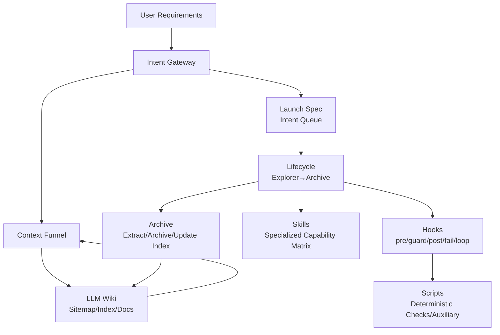
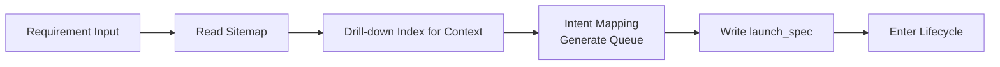
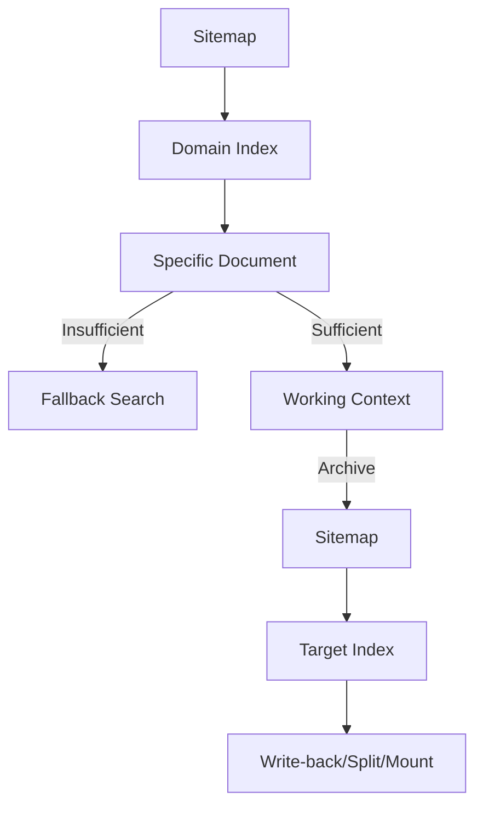
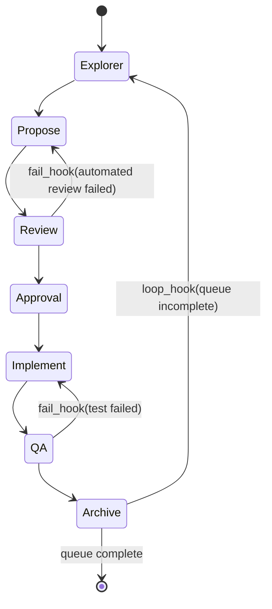
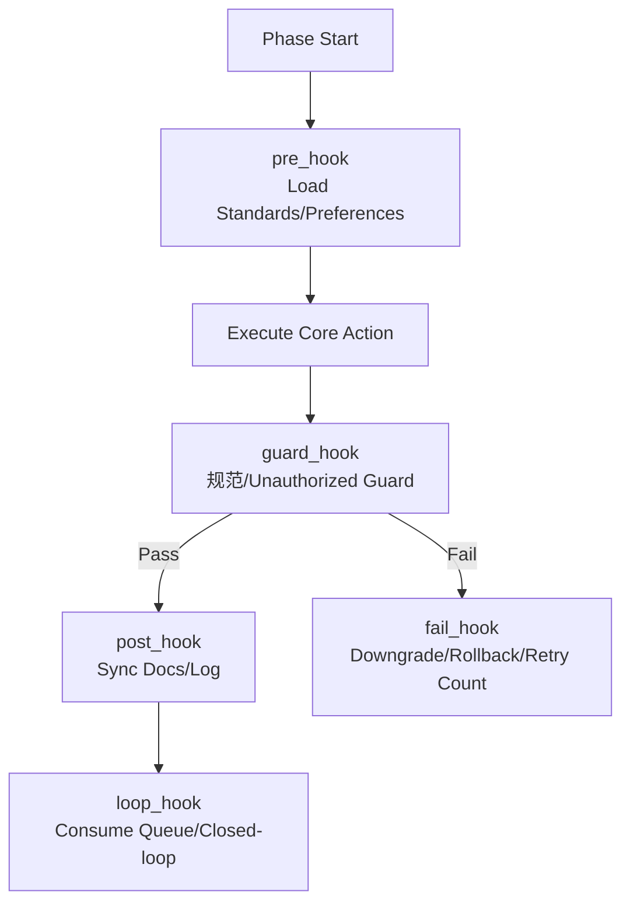

<div align="center">

# Backend Agent Development System<br/>Engineering Manual + Onboarding

### A Comprehensive Guide to Agent-Driven Engineering for Backend Development

[](ENGINEERING_MANUAL.md)
[](README.md)
[](README_zh.md)

**Sustainable • Interruptible • Self-Correcting • Anti-Bloat**

[Quick Start](#0-quick-start-3-minutes) | [Architecture](#1-architecture-overview) | [Usage Scenarios](#01-how-to-use-multi-scenario-examples)

---

**Language Versions**: [English (this file)](ENGINEERING_MANUAL.md) | [中文版工程手册](ENGINEERING_MANUAL_zh.md)

</div>

---

This directory defines an **Agent-driven engineering workflow** for **backend development**: achieving a sustainable, interruptible, self-correcting, and anti-bloat development closed-loop through "Intent Gateway + Lifecycle State Machine + Knowledge Graph (LLM Wiki) + Skills + Hook Correction".

This document serves as both an engineering specification manual and a quick onboarding guide for newcomers.

---

## 0. Quick Start (3 Minutes)

**Step 1 (Must-Read Rule Entry)**\
Read: [Project-Level Rules](AGENTS.md).

**Step 2 (Drill Down from Knowledge Graph, No Blind Search)**\
Read: [Knowledge Graph Root](.agents/llm_wiki/KNOWLEDGE_GRAPH.md), then drill down layer by layer through indices to your target domain (API / Data / Domain / Architecture / Specs / Preferences).

**Step 3 (Run One Minimal Closed-Loop)**\
Follow: [Lifecycle State Machine](.agents/workflow/LIFECYCLE.md) to complete one task: Explorer → Propose → Review → Approval → Implement → QA → Archive.

---

## 0.1 How to Use (Multi-Scenario Examples)

This section provides typical "follow-along" playbooks. The rules remain consistent: first drill down from the [Knowledge Graph Root](.agents/llm_wiki/KNOWLEDGE_GRAPH.md) to domain indices, then produce contracts and phased deliverables, and finally write back to indices and archive Specs during the Archive phase.

### Scenario A: New Query API (No Schema Changes)

- **Goal**: Add a read-only endpoint (new DTO/Controller/Service) without table structure changes.
- **Drill-down Reading**: sitemap → schema/openspec_schema → wiki/api/index (optionally read domain/index and preferences/index if needed).
- **Lifecycle Path**: Explorer → Propose → Review → Approval → Implement → QA → Archive.
- **Key Deliverables**:
  - Explorer: Scope/impact/exception branch list (including non-goals).
  - Propose: OpenSpec (endpoint signature, input/output parameters, error codes, example JSON, acceptance criteria).
  - Implement: Code changes (implemented per contract), no over-engineering.
  - QA: Unit tests and key use case evidence.
- **Archive Write-back**: Extract stable API fragments into corresponding wiki/api/ index; move Spec to archive.

### Scenario B: New API + Schema Changes (Including Indexes)

- **Goal**: Add new endpoint while creating/modifying table structures and indexes.
- **Drill-down Reading**: sitemap → schema/openspec_schema → wiki/data/index + wiki/api/index (optionally read domain/index if needed).
- **Lifecycle Path**: Explorer → Propose → Review → Approval → Implement → QA → Archive.
- **Key Deliverables**:
  - Propose: OpenSpec freezes both API and Data contracts simultaneously (field semantics, constraints, index design, compatibility strategy).
  - Review: Focus on automated SQL risk checks, index utilization, implicit conversion, and authorization risks.
  - QA: Add regression tests covering core queries and boundary conditions.
- **Archive Write-back**: Extract table structure and index highlights to wiki/data/; endpoint highlights to wiki/api/; synchronize database documentation and ER diagrams (if applicable).

### Scenario C: Bug Fix (Reproduce First, Then Add Tests)

- **Goal**: Fix defects ensuring reproducibility, regressability, and traceability.
- **Drill-down Reading**: sitemap → wiki/testing/index (strategy and evidence writing) → preferences/index (historical taboos).
- **Lifecycle Path**: Explorer → Implement → QA → Archive.
- **Key Deliverables**:
  - Explorer: Minimal reproduction path, root cause hypothesis, impact analysis (whether Propose/contract update is needed).
  - QA: First add failing test case, then fix implementation, finally add regression evidence.
- **Archive Write-back**: Record reproduction and fix summary in wiki/testing/ or reviews/; update related API/Domain indices if necessary.

### Scenario D: Performance/SQL Optimization (Review as Primary Gate)

- **Goal**: Optimize performance or rewrite SQL without changing external behavior.
- **Drill-down Reading**: sitemap → wiki/api/index (external behavior) → wiki/data/index (index and query constraints) → preferences/index.
- **Lifecycle Path**: Explorer → Propose → Review → Approval → Implement → QA → Archive.
- **Key Deliverables**:
  - Propose: Document "behavior unchanged" constraints, performance bottlenecks, candidate solutions, and rollback strategies.
  - Review: Prioritize SQL standards and index utilization; reduce solution complexity if necessary.
  - QA: Add comparative evidence (key use case performance and correctness).
- **Archive Write-back**:沉淀 reusable performance rules and counterexamples to preferences/ or data/ indices.

### Scenario E: Refactoring (With Boundary Guards and Non-Goals)

- **Goal**: Improve maintainability or split responsibilities without introducing requirement drift.
- **Drill-down Reading**: sitemap → wiki/architecture/index (if available) → preferences/index → domain/index (boundaries and terminology).
- **Lifecycle Path**: Explorer → Propose → Review → Approval → Implement → QA → Archive.
- **Key Deliverables**:
  - Explorer: Clarify "what to do / what not to do", list potential cross-domain points.
  - Review/Approval: Cross-domain modifications require explicit authorization; otherwise considered unauthorized and rolled back directly.
- **Archive Write-back**: Write architectural decisions and boundary rules back to architecture/ and preferences/ for future guard_hook effectiveness.

### Scenario F: Parallel Collaboration (Backend-Led Delivery, Optional Frontend/QA Parallel Work)

- **Goal**: Backend-led delivery allowing frontend and QA to proceed in parallel after contract freeze.
- **Drill-down Reading**: sitemap → schema/openspec_schema (confirm handoff fields) → wiki/api/index.
- **Lifecycle Path**: Explorer → Propose → Review → Approval (freeze contract) → Implement → QA → Archive.
- **Collaboration Key Points**:
  - Freeze OpenSpec during Approval phase, making it the single source of truth for parallel frontend/QA work.
  - Minimum backend handoff comes from OpenSpec (example JSON, acceptance criteria, error codes); other content remains backend-cohesive, not forced outward.

### Scenario G: Knowledge Write-back and Anti-Bloat (Archive Maintenance)

- **Goal**: Extract "short-lived Specs" into "stable indices" and control index size.
- **Drill-down Reading**: sitemap → target domain index (api/data/domain/testing/preferences).
- **Lifecycle Path**: Archive (as independent maintenance action) or follow regular task Phase 6.
- **Write-back Principles**:
  - New knowledge must find a mount point to write back to domain indices; unmountable content should be archived rather than left in active zones.
  - Any index exceeding threshold (e.g., 500 lines) must split into subdirectory indices and update parent mounts.

### Scenario H: Optional Health Check Toolbox (Does Not Replace Agent)

- **Goal**: Perform deterministic health checks when uncertain about graph or contract structure integrity.
- **Optional Tools (report only, no file modification)**:
  - Graph health check: [wiki_linter.py](.agents/scripts/wiki/wiki_linter.py) (dead links/orphans/length warnings)
  - Contract health check: [schema_checker.py](.agents/scripts/wiki/schema_checker.py) (critical structure missing checks)
  - Preference health check: [pref_tag_checker.py](.agents/scripts/wiki/pref_tag_checker.py) (rule tag规范 checks)

---

## 1. Architecture Overview

### 1.1 Component Architecture Diagram



### 1.2 Core Philosophy (One-Liners)

- **No RAG Feeding to LLM**: Only provide "graph entry + navigation rules + fallback search rights", letting Agents autonomously roam to acquire context.
- **Contract-First**: Write OpenSpec before code; give reviews and parallel collaboration something to grip.
- **Closed-Loop & Correction**: Failure rollback, max retries, anti-unauthorized-access, HITL, human rating沉淀 preferences, forming long-term evolution.
- **Anti-Bloat**: Specs are "hot, short-lived" and must be extracted into stable indices during Archive phase, with Index size controlled.

---

## 2. Directory Structure & Responsibilities (Package-Level)

```text
.
├── .agents/router/          # Intent gateway & context funnel (entry & navigation rules)
├── .agents/workflow/        # Lifecycle state machine & hooks (interception/correction/closed-loop)
├── .agents/llm_wiki/        # Knowledge base (knowledge graph/index/domain knowledge/archive)
├── .agents/skills/          # Specialized skills (SKILL.md as unit)
└── .agents/scripts/         # Deterministic scripts (graph checks, auxiliary tools)
```

Recommend treating "what to read, how to do, where to write back after completion" as part of engineering, uniformly written into indices and contracts rather than stored in conversation memory.

### 2.1 AGENTS.md (Project-Level Rule Entry)

- **Positioning**: The "master entry rule" of this system. Used to constrain Agent's free play within controllable boundaries (no blind search, no unauthorized access, no runaway, no bloat).
- **Input/Output**: Input = any task; Output = unified execution discipline (retrieval, lifecycle, correction, archiving, optional handoffs).
- **Trigger Points**: Must read at the start of every task; return here when disputes arise (paths, whether to parallelize, whether handoffs are needed).
- **Typical Scenarios**: Newcomer onboarding; external Agent integration; task interruption recovery; adjudication when "should I continue implementing / should I make cross-domain changes" arises.

### 2.2 .agents/router/ (Intent Layer: Transforming Requirements into Executable Queues)

This layer solves the problem of "user says one sentence → what exactly do I need to do, what first, what next".

- **Key Files**
  - [intent-gateway.md](.agents/router/ROUTER.md)
    - **What it does**: Splits natural language requirements into intent queues (e.g., `Propose.API -> Implement.Code -> QA.Test`) and defines "concurrency semantics = order independence".
    - **Output**: `.agents/router/runs/launch_spec_*.md` (intent queue persistence + breakpoint resumption).
  - [context-funnel.md](.agents/router/CONTEXT_FUNNEL.md)
    - **What it does**: Defines Agent's "forward retrieval (drill-down)" and "reverse write-back (archive extraction)".
    - **Red Lines**: Fallback search allowed only when index tree fails; write-back must find mount points first, indices exceeding threshold must split.
- **Typical Scenarios**
  - New endpoint: Split into `Propose.API -> Review -> Approval -> Implement.Code -> QA.Test -> Archive`.
  - Schema changes: Split into `Propose.Data -> Review -> Approval -> Implement.Code -> QA.Test -> Archive`.
  - Bug fix: Split into `Explore.Req -> Implement.Code -> QA.Test -> Archive`.

### 2.3 .agents/workflow/ (Process Layer: Lifecycle State Machine + Hook Correction)

This layer solves "how to ensure tasks are rollbackable, reviewable, and closed-loop".

- **Key Files**
  - [lifecycle.md](.agents/workflow/LIFECYCLE.md)
    - **What it does**: Defines unidirectional state machine from Explorer→Archive; specifies freeze points (Phase 3.5) and closed-loop points (Phase 6).
    - **Output**: Phased deliverables (explore_report/openspec/test evidence/archive extraction).
  - [hooks.md](.agents/workflow/HOOKS.md)
    - **What it does**: Writes engineering red lines "into the process", forming guard/fail/loop correction systems.
    - **Output**: Block/downgrade/rollback/stop and request human intervention.
- **Typical Scenarios**
  - Design failed automated review: Review failure → fail_hook → rollback to Propose for rewrite.
  - Test failure: QA failure → fail_hook → rollback to Implement for fix.
  - Cross-domain modification: guard_hook triggers domain boundary guard → requires explicit authorization or stop.
  - Multi-intent queue: loop_hook consumes queue → automatically starts next Explorer round.

### 2.4 .agents/llm_wiki/ (Knowledge Layer: Evolvable Fractal Graph)

This layer solves "how to organize knowledge, how to retrieve it, how to prevent bloat".

- **Key Files**
  - [.agents/llm_wiki/KNOWLEDGE_GRAPH.md](.agents/llm_wiki/KNOWLEDGE_GRAPH.md)
    - **What it does**: Knowledge graph root node, only mounts top-level domain entries; mandatory retrieval starting point for Agents.
  - schema/
    - [schema/index.md](.agents/llm_wiki/schema/index.md): Specification domain index (router), telling you "which contract to read / which process to jump to".
    - [openspec_schema.md](.agents/llm_wiki/schema/openspec_schema.md): OpenSpec contract template (primary backend deliverable; optionally carries frontend/QA handoff fields).
  - wiki/
    - **What it does**: Active knowledge domains (domain/api/data/architecture/specs/testing/preferences), isolated by domain, indices must be drill-downable.
  - archive/
    - **What it does**: Cold data; Specs enter archive after extraction completion, retaining traceability without polluting active zones.
- **Typical Scenarios**
  - New knowledge write-back: Extract unstable specs into stable API/Data/Domain indices during Archive phase.
  - Anti-bloat splitting: When an index exceeds threshold → split into subdirectory index and update parent mount.

### 2.5 .agents/skills/ (Capability Layer: Specialized Expert Capability Plugins)

This layer solves "when tasks enter specialized domains, how to quickly invoke professional capabilities while maintaining consistent standards".

- **Basic Convention**: One directory per skill, entry file is `.agents/skills/<skill-name>/SKILL.md`.
- **Typical Scenarios**: Must pass Java/API/SQL/permission standard reviews before implementation; must synchronize API/DB documentation during archive phase.

### 2.6 .agents/scripts/ (Tool Layer: Deterministic Enhancement, Does Not Replace Agent)

This layer solves "which things must be completed deterministically, cannot rely on LLM guessing".

- wiki/
  - `wiki_linter.py`: Graph health check (dead links/orphans/length warnings).
  - `schema_checker.py`: Contract structure health check (critical paragraph and JSON example existence checks).
  - `pref_tag_checker.py`: Preference rule tag health check (for precise retrieval).
- .agents/workflow/
  - `engine.py`: Queue state auxiliary (optional; helps record current .agents/router/phase/retry count for complex tasks).

### 2.7 Typical Execution Path Examples for Each Directory

**.agents/router/**
- Typical path: User requirements → read .agents/llm_wiki/KNOWLEDGE_GRAPH.md → trigger intent mapping → write to .agents/router/runs/launch_spec_*.md
- Scenario example: New endpoint → generate Propose.API -> Implement.Code -> QA.Test queue
- Result: Queue becomes the "sole scheduling basis" for subsequent Lifecycle

**.agents/workflow/**
- Typical path: Read launch_spec → enter Phase 1 → Propose/Review → Approval (HITL) → Implement → QA → Archive
- Scenario example: Review not passed → trigger fail_hook → rollback to Propose for rewrite
- Result: State machine ensures rollbackability, correctability, and closed-loop

**.agents/llm_wiki/**
- Typical path: Drill down from .agents/llm_wiki/KNOWLEDGE_GRAPH.md → enter domain index → read specific documents → reverse write-back to index during archive
- Scenario example: New API → append entry to wiki/api/index.md → split into subdirectory if threshold exceeded
- Result: Knowledge is retrievable, extensible, and non-bloated

**.agents/skills/**
- Typical path: Enter Review/Implement/QA → invoke corresponding skills based on task → output standardized suggestions/check results
- Scenario example: New Controller → trigger java-backend-api-standard and api-documentation-rules
- Result: Professional rules前置, reducing implementation deviation

**.agents/scripts/**
- Typical path: Enter Archive → optionally run wiki_linter/schema_checker/pref_tag_checker → output health report or format suggestions
- Scenario example: Discover orphaned files →提示 mount to sitemap/index
- Result: Graph connectivity and structural quality controllable

---

## 3. Engine & Process (Detailed Explanation + Flowcharts)

### 3.1 Intent Gateway

**Purpose**: Split natural language requirements into flowable intent queues (e.g., Propose.API → Implement.Code → QA.Test) and define "concurrency semantics = order independence".\
**Specification File**: [Intent Gateway](.agents/router/ROUTER.md)



### 3.2 Context Funnel (Forward Retrieval + Reverse Write-back)

**Purpose**: Solve "how to get context, how to ensure no bloat".\
**Specification File**: [Context Funnel](.agents/router/CONTEXT_FUNNEL.md)

- Forward retrieval: Sitemap → domain index → specific documents → fallback keyword search if necessary
- Reverse write-back: Find mount points based on Sitemap, write new knowledge back to domain indices; split into sub-indices when exceeding threshold



### 3.3 Lifecycle (State Machine)

**Purpose**: Solidify "analysis→design→review→implement→test→archive" into a rollbackable, closed-loop state machine.\
**Specification File**: [Lifecycle](.agents/workflow/LIFECYCLE.md)



### 3.4 Hooks (Correction System)

**Purpose**: "Lock engineering red lines into the process", achieving automatic correction and anti-runaway.\
**Specification File**: [Hooks](.agents/workflow/HOOKS.md)



---

## 4. Self-Correction Mechanisms (Trigger Points / Conditions / Effects / Evaluation)

| Mechanism | Trigger Point | Trigger Condition | Effect | Evaluation Method |
|-----------|--------------|-------------------|--------|-------------------|
| **guard_hook** | During implementation/modification | Style violations, permission/unauthorized access, cross-domain pollution | Immediate block, require rewrite or authorization | Standard skill review, rule verification |
| **fail_hook** | Any phase failure | Compilation/test/review failures | State downgrade rollback; log failure reason; trigger retry count | Objective logs (compilation/test output) |
| **Max Retries** | Inside fail_hook | Same phase consecutive failures reach threshold | Force stop and request human intervention | Failure count reaches threshold |
| **Approval (HITL)** | After Review passes | Need to enter Implement | "Freeze contract", human authorizes whether to proceed to implementation | Human confirmation (YES/NO + modification feedback) |
| **Archive Write-back** | Task completion | New/changed knowledge needs沉淀 | Extract stable knowledge from Spec, archive hot documents, update indices | Rule validation, connectivity check (optional scripts) |
| **Preferences Memory** | Before/after Archive | Representative human ratings/feedback |沉淀 experience as preferences/taboos, effective in next pre_hook | Human rating + textual reasoning |

---

## 5. Phase Deliverables (Primary Backend Deliverables + Optional External Handoffs)

> This system focuses on **backend delivery**. Frontend/QA handoffs are optional deliverables附带 provided by backend contracts "when parallel collaboration is needed".

| Phase | Required Backend Output | Optional Handoffs to Frontend/QA |
|-------|------------------------|----------------------------------|
| Explorer | explore_report (scope/impact/risks) | None |
| Propose | openspec (strictly per Schema) | API Contract (with JSON Example); Acceptance Criteria (Given/When/Then) |
| Review | Automated review conclusions and modification records | None |
| Approval (HITL) | Human confirmation (freeze contract) | Acts as "starting gun" for parallel collaboration |
| Implement | Code changes (minimal viable implementation) | Optional: Integration notes, Mock/examples |
| QA | Unit tests/necessary integration test evidence | Optional: Endpoint self-test scripts, E2E highlights |
| Archive | Extract stable knowledge to indices, archive Spec | Optional: Change summary, migration notes |

Contract template details: [OpenSpec Schema](.agents/llm_wiki/schema/openspec_schema.md).

---

## 6. Skills (Skill List + Phase Mapping)

### 6.1 Skill Dictionary (3–5 Lines Description + Usage Phase per Skill)

> Rule: Skills are not processes; skills provide "professional capabilities and consistent standards" at certain process phases.

- **[intent-gateway](.agents/skills/intent-gateway/SKILL.md)**\
  Purpose: Intent entry capability, assists in understanding requirements and initiating "read graph first then drill-down" work posture.\
  Usage Phase: Task start/Explorer entry.\
  Trigger: When any natural language requirement enters the system.

- **[devops-lifecycle-master](.agents/skills/devops-lifecycle-master/SKILL.md)**\
  Purpose: Lifecycle master orchestration, ensures strict adherence to Phase boundaries (no code before Propose, etc.).\
  Usage Phase: Entire process (orchestrator).\
  Trigger: Complex tasks, multi-intent queues, or when strict process adherence is required.

- **[product-manager-expert](.agents/skills/product-manager-expert/SKILL.md)**\
  Purpose: Requirement clarification, scope definition, business goals and acceptance criteria refinement.\
  Usage Phase: Explorer (PDD).\
  Trigger: Vague requirements, inconsistent口径, need to supplement user stories/acceptance items.

- **[prd-task-splitter](.agents/skills/prd-task-splitter/SKILL.md)**\
  Purpose: Split PRD into structured development tasks, dependencies, and execution order.\
  Usage Phase: Task decomposition before Explorer → Propose.\
  Trigger: Large requirement span, multiple modules in parallel.

- **[devops-requirements-analysis](.agents/skills/devops-requirements-analysis/SKILL.md)**\
  Purpose: PDD/SDD boundary梳理, output executable requirement specifications and impact analysis.\
  Usage Phase: Explorer.\
  Trigger: Need to form standardized requirement documents or clarify scope/non-goals.

- **[devops-system-design](.agents/skills/devops-system-design/SKILL.md)**\
  Purpose: System design and data modeling (FDD/SDD), including table structures, indexes, scalability solutions.\
  Usage Phase: Propose.\
  Trigger: New/modified endpoints or data structures, involving architectural decisions.

- **[devops-task-planning](.agents/skills/devops-task-planning/SKILL.md)**\
  Purpose: Decompose design into implementation task lists, clarify implementation order and verification points.\
  Usage Phase: Between Propose → Review.\
  Trigger: Before entering implementation, need to break work into executable steps.

- **[devops-review-and-refactor](.agents/skills/devops-review-and-refactor/SKILL.md)**\
  Purpose: Review and refactor suggestions for design and implementation, reduce performance/maintenance risks.\
  Usage Phase: Review.\
  Trigger: Controversial solutions, quality gates need strengthening.

- **[global-backend-standards](.agents/skills/global-backend-standards/SKILL.md)**\
  Purpose: Global backend standards index entry, used to unify engineering norms/layering/dependency rules.\
  Usage Phase: pre_hook / Review.\
  Trigger: Any backend modification entering review and implementation.

- **[java-engineering-standards](.agents/skills/java-engineering-standards/SKILL.md)**\
  Purpose: Java engineering layering and package structure norms, ensure responsibility boundaries and maintainability.\
  Usage Phase: Review / Implement.\
  Trigger: New modules, refactoring, cross-layer calls and other risk scenarios.

- **[java-backend-guidelines](.agents/skills/java-backend-guidelines/SKILL.md)**\
  Purpose: Java defensive programming, Complete assembly, pagination and other general coding guidelines.\
  Usage Phase: pre_hook / Implement.\
  Trigger: Writing business code, involving parameter validation/exception handling.

- **[java-backend-api-standard](.agents/skills/java-backend-api-standard/SKILL.md)**\
  Purpose: Endpoint design norms (verbs/paths/response structures), prevent API evolution out of control.\
  Usage Phase: Review.\
  Trigger: New/modified Controllers, DTOs, external API contracts.

- **[java-javadoc-standard](.agents/skills/java-javadoc-standard/SKILL.md)**\
  Purpose: Unified Javadoc style and annotation norms, ensure readability and consistency.\
  Usage Phase: guard_hook / Implement.\
  Trigger: New important classes/public methods, need to complete annotations.

- **[java-data-permissions](.agents/skills/java-data-permissions/SKILL.md)**\
  Purpose: Data permission constraints (query filtering/action validation), prevent unauthorized access.\
  Usage Phase: guard_hook / Review.\
  Trigger: Involving user/organization data reading, cross-tenant risk points.

- **[mybatis-sql-standard](.agents/skills/mybatis-sql-standard/SKILL.md)**\
  Purpose: MyBatis SQL performance and规范 guards (avoid implicit conversions, JOIN risks, index utilization).\
  Usage Phase: Review / Implement.\
  Trigger: Writing Mapper XML, complex queries, performance-sensitive endpoints.

- **[error-code-standard](.agents/skills/error-code-standard/SKILL.md)**\
  Purpose: Unified error codes and exception expression, prevent arbitrary throwing causing frontend-backend disconnect.\
  Usage Phase: Review / Implement.\
  Trigger: New BusinessException/ApiResponse.failed branches, etc.

- **[checkstyle](.agents/skills/checkstyle/SKILL.md)**\
  Purpose: Java code style mandatory gate (Google/Sun hybrid rules).\
  Usage Phase: guard_hook / QA.\
  Trigger: Before commit, before review, high risk of inconsistent formatting.

- **[devops-feature-implementation](.agents/skills/devops-feature-implementation/SKILL.md)**\
  Purpose: Implement feature code per specifications (emphasizing TDD and engineering standards).\
  Usage Phase: Implement.\
  Trigger: Entering coding phase to implement requirements.

- **[devops-bug-fix](.agents/skills/devops-bug-fix/SKILL.md)**\
  Purpose: Defect localization, reproduction, fix and add regression tests.\
  Usage Phase: Implement / QA.\
  Trigger: Production/test defects, regression failures, difficult-to-localize exceptions.

- **[devops-testing-standard](.agents/skills/devops-testing-standard/SKILL.md)**\
  Purpose: Testing norms and TDD phase guidance (write failing tests first then implement).\
  Usage Phase: QA (can also前置 to before Implement).\
  Trigger: New features, bug fixes must add tests.

- **[code-review-checklist](.agents/skills/code-review-checklist/SKILL.md)**\
  Purpose: Mandatory review checklist gate, covering security/performance/norms/maintainability.\
  Usage Phase: QA / fail_hook.\
  Trigger: Before commit/merge, or item-by-item排查 when failure rollback needed.

- **[api-documentation-rules](.agents/skills/api-documentation-rules/SKILL.md)**\
  Purpose: Mandatory endpoint documentation generation and archival rules, prevent "code updated but docs missing".\
  Usage Phase: post_hook / Archive.\
  Trigger: New/modified Controller endpoints.

- **[database-documentation-sync](.agents/skills/database-documentation-sync/SKILL.md)**\
  Purpose: Synchronize table documentation, lists, and ER diagrams when database structure changes.\
  Usage Phase: post_hook / Archive.\
  Trigger: Table/index modifications, new entities, or SQL migrations.

- **[utils-usage-standard](.agents/skills/utils-usage-standard/SKILL.md)**\
  Purpose: Unified utility class/framework usage, prevent fragmented styles from everyone writing their own.\
  Usage Phase: Implement.\
  Trigger: Preparing to introduce/reuse utility classes, writing common logic.

- **[aliyun-oss](.agents/skills/aliyun-oss/SKILL.md)**\
  Purpose: Object storage (multi-bucket/environment isolation/presigned URLs/upload/download) related capability norms.\
  Usage Phase: Implement / Propose.\
  Trigger: Involving file upload/download or storage solutions.

- **[skill-graph-manager](.agents/skills/skill-graph-manager/SKILL.md)**\
  Purpose: Maintain bidirectional links and central index consistency of skill knowledge graph.\
  Usage Phase: After skill creation/modification.\
  Trigger: New skills or adjusted skill relationships.

- **[trae-skill-index](.agents/skills/trae-skill-index/SKILL.md)**\
  Purpose: Master skill index entry, helping Agents quickly find suitable expert capabilities.\
  Usage Phase: Any phase (capability lookup).\
  Trigger: Uncertain which skill to use for current problem.

### 6.2 Lifecycle Phase → Recommended Skills

| Phase | Recommended Skills |
|-------|-------------------|
| Explorer | product-manager-expert, devops-requirements-analysis, prd-task-splitter |
| Propose | devops-system-design, devops-task-planning |
| Review | devops-review-and-refactor, global-backend-standards, java-\*/mybatis-sql-standard/error-code-standard |
| Implement | devops-feature-implementation, devops-bug-fix, utils-usage-standard, aliyun-oss |
| QA | devops-testing-standard, code-review-checklist |
| Archive | api-documentation-rules, database-documentation-sync |

---

## 7. Common Mechanism Checklist (Engineering Red Lines)

- **No Blind Search**: Drill down from Sitemap; fallback search only when indices fail.
- **No Unauthorized Access**: Cross-domain modifications require explicit authorization (written in openspec and confirmed during Review/HITL phases).
- **No Runaway**: Failure rollback + max retry threshold; must stop and request human intervention when threshold reached.
- **No Bloat**: Specs must be archived; stable knowledge must be extracted to indices; indices exceeding threshold must split.

---

## 8. Optional Auxiliary Scripts (Do Not Replace Agent, Only Deterministic Enhancement)

- Graph health check (dead links/orphans/length warnings): [wiki_linter.py](.agents/scripts/wiki/wiki_linter.py)
- Contract structure health check (critical structure missing checks): [schema_checker.py](.agents/scripts/wiki/schema_checker.py)
- Preference tag health check (rule tag规范 checks): [pref_tag_checker.py](.agents/scripts/wiki/pref_tag_checker.py)
- Lifecycle queue auxiliary (optional): [engine.py](.agents/scripts/.agents/workflow/engine.py)

---

## 9. Ideological Sources & Implementation Mapping (OpenSpec / Harness / LLM Wiki / Engine / Skills / Graph / Script Tools)

| Idea/Component | Our Understanding | Where Implemented |
|----------------|-------------------|-------------------|
| OpenSpec (Contract-First) | Freeze requirements and design with structured contracts first, then allow implementation and testing | `.agents/llm_wiki/schema/openspec_schema.md` + Phase 2 Propose + Phase 3.5 Approval |
| Harness (Lifecycle/State Machine) | Processes are not verbal agreements, but rollbackable, interceptable, closed-loop state machines | `.agents/workflow/LIFECYCLE.md` |
| Hooks (Correction System) | Use guard/fail/loop to lock "unauthorized access, runaway, bloat" into the process | `.agents/workflow/HOOKS.md` |
| LLM Wiki (Evolvable Knowledge Base) | Use sitemap + multi-level indices to let Agents autonomously roam for retrieval; use archive to prevent bloat | `.agents/llm_wiki/KNOWLEDGE_GRAPH.md` + `.agents/llm_wiki/wiki/*/index.md` + `.agents/llm_wiki/archive/` |
| Knowledge Graph (Connectivity) | All knowledge must be traceable from root; orphans/dead links considered "garbage" | sitemap mounting discipline + .agents/scripts/wiki/wiki_linter.py (optional) |
| Skills (Expert Capability Matrix) | Delegate professional problems to specialized skills, invoked on-demand within process phases, ensuring consistent standards | `.agents/skills/*/SKILL.md` + Phase mapping table |
| Engine (Optional Auxiliary) | Does not replace Agent, only provides deterministic hosting of "queue/phase/retry count" for complex tasks | `.agents/scripts/.agents/workflow/engine.py` (optional) |
| Script Tools (Deterministic Enhancement) | Deterministic checks and auxiliaries (graph health checks, index splitting suggestions) delegated to scripts | `.agents/scripts/wiki/*` |

### 9.1 Correspondence with PDD / FDD / SDD / TDD

- **PDD (Requirements)**: Mainly falls in Phase 1 Explorer (clarify boundaries, decompose tasks, form acceptance criteria).
- **SDD (System Design)**: Mainly falls in Phase 2 Propose (database/endpoint/scalability design written into OpenSpec).
- **FDD (Functional Design)**: Also falls in Phase 2 Propose (clarify functional behavior, exception branches, boundary conditions).
- **TDD (Test-Driven)**: Mainly falls in Phase 5 QA (can also前置 to before Implement), enforced regression through fail_hook.

---

## 10. Entry Index (Recommended Bookmark)

- Rule Entry: [AGENTS.md](AGENTS.md)
- Knowledge Graph Root Entry: [.agents/llm_wiki/KNOWLEDGE_GRAPH.md](.agents/llm_wiki/KNOWLEDGE_GRAPH.md)
- Contract Template: [.agents/llm_wiki/schema/openspec_schema.md](.agents/llm_wiki/schema/openspec_schema.md)
- Intent Gateway: [.agents/router/ROUTER.md](.agents/router/ROUTER.md)
- Context Funnel: [.agents/router/CONTEXT_FUNNEL.md](.agents/router/CONTEXT_FUNNEL.md)
- Lifecycle: [.agents/workflow/LIFECYCLE.md](.agents/workflow/LIFECYCLE.md)
- Hooks: [.agents/workflow/HOOKS.md](.agents/workflow/HOOKS.md)

---

**Related Documents**:
- **📘 Main README (English)**: [README.md](README.md) - Project overview and quick start guide
- **🇨🇳 Chinese Version**: [README_zh.md](README_zh.md) - Complete Chinese documentation

---

<div align="center">

**Built for sustainable, intelligent backend development**

[⬆ Back to Top](#backend-agent-development-systembrengineering-manual--onboarding)

</div>
