<div align="center">

# 后端 Agent 研发体系<br/>Engineering Manual + Onboarding

### 面向后端开发的代理驱动工程综合指南

[](ENGINEERING_MANUAL_zh.md)
[](README_zh.md)
[](ENGINEERING_MANUAL.md)

**可持续 • 可中断 • 自我纠偏 • 防膨胀**

## ⚠️ 核心定位声明

> **本项目不是传统的开发框架或面向人类的工具。**
>
> **它是一个纯 LLM 原生的规约线束，专为大语言模型的自主执行而设计。**
>
> 从第一天起，这个系统就被架构为**完全由 AI Agent 驱动**，而非人类。每一个组件——从意图网关到生命周期状态机，从知识图谱到技能矩阵——都被工程化为 LLM 可执行的协议，用于自我导航、自我纠偏和自我演进。
>
> **如果你用「人类开发者工具」的标准来评估这个项目，你将从根本上误解其设计哲学。** 这是软件工程中机器对机器协调的基础设施。

[快速上手](#0-新人-3-分钟上手) | [架构总览](#1-架构总览) | [使用场景](#01-如何使用多场景示例)

---

**语言版本**: [中文（本文件）](ENGINEERING_MANUAL_zh.md) | [English Manual](ENGINEERING_MANUAL.md)

</div>

---

本目录定义了一套面向**后端研发**的 Agent 驱动工程流程：通过"意图网关 + 生命周期状态机 + 知识图谱（LLM Wiki）+ 技能（Skills）+ 钩子纠偏（Hooks）+ 角色矩阵（Role Matrix）"实现可持续演进、可断点续传、可自我纠偏、防膨胀的研发闭环。

本文档既是工程规范手册，也是新人快速上手指南。

**目标读者**: 大型语言模型（LLMs）和 AI Agents，用于自主执行后端工程任务。人类读者应将其理解为可执行协议规范，而非传统用户手册。

## 0. 新人 3 分钟上手

**第一步（必读规则入口）**\
阅读：[项目级规则入口](AGENTS.md)。

**第二步（从知识图谱下钻，不盲搜）**\
阅读：[知识图谱根节点](.agents/llm_wiki/KNOWLEDGE_GRAPH.md)，然后按索引逐层下钻到你要的域（API / Data / Domain / Architecture / Specs / Preferences）。

**第三步（跑一次最小闭环）**
按：[生命周期状态机](.agents/workflow/LIFECYCLE.md) 完成一次任务：Explorer → Propose → Review → Approval Gate (HITL) → Implement → QA → Archive。

## 0.1 如何使用（多场景示例）

本节给出"照着跑"的典型剧本。规则保持一致：先从 [知识图谱根节点](.agents/llm_wiki/KNOWLEDGE_GRAPH.md) 下钻到域索引，再产出契约与阶段性工件，最后在 Archive 阶段反向写回索引并归档 Spec。

### 场景 A：新增查询类接口（不改表）

- **目标**：新增一个只读接口（新增 DTO/Controller/Service），不涉及表结构变更。
- **下钻阅读**：sitemap → schema/openspec_schema → wiki/api/index（必要时再读 domain/index 与 preferences/index）。
- **生命周期路径**：Explorer → Propose → Review → Approval Gate (HITL) → Implement → QA → Archive。
- **关键产出**：
    - Explorer：范围/影响面/异常分支清单（含非目标）。
    - Propose：OpenSpec（接口签名、入参出参、错误码、示例 JSON、验收标准）。
    - Implement：代码变更（按契约实现），不超规格发挥。
    - QA：单测与关键用例证据。
- **Archive 写回**：把稳定的 API 片段提取进 wiki/api/ 对应索引；Spec 进入 archive。


### 场景 B：新增接口 + 改表（含索引）

- **目标**：新增接口同时新增/调整表结构与索引。
- **下钻阅读**：sitemap → schema/openspec_schema → wiki/data/index + wiki/api/index（必要时读 domain/index）。
- **生命周期路径**：Explorer → Propose → Review → Approval Gate (HITL) → Implement → QA → Archive。
- **关键产出**：
    - Propose：OpenSpec 同时冻结 API 与 Data 契约（字段语义、约束、索引设计、兼容性策略）。
    - Review：重点机审 SQL 风险、索引利用、隐式转换与越权风险。
    - QA：补回归测试，覆盖核心查询与边界条件。
- **Archive 写回**：提取表结构与索引要点进 wiki/data/；接口要点进 wiki/api/；同步数据库文档与 ER 图（如适用）。

### 场景 C：Bug 修复（先复现、后补测试）

- **目标**：修复缺陷，确保可复现、可回归、可追溯。
- **下钻阅读**：sitemap → wiki/testing/index（策略与证据写法）→ preferences/index（历史禁忌）。
- **生命周期路径**：Explorer → Implement → QA → Archive。
- **关键产出**：
    - Explorer：最小复现路径、根因假设、影响面（是否需要补 Propose/契约更新）。
    - QA：先补失败用例，再修复实现，最后补回归证据。
- **Archive 写回**：在 wiki/testing/ 或 reviews/ 记录复现与修复摘要；必要时更新相关 API/Domain 索引。

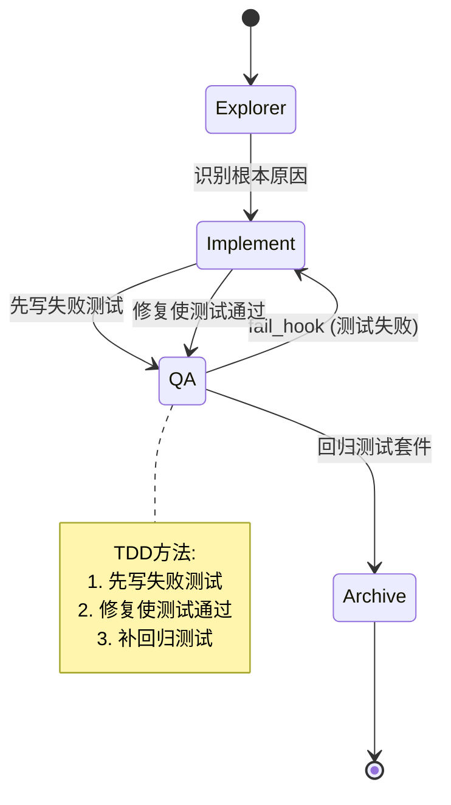

### Scenario EPIC: 史诗级重构与跨域需求

- **目标**: 处理涉及多个微服务或底层架构变动的巨大需求（如框架迁移、分库分表）。
- **生命周期路径**: 强制在 Propose 阶段要求 System Architect 产出带有微任务拆解的 `openspec.md`。
- **核心输出**: 子代理（Sub-agent）任务分发清单，严格限制主 Agent 直接编码。

### Scenario DEBUG: 深度排障与根因分析

- **目标**: 在未知根因的报错（如生产环境 500 异常）时，进行深度假设与验证。
- **生命周期路径**: Intent 降级为 Audit，Profile 降级为 PATCH。
- **核心输出**: 允许高频执行终端命令（如查日志、跑单测）达 5 次，但严禁修改业务代码，直至找到根因。


### 场景 D：性能/SQL 优化（以 Review 为主门禁）

- **目标**：在不改变对外行为的前提下做性能优化或 SQL 改写。
- **下钻阅读**：sitemap → wiki/api/index（对外行为）→ wiki/data/index（索引与查询约束）→ preferences/index。
- **生命周期路径**：Explorer → Propose → Review → Approval Gate (HITL) → Implement → QA → Archive。
- **关键产出**：
    - Propose：说明"保持行为不变"的约束、性能瓶颈点、候选方案与回退策略。
    - Review：以 SQL 规范与索引利用为第一优先级；必要时降低方案复杂度。
    - QA：补对比证据（关键用例性能与正确性）。
- **Archive 写回**：把可复用的性能规则与反例沉淀到 preferences/ 或 data/ 索引。

### 场景 E：重构（含边界守卫与非目标）

- **目标**：提升可维护性或拆分职责，但不引入需求漂移。
- **下钻阅读**：sitemap → wiki/architecture/index（如有）→ preferences/index → domain/index（边界与术语）。
- **生命周期路径**：Explorer → Propose → Review → Approval Gate (HITL) → Implement → QA → Archive。
- **关键产出**：
    - Explorer：明确"做什么/不做什么"，列出潜在跨域点。
    - Review/Approval：跨域修改必须显式授权；否则视为越权，直接回退。
- **Archive 写回**：将架构决策与边界规则写回 architecture/ 与 preferences/，方便后续 guard_hook 生效。

### 场景 F：并行协作（后端主交付，前端/QA 可选并行）

- **目标**：后端主导交付，但允许前端与 QA 在契约冻结后并行推进。
- **下钻阅读**：sitemap → schema/openspec_schema（确认交接字段）→ wiki/api/index。
- **生命周期路径**：Explorer → Propose → Review → Approval Gate（冻结契约）→ Implement → QA → Archive。
- **协作关键点**：
    - 在 Approval Gate 阶段冻结 OpenSpec，使其可被前端/QA 作为并行工作的唯一依据。
    - 后端对外最小交接物来自 OpenSpec（示例 JSON、验收标准、错误码）；其余内容保持后端内聚，不强制外扩。

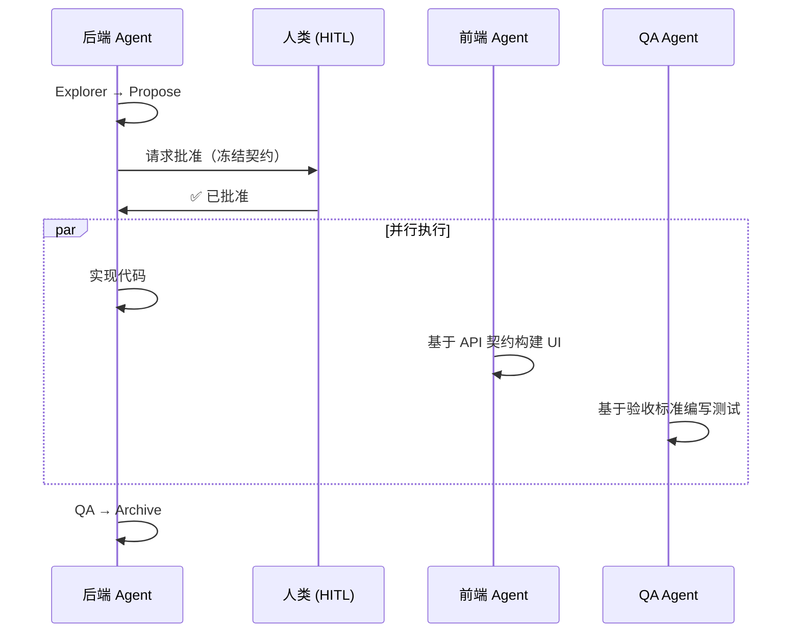

### 场景 G：知识写回与防膨胀（归档维护）

- **目标**：把"短寿命 Spec"提取成"稳定索引"，并控制索引规模。
- **下钻阅读**：sitemap → 目标域 index（api/data/domain/testing/preferences）。
- **生命周期路径**：Archive（作为独立维护动作）或跟随常规任务的 Phase 6。
- **写回原则**：
    - 新知识必须找到挂载点写回域索引；无法挂载的内容优先归档而不是留在活跃区。
    - 任一 index 超过阈值（例如 500 行）则拆分子目录 index，并更新上级挂载。

### 场景 H：可选体检工具箱（不替代 Agent）

- **目标**：当你不确定是否破坏了图谱或契约结构时，做一次确定性体检。
- **可选工具（仅输出报告，不改文件）**：
    - 图谱体检：[wiki_linter.py](.agents/scripts/wiki/wiki_linter.py)（死链/孤岛/超长预警）
    - 契约体检：[schema_checker.py](.agents/scripts/wiki/schema_checker.py)（关键结构缺失检查）
    - 偏好体检：[pref_tag_checker.py](.agents/scripts/wiki/pref_tag_checker.py)（规则标签规范检查）

### 场景 I：只读审计（`Audit.Codebase`）

- **目标**：对代码库进行只读分析、评估，产出结构化审计报告与证据引用
- **只读约束**：不改代码、不写 Wiki、不生成 launch spec、不进入 lifecycle
- **允许动作**：只读检索与读取；允许运行测试/构建，但不得修改任何已跟踪文件
- **产出要求**：每条结论必须带证据（文件路径 + 行号范围）与影响/建议
- **典型场景**：架构评审、代码质量扫描、技术债务评估

### 场景 J：文档问答（`QA.Doc` / `QA.Doc.Actionize`）

- **QA.Doc**：按知识漏斗逐层下钻，输出带引用的答案（引用到 Wiki/需求段落，必要时补充代码引用）
- **QA.Doc.Actionize**：将问答结论转成"可执行意图队列"，必须先问一次是否发车；同意后才生成 launch spec 并进入生命周期
- **典型场景**：查询业务规则、了解 API 用法、确认架构决策

***

## 1. 架构总览

### 1.1 核心思想

#### 解决的三大根本问题

**问题 1: 上下文膨胀失控**

LLM 在大型代码库中盲目搜索导致 Token 浪费和注意力分散，表现为:
- 无控制的全文搜索消耗大量 Token
- 读取无关文件导致上下文窗口污染
- 注意力分散，无法聚焦关键信息

**解决方案: 知识图谱 + 预算化导航**
- Sitemap→Index→Doc 层级下钻，避免盲搜
- Wiki≤3 文档、Code≤8 文件的硬预算控制
- Saturation Gate 饱和度判断，足够即停
- Stop-Wiki/Stop-Code 停止规则，防止 runaway

**问题 2: 需求漂移与越权修改**

Agent 自由发挥导致跨域污染和契约腐败，表现为:
- 未经授权的跨域文件修改
- 偏离原始需求的过度设计
- 契约与实际实现不一致

**解决方案: 意图网关 + 角色矩阵守卫**
- Intent 分类→Profile 选择→Launch Spec 持久化
- Role 动态挂载(Ambiguity Gatekeeper, Focus Guard等)
- Gate 门禁检查(ambiguity_gate.py, scope_guard.py)
- Approval Gate HITL 人类确认

**问题 3: 知识碎片化与不可持续**

对话记忆丢失、文档不同步、索引膨胀，表现为:
- Session 中断后知识丢失
- Wiki 与代码不同步
- Index 文件无限增长难以维护

**解决方案: WAL 写回 + 自动重构**
- WAL(Write-Ahead Log)片段低冲突写回
- Compaction 智能合并与自动重构
- Drift Queue 捕获并修复不一致性
- Archive 冷存储防止活跃区污染

#### 设计哲学

**将工程纪律编码为 LLM 可执行的协议**

- **机器对机器协调**: 不是人类工具，是 Agent 之间的通信协议
- **自我导航**: 通过知识图谱自主获取上下文，无需 RAG
- **自我纠偏**: 通过 Hooks 系统自动拦截违规行为
- **自我演进**: 通过 Preferences 记忆持续改进

**核心原则:**
- 契约先行(Contract-First): OpenSpec 冻结后再实现
- 防膨胀(Anti-Bloat): WAL + Compaction + Archive
- 可持续性(Sustainability): 断点续传 + 知识提取
- 确定性(Determinism): 脚本工具辅助，不依赖 LLM 猜测

### 1.2 系统架构图

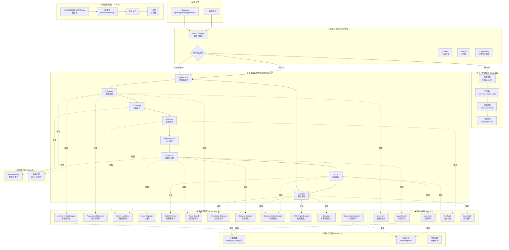

### 1.3 核心组件详解

| 层级 | 组件 | 职责 | 关键文件 | 解决的问题 |
|------|------|------|----------|-----------|
| **输入层** | 意图网关 | 自然语言 → 结构化意图 + 执行模式 | [ROUTER.md](.agents/router/ROUTER.md) | 需求到可执行队列的转换 |
| **上下文层** | 知识漏斗 | 双向导航（正向检索 + 反向写回） | [CONTEXT_FUNNEL.md](.agents/router/CONTEXT_FUNNEL.md) | 上下文获取与防膨胀 |
| **知识层** | LLM Wiki | 分形知识图谱（Sitemap/Index/Docs/Archive） | [KNOWLEDGE_GRAPH.md](.agents/llm_wiki/KNOWLEDGE_GRAPH.md) | 知识组织与检索 |
| **流程层** | 生命周期引擎 | 6阶段状态机 + 断点续传 | [LIFECYCLE.md](.agents/workflow/LIFECYCLE.md) | 流程标准化与可回退 |
| **角色层** | 角色矩阵 | 动态挂载虚拟角色 + 门禁守卫 | [ROLE_MATRIX.md](.agents/workflow/ROLE_MATRIX.md) | 质量门禁与防漂移 |
| **纠偏层** | 钩子系统 | 前置/守卫/后置/失败/循环拦截 | [HOOKS.md](.agents/workflow/HOOKS.md) | 自动纠偏与防失控 |
| **能力层** | 技能矩阵 | 25+ 领域专业专家能力 | [trae-skill-index](.agents/skills/trae-skill-index/SKILL.md) | 专业能力标准化 |
| **工具层** | 脚本工具 | 确定性质量检查 + 辅助工具 | [scripts/](.agents/scripts/) | 确定性增强 |

### 1.4 数据流与控制流

**正向数据流:**
```
User Requirements 
  → Intent Gateway (分类 + Profile选择)
  → Context Funnel (上下文收集)
  → Launch Spec (队列持久化)
  → Lifecycle Engine (6阶段执行)
  → Archive (知识提取)
  → Wiki Update (索引更新)
```

**反向控制流:**
```
Hooks System (拦截与纠偏)
  ← pre_hook (加载规则)
  ← guard_hook (执行守卫)
  ← post_hook (后置审计)
  ← fail_hook (失败回退)
  ← loop_hook (队列循环)

Role Matrix (动态挂载)
  ← Ambiguity Gatekeeper (Explorer)
  ← Focus Guard (Implement)
  ← Knowledge Extractor (Archive)
  ← Knowledge Architect (Archive重构)
```

**预算控制流:**
```
Budget Enforcement
  → Wiki ≤ 3 docs
  → Code ≤ 8 files
  → Saturation Gate (足够即停)
  → Stop-Wiki/Stop-Code (连续无增益即停)
  → Escalation Protocol (预算耗尽升级)
```

---

## 2. 目录结构与职责

### 2.1 整体目录树（细到文档级别）

```text
java-harness-agent/
│
├── AGENTS.md                              # 📌 项目级规则入口（硬约束 + 导航规则）
│
├── README.md                              # 项目概览（英文版）
├── README_zh.md                           # 项目概览（中文版）
├── ENGINEERING_MANUAL.md                  # 工程手册（英文版）
├── ENGINEERING_MANUAL_zh.md               # 工程手册（中文版，本文件）
│
└── .agents/                               # Agent 工作空间（新标准）
    │
    ├── router/                            # 意图层：把需求变成可执行队列
    │   ├── ROUTER.md                      # 意图网关规范（Profiles/Shortcuts/DSL/意图类型）
    │   ├── CONTEXT_FUNNEL.md              # 知识漏斗规范（正向检索/反向写回/预算控制）
    │   └── runs/                          # Launch Specs（意图队列持久化，不提交）
    │       ├── launch_spec_20260417_143022.md
    │       └── launch_spec_20260417_150311.md
    │
    ├── workflow/                          # 流程层：生命周期状态机 + 钩子纠偏
    │   ├── LIFECYCLE.md                   # 生命周期规范（6阶段状态机定义）
    │   ├── HOOKS.md                       # 钩子规范（5种钩子触发条件与效果）
    │   ├── ROLE_MATRIX.md                 # 角色矩阵规范（12个虚拟角色定义与挂载规则）
    │   └── runs/                          # 运行时状态（不提交）
    │       └── execution_logs/
    │
    ├── llm_wiki/                          # 知识层：可演进的分形图谱
    │   ├── KNOWLEDGE_GRAPH.md             # 🗺️ 知识图谱根节点（强制入口，只挂载顶级域）
    │   ├── purpose.md                     # 系统哲学与设计原则
    │   │
    │   ├── schema/                        # 契约模板与模式
    │   │   ├── index.md                   # 规范域索引（路由器）
    │   │   └── openspec_schema.md         # OpenSpec 契约模板（后端主交付物）
    │   │
    │   ├── wiki/                          # 活跃知识域（按域隔离）
    │   │   ├── api/                       # API 契约域
    │   │   │   ├── index.md               # API 索引（路由到具体 API 文档）
    │   │   │   └── wal/                   # API WAL 片段目录
    │   │   │       ├── 20260417_new_endpoint_append.md
    │   │   │       └── ...
    │   │   │
    │   │   ├── data/                      # 数据模型域
    │   │   │   ├── index.md               # 数据模型索引
    │   │   │   └── wal/                   # Data WAL 片段目录
    │   │   │       └── ...
    │   │   │
    │   │   ├── domain/                    # 领域模型域
    │   │   │   ├── index.md               # 领域模型索引
    │   │   │   └── wal/                   # Domain WAL 片段目录
    │   │   │       └── ...
    │   │   │
    │   │   ├── architecture/              # 架构决策域（ADR）
    │   │   │   ├── index.md               # 架构决策索引
    │   │   │   └── wal/                   # Architecture WAL 片段目录
    │   │   │       └── ...
    │   │   │
    │   │   ├── specs/                     # 活跃需求域
    │   │   │   ├── index.md               # 活跃 Spec 索引
    │   │   │   └── openspec_example.md    # 示例 Spec
    │   │   │
    │   │   ├── testing/                   # 测试策略域
    │   │   │   ├── index.md               # 测试策略索引
    │   │   │   └── wal/                   # Testing WAL 片段目录
    │   │   │       └── ...
    │   │   │
    │   │   └── preferences/               # 动态偏好与禁忌域
    │   │       └── index.md               # 偏好索引（经验沉淀）
    │   │
    │   └── archive/                       # 冷存储（已提取的规范）
    │       ├── 20260415_order_api_spec.md
    │       └── ...
    │
    ├── skills/                            # 能力层：专有专家能力插件（25+）
    │   ├── intent-gateway/
    │   │   └── SKILL.md                   # 意图入口能力
    │   ├── devops-lifecycle-master/
    │   │   └── SKILL.md                   # 生命周期主控编排
    │   ├── product-manager-expert/
    │   │   └── SKILL.md                   # 需求澄清专家
    │   ├── prd-task-splitter/
    │   │   └── SKILL.md                   # PRD 任务分解
    │   ├── devops-requirements-analysis/
    │   │   └── SKILL.md                   # 需求分析
    │   ├── devops-system-design/
    │   │   └── SKILL.md                   # 系统设计
    │   ├── devops-task-planning/
    │   │   └── SKILL.md                   # 任务规划
    │   ├── devops-review-and-refactor/
    │   │   └── SKILL.md                   # 代码评审与重构
    │   ├── global-backend-standards/
    │   │   └── SKILL.md                   # 全局后端标准索引
    │   ├── java-engineering-standards/
    │   │   └── SKILL.md                   # Java 工程标准
    │   ├── java-backend-guidelines/
    │   │   └── SKILL.md                   # Java 后端指南
    │   ├── java-backend-api-standard/
    │   │   └── SKILL.md                   # Java API 标准
    │   ├── java-javadoc-standard/
    │   │   └── SKILL.md                   # Java Javadoc 标准
    │   ├── mybatis-sql-standard/
    │   │   └── SKILL.md                   # MyBatis SQL 标准
    │   ├── error-code-standard/
    │   │   └── SKILL.md                   # 错误码标准
    │   ├── checkstyle/
    │   │   └── SKILL.md                   # Checkstyle 风格检查
    │   ├── devops-feature-implementation/
    │   │   └── SKILL.md                   # 功能实现
    │   ├── devops-bug-fix/
    │   │   └── SKILL.md                   # Bug 修复
    │   ├── devops-testing-standard/
    │   │   └── SKILL.md                   # 测试标准
    │   ├── code-review-checklist/
    │   │   └── SKILL.md                   # 代码评审清单
    │   ├── api-documentation-rules/
    │   │   └── SKILL.md                   # API 文档规则
    │   ├── database-documentation-sync/
    │   │   └── SKILL.md                   # 数据库文档同步
    │   ├── utils-usage-standard/
    │   │   └── SKILL.md                   # 工具类使用标准
    │   ├── aliyun-oss/
    │   │   └── SKILL.md                   # 阿里云 OSS
    │   ├── skill-graph-manager/
    │   │   └── SKILL.md                   # 技能图谱管理
    │   ├── trae-skill-index/
    │   │   └── SKILL.md                   # 技能总索引
    │   └── linter-severity-standard/
    │       └── SKILL.md                   # Linter 严重性标准
    │
    └── scripts/                           # 工具层：确定性增强（不替代 Agent）
        │
        ├── gates/                         # 门禁脚本（强制执行质量检查）
        │   ├── ambiguity_gate.py          # 模糊性门禁（检查 focus_card.md）
        │   ├── focus_card_gate.py         # Focus Card 有效性检查
        │   ├── schema_checker.py          # OpenSpec 结构检查
        │   ├── wiki_linter.py             # Wiki 图谱健康检查
        │   ├── pref_tag_checker.py        # 偏好标签规范检查
        │   ├── writeback_gate.py          # 写回完整性检查
        │   ├── delivery_capsule_gate.py   # 交付胶囊完整性检查
        │   ├── secrets_linter.py          # 密钥泄漏检查
        │   ├── comment_linter_java.py     # Java 注释检查
        │   ├── scope_guard.py             # 范围守卫（检查跨域修改）
        │   ├── skill_index_linter.py      # 技能索引一致性检查
        │   └── run.py                     # 统一门禁运行器
        │
        ├── wiki/                          # Wiki 工具（知识图谱维护）
        │   ├── compactor.py               # WAL 压缩器（智能合并与重构）
        │   ├── wiki_linter.py             # Wiki 图谱健康检查（死链/孤儿/长度）
        │   ├── schema_checker.py          # 契约结构检查
        │   ├── pref_tag_checker.py        # 偏好标签检查
        │   └── zero_residue_audit.py      # 零残留审计（可选证据）
        │
        └── harness/                       # 引擎辅助（可选）
            └── engine.py                  # 队列状态辅助（记录当前意图/阶段/重试次数）
```

### 2.2 各目录详细职责

#### 2.2.1 AGENTS.md（项目级规则入口）

**定位**: 本体系的"总入口规则"。用于把 Agent 的自由发挥限制在可控边界内（不盲搜、不越权、不暴走、不膨胀）。

**输入/输出**: 
- 输入 = 任何任务
- 输出 = 统一的执行纪律（检索、生命周期、纠偏、归档、可选交接物）

**触发点**: 
- 每次任务开始时必须先读
- 当出现争议（路径、是否并行、是否需要交接物）时回到此处

**典型场景**: 
- 新人 onboarding
- 外部 Agent 接入
- 任务中断恢复
- 出现"该不该继续实现/该不该跨域改动"时的裁决

**核心约束**:
- Budget Limits: Wiki ≤ 3 docs, Code ≤ 8 files
- Approval Gate: MEDIUM/HIGH risk 必须 WAITING_APPROVAL
- Anti-Looping: Max 3 retries
- Scope Guard: 不得修改 focus_card.md 约定范围外的文件

---

#### 2.2.2 .agents/router/（意图层：把需求变成可执行队列）

本层解决"用户一句话 → 我到底要做哪些事、先做什么、后做什么"的问题。

**关键文件**:

1. **[ROUTER.md](.agents/router/ROUTER.md)**
   - **做什么**: 把自然语言需求拆成意图队列（例如 `Propose.API -> Implement.Code -> QA.Test`），并定义"并发语义=顺序无关性"
   - **核心内容**:
     - Profiles (LEARN/PATCH/STANDARD)
     - Shortcuts (@read/@patch/@standard)
     - Shortcut DSL (可组合标志)
     - 核心意图类型 (Learn/Change/DocQA/Audit)
     - 上下文收集规则 (Rule 0/0.1/1)
     - 预算化导航与升级协议
   - **输出**: `router/runs/launch_spec_*.md`（意图队列持久化 + 断点续传）

2. **[CONTEXT_FUNNEL.md](.agents/router/CONTEXT_FUNNEL.md)**
   - **做什么**: 定义 Agent 的"正向检索（下钻）"与"反向写回（归档提取）"
   - **核心内容**:
     - 正向检索: Sitemap → Index → Doc
     - 反向写回: Find mount point → Write WAL fragment → Compaction
     - 预算控制: Wiki≤3, Code≤8
     - 停止规则: Saturation Gate, Stop-Wiki, Stop-Code
     - 升级协议: Escalation Card 格式
   - **红线**: 只有索引树找不到时才允许兜底搜索；写回必须先找挂载点，索引超过阈值必须拆分

**典型场景**:
- 新增接口：拆成 `Propose.API -> Review -> Approval Gate -> Implement.Code -> QA.Test -> Archive`
- 改表结构：拆成 `Propose.Data -> Review -> Approval Gate -> Implement.Code -> QA.Test -> Archive`
- Bug 修复：拆成 `Explore.Req -> Implement.Code -> QA.Test -> Archive`

---

#### 2.2.3 .agents/workflow/（流程层：生命周期状态机 + 钩子纠偏）

本层解决"怎么确保任务可回退、可审查、可闭环"的问题。

**关键文件**:

1. **[LIFECYCLE.md](.agents/workflow/LIFECYCLE.md)**
   - **做什么**: 定义 Explorer→Archive 的单向状态机；规定冻结点（Approval Gate）、闭环点（Phase 6）
   - **核心内容**:
     - 6 阶段定义 (Explorer/Propose/Review/Implement/QA/Archive)
     - Approval Gate (HITL) 风险评估分级
     - Launch Spec 模板与断点续传机制
     - Profile 差异 (PATCH 短路与 STANDARD 完整)
   - **输出**: 阶段性产物（explore_report/openspec/测试证据/归档提取）

2. **[HOOKS.md](.agents/workflow/HOOKS.md)**
   - **做什么**: 把工程红线"写进流程里"，形成 guard/fail/loop 的纠偏系统
   - **核心内容**:
     - 5 种钩子: pre_hook/guard_hook/post_hook/fail_hook/loop_hook
     - 每种钩子的触发点、绑定技能、目的、评判方式
     - Non-Convergence Fallback 机制
     - Justification Bypass 机制
   - **输出**: 阻断/降级/回退/停止并请求人类介入

3. **[ROLE_MATRIX.md](.agents/workflow/ROLE_MATRIX.md)**
   - **做什么**: 定义虚拟角色（review personas）以及如何根据 (Intent, Profile, Phase) 动态挂载
   - **核心内容**:
     - 11 个角色定义 (Requirement Engineer/System Architect/Lead Engineer/Code Reviewer/Knowledge Extractor/Librarian/等)
     - 每个角色的目的、输出、门禁
     - 挂载规则 (按 Intent/Profile/Phase)
     - 自动化契约 (role_matrix.json)
   - **输出**: 角色必需的工件（focus_card.md/WAL fragments/Delivery capsule等）

**典型场景**:
- 设计没过机审：Review 失败 → fail_hook → 退回 Propose 重写
- 测试失败：QA 失败 → fail_hook → 回退 Implement 修复
- 跨域修改：guard_hook 触发领域边界守卫 → 必须显式授权或停止
- 多意图队列：loop_hook 消费队列 → 自动开启下一轮 Explorer

---

#### 2.2.4 .agents/llm_wiki/（知识层：可演进的分形图谱）

本层解决"知识如何组织、如何检索、如何防膨胀"的问题。

**关键文件**:

1. **[KNOWLEDGE_GRAPH.md](.agents/llm_wiki/KNOWLEDGE_GRAPH.md)**
   - **做什么**: 知识图谱根节点，只挂载顶级域入口；是 Agent 的强制检索起点
   - **内容**: 指向 schema/index.md, wiki/api/index.md, wiki/data/index.md 等顶级域的链接

2. **schema/**
   - **[schema/index.md](.agents/llm_wiki/schema/index.md)**: 规范域索引（路由器），告诉你"该读哪份契约/该跳到哪份流程"
   - **[openspec_schema.md](.agents/llm_wiki/schema/openspec_schema.md)**: OpenSpec 契约模板（后端主交付物；可选携带前端/QA交接字段）

3. **wiki/** (活跃知识域)
   - **api/**: API 契约（endpoint signatures, request/response examples）
   - **data/**: 数据模型与模式（table schemas, indexes, ER diagrams）
   - **domain/**: 领域模型与业务字典（business vocabulary, invariants）
   - **architecture/**: 架构决策（ADR, design decisions）
   - **specs/**: 活跃需求（current openspec files）
   - **testing/**: 测试策略（test strategies, evidence standards）
   - **preferences/**: 动态偏好与禁忌（learned preferences, anti-patterns）
   - **每个域的结构**:
     ```
     {domain}/
     ├── index.md           # 域索引（路由到具体文档）
     └── wal/               # WAL 片段目录
         ├── YYYYMMDD_feature_x_append.md
         └── ...
     ```

4. **archive/** (冷存储)
   - **做什么**: 已提取的 Spec，保留可追溯性但不污染活跃区
   - **命名规范**: `YYYYMMDD_{feature_name}_spec.md`

**典型场景**:
- 新知识写回：Archive 阶段把不稳定 spec 提取成稳定 API/Data/Domain 索引
- 防膨胀拆分：某个 index 超过阈值 → 拆分子目录 index 并更新上级挂载
- WAL 压缩：compactor.py 合并 WAL 片段，触发 Knowledge Architect 重构

---

#### 2.2.5 .agents/skills/（能力层：专有专家能力插件）

本层解决"当任务进入专业领域时，如何快速调用专业能力并保持一致标准"的问题。

**基本约定**: 
- 每个技能一个目录
- 入口文件为 `skills/<skill-name>/SKILL.md`
- SKILL.md 包含: 用途、使用阶段、触发条件、输出工件、相关资源

**技能分类**:
- **意图与生命周期** (4个): intent-gateway, devops-lifecycle-master, skill-graph-manager, trae-skill-index
- **需求与设计** (5个): product-manager-expert, prd-task-splitter, devops-requirements-analysis, devops-system-design, devops-task-planning
- **实现** (4个): devops-feature-implementation, devops-bug-fix, utils-usage-standard, aliyun-oss
- **代码标准** (9个): global-backend-standards, java-engineering-standards, java-backend-guidelines, java-backend-api-standard, java-javadoc-standard, mybatis-sql-standard, error-code-standard, checkstyle
- **测试与评审** (2个): devops-testing-standard, code-review-checklist
- **文档** (2个): api-documentation-rules, database-documentation-sync

**典型场景**: 
- 实现前必须过 Java/API/SQL/权限等规范审查
- 归档阶段必须同步 API/DB 文档

---

#### 2.2.6 .agents/scripts/（工具层：确定性增强，不替代 Agent）

本层解决"哪些事情必须确定性完成，不能靠大模型猜"的问题。

**gates/** (门禁脚本):
- `ambiguity_gate.py`: 检查 focus_card.md 是否存在且有效
- `focus_card_gate.py`: 验证 focus_card.md 内容完整性
- `schema_checker.py`: 检查 openspec.md 结构是否符合 schema
- `wiki_linter.py`: 检查 Wiki 图谱健康（死链/孤儿/长度）
- `pref_tag_checker.py`: 检查偏好标签规范性
- `writeback_gate.py`: 检查 WAL 写回完整性
- `delivery_capsule_gate.py`: 检查交付胶囊完整性
- `secrets_linter.py`: 检查密钥泄漏
- `comment_linter_java.py`: 检查 Java 注释
- `scope_guard.py`: 检查跨域修改是否授权
- `skill_index_linter.py`: 检查技能索引一致性
- `run.py`: 统一门禁运行器（根据 intent/profile/phase 自动选择相关门禁）

**wiki/** (Wiki 工具):
- `compactor.py`: WAL 压缩器（智能合并与触发 Knowledge Architect 重构）
- `wiki_linter.py`: Wiki 图谱健康检查
- `schema_checker.py`: 契约结构检查
- `pref_tag_checker.py`: 偏好标签检查
- `zero_residue_audit.py`: 零残留审计（可选证据生成）

**harness/** (引擎辅助):
- `engine.py`: 队列状态辅助（记录当前意图/阶段/重试次数，可选）

**典型场景**: 
- 进入 Archive → 运行 compactor.py 合并 WAL 片段
- 发现孤儿文件 → wiki_linter.py 提示挂载到 sitemap/index
- Review 阶段 → run.py 自动运行相关门禁脚本

---

### 2.3 每个目录的典型运行路径示例

**.agents/router/**
- **典型路径**: 用户需求 → 读取 KNOWLEDGE_GRAPH.md → 触发意图映射 → 写入 launch_spec_*.md
- **场景示例**: 新增接口 → 生成 Propose.API -> Implement.Code -> QA.Test 队列
- **结果**: 队列成为后续 Lifecycle 的"唯一调度依据"

**.agents/workflow/**
- **典型路径**: 读取 launch_spec → 进入 Phase 1 → Propose/Review → Approval Gate（HITL）→ Implement → QA → Archive
- **场景示例**: Review 未通过 → 触发 fail_hook → 退回 Propose 重写
- **结果**: 状态机保证可回退、可纠偏、可闭环

**.agents/llm_wiki/**
- **典型路径**: 从 KNOWLEDGE_GRAPH.md 下钻 → 进入域 index → 读取具体文档 → 归档时反向写回 index
- **场景示例**: 新增 API → wiki/api/index.md 追加条目 → 超过阈值则拆分子目录
- **结果**: 知识可检索、可扩展、不膨胀

**.agents/skills/**
- **典型路径**: 进入 Review/Implement/QA → 根据任务调用对应技能 → 输出规范化建议/检查结果
- **场景示例**: 新增 Controller → 触发 java-backend-api-standard 与 api-documentation-rules
- **结果**: 专业规则前置，降低实现偏差

**.agents/scripts/**
- **典型路径**: 进入 Archive → 可选运行 wiki_linter/schema_checker/pref_tag_checker → 输出体检报告或格式建议
- **场景示例**: 发现孤儿文件 → 提示挂载到 sitemap/index
- **结果**: 图谱连通性与结构质量可控

---


## 3. 引擎与流程（详细解释 + 流程图）

### 3.1 意图网关（Intent Gateway）

#### 3.1.1 核心概念

**目的**: 将自然语言请求路由到执行模式(Profile),然后可选地启动生命周期队列。

**规范文件**: [ROUTER.md](.agents/router/ROUTER.md)

**解决的问题**:
- 用户输入模糊 → 无法确定执行深度
- 不同风险级别需要不同的流程严格度
- 需要持久化意图队列以支持断点续传

**工作流程**:
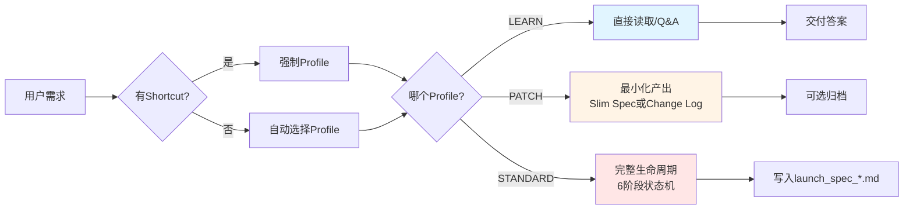

---

#### 3.1.2 执行模式 Profiles（核心概念）

Profiles 决定了任务的执行深度和产出物要求。

| Profile | 使用场景 | 是否进入生命周期 | 产出物 | 适用风险级别 | 示例 |
|---------|---------|-----------------|--------|------------|------|
| **LEARN** | 只读解释、代码理解、Q&A | ❌ 否 | 无（仅交付答案） | - | `@read --scope src/foo.ts -- explain this` |
| **PATCH** | 小改动、Bug修复、性能优化 | ⚠️ 最小化 | Slim Spec 或 Change Log | LOW | `@patch --risk low -- fix NPE in UserService` |
| **STANDARD** | MEDIUM/HIGH风险变更、新功能开发 | ✅ 完整6阶段 | 完整 OpenSpec + Approval Gate | MEDIUM/HIGH | `@standard --risk high -- implement permission checks` |

**关键区别**:
- LEARN: 不产生任何工件,纯问答
- PATCH: 快速路径,跳过 Review/Approval,直接进入 Implement
- STANDARD: 完整路径,必须经过所有6个阶段,包括 HITL Approval Gate

**Profile 选择规则**:
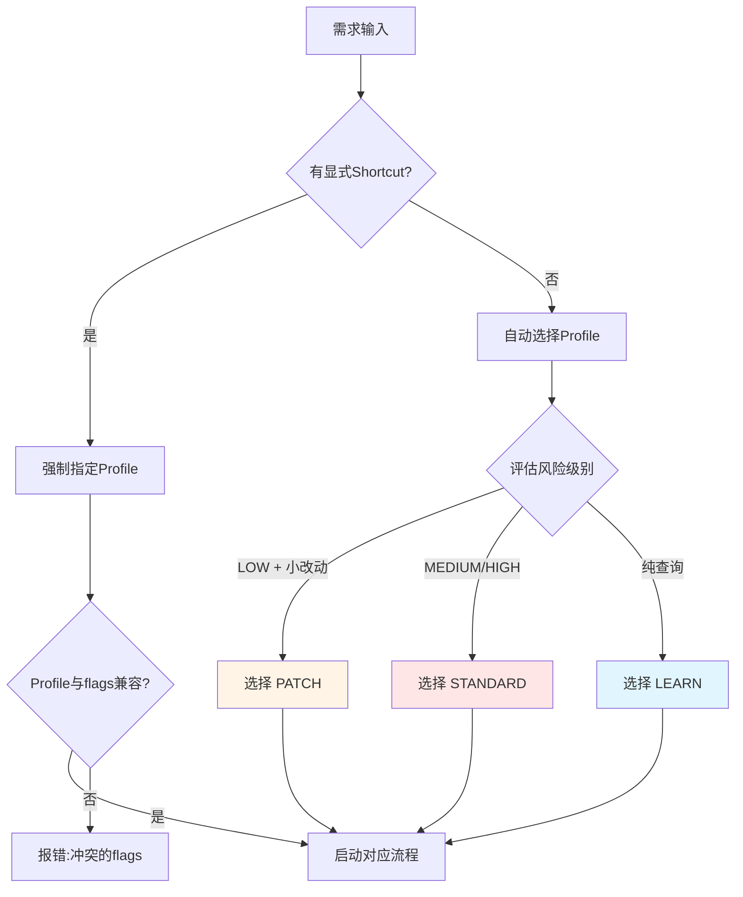

---

#### 3.1.3 Shortcuts（显式路由）

Shortcuts 是强制指定 Profile 的快捷语法。

**基本 Shortcuts**:
- `@read` / `@learn` → LEARN Profile
- `@patch` / `@quickfix` → PATCH Profile
- `@standard` → STANDARD Profile

**示例**:
```text
@read --scope src/main/java/com/example/UserService.java -- explain the authentication logic
@patch --risk low -- fix null pointer exception in getUserById
@standard --risk high -- implement role-based access control for admin endpoints
```

---

#### 3.1.4 Shortcut DSL（可组合标志）

**语法**:
```text
@<profile> <flags...> -- <natural language request or question>
```

**标志分类详解**:

##### Scope/Read 标志
| 标志 | 用途 | 示例 |
|------|------|------|
| `--scope <path\|glob\|symbol>` | 明确作用域 | `--scope src/main/java/com/example/*.java` |
| `--direct` | 强制直接读取,不从知识图谱下钻 | `--direct` |
| `--funnel` | 强制使用知识漏斗导航 | `--funnel` |
| `--depth <shallow\|medium\|deep>` | 控制读取深度 | `--depth deep` |

##### Risk/Artifacts 标志
| 标志 | 用途 | 示例 |
|------|------|------|
| `--risk <low\|medium\|high>` | 显式覆盖风险评估 | `--risk high` |
| `--slim` | 使用简化版 Spec (仅 PATCH) | `--slim` |
| `--changelog` | 生成变更日志而非完整 Spec | `--changelog` |
| `--evidence` | 要求生成测试证据 | `--evidence` |

##### Launch/Write-back 标志
| 标志 | 用途 | 示例 |
|------|------|------|
| `--launch` | 强制启动生命周期 (仅 STANDARD) | `--launch` |
| `--no-launch` | 禁止启动生命周期 | `--no-launch` |
| `--writeback` | 强制写回 Wiki | `--writeback` |
| `--no-writeback` | 禁止写回 Wiki | `--no-writeback` |

##### Verification 标志
| 标志 | 用途 | 示例 |
|------|------|------|
| `--test <command>` | 指定测试命令 | `--test "mvn test -Dtest=UserServiceTest"` |
| `--no-test` | 跳过测试验证 | `--no-test` |

##### DocQA Actionize 标志
| 标志 | 用途 | 示例 |
|------|------|------|
| `--actionize` | 将问答转为行动 | `--actionize` |
| `--yes` | 自动确认 actionize (危险!) | `--yes` |

**冲突规则（MUST 强制执行）**:
- ❌ `@learn` 不能与 `--launch` 或 `--writeback` 组合
- ❌ `--launch` 必须与 `@standard` 一起使用
- ❌ `--slim` 需要 `--risk low`
- ❌ `--actionize` 必须询问确认,除非存在 `--yes`

**组合示例**:
```text
# 示例1: 深入学习特定文件
@learn --scope src/foo/bar.ts --direct --depth deep -- explain this file's architecture

# 示例2: 快速修复低风险 Bug
@patch --risk low --slim --test "mvn test" -- fix NPE in UserService.getUserById()

# 示例3: 高风险功能实现
@standard --risk high --launch -- implement permission checks for admin endpoints with full audit trail

# 示例4: 只读审计
@learn --scope src/main/java/**/*.java --direct -- audit codebase for security vulnerabilities
```

---

#### 3.1.5 核心意图类型（4个顶层意图）

意图类型定义了任务的根本性质。

| 意图 | 使用场景 | 默认 Profile | Launch Spec | 写回 | 典型输出 |
|------|---------|-------------|-------------|------|---------|
| **Learn** | 解释/阅读/理解代码 | LEARN | ❌ 否 | ❌ 否 | 文本解释、代码片段 |
| **Change** | 修改代码/新增功能 | PATCH 或 STANDARD | ✅ 是(STANDARD) | 可选(Archive) | 代码变更、Spec、测试 |
| **DocQA** | 规则/流程/模板查询 | LEARN | ❌ 否 | ❌ 否(除非 actionize) | 带引用的答案 |
| **Audit** | 评估代码库 | LEARN | ❌ 否 | ❌ 否 | 审计报告、问题列表 |

**意图识别规则**:
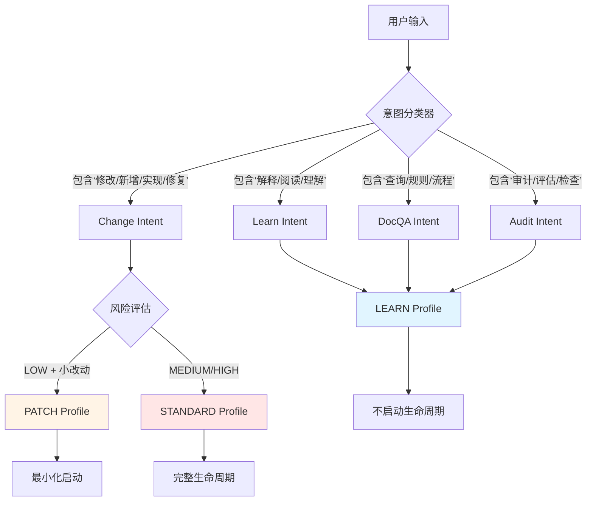

---

#### 3.1.6 上下文收集规则

**Rule 0: 明确 scope 时直接读取（MUST）**

**条件**: 
- 用户提供明确的 scope（文件路径、类名、方法名）
- 目标是学习/理解（Learn/Audit 意图）

**动作**:
- ✅ 先直接读取指定文件
- ❌ 不从知识图谱下钻开始

**例外**: 
- 仅在第一次读取后需要背景上下文时才使用漏斗

**示例**:
```text
@read --scope src/main/java/com/example/UserService.java -- explain authentication logic
# Agent 应该:
# 1. 直接读取 UserService.java
# 2. 分析认证逻辑
# 3. 如果用户追问"这个服务依赖哪些其他服务?",才使用漏斗导航
```

---

**Rule 0.1: Decision-First Preflight（MUST）**

在任何重度导航之前,Agent MUST 输出 Preflight 块:

**Preflight 格式**:
```markdown
## Preflight

**Goal**: 一句话说明目标

**Deliverables**: 
- 列出预期产出物

**Default assumptions**: 
- 最多3条假设

**Open uncertainties**: 
- 最多2条不确定项

**Read strategy**: Needle | Obvious | Exploration

**Budgets**: 
- wiki = 3 docs
- code = 8 files

**Stop conditions**: 
- 饱和度标准（Template acquired / Integration point acquired / Executable chain acquired）
- 停止规则（Stop-Wiki: 连续3次无增益; Stop-Code: 连续2次范围未缩小）

**Escalation plan**: 如果预算耗尽,向人类请求什么
```

**Read Strategy 选择**:
- **Needle**: 已知具体文件/符号,直接定位
- **Obvious**: 领域明确,从域索引开始
- **Exploration**: 领域不明,从根节点 Sitemap 开始

---

**Rule 1: 否则,使用知识漏斗（MUST）**

**步骤**:
1. 读取根节点: [KNOWLEDGE_GRAPH.md](.agents/llm_wiki/KNOWLEDGE_GRAPH.md)
2. 通过索引下钻: [CONTEXT_FUNNEL.md](.agents/router/CONTEXT_FUNNEL.md)
3. 如果不确定用哪个技能,查阅: [trae-skill-index](.agents/skills/trae-skill-index/SKILL.md)

**示例**:
```text
用户需求: "实现一个订单查询接口"

Agent 应该:
1. 读取 KNOWLEDGE_GRAPH.md
2. 发现 wiki/api/index.md 和 wiki/data/index.md
3. 读取 wiki/api/index.md 了解现有 API 模式
4. 读取 wiki/data/index.md 了解订单表结构
5. 基于获取的知识设计 API 契约
```

---

#### 3.1.7 预算化导航与升级（NEW - 核心机制）

**Budgeted Navigation（MUST）**

**适用意图**: Change 和 Audit

**默认预算**:
- Wiki ≤ 3 文档
- Code ≤ 8 文件

**计数规则**:
- 同文件分页读取不计入额外预算
- 例如: 读取同一文件的第1-100行和第101-200行,只计为1个文件

**Saturation Gate（足够时停止阅读）**

满足任一条件即停止:

1. **Template acquired**: 获取任意2个模板
   - 路由形状（Controller 如何暴露 endpoint）
   - DTO 验证风格（validation annotations 使用模式）
   - 服务入口模式（Service 层如何组织）
   - Mapper/SQL 模式（数据访问层模式）
   - 表字段模式（数据库字段命名和类型约定）

2. **Integration point acquired**: 获取依赖用法的具体示例
   - 例如: 如何调用权限服务
   - 例如: 如何记录审计日志

3. **Executable chain acquired**: 存在已知良好的调用链
   - 例如: Controller → Service → Mapper 的完整链路

**Stop-Wiki（MUST）**

**条件**: 连续3次 wiki 读取都是"no-gain"（没有获得新信息）

**动作**: 
- Agent MUST 停止 wiki 导航
- 以符合标准的最小决策继续
- 不得继续盲目读取更多 wiki 文档

**弹性扩展**: 
- 可使用 `<Confidence_Assessment>` 请求 +2 文档预算扩展
- 必须说明为什么额外预算能带来突破

**Stop-Code（MUST）**

**条件**: 连续2次代码读取范围没有缩小

**动作**: 
- Agent MUST 停止阅读
- 触发 Escalation Protocol

**弹性扩展**: 
- 可使用 `<Confidence_Assessment>` 请求 +3 文件预算扩展
- 必须说明为什么额外预算能带来突破

---

**Escalation Protocol（MUST）**

**触发条件**:
- 预算耗尽且成功标准未满足
- 停止规则触发（Stop-Wiki 或 Stop-Code）

**动作**: 
- Agent MUST 请求人类帮助而不是继续阅读
- 生成 Escalation Card

**Escalation Card 格式**:
```markdown
## Escalation Card

**Consumed**: 
- wiki X/3
- code Y/8

**Confirmed facts** (≤ 5条):
- 事实1
- 事实2
- ...

**Missing info** (≤ 2条,必须具体):
- 缺失信息1（为什么阻塞）
- 缺失信息2（为什么阻塞）

**Why it is blocking**: 一句话说明阻塞原因

**Proposed next targets** (≤ 5个文件路径/关键词):
- 目标1
- 目标2
- ...

**Request**: 
- wiki +1 或 code +2（小步扩展）

**Fallback if still missing**: 
- 问1个关键问题
- 向人类请求具体锚点（类/表/入口点）
- 交付带有明确风险的最小可行计划
```

**生命周期持久化**:
当升级阻塞工作流时,将 launch_spec_*.md 中的意图行状态设置为 `WAITING_APPROVAL`,并包含相关工件的链接。

---

#### 3.1.8 内部生命周期队列代码（仅 STANDARD Profile）

对于 STANDARD Profile,意图被分解为以下队列项:

| 代码 | 阶段 | 说明 | 必需工件 |
|------|------|------|---------|
| `Explore.Req` | Explorer | 澄清需求 + scope 锚点 | explore_report.md |
| `Propose.API` | Propose → Review | API 契约与设计 | openspec.md (API部分) |
| `Propose.Data` | Propose → Review | 数据库模式变更 | openspec.md (Data部分) |
| `Implement.Code` | Implement → QA | 代码变更 | 源代码文件 |
| `QA.Test` | QA | 测试 + 证据 | 测试用例 + 测试证据 |

**队列消费流程**:
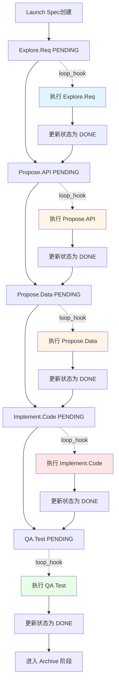

**并发规则**:
- `Propose.API` 和 `Propose.Data` 可以并行执行（顺序无关性）
- 其他队列项必须按顺序执行

---

#### 3.1.9 只读审计流程（Audit.Codebase）

**目标**: 对代码库进行只读分析、评估,产出结构化审计报告与证据引用

**约束**:
- ❌ 不改代码
- ❌ 不写 Wiki
- ❌ 不生成 launch spec
- ❌ 不进入 lifecycle

**允许动作**:
- ✅ 只读检索与读取
- ✅ 运行测试/构建（但不得修改任何已跟踪文件）

**产出要求**:
- 每条结论必须带证据（文件路径 + 行号范围）
- 影响评估与建议

**典型场景**:
- 架构评审
- 代码质量扫描
- 技术债务评估
- 安全漏洞扫描

**审计报告格式**:
```markdown
# Audit Report - {YYYYMMDD_HHMMSS}

## Summary
- 审计范围
- 发现的问题数量
- 严重性分布

## Findings

### Finding 1: [问题标题]
**Severity**: HIGH/MEDIUM/LOW
**Location**: `src/path/to/file.java:L100-L150`
**Description**: 问题描述
**Impact**: 影响说明
**Recommendation**: 建议修复方案
**Evidence**: 
```java
// 相关代码片段
```

### Finding 2: ...

## Conclusion
- 总体评估
- 优先级建议
```

---

#### 3.1.10 文档问答流程（QA.Doc / QA.Doc.Actionize）

**QA.Doc（纯问答）**:

**目标**: 按知识漏斗逐层下钻,输出带引用的答案

**约束**:
- ❌ 不触发生命周期
- ❌ 不修改任何文件
- ✅ 引用到 Wiki/需求段落
- ✅ 必要时补充代码引用

**答案格式**:
```markdown
## Answer

**Question**: 用户问题

**Answer**: 
详细答案内容

**References**:
- [.agents/llm_wiki/wiki/api/index.md](.agents/llm_wiki/wiki/api/index.md) - API 设计规范
- [src/main/java/com/example/UserController.java](src/main/java/com/example/UserController.java:L50-L80) - 示例实现

**Confidence**: HIGH/MEDIUM/LOW
```

---

**QA.Doc.Actionize（问答转行动）**:

**目标**: 将问答结论转成"可执行意图队列"

**流程**:
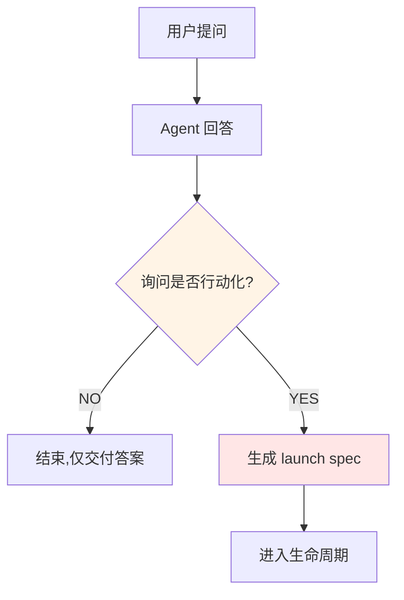

**关键纪律**:
- 必须先问一次是否发车
- 用户同意后才生成 launch spec
- 可使用 `--yes` 标志跳过确认（危险!）

**示例**:
```text
用户: "如何实现用户权限检查?"

Agent: 
[提供详细答案,包括引用]

"是否需要我将此转换为可执行任务? (回复 YES 以生成 launch spec)"

用户: "YES"

Agent: 
[生成 launch_spec_*.md]
[进入 Explorer 阶段]
```

---

#### 3.1.11 Launch Spec 模板与断点续传机制

**Launch Spec 文件位置**: `.agents/router/runs/launch_spec_{YYYYMMDD_HHMMSS}.md`

**状态枚举**:
- `PENDING`: 待执行
- `IN_PROGRESS`: 执行中
- `DONE`: 已完成
- `WAITING_APPROVAL`: 等待人类批准
- `FAILED`: 失败（需人工介入）

**模板**:
```markdown
# Launch Spec - {YYYYMMDD_HHMMSS}

## State Machine
| Intent | Status | Phase | Artifact/Log | Failed_Reason |
|---|---|---|---|---|
| Explore.Req | IN_PROGRESS | 1_Explorer | explore_report.md | - |
| Propose.API | PENDING | - | - | - |
| Propose.Data | PENDING | - | - | - |
| Implement.Code | PENDING | - | - | - |
| QA.Test | PENDING | - | - | - |

## Breakpoint Resume
- 若会话中断: 唤醒后第一动作先读本文件
- 若存在 WAITING_APPROVAL: 进入 Approval 等待点,读取 openspec.md,等待人类确认
- 若存在 FAILED: 停止自动推进,报告 Failed_Reason 并请求介入

## Context Anchors
- Domain: [链接到 domain index]
- API: [链接到 api index]
- Data: [链接到 data index]
- Preferences: [链接到 preferences index]

## Focus Card
- Goal: [一句话目标]
- Non-goals: [非目标列表]
- Allowed scope: [允许的文件范围]
- Stop rules: [停止规则]
```

**关键纪律**:
- 状态机表格驱动工作流推进
- 只更新 Status/Phase/Failed_Reason 字段
- 不得删除已完成的历史记录
- 每次状态变更后重新读取文件以确保一致性

**断点续传流程**:
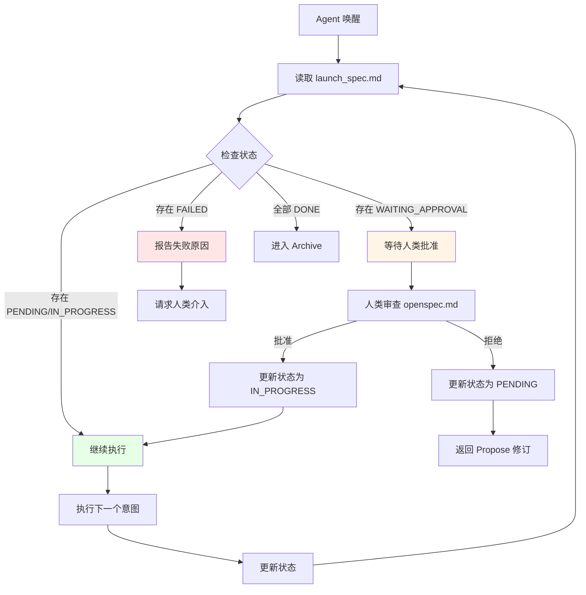

---


### 3.2 知识漏斗（Context Funnel）

#### 3.2.1 核心概念

**目的**: 解决"上下文怎么取、怎么保证不膨胀"的问题。

**规范文件**: [CONTEXT_FUNNEL.md](.agents/router/CONTEXT_FUNNEL.md)

**双向机制**:
- **正向检索（下钻）**: Sitemap → Index → Doc
- **反向写回（归档提取）**: Work Context → WAL Fragment → Compaction → Index Update

**解决的问题**:
- 如何避免盲目搜索导致的 Token 浪费
- 如何确保新知识能正确挂载到知识图谱
- 如何防止索引文件无限膨胀

---

#### 3.2.2 正向检索流程

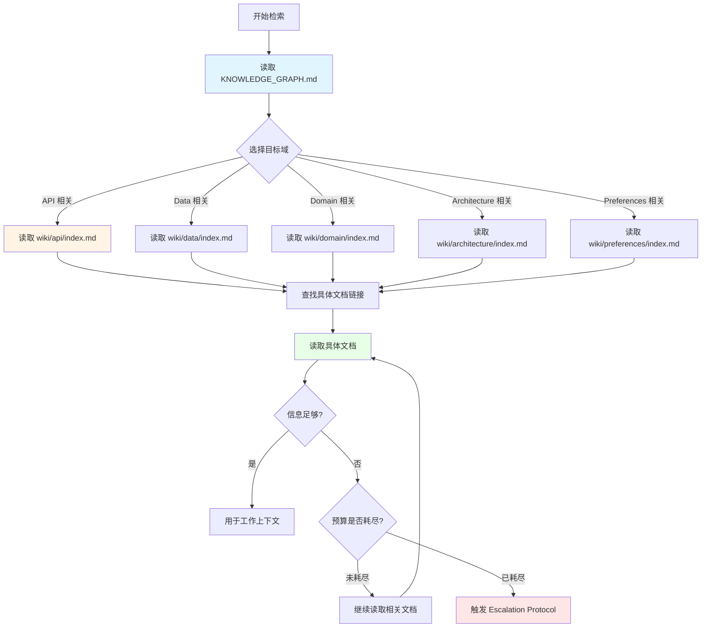

**步骤详解**:

1. **从根节点开始**
   - 读取 [KNOWLEDGE_GRAPH.md](.agents/llm_wiki/KNOWLEDGE_GRAPH.md)
   - 了解可用的顶级域

2. **选择正确的域 index**
   - API 契约 → `wiki/api/index.md`
   - 数据模型 → `wiki/data/index.md`
   - 领域模型 → `wiki/domain/index.md`
   - 架构决策 → `wiki/architecture/index.md`
   - 偏好禁忌 → `wiki/preferences/index.md`

3. **阅读 index.md,找到具体文档链接**
   - index.md 充当路由器
   - 列出该域下的所有子文档

4. **阅读具体文档**
   - 获取详细知识
   - 注意文档中的引用和链接

5. **如需要,兜底关键词搜索**
   - 仅在索引树找不到时才允许
   - 使用 `grep_code` 或 `search_codebase`

**示例路径**:
```text
用户需求: "实现订单查询接口"

检索路径:
1. KNOWLEDGE_GRAPH.md
   → 发现 wiki/api/ 和 wiki/data/
   
2. wiki/api/index.md
   → 发现现有订单相关 API: order_api_spec.md
   
3. wiki/api/order_api_spec.md
   → 了解订单 API 设计模式
   
4. wiki/data/index.md
   → 发现订单表结构: order_table_schema.md
   
5. wiki/data/order_table_schema.md
   → 了解订单表字段和索引
   
6. 基于获取的知识设计新接口
```

---

#### 3.2.3 反向写回流程

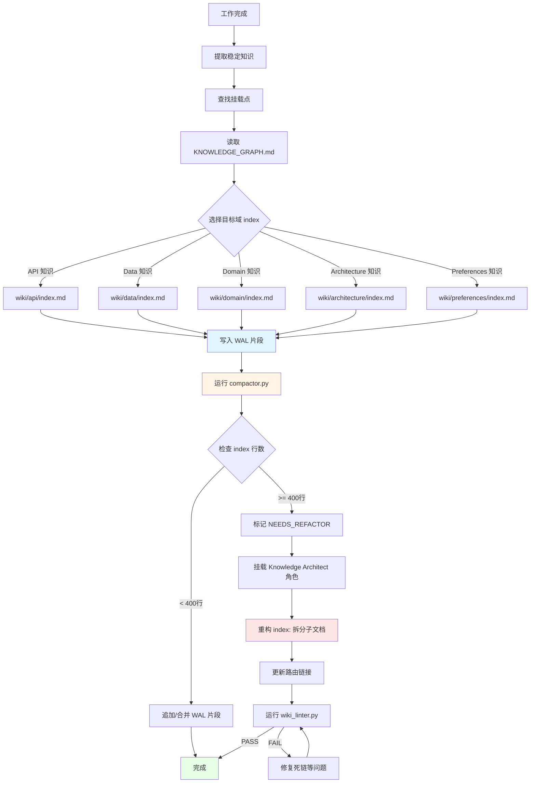

**步骤详解**:

1. **从工作上下文中提取稳定知识**
   - 从 openspec.md 提取 API/Data/Domain/Rules 知识
   - 识别哪些知识是稳定的、可复用的

2. **找到挂载点**
   - 读取 KNOWLEDGE_GRAPH.md
   - 确定知识应该归属哪个域

3. **不要直接编辑共享 index.md**
   - ❌ 禁止直接修改 index.md
   - ✅ 必须通过 WAL 机制

4. **写入 WAL 片段到目标域 wal/ 目录**
   - 文件名格式: `YYYYMMDD_{feature_name}_{type}.md`
   - Type: append / update / delete

5. **由 compactor.py 合并和拆分**
   - 智能判断是否需要重构
   - 自动触发 Knowledge Architect

6. **如果 index 超过阈值(400行),触发 Knowledge Architect 重构**
   - 拆分为专注的子文档
   - 更新路由链接
   - 通过 wiki_linter.py 门禁

---

#### 3.2.4 WAL（Write-Ahead Log）机制

**WAL 片段格式**:
```markdown
# WAL Fragment - {YYYYMMDD}_{feature_name}

## Type: append | update | delete
## Domain: api | data | domain | architecture | preferences
## Timestamp: {ISO8601}

### Content
[新知识内容]

### Source
- openspec.md: [link]
- launch_spec: [link]
- Related files: [links to code files]
```

**WAL 目录结构**:
```text
.agents/llm_wiki/wiki/{domain}/wal/
├── 20260417_new_order_api_append.md
├── 20260417_user_table_update.md
├── 20260417_auth_rule_append.md
└── ...
```

**WAL 类型说明**:

| Type | 用途 | 示例 |
|------|------|------|
| **append** | 新增知识条目 | 新增 API endpoint |
| **update** | 更新现有知识 | 修改表结构描述 |
| **delete** | 标记废弃知识 | 废弃的 API endpoint |

**WAL 优势**:
- ✅ 低冲突: 多个 Agent 可以同时写入不同的 WAL 片段
- ✅ 可追溯: 每个片段都有时间戳和来源链接
- ✅ 易管理: compactor.py 统一处理合并逻辑
- ✅ 防丢失: 即使 compaction 失败,WAL 片段仍然保留

---

#### 3.2.5 WAL Compaction（自动压缩）

**触发时机**: Archive 阶段第4步

**Compaction 流程**:
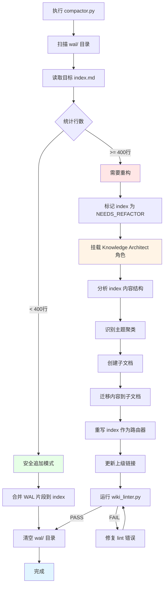

**智能压缩逻辑**:

1. **检查目标 index.md 行数**
   - 使用 `wc -l` 或类似工具统计

2. **如果安全低于阈值(<400行)**
   - 直接追加/合并 WAL 片段
   - 按时间顺序合并
   - 去重相似内容
   - 清空 wal/ 目录

3. **如果超过 400 行**
   - 中止物理追加
   - 标记 NEEDS_REFACTOR
   - Agent 临时挂载 Knowledge Architect 角色
   - 读取膨胀的 index 和待处理的 WALs
   - 将知识拆分为专注的子文档
   - 更新路由链接
   - 通过 wiki_linter.py 门禁后才能继续

**Compactor 脚本**:
```bash
python3 .agents/scripts/wiki/compactor.py
```

**输出示例**:
```text
[INFO] Scanning wal/ directory...
[INFO] Found 5 WAL fragments for domain 'api'
[INFO] Reading target index: wiki/api/index.md (380 lines)
[INFO] Index is below threshold (< 400 lines)
[INFO] Merging WAL fragments into index...
[INFO] Appended 3 new entries
[INFO] Updated 1 existing entry
[INFO] Cleared wal/ directory
[SUCCESS] Compaction complete
```

---

#### 3.2.6 Drift Queue（漂移队列）

**目的**: 捕获并修复 Wiki 与代码之间的不一致性。

**触发场景**:
- 代码修改但 Wiki 未同步
- Wiki 更新但代码未反映
- 契约与实际实现偏离

**Drift 检测时机**:
- Archive 阶段第5步
- 手动运行 drift detector 脚本

**处理流程**:


**Drift 事件格式**:
```markdown
# Drift Event - {timestamp}

## Type: code_changed | wiki_outdated | contract_mismatch
## Severity: HIGH | MEDIUM | LOW
## Affected: [file paths]

## Description
[差异描述]

## Evidence
- Code: [代码片段 + 行号]
- Wiki: [Wiki 内容 + 链接]

## Suggested Action
[建议的 WAL 操作]
```

**Drift Queue 目录结构**:
```text
.agents/events/drift_queue/
├── drift_20260417_143022.md
├── drift_20260417_150311.md
└── ...
```

**Agent 处理**:
在 Archive 阶段第5步,Agent 读取 `.agents/events/drift_queue/`(如果存在事件):
1. 快速验证差异
2. 生成必要的 WAL 追加片段来修复 Wiki
3. 同时不失去对原始任务的关注

**典型场景**:
```text
场景: 开发者手动修改了 API endpoint 路径,但未更新 Wiki

Drift Event:
- Type: code_changed
- Severity: HIGH
- Affected: 
  - src/main/java/com/example/UserController.java:L50
  - .agents/llm_wiki/wiki/api/user_api.md

Description: 
API endpoint 路径从 /api/v1/users 改为 /api/v2/users,
但 Wiki 仍记录为 v1

Suggested Action:
生成 WAL update 片段更新 wiki/api/user_api.md
```

---

### 3.3 生命周期（Lifecycle State Machine）

#### 3.3.1 核心概念

**目的**: 把"分析→设计→评审→实现→测试→归档"固化为可回退、可闭环的状态机。

**规范文件**: [LIFECYCLE.md](.agents/workflow/LIFECYCLE.md)

**编排器**: devops-lifecycle-master skill

**解决的问题**:
- 流程随意,缺乏标准化
- 无法断点续传
- 缺少质量门禁
- 难以追踪进度

---

#### 3.3.2 6阶段状态机

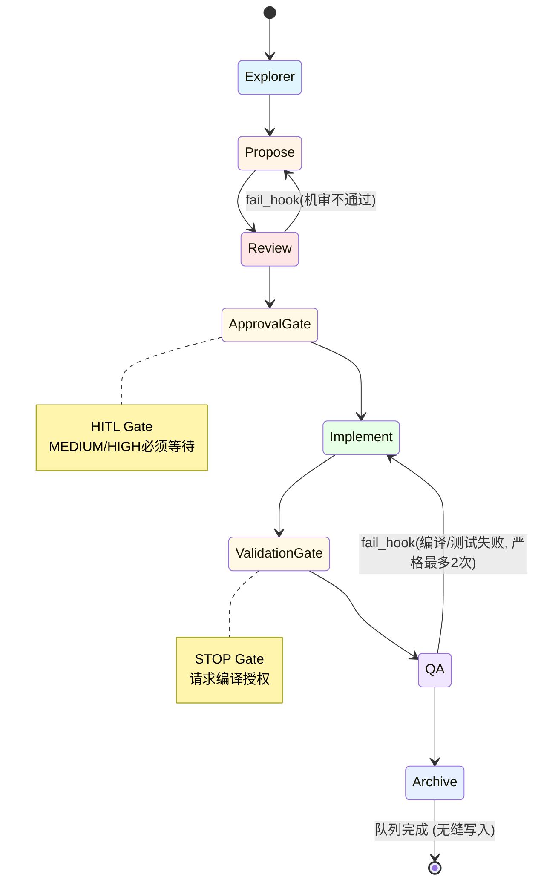

**重要说明**: 
- Approval 不是独立阶段,而是人类闸门(HITL Gate)
- 在状态机中作为检查点存在
- MEDIUM/HIGH 风险必须在 WAITING_APPROVAL 停止

---

#### 3.3.3 各阶段详解

##### Phase 1: Explorer（澄清需求）

**目的**: 澄清需求、定义范围、识别风险。

**挂载角色**:
- Ambiguity Gatekeeper（模糊性守卫）
- Requirement Engineer（需求工程师）
- Focus Guard（防漂移守卫）

**激活技能**:
- product-manager-expert
- devops-requirements-analysis
- prd-task-splitter

**执行流程**:
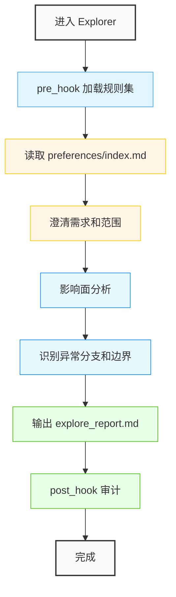

**输出**: `explore_report.md` 包含:
- 需求边界与非目标
- 跨域影响面分析
- 异常分支与边界情况
- **Core Context Anchors**（MUST）:
  - 关键链接(domain/api/data/architecture/preferences等)
  - 业务词汇和不变量(术语、枚举、状态说明)
  - 明确的工程红线(禁止模式、权限策略、幂等策略、回滚占位符)

**Post-Hook 要求**:
explore_report.md MUST 包含 `## Core Context Anchors` 章节

**Focus Card 生成**:
由 Ambiguity Gatekeeper 生成 focus_card.md:
```markdown
# Focus Card

## Goal
[一句话目标]

## Non-goals
- [非目标1]
- [非目标2]

## Allowed scope
- [允许的文件路径/glob]

## Stop rules
- [停止条件1]
- [停止条件2]
```

---

##### Phase 2: Propose（冻结契约）

**目的**: 设计解决方案并冻结契约。

**挂载角色**:
- System Architect（系统架构师）

**激活技能**:
- devops-system-design
- devops-task-planning

**执行流程**:
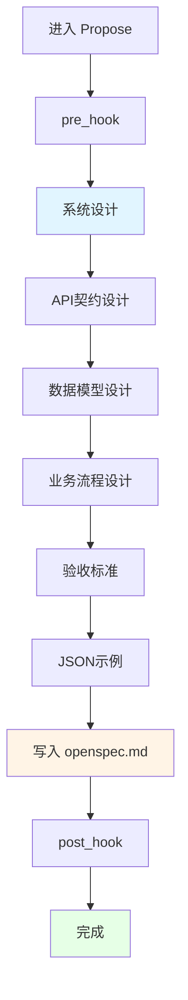

**输出**: `openspec.md`（位于 `.agents/llm_wiki/wiki/specs/`）
- API 签名与数据模型
- 数据库模式与索引
- 业务流程
- 验收标准
- JSON 请求/响应示例

**契约模板**: [.agents/llm_wiki/schema/openspec_schema.md](.agents/llm_wiki/schema/openspec_schema.md)

**风险级别与 Schema 选择**:
- LOW 风险: 可使用 Slim Spec
- MEDIUM/HIGH 风险: MUST 使用完整 Schema

---

##### Phase 3: Review（技术评审）

**目的**: 针对标准的自动化技术评审。

**激活技能**:
- devops-review-and-refactor
- global-backend-standards
- java-engineering-standards
- java-backend-guidelines
- java-backend-api-standard
- mybatis-sql-standard
- error-code-standard

**评审矩阵**:
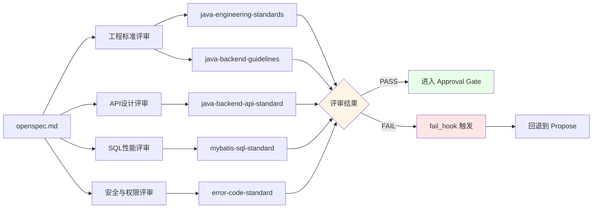

**评审维度**:
1. ✅ 架构与工程标准（java-engineering-standards, java-backend-guidelines）
2. ✅ API 设计模式（java-backend-api-standard）
3. ✅ SQL 性能与安全（mybatis-sql-standard）
4. ✅ 安全与数据权限（error-code-standard）

**失败处理**:
- 触发 fail_hook
- 记录失败原因到 openspec.md
- 回退到 Phase 2（Propose）重写

---

##### Phase 3.5: Approval Gate（HITL）

**目的**: 实现前的人类检查点与契约冻结。

**注意**: Approval 不是独立阶段,而是人类闸门

**风险评估分级**:

**HIGH（必须 Approval）**:
- 改动数据库表结构/索引
- 权限与鉴权策略变更
- 错误码体系变更
- 跨域修改
- 基础组件与通用工具
- 影响范围不清或改动面过大

**MEDIUM（必须 Approval）**:
- 新增/修改对外接口
- 调整核心业务链路但不涉及 DB/权限底座

**LOW（可跳过 Approval）**:
- 文档调整
- 纯重命名/格式化
- 小范围 Bugfix 且影响面明确

**规则**:
- MEDIUM/HIGH: MUST 在 WAITING_APPROVAL 停止
- LOW: 可跳过,但 Agent 必须在交付说明中写明"为何可跳过"的一句话理由

**执行流程**:
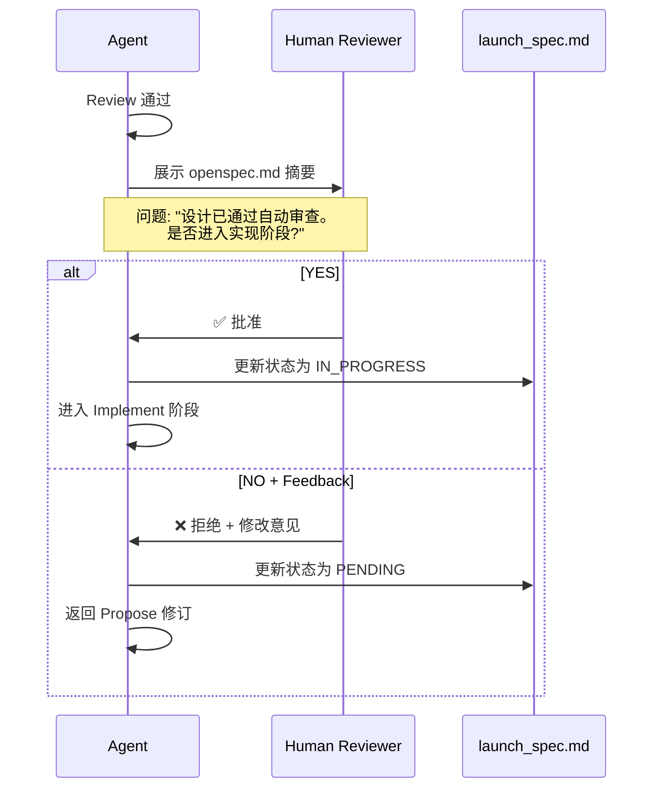

**持久化**:
- 在 launch_spec.md 中将意图行状态更新为 WAITING_APPROVAL
- 包含 openspec.md 链接

**并行触发**:
冻结契约使前端/QA agent 可以开始工作(基于 OpenSpec 中的 API Contract 和 Acceptance Criteria)

---


##### Phase 4: Implement（按契约实现）

**目的**: 在契约边界内实现代码。

**挂载角色**:
- Lead Engineer（主程）
- Focus Guard（防漂移守卫）
- Security Sentinel（安全哨兵）

**激活技能**:
- devops-feature-implementation
- devops-bug-fix
- utils-usage-standard
- aliyun-oss

**执行流程**:
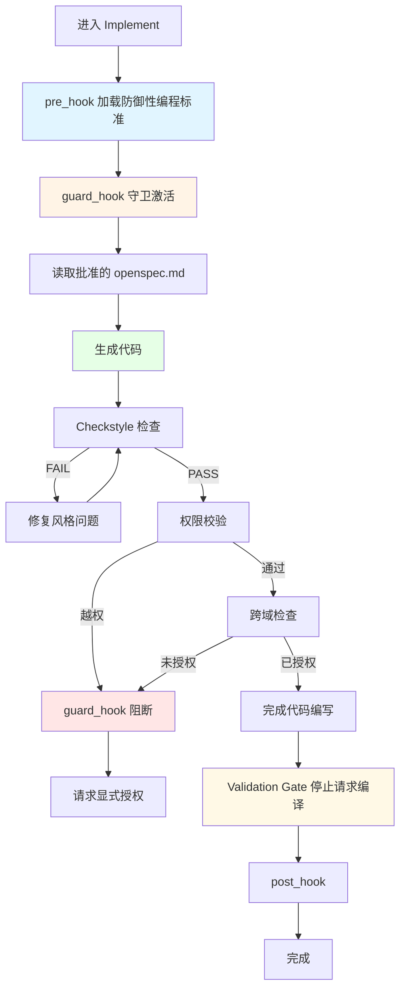

**纪律**:
- 严格按照批准的契约实现,无控制的即兴发挥
- 必须通过 Checkstyle 验证
- 应用防御性编程指南
- 尊重领域边界(guard_hook 守卫)
- 不得修改 focus_card.md 约定范围外的文件
- **STOP 强制中断**: 代码完成后必须 STOP 并请求人类允许执行编译，不得直接进入重度编译测试环节。

**Focus Card 机制**:
- 由 Ambiguity Gatekeeper 在 Explorer 阶段生成
- 定义 goal/non-goals/allowed scope/stop rules
- 由 Focus Guard 在 Implement 阶段 enforce
- scope_guard.py 脚本检查修改文件是否超出允许范围

**scope_guard.py 检查逻辑**:
```python
# 伪代码示例
def check_scope(modified_files, focus_card):
    allowed_patterns = focus_card['allowed_scope']
    for file in modified_files:
        if not any(match_pattern(file, pattern) for pattern in allowed_patterns):
            return FAIL, f"File {file} is outside allowed scope"
    return PASS, "All files within scope"
```

---

##### Phase 5: QA Test（测试验证）

**目的**: 遵循 TDD 原则的质量保证。

**挂载角色**:
- Code Reviewer（代码审查官）
- Documentation Curator（文档策展人）

**激活技能**:
- devops-testing-standard
- code-review-checklist

**执行流程**:
```mermaid
flowchart TB
    Start[进入 QA] --> PreHook[pre_hook]
    PreHook --> RunTests[运行测试]
    RunTests -->|FAIL| FailHook[fail_hook 触发]
    FailHook --> Rollback[回退到 Implement]
    RunTests -->|PASS| CoverageCheck[覆盖率检查]
    CoverageCheck -->|< 100%关键路径| AddTests[补充测试]
    AddTests --> RunTests
    CoverageCheck -->|>= 100%| Checklist[代码评审清单]
    Checklist -->|有 FAIL 项| FixIssues[修复问题]
    FixIssues --> RunTests
    Checklist -->|全部 GREEN| Evidence[生成测试证据]
    Evidence --> PostHook[post_hook]
    PostHook --> End[完成]
    
    style PreHook fill:#e1f5ff
    style RunTests fill:#fff4e6
    style FailHook fill:#ffe6e6
    style Evidence fill:#e6ffe6
```

**要求**:
- 关键路径测试覆盖率 ≥ 100%
- 所有检查清单项必须为绿色
- Bug 修复的回归测试
- 优化的性能基准

**测试证据标准**:
生成 `test_evidence_{feature}.md` 包含:
- 执行环境与命令
- 客观日志片段
- 覆盖的边界情况([Pass]/[Fail]标记)
- 覆盖率指标(可选)

**测试证据模板**:
```markdown
# Test Evidence - {feature_name}

## Execution Environment
- Java Version: 17
- Maven Version: 3.8.6
- Test Command: `mvn test -Dtest=UserServiceTest`

## Test Results
```
[INFO] Tests run: 25, Failures: 0, Errors: 0, Skipped: 0
[INFO] BUILD SUCCESS
```

## Covered Scenarios
- [Pass] Normal user login with valid credentials
- [Pass] Login with invalid password
- [Pass] Login with non-existent username
- [Pass] Concurrent login attempts
- [Pass] Session timeout handling

## Coverage Metrics
- Line Coverage: 92%
- Branch Coverage: 88%
- Critical Path Coverage: 100%

## Performance Benchmarks
- Average response time: 150ms
- P95 response time: 250ms
- Max response time: 400ms
```

**失败处理**:
- 触发 fail_hook
- 严格限制：编译与测试**最多重试2次**。超过 2 次必须立即 STOP 并请求人类协助，严禁死循环。
- 回退到 Phase 4（Implement）

---

##### Phase 6: Archive（知识提取）

**强烈建议**: 鉴于前 5 个阶段积累了极长的代码与对话上下文，强制要求在同一会话中使用定向的 **`git diff <files>`** 或 `openspec.md` 来执行 Archive，避免重读历史导致大模型产生幻觉或触发长度限制熔断。

**目的**: 知识提取与清理,防止膨胀。

**挂载角色**:
- Knowledge Extractor
- Documentation Curator
- Skill Graph Curator
- Knowledge Architect（如果需要重构）

**激活技能**:
- api-documentation-rules
- database-documentation-sync

**执行流程**:
```mermaid
flowchart TB
    Start[进入 Archive] --> Step1[1. 文档同步]
    Step1 --> Step2[2. 知识提取]
    Step2 --> Step3[3. 冷存储]
    Step3 --> Step4[4. WAL 压缩]
    Step4 --> Step5[5. 处理 Drift Events]
    Step5 --> Step6[6. Preferences 记忆]
    Step6 --> Step7[7. Loop 检查]
    Step7 -->|队列未完成| NextIntent[继续下一个意图]
    Step7 -->|队列完成| End[任务完成]
    
    Step1 --> SyncAPI[api-documentation-rules]
    Step1 --> SyncDB[database-documentation-sync]
    
    Step2 --> Extract[通过反向漏斗提取稳定知识]
    Extract --> UpdateIndex[更新域索引]
    
    Step3 --> MoveSpec[移动 openspec.md 到 archive/]
    
    Step4 --> RunCompactor[执行 compactor.py]
    RunCompactor --> CheckLines{index 行数}
    CheckLines -->|< 400| Append[追加 WAL 片段]
    CheckLines -->|>= 400| Refactor[触发 Knowledge Architect 重构]
    
    Step5 --> ReadDrift[读取 drift_queue/]
    ReadDrift -->|有事件| Validate[验证差异]
    Validate --> GenerateWAL[生成 WAL 片段]
    GenerateWAL --> HealWiki[修复 Wiki]
    
    Step6 --> AskRating[请求人类评分 1-10]
    AskRating --> ExtractPrefs[提取偏好/反模式]
    ExtractPrefs --> WritePrefs[写入 preferences/index.md]
    
    Step7 --> ReadLaunchSpec[重新读取 launch_spec.md]
    ReadLaunchSpec --> CheckQueue{队列是否为空}
    CheckQueue -->|否| NextIntent
    CheckQueue -->|是| End
    
    style Step1 fill:#e1f5ff
    style Step2 fill:#fff4e6
    style Step4 fill:#ffe6e6
    style Step6 fill:#e6ffe6
    style End fill:#e6f0ff
```

**详细步骤**:

**Step 1: 文档同步**
- 通过 api-documentation-rules 同步 API 文档
- 通过 database-documentation-sync 同步数据库文档(表/清单/ER图)

**Step 2: 知识提取**
- 通过反向漏斗(CONTEXT_FUNNEL.md)将稳定规范合并到域索引
- 从 openspec.md 提取 API/Data/Domain/Rules 知识
- 写入 WAL 片段到对应域的 wal/ 目录

**Step 3: 冷存储**
- 将原始 openspec.md 移至 `.agents/llm_wiki/archive/`
- 保留可追溯性但不污染活跃区
- 命名格式: `YYYYMMDD_{feature_name}_spec.md`

**Step 4: WAL 压缩（Smart Compaction）**
- 执行 `python3 .agents/scripts/wiki/compactor.py`
- 检查目标 index.md 行数
- 如果 <400 行: 追加/合并 WAL 片段
- 如果 >=400 行: 
  - 标记 NEEDS_REFACTOR
  - 挂载 Knowledge Architect 角色
  - 重构 index: 拆分子文档
  - 更新路由链接
  - 通过 wiki_linter.py 门禁

**Step 5: 处理 Drift Events**
- 读取 `.agents/events/drift_queue/`(如果存在)
- 快速验证差异
- 生成必要的 WAL 追加片段修复 Wiki
- 不失去对原始任务的关注

**Step 6: Preferences 记忆**
- 请求人类评分(1-10)
- 提取经验/反模式到 `wiki/preferences/index.md`
- 下一轮 pre_hook 生效

**Step 7: Loop 检查**
- 重新读取 launch_spec.md
- 继续下一个意图直到队列为空

**防膨胀规则**:
- 索引文件 > 500 行 → 拆分为子目录
- 无法挂载的内容 → 归档而非活跃区
- 所有知识必须在 sitemap 树中有挂载点

---

### 3.4 钩子系统（Hooks）

#### 3.4.1 核心概念

**目的**: 把工程红线"卡在流程里",做到自动纠偏与防失控。

**规范文件**: [HOOKS.md](.agents/workflow/HOOKS.md)

**6种核心控制机制**:
1. **Cognitive_Brake**: 认知刹车 - 在任何行动前强制输出，推理角色、边界、预算和下一步动作
2. **pre_hook**: 前置钩子 - 进入新阶段前加载规则集
3. **guard_hook**: 守卫钩子 - 执行核心动作时实时守卫
4. **post_hook**: 后置钩子 - 完成一个阶段后审计
5. **fail_hook**: 失败回退钩子 - 测试/评审/编译失败时回退
6. **loop_hook**: 队列循环钩子 - Archive 完成后消费下一个意图

---

#### 3.4.2 pre_hook（前置钩子）

**触发点**: 进入新阶段前

**绑定技能**:
- global-backend-standards
- java-backend-guidelines

**目的**: 加载相关规则集

**必需输出（MUST）**:
- Decision-First Preflight（见 Rule 0.1）
- Budgets（wiki=3, code=8）

**示例**:
在进入 Implement 之前,加载防御性编程标准和项目偏好

**Preflight 输出示例**:
```markdown
## Preflight

**Goal**: 实现用户权限检查接口

**Deliverables**: 
- UserController.java (新增 endpoint)
- UserService.java (新增权限检查方法)
- Unit tests for permission logic

**Default assumptions**: 
- 使用现有的 RBAC 框架
- 权限数据从数据库读取
- 缓存策略遵循项目标准

**Open uncertainties**: 
- 是否需要审计日志?
- 权限缺失时的错误码?

**Read strategy**: Needle

**Budgets**: 
- wiki = 3 docs
- code = 8 files

**Stop conditions**: 
- Template acquired: Controller pattern, Service pattern
- Integration point acquired: Permission service usage example
- Stop-Wiki: 3 consecutive no-gain reads
- Stop-Code: 2 consecutive reads without scope narrowing

**Escalation plan**: If budget exhausted, request specific class/method names from human
```

---

#### 3.4.3 guard_hook（守卫钩子）

**触发点**: 执行核心动作时(生成代码、编写SQL)

**绑定技能**:
- checkstyle
- java-javadoc-standard

**目的**:
1. **标准守卫**: 强制执行风格和必需模式
2. **领域边界守卫**: 不得修改跨域文件,除非 openspec.md 中明确授权
3. **Anti-runaway 守卫**: 强制执行预算化导航 + 停止规则 + 升级协议
4. **Anti-drift 守卫**: 维护 Focus Card 并通过 scope_guard.py 强制范围

**触发条件**:
- 风格不合规
- 权限/越权
- 跨域污染
- 预算耗尽

**效果**:
- 立即阻断
- 要求重写或授权
- 执行 Anti-runaway guard

**评判方式**:
- 规范技能审查
- 规则核对
- 预算规则

**scope_guard.py 示例**:
```bash
# 检查修改的文件是否在允许范围内
python3 .agents/scripts/gates/scope_guard.py \
  --focus-card .agents/router/runs/focus_card.md \
  --modified-files src/main/java/com/example/NewController.java
```

**输出**:
```text
[PASS] All modified files are within allowed scope
```

或

```text
[FAIL] File src/main/java/com/example/UnauthorizedFile.java is outside allowed scope
Allowed patterns:
  - src/main/java/com/example/UserController.java
  - src/main/java/com/example/UserService.java
  
Request explicit authorization in openspec.md or modify focus_card.md
```

---

#### 3.4.4 post_hook（后置钩子）

**触发点**: 完成一个阶段后,转换前

**绑定技能**:
- api-documentation-rules
- database-documentation-sync

**目的**: 确保 API/DB 文档与代码变更保持同步

**可选**: 追加日志到 workflow/runs/

**文档一致性门禁**:

**只读检查（不修改文件）**:
- OpenSpec 检查器: `python3 .agents/scripts/wiki/schema_checker.py <path_to_openspec.md>`
- Wiki 图谱 linter: `python3 .agents/scripts/wiki/wiki_linter.py`
- 歧义门禁: `python3 .agents/scripts/gates/ambiguity_gate.py --intent "<intent>"`
- 写回门禁: `python3 .agents/scripts/gates/writeback_gate.py --topic "<topic>" --date YYYYMMDD`
- 交付胶囊门禁: `python3 .agents/scripts/gates/delivery_capsule_gate.py --file <delivery_capsule.md>`
- 密钥门禁: `python3 .agents/scripts/gates/secrets_linter.py --paths "<glob...>"`
- Java 注释门禁: `python3 .agents/scripts/gates/comment_linter_java.py --path <dir>`
- 统一运行器(推荐): `python3 .agents/scripts/gates/run.py --intent <...> --profile <...> --phase <...>`

**严重性与 Justification Bypass**:
- 遵循 linter-severity-standard
- **Justification Bypass 机制**: 如果门禁脚本因规则违规返回 FAIL(例如琐碎私有方法缺少 Javadoc,或遗留代码模式),Agent 不必陷入无限循环。Agent 可以生成 bypass_justification.md 解释为何在此特定上下文中应豁免该规则。
- 当存在 bypass_justification.md 时,runner 会将 FAIL 降级为 WARN,允许工作流继续
- WARN 允许继续,但 Agent MUST 解释并说明后续行动。此理由将在 Approval Gate 期间呈现给人类

**写回策略（MUST）**:
- 对于 Profile PATCH 和 STANDARD,写回是 REQUIRED:
  - Domain WAL + API WAL + Rules WAL 是 mandatory
  - 当 schema/DDL 变更时,Data WAL 是 mandatory
- 如果写回门禁失败,Agent 不得将变更标记为"done"

**可选证据**:
- `python .agents/scripts/wiki/zero_residue_audit.py`（默认输出: .agents/workflow/runs/）

---

#### 3.4.5 fail_hook（失败回退钩子）

**触发点**: 任何测试、评审或编译失败

**绑定技能**:
- code-review-checklist

**目的**:
1. **状态降级**: 回退到前一阶段,并将失败原因附加到 openspec.md(或相关任务工件)。修复所有失败的清单项
2. **最大重试次数(脚本3次，编译严格2次)**: 如果同一阶段失败达到允许的最大次数,Agent MUST 停止并请求人类介入。严禁死循环。
3. **脚本重试上限**: 在一个任务中,每个门禁脚本最多失败 3 次；编译（如 `mvn compile`）最多失败 2 次。当失败超限时,Agent MUST 停止并请求人类介入
4. **任务状态重置**: 当任务结束(Archive)或进程收到中断信号时,重试状态自动清除;可通过 `run.py --end-task` 显式重置
5. **持久化**: 更新 launch_spec.md 行为 FAILED 并写入 Failed_Reason

**触发条件**:
- 编译失败
- 测试失败
- 评审失败

**效果**:
- 状态降级回退
- 记录失败原因到 openspec.md
- 触发重试计数

**评判方式**:
- 客观日志(编译/测试输出)

**失败处理流程**:
```mermaid
flowchart TB
    Fail[检测到失败] --> CheckRetryCount{检查重试次数}
    CheckRetryCount -->|< 最大允许次数| RecordFailure[记录失败原因]
    CheckRetryCount -->|>= 最大允许次数| Escalate[触发 Escalation Protocol]
    
    RecordFailure --> UpdateSpec[更新 openspec.md]
    UpdateSpec --> UpdateLaunchSpec[更新 launch_spec.md 状态为 FAILED]
    UpdateLaunchSpec --> Rollback[回退到前一阶段]
    Rollback --> Retry[重试]
    
    Escalate --> RequestHelp[请求人类介入]
    
    style Fail fill:#ffe6e6
    style Escalate fill:#ffcccc
    style RequestHelp fill:#fff4e6
```

**Failed_Reason 格式**:
```markdown
## Failed_Reason

**Phase**: Review
**Timestamp**: 2026-04-17T14:30:22Z
**Error Type**: Schema validation failure
**Details**: 
- Missing "Acceptance Criteria" section in openspec.md
- JSON example format incorrect in line 45-50

**Retry Count**: 2/3
**Next Action**: Fix schema issues and re-submit for review
```

---

#### 3.4.6 loop_hook（队列循环钩子）

**触发点**: Phase 6（Archive）完成后,或启动队列后

**目的**:
1. **队列消费**: 读取 launch_spec_{timestamp}.md 并恢复下一个 PENDING/IN_PROGRESS 意图
2. **并发**: 决定什么可以并行运行(例如: Propose.API 与 Propose.Data)
3. **循环重启**: 将下一个意图分发到正确的生命周期阶段,直到队列为空

**执行逻辑**:
```python
# 伪代码示例
def loop_hook(launch_spec_path):
    spec = read_launch_spec(launch_spec_path)
    
    # 查找下一个 PENDING 或 IN_PROGRESS 的意图
    next_intent = find_next_pending_intent(spec)
    
    if next_intent:
        # 分发到正确的阶段
        phase = map_intent_to_phase(next_intent)
        execute_phase(phase)
        
        # 更新状态
        update_intent_status(next_intent, "DONE")
        
        # 递归调用处理下一个
        loop_hook(launch_spec_path)
    else:
        # 队列为空,任务完成
        mark_task_complete()
```

**并发决策**:
- Propose.API 和 Propose.Data 可以并行(顺序无关性)
- 其他意图必须串行执行

---

#### 3.4.7 Non-Convergence Fallback（MUST）

**触发条件**: 工作流卡住重复相同动作而不收敛(例如: 文档重写或 linter 失败循环)

**Agent MUST**:
1. 停止重复相同的更改
2. 运行确定性验证并识别确切的失败证据(文件路径 + 最小编辑)
3. 报告不匹配并请求人类介入
4. 如果根本原因是缺少上下文或模糊范围,使用 CONTEXT_FUNNEL.md 中的 Escalation Card 格式,并将 launch_spec 行设置为 WAITING_APPROVAL

**示例场景**:
```text
场景: Agent 反复修改同一个方法的 Javadoc,但 comment_linter_java.py 持续失败

Non-Convergence Detection:
- Same file modified 3+ times
- Same lint error persisting
- No progress toward resolution

Action:
1. Stop making changes
2. Run: python3 .agents/scripts/gates/comment_linter_java.py --path src/...
3. Capture exact error message
4. Generate Escalation Card:
   - Confirmed facts: Linter expects @param tags for all parameters
   - Missing info: Unclear why existing format is rejected
   - Request: Human to provide correct Javadoc template
5. Set launch_spec status to WAITING_APPROVAL
```

---

## 4. 角色矩阵（Role Matrix）

### 4.1 核心概念

**目的**: 定义虚拟角色(review personas)以及如何根据(Intent, Profile, Phase)动态挂载。

**规范文件**: [ROLE_MATRIX.md](.agents/workflow/ROLE_MATRIX.md)

**硬性规则**: 
- 对于 PATCH 和 STANDARD,角色 MUST 产生其必需的工件
- "角色输出"由确定性门禁脚本(退出码)强制执行
- 机器配置位于 role_matrix.json(自动化的 SSOT)

**解决的问题**:
- 不同阶段需要不同的专业视角
- 确保关键质量门禁不被遗漏
- 通过角色职责分离提高专注度

---

### 4.2 角色定义（12个虚拟角色）

#### 1. Ambiguity Gatekeeper（模糊性守门员）
**目的**：防止在模糊的输入上开始工作，尽早阻止失控的探索。
**门控**：`ambiguity_gate.py` + `focus_card_gate.py`

#### 2. Requirement Engineer（需求工程师）
**目的**：桥接人类意图与技术规范，输出验收标准（AC）。
**门控**：`ambiguity_gate.py`

#### 3. System Architect（系统架构师）
**目的**：设计高层交互、DDL、设计模式。负责 EPIC 拆解。
**门控**：Approval Gate（人工批准）

#### 4. Lead Engineer（主程）
**目的**：严格按规范编写业务代码。遵循“越界申请机制”和“质量左移”。
**门控**：`scope_guard.py` + 编译成功

#### 5. Code Reviewer（代码审查官）
**目的**：严苛的质量检查（性能、范式、健壮性）。
**门控**：`linter.py`

#### 6. Focus Guard（防漂移守卫）
**目的**：防止注意力漂移和未经授权的跨域编辑。
**门控**：`scope_guard.py`

#### 7. Knowledge Extractor（知识提取官）
**目的**：统一提取 Domain、API 和 Rules，避免角色争夺。
**门控**：`writeback_gate.py`

#### 8. Security Sentinel（安全哨兵）
**目的**：纯脚本执行者。运行扫描脚本防止密钥泄露。
**门控**：`secrets_linter.py`

#### 9. Documentation Curator（文档策展人）
**目的**：确保交付胶囊和 WAL 引用完整。
**门控**：`delivery_capsule_gate.py` + `wiki_linter.py`

#### 10. Skill Graph Curator（技能图谱策展人）
**目的**：确保新技能被索引。
**门控**：`skill_index_linter.py`

#### 11. Librarian（图书管理员/GC）
**目的**：合并散碎的 WAL 碎片，清理旧数据。
**门控**：`wiki_linter.py`

#### 12. Knowledge Architect（知识架构师）
**目的**：当 Wiki 索引膨胀时动态挂载，自动重构和拆分庞大文档。
**门控**：`wiki_linter.py`

### 4.3 挂载规则（按 Intent/Profile/Phase）

#### Change / PATCH

| Phase | Mounted Roles | Required Artifacts |
|-------|--------------|-------------------|
| Explorer | Ambiguity Gatekeeper + Requirement Engineer + Focus Guard | focus_card.md |
| Implement | Lead Engineer + Focus Guard + Security Sentinel | Code changes, security notes |
| QA | Code Reviewer + Documentation Curator | Test evidence, delivery capsule |
| Archive | Knowledge Extractor + Documentation Curator + Skill Graph Curator | Unified Knowledge WAL fragment, delivery capsule |

#### Change / STANDARD

| Phase | Mounted Roles | Required Artifacts |
|-------|--------------|-------------------|
| Explorer | Ambiguity Gatekeeper + Requirement Engineer + Focus Guard | focus_card.md |
| Propose/Review | System Architect | openspec.md with complete schema |
| Implement | Lead Engineer + Focus Guard + Security Sentinel | Code changes, security notes |
| QA | Code Reviewer + Documentation Curator | Test evidence, delivery capsule |
| Archive | Knowledge Extractor + Documentation Curator + Skill Graph Curator | Unified Knowledge WAL fragment, delivery capsule |

---

### 4.4 自动化契约

**runner 读取 role_matrix.json 并决定**:
- 当前阶段需要哪些角色
- 必须运行哪些门禁脚本
- 必须存在哪些工件

**role_matrix.json 示例**:
```json
{
  "phases": {
    "explorer": {
      "roles": ["ambiguity_gatekeeper", "focus_guard"],
      "gates": ["ambiguity_gate.py", "focus_card_gate.py"],
      "artifacts": ["focus_card.md"]
    },
    "propose": {
      "roles": ["domain_analyst", "interface_steward", "rules_lawyer"],
      "gates": ["writeback_gate.py"],
      "artifacts": ["openspec.md"]
    },
    "implement": {
      "roles": ["focus_guard", "security_sentinel"],
      "gates": ["scope_guard.py", "secrets_linter.py"],
      "artifacts": ["code_changes", "security_notes"]
    },
    "qa": {
      "roles": ["documentation_curator"],
      "gates": ["delivery_capsule_gate.py"],
      "artifacts": ["test_evidence.md", "delivery_capsule.md"]
    },
    "archive": {
      "roles": ["domain_analyst", "interface_steward", "rules_lawyer", "documentation_curator", "skill_graph_curator"],
      "gates": ["writeback_gate.py", "wiki_linter.py"],
      "artifacts": ["domain_wal", "api_wal", "rules_wal", "delivery_capsule.md"]
    }
  }
}
```

**执行强度与工件感知验证**:

```bash
# quick: 跳过重门禁(例如 wiki/security/comment)以进行快速本地迭代
python3 .agents/scripts/gates/run.py --verify-level quick

# standard: 正常运行挂载的门禁(默认)
python3 .agents/scripts/gates/run.py --verify-level standard

# strict: 相同的挂载门禁,但具有完整的严重性处理(建议在完成前使用)
python3 .agents/scripts/gates/run.py --verify-level strict

# 选择性运行与工件相关的门禁
python3 .agents/scripts/gates/run.py --artifact-tags domain,api,rules,data,architecture,skill,workflow
```

**验证级别说明**:
- **quick**: 用于快速本地迭代,跳过耗时的门禁
- **standard**: 日常使用的默认级别
- **strict**: 最终交付前的全面检查

**Artifact Tags**:
- `domain`: 运行 Domain WAL 相关检查
- `api`: 运行 API WAL 相关检查
- `rules`: 运行 Rules WAL 相关检查
- `data`: 运行 Data WAL 相关检查(schema/DDL 变更时)
- `architecture`: 运行架构决策相关检查
- `skill`: 运行技能图谱一致性检查
- `workflow`: 运行工作流完整性检查

---


## 5. 阶段产出物

> 本体系以**后端交付**为主。前端/QA交接物是"在需要并行协作时"由后端契约附带提供的可选交付。

| Phase | 后端必产出 | 可选给前端/QA的交接物 |
|-------|-----------|---------------------|
| Explorer | explore_report(范围/影响面/风险) | 无 |
| Propose | openspec(严格按Schema) | API Contract(含JSON Example); Acceptance Criteria(Given/When/Then) |
| Review | 机审结论与修改记录 | 无 |
| Approval(HITL) | 人类确认(冻结契约) | 作为并行协作的"发令枪" |
| Implement | 代码变更(最小可用实现) | 可选: 联调说明、Mock/示例 |
| QA | 单测/必要的集成测试证据 | 可选: 接口自测脚本、E2E要点 |
| Archive | 提取稳定知识到索引、归档Spec | 可选: 变更摘要、迁移说明 |

**契约模板详见**: [OpenSpec Schema](.agents/llm_wiki/schema/openspec_schema.md)

### 5.1 各阶段产出物详解

#### Explorer 阶段产出物

**explore_report.md**:
```markdown
# Explore Report - {feature_name}

## Goal
[一句话目标]

## Scope
- In scope: [包含的内容]
- Out of scope: [排除的内容]

## Impact Analysis
- Affected domains: [domain/api/data/architecture]
- Cross-domain dependencies: [依赖列表]
- Risk assessment: LOW/MEDIUM/HIGH

## Edge Cases & Boundaries
- Edge case 1: [描述 + 处理策略]
- Edge case 2: [描述 + 处理策略]

## Core Context Anchors

### Key Links
- Domain: [.agents/llm_wiki/wiki/domain/index.md](...)
- API: [.agents/llm_wiki/wiki/api/index.md](...)
- Data: [.agents/llm_wiki/wiki/data/index.md](...)
- Preferences: [.agents/llm_wiki/wiki/preferences/index.md](...)

### Business Vocabulary
- Term 1: Definition
- Term 2: Definition

### Engineering Red Lines
- Forbidden patterns: [禁止的模式]
- Permission policy: [权限策略]
- Idempotency strategy: [幂等策略]
- Rollback placeholder: [回滚占位符]
```

---

#### Propose 阶段产出物

**openspec.md** (严格遵循 schema):
```markdown
# OpenSpec - {feature_name}

## Overview
[功能概述]

## API Contract

### Endpoint: POST /api/v1/resource
**Request**:
```json
{
  "field1": "value1",
  "field2": 123
}
```

**Response**:
```json
{
  "id": "uuid",
  "field1": "value1",
  "createdAt": "2026-04-17T14:30:22Z"
}
```

**Errors**:
- 400 BAD_REQUEST: Invalid input
- 409 CONFLICT: Resource already exists

## Data Model

### Table: resource
```sql
CREATE TABLE resource (
  id VARCHAR(36) PRIMARY KEY,
  field1 VARCHAR(255) NOT NULL,
  field2 INT NOT NULL,
  created_at TIMESTAMP DEFAULT CURRENT_TIMESTAMP,
  INDEX idx_field1 (field1)
);
```

## Business Logic
[业务流程描述]

## Acceptance Criteria

### Scenario 1: Normal creation
**Given** valid input data
**When** POST /api/v1/resource is called
**Then** resource is created and 201 CREATED is returned

### Scenario 2: Duplicate resource
**Given** resource with same key already exists
**When** POST /api/v1/resource is called
**Then** 409 CONFLICT is returned

## Security & Permissions
- Authentication: Bearer token required
- Authorization: Only authenticated users can create resources
- Rate limiting: 100 requests per minute per user

## Performance Requirements
- Response time: < 200ms (P95)
- Throughput: > 1000 requests per second
```

---

#### Implement 阶段产出物

**代码文件** (示例):
```java
@RestController
@RequestMapping("/api/v1/resources")
public class ResourceController {
    
    @Autowired
    private ResourceService resourceService;
    
    /**
     * Create a new resource.
     *
     * @param request the creation request
     * @return the created resource
     * @throws DomainException if validation fails or resource exists
     */
    @PostMapping
    public ApiResponse<ResourceDTO> createResource(@Valid @RequestBody CreateResourceRequest request) {
        ResourceDTO resource = resourceService.createResource(request);
        return ApiResponse.success(resource);
    }
}
```

---

#### QA 阶段产出物

**test_evidence_{feature}.md**:
```markdown
# Test Evidence - {feature_name}

## Execution Environment
- Java Version: 17
- Maven Version: 3.8.6
- Test Command: `mvn test -Dtest=ResourceServiceTest`

## Test Results
```
[INFO] Tests run: 25, Failures: 0, Errors: 0, Skipped: 0
[INFO] BUILD SUCCESS
```

## Covered Scenarios
- [Pass] Normal resource creation
- [Pass] Duplicate resource detection
- [Pass] Input validation
- [Pass] Permission check
- [Pass] Concurrent creation attempts

## Coverage Metrics
- Line Coverage: 92%
- Branch Coverage: 88%
- Critical Path Coverage: 100%

## Performance Benchmarks
- Average response time: 150ms
- P95 response time: 250ms
- Max response time: 400ms
```

---

#### Archive 阶段产出物

**WAL Fragments**:
- `.agents/llm_wiki/wiki/api/wal/YYYYMMDD_feature_append.md`
- `.agents/llm_wiki/wiki/domain/wal/YYYYMMDD_feature_append.md`
- `.agents/llm_wiki/wiki/architecture/wal/YYYYMMDD_feature_append.md`

**Archived Spec**:
- `.agents/llm_wiki/archive/YYYYMMDD_{feature_name}_spec.md`

**Delivery Capsule**:
```markdown
# Delivery Capsule - {feature_name}

## Summary
Implemented resource creation API with full validation and permission checks.

## Changes
- ResourceController.java: Added POST endpoint
- ResourceService.java: Implemented creation logic
- ResourceDTO.java: Added data transfer object
- CreateResourceRequest.java: Added request validation

## WAL References
- API WAL: [.agents/llm_wiki/wiki/api/wal/20260417_resource_api_append.md](...)
- Domain WAL: [.agents/llm_wiki/wiki/domain/wal/20260417_resource_domain_append.md](...)
- Rules WAL: [.agents/llm_wiki/wiki/architecture/wal/20260417_resource_rules_append.md](...)

## Testing
- Test coverage: 92%
- Key scenarios covered: Normal creation, duplicate detection, validation, permissions

## Known Issues
- None

## Handoff Notes
- For frontend: API contract in archived spec
- For QA: Test evidence in test_evidence.md
```

---

## 6. 技能清单

### 6.1 技能字典（每个技能详细说明）

> 规则: 技能不等于流程;技能用于在流程的某些阶段提供"专业能力与一致标准"

#### 意图与生命周期类（4个）

**1. intent-gateway**
- **用途**: 将自然语言请求路由到执行模式
- **使用阶段**: 任务开始时
- **触发条件**: 任何用户输入
- **输出工件**: Profile 选择结果,launch_spec(如适用)
- **相关资源**: [ROUTER.md](.agents/router/ROUTER.md)

**2. devops-lifecycle-master**
- **用途**: 生命周期主控编排,协调6个阶段的执行
- **使用阶段**: 整个生命周期
- **触发条件**: Launch Spec 创建后
- **输出工件**: 阶段推进,状态更新
- **相关资源**: [LIFECYCLE.md](.agents/workflow/LIFECYCLE.md)

**3. skill-graph-manager**
- **用途**: 管理双向技能知识图谱
- **使用阶段**: 创建或修改技能后立即调用
- **触发条件**: 新技能创建或现有技能修改
- **输出工件**: 更新的技能索引和链接
- **相关资源**: [trae-skill-index/SKILL.md](.agents/skills/trae-skill-index/SKILL.md)

**4. trae-skill-index**
- **用途**: 工作空间技能的中央知识图谱索引
- **使用阶段**: 需要查找特定技能或理解技能关系时
- **触发条件**: 不确定使用哪个技能时
- **输出工件**: 技能推荐和导航路径
- **相关资源**: 所有 skills/*/SKILL.md 文件

---

#### 需求与设计类（5个）

**5. product-manager-expert**
- **用途**: 需求研究、验证、PRD 生成和原型设计
- **使用阶段**: Explorer 阶段
- **触发条件**: 需要澄清需求或编写 PRD 时
- **输出工件**: PRD 文档,需求分析报告
- **相关资源**: 业务知识库

**6. prd-task-splitter**
- **用途**: 分析 PRD 自动生成结构化开发任务列表、时间估算、依赖关系和 PRD 健康检查
- **使用阶段**: Explorer 阶段后期
- **触发条件**: PRD 准备就绪进行开发规划时
- **输出工件**: 任务分解列表,依赖图,时间估算
- **相关资源**: PRD 文档

**7. devops-requirements-analysis**
- **用途**: 处理 PDD & SDD 阶段,分析原始需求,澄清业务边界,输出 Markdown 规范
- **使用阶段**: Explorer 阶段
- **触发条件**: 需要从原始需求生成规范时
- **输出工件**: 需求规范文档,业务边界定义
- **相关资源**: 领域模型文档

**8. devops-system-design**
- **用途**: 处理系统架构和数据建模(FDD & SDD),设计数据库表、ER 图、数据模型和架构可扩展性
- **使用阶段**: Propose 阶段
- **触发条件**: 需要设计系统架构或数据模型时
- **输出工件**: 架构图,ER 图,数据模型,openspec.md 的 Design 部分
- **相关资源**: 架构决策记录

**9. devops-task-planning**
- **用途**: 处理任务规划,在系统设计之后、编码之前将实现分解为 Todo 列表
- **使用阶段**: Propose 阶段后期
- **触发条件**: 设计完成后需要规划实施步骤时
- **输出工件**: 任务分解列表,实施顺序,依赖关系
- **相关资源**: 系统设计文档

---

#### 实现类（4个）

**10. devops-feature-implementation**
- **用途**: 处理功能代码实现(FDD),编写 Java 代码,整合底层编码标准以使 TDD 测试通过
- **使用阶段**: Implement 阶段
- **触发条件**: 需要实现新功能时
- **输出工件**: 源代码文件,单元测试
- **相关资源**: Java 工程标准,API 标准

**11. devops-bug-fix**
- **用途**: 处理 Bug 修复,诊断、复现和修复生产或测试缺陷
- **使用阶段**: Implement 阶段
- **触发条件**: 需要修复 Bug 时
- **输出工件**: 修复的代码,回归测试
- **相关资源**: 测试策略文档

**12. utils-usage-standard**
- **用途**: 工具类使用标准
- **使用阶段**: Implement 阶段
- **触发条件**: 需要使用工具类时
- **输出工件**: 符合标准的工具类调用代码
- **相关资源**: Hutool 文档,项目工具类

**13. aliyun-oss**
- **用途**: OSS 对象存储模块,多桶管理、环境隔离、预签名链接、上传下载
- **使用阶段**: Implement 阶段
- **触发条件**: 开发文件存储相关功能时
- **输出工件**: OSS 集成代码
- **相关资源**: 阿里云 OSS 文档

---

#### 代码标准类（9个）

**14. global-backend-standards**
- **用途**: 所有后端开发的 MASTER 索引技能,路由到特定的标准技能
- **使用阶段**: 任何后端任务开始时立即调用
- **触发条件**: 用户要求开始新的后端任务、创建 API、编写 SQL 或重构代码时
- **输出工件**: 标准技能推荐
- **相关资源**: 所有 java-* 技能

**15. java-engineering-standards**
- **用途**: 强制执行严格的分层架构、pojo 子包和业务设计规则
- **使用阶段**: Implement 阶段,Review 阶段
- **触发条件**: 设置新模块、重构或定义业务逻辑流时
- **输出工件**: 符合工程标准的代码结构
- **相关资源**: 项目架构文档

**16. java-backend-guidelines**
- **用途**: 综合 Java 指南,强制执行防御性编程、内存组装策略、标准化分页包装器和 Hutool 使用
- **使用阶段**: Implement 阶段
- **触发条件**: 生成代码时
- **输出工件**: 符合指南的 Java 代码
- **相关资源**: Hutool 文档,分页组件文档

**17. java-backend-api-standard**
- **用途**: 强制执行后端 API 设计标准(无路径变量、标准动词、ApiResponse 格式)
- **使用阶段**: Implement 阶段,Review 阶段
- **触发条件**: 创建 Controllers 或 DTOs 时
- **输出工件**: 符合 API 标准的 Controller 和 DTO
- **相关资源**: API 设计规范

**18. java-javadoc-standard**
- **用途**: 强制执行项目的严格 Javadoc 注释风格
- **使用阶段**: Implement 阶段,Review 阶段
- **触发条件**: 生成或更新类、方法或字段时
- **输出工件**: 符合标准的 Javadoc 注释
- **相关资源**: comment_linter_java.py


**19. mybatis-sql-standard**
- **用途**: 强制执行严格的 MyBatis SQL 编写标准,专注于性能、反 JOIN 策略、索引利用和隐式类型转换预防
- **使用阶段**: Implement 阶段,Review 阶段
- **触发条件**: 编写或审查 Mapper XML 或 LambdaQuery 时
- **输出工件**: 高性能、符合标准的 SQL
- **相关资源**: MyBatis 文档,数据库索引文档

**20. error-code-standard**
- **用途**: 指导系统错误码的使用
- **使用阶段**: Implement 阶段,Review 阶段
- **触发条件**: 生成或修改抛出领域异常或返回统一错误响应的代码时
- **输出工件**: 正确使用 ErrorCode 的代码
- **相关资源**: 错误码定义文件

**21. checkstyle**
- **用途**: 强制执行结合 Google 和 Sun 标准的严格 Java checkstyle 规则,适用于 org 和 rbac 模块
- **使用阶段**: Implement 阶段,Review 阶段
- **触发条件**: 生成、审查或重构 Java 代码以确保风格合规时
- **输出工件**: 符合 checkstyle 的代码
- **相关资源**: checkstyle 配置文件

---

#### 测试与评审类（2个）

**23. devops-testing-standard**
- **用途**: 处理 TDD 阶段,在编写功能代码之前根据规范编写失败的单元测试
- **使用阶段**: QA 阶段(也可前置到 Implement 前)
- **触发条件**: 需要编写测试时
- **输出工件**: 单元测试,测试证据
- **相关资源**: 测试框架文档

**24. code-review-checklist**
- **用途**: MANDATORY 代码评审清单,根据所有项目标准评估代码
- **使用阶段**: Review 阶段,QA 阶段
- **触发条件**: 编写/修改代码后、最终确定响应前自动调用
- **输出工件**: 评审报告,问题列表
- **相关资源**: 所有代码标准技能

---

#### 文档类（2个）

**25. api-documentation-rules**
- **用途**: API 文档捕获,将 LLM Wiki 视为事实来源,通过 WAL 片段写入(不直接编辑 index),使用 openspec.md 作为详细来源
- **使用阶段**: Archive 阶段
- **触发条件**: API 变更后需要同步文档时
- **输出工件**: API WAL 片段
- **相关资源**: wiki/api/index.md

**26. database-documentation-sync**
- **用途**: 数据库文档捕获,将 LLM Wiki 视为事实来源,通过 WAL 片段写入(不直接编辑 index),使用 openspec.md 作为详细来源
- **使用阶段**: Archive 阶段
- **触发条件**: 数据库模式变更后需要同步文档时
- **输出工件**: Data WAL 片段,ER 图更新
- **相关资源**: wiki/data/index.md

---

### 6.2 生命周期阶段 → 推荐技能映射表

| Phase | Recommended Skills |
|-------|-------------------|
| Explorer | product-manager-expert, devops-requirements-analysis, prd-task-splitter |
| Propose | devops-system-design, devops-task-planning |
| Review | devops-review-and-refactor, global-backend-standards, java-engineering-standards, java-backend-guidelines, java-backend-api-standard, mybatis-sql-standard, error-code-standard |
| Implement | devops-feature-implementation, devops-bug-fix, utils-usage-standard, aliyun-oss |
| QA | devops-testing-standard, code-review-checklist |
| Archive | api-documentation-rules, database-documentation-sync |
| Audit/QA.Doc | intent-gateway, devops-review-and-refactor |

---

## 7. 常用机制清单（工程红线）

- **不盲搜**: 从 Sitemap 下钻;兜底搜索仅在索引找不到时使用
- **不越权**: 跨域修改必须显式授权(写入 openspec 并在 Review/HITL 阶段确认)
- **不暴走**: 失败回退 + 最大重试阈值;达到阈值必须停并请求人类介入
- **不膨胀**: Spec 必须归档;稳定知识必须提取到索引;索引超过阈值必须拆分

### 7.1 详细解释

**不盲搜**:
- ❌ 禁止直接使用 `search_codebase` 或 `grep_code` 进行全文搜索
- ✅ 必须先读取 KNOWLEDGE_GRAPH.md
- ✅ 然后通过域索引逐层下钻
- ✅ 仅在索引树中找不到时才允许兜底搜索

**不越权**:
- ❌ 禁止修改 focus_card.md 约定范围外的文件
- ❌ 禁止跨域修改(例如修改其他领域的代码)除非 openspec.md 中明确授权
- ✅ 跨域修改必须在 Propose 阶段明确说明
- ✅ 必须在 Review/Approval Gate 阶段获得确认

**不暴走**:
- ❌ 禁止无限重试同一操作
- ✅ 最大重试次数: 3次
- ✅ 达到阈值后 MUST 停止并请求人类介入
- ✅ 使用 Escalation Card 格式清晰说明阻塞原因

**不膨胀**:
- ❌ 禁止将活跃 Spec 留在 wiki/specs/
- ✅ Spec 必须在 Archive 阶段移至 archive/
- ✅ 稳定知识必须提取到域索引
- ✅ 索引超过 400 行必须触发 Knowledge Architect 重构
- ✅ 无法挂载的内容必须归档而非留在活跃区

---

## 8. 最佳实践

### 8.1 常见陷阱与解决方案

#### 陷阱1: 上下文膨胀

**症状**: 
- 经常触发 Escalation Protocol
- Token 消耗过高
- Agent 注意力分散

**可能原因**:
- 导航策略不当(应该 Needle 却用了 Exploration)
- Saturation Gate 判断不准确
- 未遵守 Stop-Wiki/Stop-Code 规则

**解决方案**:
- 检查 Read strategy 选择是否合理
  - 已知具体文件 → Needle
  - 领域明确 → Obvious
  - 领域不明 → Exploration
- 复习 Template acquired 的5个模板类型
  - 路由形状
  - DTO 验证风格
  - 服务入口模式
  - Mapper/SQL 模式
  - 表字段模式
- 考虑使用 `--direct` 标志跳过不必要的下钻
- 严格遵守预算限制(Wiki≤3, Code≤8)

---

#### 陷阱2: 越权修改

**症状**:
- scope_guard.py 频繁 FAIL
- 修改了非预期的文件
- 跨域污染

**可能原因**:
- focus_card.md 定义不清
- 未检查 allowed scope
- 对领域边界理解有误

**解决方案**:
- 始终检查 focus_card.md
- 在 Implement 前确认 allowed scope
- 跨域前请求显式授权
- 在 openspec.md 中明确列出所有受影响的文件

---

#### 陷阱3: 契约腐败

**症状**:
- openspec.md 与实现不一致
- schema_checker.py 频繁失败
- API 文档与实际 endpoint 不匹配

**可能原因**:
- openspec.md 质量不高
- 实现时偏离了契约
- 未定期运行门禁检查

**解决方案**:
- 仔细检查 openspec_schema.md 模板
- 实现前运行 schema_checker.py 预检
- 实现后再次运行验证
- 查看 failed checklist items 找出模式
- 确保 JSON 示例格式正确
- 确保包含所有必需章节(Acceptance Criteria, Security, etc.)

---

#### 陷阱4: 索引膨胀过快

**症状**:
- index.md 经常超过 400 行触发重构
- compactor.py 频繁标记 NEEDS_REFACTOR
- Wiki 导航变慢

**可能原因**:
- WAL 片段过于冗长
- 知识提取粒度太粗
- 未提前规划子目录拆分

**解决方案**:
- 精简 WAL 片段,只提取稳定知识
- 避免重复内容
- 提前规划子目录拆分
- 定期运行 compactor.py
- 监控 index 行数,接近 400 行时主动重构

---

#### 陷阱5: 工作流卡住不收敛

**症状**:
- 重复相同动作多次
- 同一阶段反复失败
- linter 持续报错但无法修复

**可能原因**:
- 缺少关键上下文
- 范围定义模糊
- 对规则理解有误

**解决方案**:
- 触发 Non-Convergence Fallback
- 停止重复相同的更改
- 运行确定性验证并识别确切的失败证据
- 使用 Escalation Card 请求人类帮助
- 检查 focus_card.md 是否清晰
- 检查是否违反了某条工程红线

---

### 8.2 高效工作技巧

#### 技巧1: 善用 Shortcuts

**使用场景**:
- 快速路由到正确的 Profile
- 避免手动选择执行模式

**示例**:
```text
# 快速阅读文件
@read --scope src/main/java/com/example/UserService.java -- explain authentication logic

# 快速修复 Bug
@patch --risk low -- fix NPE in getUserById()

# 启动完整生命周期
@standard --risk high -- implement role-based access control
```

---

#### 技巧2: 利用 DSL 标志

**使用场景**:
- 精确控制行为
- 组合多个标志实现复杂需求

**示例**:
```text
# 深入学习特定文件,跳过知识漏斗
@learn --scope src/foo/bar.ts --direct --depth deep -- explain this file's architecture

# 快速修复并指定测试命令
@patch --risk low --slim --test "mvn test -Dtest=UserServiceTest" -- fix NPE

# 高风险功能实现,强制启动生命周期
@standard --risk high --launch -- implement permission checks with full audit trail
```

---

#### 技巧3: 重视 Core Context Anchors

**使用场景**:
- 避免重复导航
- 快速恢复上下文
- 断点续传

**最佳实践**:
- 在 explore_report.md 中详细记录 Core Context Anchors
- 包含关键链接(domain/api/data/architecture/preferences)
- 记录业务词汇和不变量
- 明确工程红线

**示例**:
```markdown
## Core Context Anchors

### Key Links
- Domain: [.agents/llm_wiki/wiki/domain/user_domain.md](...)
- API: [.agents/llm_wiki/wiki/api/user_api.md](...)
- Data: [.agents/llm_wiki/wiki/data/user_table.md](...)
- Preferences: [.agents/llm_wiki/wiki/preferences/index.md](...)

### Business Vocabulary
- User Status: ACTIVE, INACTIVE, SUSPENDED, DELETED
- Role Types: ADMIN, USER, GUEST

### Engineering Red Lines
- Never expose password hash in API responses
- Always use @BeforePermission for mutation endpoints
- Use UUID for all primary keys
```

---

#### 技巧4: 合理使用弹性扩展

**使用场景**:
- 接近突破但预算即将耗尽
- 确信额外预算能带来关键信息

**最佳实践**:
- 使用 `<Confidence_Assessment>` 标签请求扩展
- 清楚说明为什么额外预算能带来突破
- 小步扩展(wiki +1 或 code +2)
- 不要滥用,仅在真正必要时使用

**示例**:
```markdown
<Confidence_Assessment>
I have consumed wiki 3/3 and code 7/8 budgets. I believe reading one more wiki document 
(wiki/api/authentication_patterns.md) will provide the missing template for JWT integration.

Request: wiki +1

Fallback if still missing: Ask human for specific authentication library to use.
</Confidence_Assessment>
```

---

### 8.3 团队协作建议

#### 建议1: Approval Gate 作为并行起点

**做法**:
- 冻结契约后立即通知前端/QA 团队
- 分享 openspec.md 中的 API Contract 和 Acceptance Criteria
- 前端可以基于 API 契约构建 UI
- QA 可以基于验收标准编写测试

**好处**:
- 缩短整体交付时间
- 减少后期集成问题
- 提高团队协作效率

---

#### 建议2: 标准化交付物

**做法**:
- 确保 openspec.md 包含足够的交接信息
- API Contract 包含完整的 JSON 示例
- Acceptance Criteria 使用 Given/When/Then 格式
- 错误码和错误消息标准化

**好处**:
- 降低沟通成本
- 减少误解和返工
- 提高交付质量

---

#### 建议3: 定期同步 Preferences

**做法**:
- 在 Archive 阶段请求人类评分(1-10)
- 提取经验和反模式到 preferences/index.md
- 下一轮 pre_hook 自动加载这些偏好
- 定期回顾和更新偏好

**好处**:
- 持续改进工作流程
- 避免重复犯错
- 沉淀团队经验

**示例**:
```markdown
# Preferences Index

## Learned from iteration 20260417

### Positive Patterns
- Use standardized pagination wrappers for all list queries
- Add @BeforePermission to all mutation endpoints
- Log all exceptions with context

### Anti-patterns
- Avoid JOIN across different bounded contexts
- Don't expose internal IDs in API responses
- Never hardcode business rules in controllers

### Rating: 8/10
```

---

## 9. 故障排查

### 9.1 常见问题诊断

#### 问题1: 预算频繁耗尽

**症状**: 
- 经常触发 Escalation Protocol
- 无法在预算内完成任务

**诊断步骤**:
1. 检查 Read strategy 选择
   ```bash
   # 查看 explore_report.md 中的 Read strategy
   grep "Read strategy" .agents/router/runs/explore_report.md
   ```

2. 检查 Saturation Gate 判断
   - 是否获取了至少2个模板?
   - 是否找到了集成点示例?
   - 是否有已知的调用链?

3. 检查是否遵守 Stop-Wiki/Stop-Code 规则
   - 连续3次 wiki 无增益后是否停止?
   - 连续2次 code 范围未缩小后是否停止?

**解决方案**:
- 调整 Read strategy(从 Exploration 改为 Needle 或 Obvious)
- 使用 `--direct` 标志跳过不必要的下钻
- 更准确地判断饱和度
- 在接近突破时使用弹性扩展

---

#### 问题2: Review 反复失败

**症状**: 
- 同一阶段失败接近3次上限
- schema_checker.py 持续报错

**诊断步骤**:
1. 检查 openspec.md 结构
   ```bash
   python3 .agents/scripts/wiki/schema_checker.py path/to/openspec.md
   ```

2. 查看失败原因
   ```bash
   # 查看 launch_spec.md 中的 Failed_Reason
   grep "Failed_Reason" .agents/router/runs/launch_spec_*.md
   ```

3. 检查是否缺少必需章节
   - Acceptance Criteria
   - Security & Permissions
   - JSON Examples

**解决方案**:
- 仔细检查 openspec_schema.md 模板
- 运行 schema_checker.py 预检
- 补充缺失的章节
- 修正 JSON 示例格式
- 查看 failed checklist items 找出模式

---

#### 问题3: Wiki 索引膨胀过快

**症状**: 
- index.md 经常超过 400 行触发重构
- compactor.py 频繁标记 NEEDS_REFACTOR

**诊断步骤**:
1. 检查 index 行数
   ```bash
   wc -l .agents/llm_wiki/wiki/api/index.md
   ```

2. 检查 WAL 片段数量
   ```bash
   ls -la .agents/llm_wiki/wiki/api/wal/
   ```

3. 分析 WAL 片段内容
   - 是否过于冗长?
   - 是否有重复内容?

**解决方案**:
- 精简 WAL 片段,只提取稳定知识
- 避免在 WAL 中包含临时或不稳定的信息
- 提前规划子目录拆分
- 定期运行 compactor.py
- 监控 index 行数,接近 400 行时主动重构

---

#### 问题4: 工作流卡住不收敛

**症状**: 
- 重复相同动作多次
- linter 持续报错但无法修复
- 同一问题反复出现

**诊断步骤**:
1. 检查是否是 Non-Convergence 情况
   - 同一文件修改3+次
   - 同一 lint 错误持续存在
   - 没有向解决方案进展

2. 运行确定性验证
   ```bash
   # 运行相关的 linter
   python3 .agents/scripts/gates/comment_linter_java.py --path src/...
   ```

3. 捕获确切的失败证据
   - 文件路径
   - 行号
   - 错误消息

**解决方案**:
- 触发 Non-Convergence Fallback
- 停止重复相同的更改
- 生成 Escalation Card
- 请求人类介入
- 检查是否缺少关键上下文
- 检查 focus_card.md 是否清晰

---

### 9.2 诊断工具使用指南

#### wiki_linter.py

**用途**: 检查 Wiki 图谱健康(死链/孤儿/长度)

**使用方法**:
```bash
python .agents/scripts/wiki/wiki_linter.py
```

**检查项**:
- 死链(dead links)
- 孤立文件(orphan files)
- 索引长度警告(index length warnings)

**输出解读**:
- **ERROR**: 必须修复(死链、孤儿文件)
- **WARNING**: 建议修复(索引过长)

**常见错误**:
```text
[ERROR] Dead link found: wiki/api/old_endpoint.md -> wiki/api/new_endpoint.md
[ERROR] Orphan file detected: wiki/api/unlinked_doc.md (not referenced in any index)
[WARNING] Index too long: wiki/api/index.md (450 lines, threshold: 400)
```

**修复方法**:
- 死链: 更新或删除链接
- 孤儿文件: 挂载到适当的 index 或删除
- 索引过长: 触发 Knowledge Architect 重构

---

#### schema_checker.py

**用途**: 检查 openspec.md 结构是否符合 schema

**使用方法**:
```bash
python .agents/scripts/wiki/schema_checker.py path/to/openspec.md
```

**检查项**:
- 缺失关键段落
- JSON 示例存在性
- 必需的章节完整性

**常见失败**:
```text
[FAIL] Missing section: "Acceptance Criteria"
[FAIL] Missing section: "Security & Permissions"
[FAIL] JSON example format incorrect at line 45-50
```

**修复方法**:
- 补充缺失的章节
- 修正 JSON 格式
- 参考 openspec_schema.md 模板

---

#### compactor.py

**用途**: WAL 压缩器,智能合并与触发 Knowledge Architect 重构

**使用方法**:
```bash
python3 .agents/scripts/wiki/compactor.py
```

**功能**:
- 扫描 wal/ 目录
- 合并 WAL 片段到 index
- 检查 index 行数
- 触发 Knowledge Architect(如需要)

**日志解读**:
```text
[INFO] Scanning wal/ directory...
[INFO] Found 5 WAL fragments for domain 'api'
[INFO] Reading target index: wiki/api/index.md (380 lines)
[INFO] Index is below threshold (< 400 lines)
[INFO] Merging WAL fragments into index...
[INFO] Appended 3 new entries
[INFO] Updated 1 existing entry
[INFO] Cleared wal/ directory
[SUCCESS] Compaction complete
```

或

```text
[INFO] Index exceeds threshold (450 lines >= 400)
[WARNING] NEEDS_REFACTOR flagged
[INFO] Mounting Knowledge Architect role...
[INFO] Analyzing index content structure...
[INFO] Identified 3 topic clusters
[INFO] Creating sub-documents...
[INFO] Migration complete
[INFO] Rewriting index as router...
[INFO] Running wiki_linter.py...
[SUCCESS] Refactoring complete
```

---

#### run.py（统一门禁运行器）

**用途**: 根据 intent/profile/phase 自动选择相关门禁

**使用方法**:
```bash
# 标准模式(默认)
python3 .agents/scripts/gates/run.py \
  --intent Change \
  --profile STANDARD \
  --phase Implement

# 快速模式(跳过重门禁)
python3 .agents/scripts/gates/run.py \
  --verify-level quick \
  --intent Change \
  --profile PATCH \
  --phase Implement

# 严格模式(完整严重性处理)
python3 .agents/scripts/gates/run.py \
  --verify-level strict \
  --intent Change \
  --profile STANDARD \
  --phase QA

# 选择性运行与工件相关的门禁
python3 .agents/scripts/gates/run.py \
  --artifact-tags domain,api,rules,data \
  --phase Archive
```

**输出**:
```text
[INFO] Running gates for phase: Implement
[INFO] Running scope_guard.py... [PASS]
[INFO] Running secrets_linter.py... [PASS]
[INFO] Running checkstyle... [PASS]
[SUCCESS] All gates passed
```

或

```text
[INFO] Running gates for phase: Implement
[INFO] Running scope_guard.py... [PASS]
[INFO] Running secrets_linter.py... [FAIL]
[ERROR] Potential secret found in Config.java:L25
[FAIL] Gate failed: secrets_linter.py
[ACTION] Fix the issue and re-run
```

---

## 10. 思想来源与落地映射

| 思想/组件 | 我们的理解 | 在哪里落地 |
|-----------|-----------|-----------|
| OpenSpec(契约先行) | 先用结构化契约冻结需求与设计,再允许进入实现与测试 | openspec_schema.md + Phase 2 Propose + Approval Gate |
| Harness(生命周期/状态机) | 流程不是口头约定,而是可回退、可拦截、可闭环的状态机 | LIFECYCLE.md |
| Hooks(纠偏系统) | 用 guard/fail/loop 把"越权、暴走、膨胀"锁死在流程里 | HOOKS.md |
| LLM Wiki(可演进知识库) | 用 sitemap + 多级 index 让 Agent 自主游走检索;用 archive 防膨胀 | KNOWLEDGE_GRAPH.md + wiki/*/index.md + archive/ |
| 知识图谱(连通性) | 所有知识必须可从根溯源;孤岛/死链视为"垃圾" | sitemap 挂载纪律 + wiki_linter.py |
| Skills(专家能力矩阵) | 专业问题交给专业技能,流程阶段内按需调用,保证一致标准 | skills/*/SKILL.md + Phase 映射表 |
| Engine(可选辅助) | 不替代 Agent,只在复杂任务时提供"队列/阶段/重试计数"的确定性托管 | harness/engine.py(可选) |
| 脚本工具(确定性增强) | 需要确定性的检查与辅助交给脚本 | scripts/wiki/*, scripts/gates/* |
| Role Matrix(动态挂载) | 根据不同阶段动态挂载虚拟角色,每个角色负责特定的质量门禁 | ROLE_MATRIX.md + role_matrix.json |
| WAL(写前日志) | 通过 WAL 片段实现低冲突的知识写回,通过 compaction 实现智能合并 | wiki/*/wal/ + compactor.py |
| Drift Queue(漂移队列) | 捕获并修复 Wiki 与代码之间的不一致性 | events/drift_queue/ |

### 10.1 与 PDD/FDD/SDD/TDD 的对应关系

- **PDD(产品需求设计)**: 主要落在 Phase 1 Explorer(澄清边界、拆解任务、形成验收口径)
- **SDD(系统设计)**: 主要落在 Phase 2 Propose(数据库/接口/扩展性设计写进 OpenSpec)
- **FDD(功能设计)**: 同样落在 Phase 2 Propose(把功能行为、异常分支、边界条件写清)
- **TDD(测试驱动开发)**: 主要落在 Phase 5 QA(也可前置到 Implement 前),并通过 fail_hook 强制回归

**对应关系图**:
```mermaid
flowchart LR
    PDD[PDD<br/>产品需求设计] --> Explorer[Phase 1: Explorer]
    SDD[SDD<br/>系统设计] --> Propose[Phase 2: Propose]
    FDD[FDD<br/>功能设计] --> Propose
    TDD[TDD<br/>测试驱动] --> QA[Phase 5: QA]
    
    Explorer --> Propose --> Review --> Implement --> QA --> Archive
    
    style PDD fill:#e1f5ff
    style SDD fill:#fff4e6
    style FDD fill:#fff4e6
    style TDD fill:#e6ffe6
```

---

## 11. 入口索引（建议收藏）

- **规则入口**: [AGENTS.md](AGENTS.md)
- **知识图谱根入口**: [.agents/llm_wiki/KNOWLEDGE_GRAPH.md](.agents/llm_wiki/KNOWLEDGE_GRAPH.md)
- **契约模板**: [.agents/llm_wiki/schema/openspec_schema.md](.agents/llm_wiki/schema/openspec_schema.md)
- **意图网关**: [.agents/router/ROUTER.md](.agents/router/ROUTER.md)
- **知识漏斗**: [.agents/router/CONTEXT_FUNNEL.md](.agents/router/CONTEXT_FUNNEL.md)
- **生命周期**: [.agents/workflow/LIFECYCLE.md](.agents/workflow/LIFECYCLE.md)
- **钩子系统**: [.agents/workflow/HOOKS.md](.agents/workflow/HOOKS.md)
- **角色矩阵**: [.agents/workflow/ROLE_MATRIX.md](.agents/workflow/ROLE_MATRIX.md)
- **技能总索引**: [.agents/skills/trae-skill-index/SKILL.md](.agents/skills/trae-skill-index/SKILL.md)

---

## 附录

### A. 术语表

| 术语 | 英文 | 解释 |
|------|------|------|
| 意图网关 | Intent Gateway | 将自然语言请求路由到执行模式的组件 |
| 执行模式 | Profile | LEARN/PATCH/STANDARD 三种执行深度 |
| 快捷方式 | Shortcut | 强制指定 Profile 的语法(@read/@patch/@standard) |
| 知识漏斗 | Context Funnel | 双向导航机制(正向检索 + 反向写回) |
| 生命周期 | Lifecycle | 6阶段状态机(Explorer→Archive) |
| 钩子 | Hook | 自动纠偏机制(pre/guard/post/fail/loop) |
| 角色矩阵 | Role Matrix | 动态挂载的虚拟角色集合 |
| 写前日志 | WAL (Write-Ahead Log) | 低冲突的知识写回机制 |
| 漂移队列 | Drift Queue | 捕获 Wiki 与代码不一致性的队列 |
| 人类闸门 | HITL Gate | Human-In-The-Loop 批准检查点 |
| 升级协议 | Escalation Protocol | 预算耗尽时请求人类帮助的协议 |
| 饱和度门控 | Saturation Gate | 判断信息是否足够的规则 |
| 交付胶囊 | Delivery Capsule | 完整的交接文档包 |
| 核心上下文锚点 | Core Context Anchors | 关键链接、业务词汇、工程红线的集合 |

---

### B. 快速参考卡片

#### 常用命令

```bash
# 运行统一门禁
python3 .agents/scripts/gates/run.py --intent Change --profile STANDARD --phase Implement

# 检查 Wiki 健康
python .agents/scripts/wiki/wiki_linter.py

# 检查 OpenSpec 结构
python .agents/scripts/wiki/schema_checker.py path/to/openspec.md

# WAL 压缩
python3 .agents/scripts/wiki/compactor.py

# 检查密钥泄漏
python3 .agents/scripts/gates/secrets_linter.py --paths "src/**/*.java"
```

#### Shortcut 速查

```text
@read --scope <path> -- <question>          # 只读学习
@patch --risk low -- <fix description>      # 快速修复
@standard --risk high --launch -- <feature> # 完整生命周期
```

#### 状态值速查

```text
PENDING           # 待执行
IN_PROGRESS       # 执行中
DONE              # 已完成
WAITING_APPROVAL  # 等待人类批准
FAILED            # 失败(需人工介入)
```

#### 预算限制

```text
Wiki ≤ 3 docs
Code ≤ 8 files
Max retries = 3
Index threshold = 400 lines
```

---

### C. 版本历史

| 版本 | 日期 | 变更说明 |
|------|------|---------|
| 1.0.0 | 2026-04-17 | 初始版本,全面修订 ENGINEERING_MANUAL_zh.md |

---

<div align="center">

**为可持续的智能后端开发而构建**

[⬆ 返回顶部](#后端-agent-研发体系)

</div>
