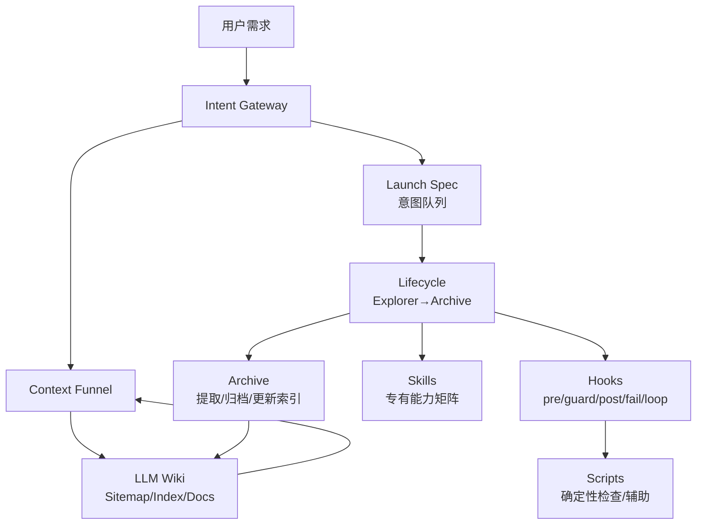
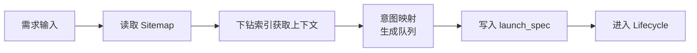
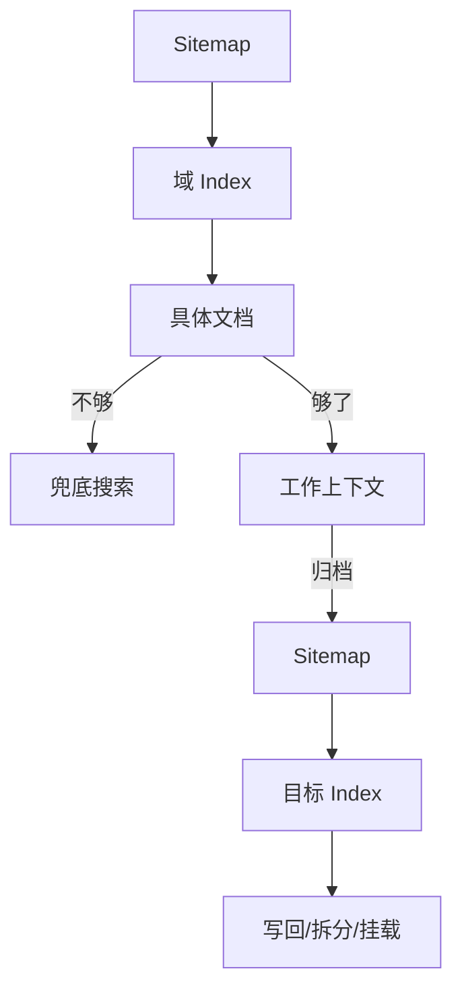
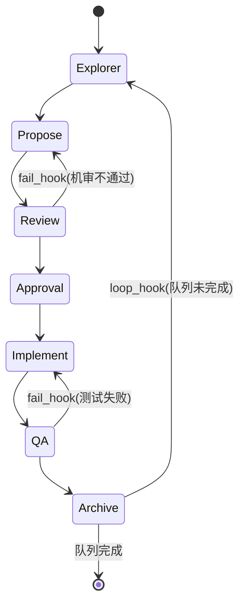
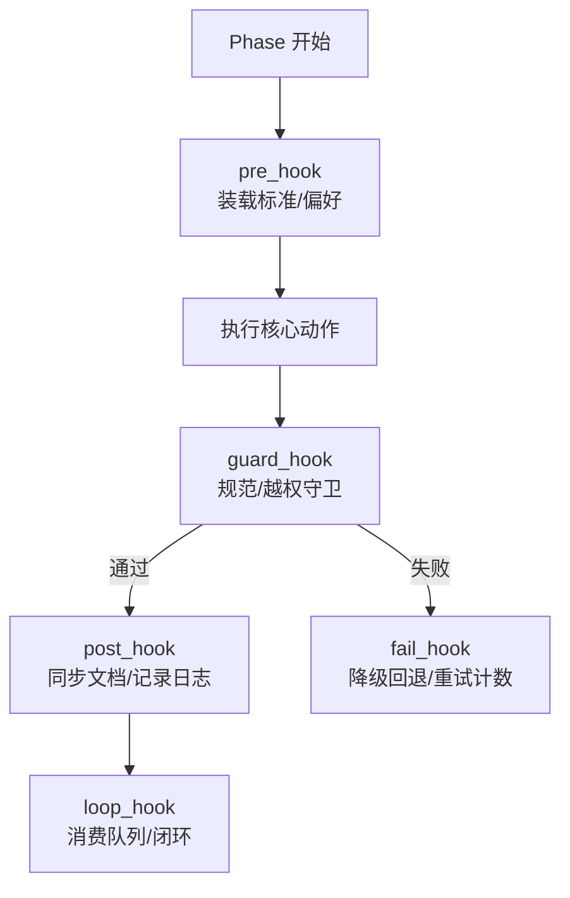

<div align="center">

# 后端 Agent 研发体系<br/>工程规范手册 + Onboarding

### 面向后端研发的 Agent 驱动工程完整指南

[](ENGINEERING_MANUAL_zh.md)
[](ENGINEERING_MANUAL_zh.md)
[](ENGINEERING_MANUAL.md)

**可持续 • 可中断 • 自我纠偏 • 防膨胀**

[快速上手](#0-新人-3-分钟上手) | [架构总览](#1-架构总览) | [使用场景](#01-如何使用多场景示例)

---

**语言版本**: [中文（本文件）](ENGINEERING_MANUAL_zh.md) | [English Manual](ENGINEERING_MANUAL.md)

</div>

---

本目录定义了一套面向**后端研发**的 Agent 驱动工程流程：通过"意图网关 + 生命周期状态机 + 知识图谱（LLM Wiki）+ 技能（Skills）+ 钩子纠偏（Hooks）"实现可持续演进、可断点续传、可自我纠偏、防膨胀的研发闭环。

本文档既是工程规范手册，也是新人快速上手指南。

## 0. 新人 3 分钟上手

**第一步（必读规则入口）**\
阅读：[项目级规则入口](project-rules.md)。

**第二步（从知识图谱下钻，不盲搜）**\
阅读：[知识图谱根节点](llm_wiki/sitemap.md)，然后按索引逐层下钻到你要的域（API / Data / Domain / Architecture / Specs / Preferences）。

**第三步（跑一次最小闭环）**\
按：[生命周期状态机](harness/lifecycle.md) 完成一次任务：Explorer → Propose → Review → Approval → Implement → QA → Archive。

## 0.1 如何使用（多场景示例）

本节给出“照着跑”的典型剧本。规则保持一致：先从 [知识图谱根节点](llm_wiki/sitemap.md) 下钻到域索引，再产出契约与阶段性工件，最后在 Archive 阶段反向写回索引并归档 Spec。

### 场景 A：新增查询类接口（不改表）

- 目标：新增一个只读接口（新增 DTO/Controller/Service），不涉及表结构变更。
- 下钻阅读：sitemap → schema/openspec\_schema → wiki/api/index（必要时再读 domain/index 与 preferences/index）。
- 生命周期路径：Explorer → Propose → Review → Approval → Implement → QA → Archive。
- 关键产出：
    - Explorer：范围/影响面/异常分支清单（含非目标）。
    - Propose：OpenSpec（接口签名、入参出参、错误码、示例 JSON、验收标准）。
    - Implement：代码变更（按契约实现），不超规格发挥。
    - QA：单测与关键用例证据。
- Archive 写回：把稳定的 API 片段提取进 wiki/api/ 对应索引；Spec 进入 archive。

### 场景 B：新增接口 + 改表（含索引）

- 目标：新增接口同时新增/调整表结构与索引。
- 下钻阅读：sitemap → schema/openspec\_schema → wiki/data/index + wiki/api/index（必要时读 domain/index）。
- 生命周期路径：Explorer → Propose → Review → Approval → Implement → QA → Archive。
- 关键产出：
    - Propose：OpenSpec 同时冻结 API 与 Data 契约（字段语义、约束、索引设计、兼容性策略）。
    - Review：重点机审 SQL 风险、索引利用、隐式转换与越权风险。
    - QA：补回归测试，覆盖核心查询与边界条件。
- Archive 写回：提取表结构与索引要点进 wiki/data/；接口要点进 wiki/api/；同步数据库文档与 ER 图（如适用）。

### 场景 C：Bug 修复（先复现、后补测试）

- 目标：修复缺陷，确保可复现、可回归、可追溯。
- 下钻阅读：sitemap → wiki/testing/index（策略与证据写法）→ preferences/index（历史禁忌）。
- 生命周期路径：Explorer → Implement → QA → Archive。
- 关键产出：
    - Explorer：最小复现路径、根因假设、影响面（是否需要补 Propose/契约更新）。
    - QA：先补失败用例，再修复实现，最后补回归证据。
- Archive 写回：在 wiki/testing/ 或 reviews/ 记录复现与修复摘要；必要时更新相关 API/Domain 索引。

### 场景 D：性能/SQL 优化（以 Review 为主门禁）

- 目标：在不改变对外行为的前提下做性能优化或 SQL 改写。
- 下钻阅读：sitemap → wiki/api/index（对外行为）→ wiki/data/index（索引与查询约束）→ preferences/index。
- 生命周期路径：Explorer → Propose → Review → Approval → Implement → QA → Archive。
- 关键产出：
    - Propose：说明“保持行为不变”的约束、性能瓶颈点、候选方案与回退策略。
    - Review：以 SQL 规范与索引利用为第一优先级；必要时降低方案复杂度。
    - QA：补对比证据（关键用例性能与正确性）。
- Archive 写回：把可复用的性能规则与反例沉淀到 preferences/ 或 data/ 索引。

### 场景 E：重构（含边界守卫与非目标）

- 目标：提升可维护性或拆分职责，但不引入需求漂移。
- 下钻阅读：sitemap → wiki/architecture/index（如有）→ preferences/index → domain/index（边界与术语）。
- 生命周期路径：Explorer → Propose → Review → Approval → Implement → QA → Archive。
- 关键产出：
    - Explorer：明确“做什么/不做什么”，列出潜在跨域点。
    - Review/Approval：跨域修改必须显式授权；否则视为越权，直接回退。
- Archive 写回：将架构决策与边界规则写回 architecture/ 与 preferences/，方便后续 guard\_hook 生效。

### 场景 F：并行协作（后端主交付，前端/QA 可选并行）

- 目标：后端主导交付，但允许前端与 QA 在契约冻结后并行推进。
- 下钻阅读：sitemap → schema/openspec\_schema（确认交接字段）→ wiki/api/index。
- 生命周期路径：Explorer → Propose → Review → Approval（冻结契约）→ Implement → QA → Archive。
- 协作关键点：
    - 在 Approval 阶段冻结 OpenSpec，使其可被前端/QA 作为并行工作的唯一依据。
    - 后端对外最小交接物来自 OpenSpec（示例 JSON、验收标准、错误码）；其余内容保持后端内聚，不强制外扩。

### 场景 G：知识写回与防膨胀（归档维护）

- 目标：把“短寿命 Spec”提取成“稳定索引”，并控制索引规模。
- 下钻阅读：sitemap → 目标域 index（api/data/domain/testing/preferences）。
- 生命周期路径：Archive（作为独立维护动作）或跟随常规任务的 Phase 6。
- 写回原则：
    - 新知识必须找到挂载点写回域索引；无法挂载的内容优先归档而不是留在活跃区。
    - 任一 index 超过阈值（例如 500 行）则拆分子目录 index，并更新上级挂载。

### 场景 H：可选体检工具箱（不替代 Agent）

- 目标：当你不确定是否破坏了图谱或契约结构时，做一次确定性体检。
- 可选工具（仅输出报告，不改文件）：
    - 图谱体检：[wiki\_linter.py](scripts/wiki/wiki_linter.py)（死链/孤岛/超长预警）
    - 契约体检：[schema\_checker.py](scripts/wiki/schema_checker.py)（关键结构缺失检查）
    - 偏好体检：[pref\_tag\_checker.py](scripts/wiki/pref_tag_checker.py)（规则标签规范检查）

***

## 1. 架构总览

### 1.1 组件架构图



### 1.2 核心思想（一句话）

- **不给大模型喂 RAG**：只提供“图谱入口 + 导航规则 + 兜底搜索权”，让 Agent 自主游走获取上下文。
- **契约先行**：先写 OpenSpec，再写代码；让评审与并行协作有抓手。
- **闭环与纠偏**：失败回退、最大重试、防越权、HITL、人类评分沉淀偏好，形成长期进化。
- **防膨胀**：Spec 是“热的、短寿命的”，必须在 Archive 阶段提取为稳定索引，并控制 Index 规模。
- **准确性声明**：文档中出现的“必须/强制”默认为流程纪律与评审门禁口径；除非明确写明“脚本/工具自动执行”，否则不代表系统会自动拦截或强制执行。

***

## 2. 目录与职责（包结构级别）

```text
.
├── intent/                  # 意图网关与上下文漏斗（入口与导航规则）
├── harness/                 # 生命周期状态机与钩子（拦截/纠偏/闭环）
├── llm_wiki/                # 知识库（sitemap/index/域知识/归档）
├── skills/                  # 专有技能（以 SKILL.md 为单位）
└── scripts/                 # 确定性脚本（图谱检查、辅助工具）
```

推荐把“读什么、怎么做、做完写回哪里”都视为工程的一部分，统一写进索引与契约，而不是存在对话记忆里。

### 2.1 project-rules.md（项目级规则入口）

- **定位**：本体系的“总入口规则”。用于把 Agent 的自由发挥限制在可控边界内（不盲搜、不越权、不暴走、不膨胀）。
- **输入/输出**：输入=任何任务；输出=统一的执行纪律（检索、生命周期、纠偏、归档、可选交接物）。
- **触发点**：每次任务开始时必须先读；当出现争议（路径、是否并行、是否需要交接物）时回到此处。
- **典型场景**：新人 onboarding；外部 Agent 接入；任务中断恢复；出现“该不该继续实现/该不该跨域改动”时的裁决。

### 2.2 intent/（意图层：把需求变成可执行队列）

本层解决“用户一句话 → 我到底要做哪些事、先做什么、后做什么”的问题。

- **关键文件**
    - [intent-gateway.md](intent/intent-gateway.md)
        - **做什么**：把自然语言需求拆成意图队列（例如 `Propose.API -> Implement.Code -> QA.Test`），并定义“并发语义=顺序无关性”。
        - **输出**：`intent/catalog/launch_spec_*.md`（意图队列持久化 + 断点续传）。
    - [context-funnel.md](intent/context-funnel.md)
        - **做什么**：定义 Agent 的“正向检索（下钻）”与“反向写回（归档提取）”。
        - **红线**：只有索引树找不到时才允许兜底搜索；写回必须先找挂载点，索引超过阈值必须拆分。
- **典型场景**
    - 新增接口：拆成 `Propose.API -> Review -> Approval -> Implement.Code -> QA.Test -> Archive`。
    - 改表结构：拆成 `Propose.Data -> Review -> Approval -> Implement.Code -> QA.Test -> Archive`。
    - Bug 修复：拆成 `Explore.Req -> Implement.Code -> QA.Test -> Archive`。

### 2.3 harness/（流程层：生命周期状态机 + 钩子纠偏）

本层解决“怎么确保任务可回退、可审查、可闭环”的问题。

- **关键文件**
    - [lifecycle.md](harness/lifecycle.md)
        - **做什么**：定义 Explorer→Archive 的单向状态机；规定冻结点（Phase 3.5）、闭环点（Phase 6）。
        - **输出**：阶段性产物（explore\_report/openspec/测试证据/归档提取）。
    - [hooks.md](harness/hooks.md)
        - **做什么**：把工程红线“写进流程里”，形成 guard/fail/loop 的纠偏系统。
        - **输出**：阻断/降级/回退/停止并请求人类介入。
- **典型场景**
    - 设计没过机审：Review 失败 → fail\_hook → 退回 Propose 重写。
    - 测试失败：QA 失败 → fail\_hook → 回退 Implement 修复。
    - 跨域修改：guard\_hook 触发领域边界守卫 → 必须显式授权或停止。
    - 多意图队列：loop\_hook 消费队列 → 自动开启下一轮 Explorer。

### 2.4 llm\_wiki/（知识层：可演进的分形图谱）

本层解决“知识如何组织、如何检索、如何防膨胀”的问题。

- **关键文件**
    - [sitemap.md](llm_wiki/sitemap.md)
        - **做什么**：知识图谱根节点，只挂载顶级域入口；是 Agent 的强制检索起点。
    - schema/
        - [schema/index.md](llm_wiki/schema/index.md)：规范域索引（路由器），告诉你“该读哪份契约/该跳到哪份流程”。
        - [openspec\_schema.md](llm_wiki/schema/openspec_schema.md)：OpenSpec 契约模板（后端主交付物；可选携带前端/QA交接字段）。
    - wiki/
        - **做什么**：活跃知识域（domain/api/data/architecture/specs/testing/preferences），按域隔离，索引必须可下钻。
    - archive/
        - **做什么**：冷数据；Spec 完成提取后进入归档，保留可追溯但不污染活跃区。
- **典型场景**
    - 新知识写回：Archive 阶段把不稳定 spec 提取成稳定 API/Data/Domain 索引。
    - 防膨胀拆分：某个 index 超过阈值 → 拆分子目录 index 并更新上级挂载。

### 2.5 skills/（能力层：专有专家能力插件）

本层解决“当任务进入专业领域时，如何快速调用专业能力并保持一致标准”的问题。

- **基本约定**：每个技能一个目录，入口文件为 `skills/<skill-name>/SKILL.md`。
- **典型场景**：实现前必须过 Java/API/SQL/权限等规范审查；归档阶段必须同步 API/DB 文档。

### 2.6 scripts/（工具层：确定性增强，不替代 Agent）

本层解决“哪些事情必须确定性完成，不能靠大模型猜”的问题。

- wiki/
    - `wiki_linter.py`：图谱体检（死链/孤岛/超长预警）。
    - `schema_checker.py`：契约结构体检（关键段落与 JSON 示例存在性检查）。
    - `pref_tag_checker.py`：偏好规则标签体检（便于精准检索）。
    - 其他可选脚本以 `scripts/wiki/` 目录为准（例如 `graph_checker.py`、`compaction.py` 等，未必纳入当前流程引用）。
- harness/
    - `engine.py`：队列状态辅助（可选；用于复杂任务时帮助记录当前意图/阶段/重试次数）。

### 2.7 每个目录的典型运行路径示例

intent/

- 典型路径：用户需求 → 读取 llm\_wiki/sitemap.md → 触发意图映射 → 写入 intent/catalog/launch\_spec\_\*.md
- 场景示例：新增接口 → 生成 Propose.API -> Implement.Code -> QA.Test 队列
- 结果：队列成为后续 Lifecycle 的“唯一调度依据”
  harness/
- 典型路径：读取 launch\_spec → 进入 Phase 1 → Propose/Review → Approval（HITL）→ Implement → QA → Archive
- 场景示例：Review 未通过 → 触发 fail\_hook → 退回 Propose 重写
- 结果：状态机保证可回退、可纠偏、可闭环
  llm\_wiki/
- 典型路径：从 sitemap.md 下钻 → 进入域 index → 读取具体文档 → 归档时反向写回 index
- 场景示例：新增 API → wiki/api/index.md 追加条目 → 超过阈值则拆分子目录
- 结果：知识可检索、可扩展、不膨胀
  skills/
- 典型路径：进入 Review/Implement/QA → 根据任务调用对应技能 → 输出规范化建议/检查结果
- 场景示例：新增 Controller → 触发 java-backend-api-standard 与 api-documentation-rules
- 结果：专业规则前置，降低实现偏差
  scripts/
- 典型路径：进入 Archive → 可选运行 wiki\_linter/schema\_checker/pref\_tag\_checker → 输出体检报告或格式建议
- 场景示例：发现孤岛文件 → 提示挂载到 sitemap/index
- 结果：图谱连通性与结构质量可控

***

## 3. 引擎与流程（详细解释 + 流程图）

### 3.1 Intent Gateway（意图网关）

**目的**：把自然语言需求拆成可流转的意图队列（例如：Propose.API → Implement.Code → QA.Test），并规定“并发语义=顺序无关性”。\
**规范文件**：[意图网关](intent/intent-gateway.md)



### 3.2 Context Funnel（知识漏斗：正向检索 + 反向写回）

**目的**：解决“上下文怎么取、怎么保证不膨胀”的问题。\
**规范文件**：[知识漏斗](intent/context-funnel.md)

- 正向检索：Sitemap → 域 index → 具体文档 → 必要时兜底关键词搜索
- 反向写回：根据 Sitemap 找挂载点，把新知识写回域 index；超过阈值拆分子索引



### 3.3 Lifecycle（生命周期状态机）

**目的**：把“分析→设计→评审→实现→测试→归档”固化为可回退、可闭环的状态机。\
**规范文件**：[生命周期](harness/lifecycle.md)



### 3.4 Hooks（钩子纠偏系统）

**目的**：把工程红线“卡在流程里”，做到自动纠偏与防失控。\
**规范文件**：[Hooks](harness/hooks.md)



***

## 4. 自我纠偏机制（触发点 / 条件 / 效果 / 评判）

| 机制             | 触发点          | 触发条件             | 产生效果                         | 评判方式                |
| -------------- | ------------ | ---------------- | ---------------------------- | ------------------- |
| guard\_hook    | 实现/改动过程中     | 风格不合规、权限/越权、跨域污染 | 立即阻断、要求重写或要求授权               | 规范技能审查、规则核对         |
| fail\_hook     | 任意阶段失败       | 编译/测试/审查失败       | 状态降级回退；记录失败原因；触发重试计数         | 客观日志（编译/测试输出）       |
| Max Retries    | fail\_hook 内 | 同一阶段连续失败达到阈值     | 强制停止并请求人类介入                  | 失败计数达到阈值            |
| Approval(HITL) | Review 通过后   | 需要进入 Implement   | “冻结契约”，由人类授权是否进入实现           | 人类确认（YES/NO + 修改意见） |
| Archive 写回     | 任务结束         | 新增/变更知识需要沉淀      | 从 Spec 提取稳定知识、归档热文档、更新索引     | 规则校验、连通性检查（可选脚本）    |
| Preferences 记忆 | Archive 前后   | 人类评分/反馈有代表性      | 将经验沉淀为偏好/禁忌，下一轮 pre\_hook 生效 | 人类评分 + 文字原因         |

***

## 5. 阶段产出物（后端主交付物 + 可选对外交接物）

> 本体系以**后端交付**为主。前端/QA 交接物是“在需要并行协作时”由后端契约附带提供的可选交付。

| Phase          | 后端必产出                      | 可选给前端/QA 的交接物                                                     |
| -------------- | -------------------------- | ----------------------------------------------------------------- |
| Explorer       | explore\_report（范围/影响面/风险） | 无                                                                 |
| Propose        | openspec（严格按 Schema）       | API Contract（含 JSON Example）；Acceptance Criteria（Given/When/Then） |
| Review         | 机审结论与修改记录                  | 无                                                                 |
| Approval(HITL) | 人类确认（冻结契约）                 | 作为并行协作的“发令枪”                                                      |
| Implement      | 代码变更（最小可用实现）               | 可选：联调说明、Mock/示例                                                   |
| QA             | 单测/必要的集成测试证据               | 可选：接口自测脚本、E2E 要点                                                  |
| Archive        | 提取稳定知识到索引、归档 Spec          | 可选：变更摘要、迁移说明                                                      |

契约模板详见：[OpenSpec Schema](llm_wiki/schema/openspec_schema.md)。

***

## 6. Skills（技能清单 + 阶段映射）

### 6.1 技能字典（每个技能 3–5 行说明 + 使用阶段）

> 规则：技能不等于流程；技能用于在流程的某些阶段提供“专业能力与一致标准”。

- [intent-gateway](skills/intent-gateway/SKILL.md)\
  用途：意图入口能力，协助理解需求并启动“先读图谱再下钻”的工作姿势。\
  使用阶段：任务开始/Explorer 入口。\
  触发：任何自然语言需求进入系统时。
- [devops-lifecycle-master](skills/devops-lifecycle-master/SKILL.md)\
  用途：生命周期主控编排，确保严格遵循 Phase 边界（Propose 之前不写代码等）。\
  使用阶段：全程（编排器）。\
  触发：复杂任务、多意图队列或需要强制遵循流程时。
- [product-manager-expert](skills/product-manager-expert/SKILL.md)\
  用途：需求澄清、范围界定、业务目标与验收口径提炼。\
  使用阶段：Explorer（PDD）。\
  触发：需求模糊、口径不一致、需要补充用户故事/验收项时。
- [prd-task-splitter](skills/prd-task-splitter/SKILL.md)\
  用途：将 PRD 拆分为结构化开发任务、依赖关系与执行顺序。\
  使用阶段：Explorer → Propose 前的任务拆解。\
  触发：需求跨度大、存在多模块并行时。
- [devops-requirements-analysis](skills/devops-requirements-analysis/SKILL.md)\
  用途：PDD/SDD 边界梳理，输出可执行的需求规格与影响面。\
  使用阶段：Explorer。\
  触发：需要形成规范化需求文档或明确范围/非目标时。
- [devops-system-design](skills/devops-system-design/SKILL.md)\
  用途：系统设计与数据建模（FDD/SDD），包括表结构、索引、扩展性方案。\
  使用阶段：Propose。\
  触发：新增/修改接口或数据结构、涉及架构决策时。
- [devops-task-planning](skills/devops-task-planning/SKILL.md)\
  用途：将设计拆成实现任务清单，明确实现顺序与验证点。\
  使用阶段：Propose → Review 之间。\
  触发：准备进入实现前，需要把工作拆成可执行步骤时。
- [devops-review-and-refactor](skills/devops-review-and-refactor/SKILL.md)\
  用途：对设计与实现进行评审与重构建议，降低性能/维护风险。\
  使用阶段：Review。\
  触发：方案存在争议、质量门禁需要加强时。
- [global-backend-standards](skills/global-backend-standards/SKILL.md)\
  用途：全局后端标准索引入口，用于统一工程规范/分层/依赖规则。\
  使用阶段：pre\_hook / Review。\
  触发：任何后端改动进入评审与实现前。
- [java-engineering-standards](skills/java-engineering-standards/SKILL.md)\
  用途：Java 工程分层与包结构规范，保证职责边界与可维护性。\
  使用阶段：Review / Implement。\
  触发：新增模块、重构、跨层调用等风险场景。
- [java-backend-guidelines](skills/java-backend-guidelines/SKILL.md)\
  用途：Java 防御性编程、Complete assembly、分页等通用编码准则。\
  使用阶段：pre\_hook / Implement。\
  触发：写业务代码、涉及参数校验/异常处理时。
- [java-backend-api-standard](skills/java-backend-api-standard/SKILL.md)\
  用途：接口设计规范（动词/路径/返回结构等），避免 API 演进失控。\
  使用阶段：Review。\
  触发：新增/修改 Controller、DTO、对外 API 契约时。
- [java-javadoc-standard](skills/java-javadoc-standard/SKILL.md)\
  用途：统一 Javadoc 风格与注释规范，保证可读性与一致性。\
  使用阶段：guard\_hook / Implement。\
  触发：新增重要类/公共方法、需要补齐注释时。
- [java-data-permissions](skills/java-data-permissions/SKILL.md)\
  用途：数据权限约束（查询过滤/动作校验），避免越权。\
  使用阶段：guard\_hook / Review。\
  触发：涉及用户/组织数据读取、跨租户风险点时。
- [mybatis-sql-standard](skills/mybatis-sql-standard/SKILL.md)\
  用途：MyBatis SQL 性能与规范守卫（避免隐式转换、JOIN 风险、索引利用）。\
  使用阶段：Review / Implement。\
  触发：写 Mapper XML、复杂查询、性能敏感接口时。
- [error-code-standard](skills/error-code-standard/SKILL.md)\
  用途：统一错误码与异常表达方式，避免随意抛错导致前后端割裂。\
  使用阶段：Review / Implement。\
  触发：新增 BusinessException/ApiResponse.failed 等分支时。
- [checkstyle](skills/checkstyle/SKILL.md)\
  用途：Java 代码风格强制门禁（Google/Sun 混合规则）。\
  使用阶段：guard\_hook / QA。\
  触发：提交前、评审前、格式不一致风险高时。
- [devops-feature-implementation](skills/devops-feature-implementation/SKILL.md)\
  用途：按规格实现功能代码（强调 TDD 与工程标准）。\
  使用阶段：Implement。\
  触发：进入编码阶段实现需求时。
- [devops-bug-fix](skills/devops-bug-fix/SKILL.md)\
  用途：缺陷定位、复现、修复并补回归测试。\
  使用阶段：Implement / QA。\
  触发：线上/测试缺陷、回归失败、异常难定位时。
- [devops-testing-standard](skills/devops-testing-standard/SKILL.md)\
  用途：测试规范与 TDD 阶段指导（先写失败测试再实现）。\
  使用阶段：QA（也可前置到 Implement 前）。\
  触发：新增功能、修复缺陷必须补测试时。
- [code-review-checklist](skills/code-review-checklist/SKILL.md)\
  用途：强制评审清单门禁，覆盖安全/性能/规范/可维护性。\
  使用阶段：QA / fail\_hook。\
  触发：进入提交/合并前，或失败回退需要逐项排查时。
- [api-documentation-rules](skills/api-documentation-rules/SKILL.md)\
  用途：强制接口文档生成与归档规则，避免“代码更新但文档缺失”。\
  使用阶段：post\_hook / Archive。\
  触发：新增/修改 Controller 接口时。
- [database-documentation-sync](skills/database-documentation-sync/SKILL.md)\
  用途：数据库结构变更时同步表文档、清单与 ER 图。\
  使用阶段：post\_hook / Archive。\
  触发：改表/改索引/新增实体或 SQL 迁移时。
- [utils-usage-standard](skills/utils-usage-standard/SKILL.md)\
  用途：统一工具类/框架用法，避免各写各的导致风格碎片化。\
  使用阶段：Implement。\
  触发：准备引入/复用工具类、写通用逻辑时。
- [aliyun-oss](skills/aliyun-oss/SKILL.md)\
  用途：对象存储（多桶/环境隔离/预签名/上传下载）相关能力规范。\
  使用阶段：Implement / Propose。\
  触发：涉及文件上传下载或存储方案时。
- [skill-graph-manager](skills/skill-graph-manager/SKILL.md)\
  用途：维护技能知识图谱的双向链接与中心索引一致性。\
  使用阶段：技能创建/修改后。\
  触发：新增技能或调整技能关系时。
- [trae-skill-index](skills/trae-skill-index/SKILL.md)\
  用途：技能总索引入口，帮助 Agent 快速找到合适的专家能力。\
  使用阶段：任何阶段（查能力）。\
  触发：不确定用哪个技能解决当前问题时。

### 6.2 生命周期阶段 → 推荐技能

| Phase     | 推荐技能                                                                                                   |
| --------- | ------------------------------------------------------------------------------------------------------ |
| Explorer  | product-manager-expert, devops-requirements-analysis, prd-task-splitter                                |
| Propose   | devops-system-design, devops-task-planning                                                             |
| Review    | devops-review-and-refactor, global-backend-standards, java-\*/mybatis-sql-standard/error-code-standard |
| Implement | devops-feature-implementation, devops-bug-fix, utils-usage-standard, aliyun-oss                        |
| QA        | devops-testing-standard, code-review-checklist                                                         |
| Archive   | api-documentation-rules, database-documentation-sync                                                   |

***

## 7. 常用机制清单（工程红线）

- **不盲搜**：从 Sitemap 下钻；兜底搜索仅在索引找不到时使用。
- **不越权**：跨域修改必须显式授权（写入 openspec 并在 Review/HITL 阶段确认）。
- **不暴走**：失败回退 + 最大重试阈值；达到阈值必须停并请求人类介入。
- **不膨胀**：Spec 必须归档；稳定知识必须提取到索引；索引超过阈值必须拆分。

***

## 8. 可选辅助脚本（不替代 Agent，只做确定性增强）

- 图谱体检（死链/孤岛/超长预警）：[wiki\_linter.py](scripts/wiki/wiki_linter.py)
- 契约结构体检（关键结构缺失检查）：[schema\_checker.py](scripts/wiki/schema_checker.py)
- 偏好标签体检（规则标签规范检查）：[pref\_tag\_checker.py](scripts/wiki/pref_tag_checker.py)
- 生命周期队列辅助（可选）：[engine.py](scripts/harness/engine.py)
- 其他脚本以 `scripts/wiki/` 目录为准（不强制纳入流程）。

***

## 9. 思想来源与落地映射（OpenSpec / Harness / LLM Wiki / Engine / Skills / 图谱 / 脚本工具）

| 思想/组件             | 我们的理解                                             | 在哪里落地                                                                       |
| ----------------- | ------------------------------------------------- | --------------------------------------------------------------------------- |
| OpenSpec（契约先行）    | 先用结构化契约冻结需求与设计，再允许进入实现与测试                         | `llm_wiki/schema/openspec_schema.md` + Phase 2 Propose + Phase 3.5 Approval |
| Harness（生命周期/状态机） | 流程不是口头约定，而是可回退、可拦截、可闭环的状态机                        | `harness/lifecycle.md`                                                      |
| Hooks（纠偏系统）       | 用 guard/fail/loop 把“越权、暴走、膨胀”锁死在流程里               | `harness/hooks.md`                                                          |
| LLM Wiki（可演进知识库）  | 用 sitemap + 多级 index 让 Agent 自主游走检索；用 archive 防膨胀 | `llm_wiki/sitemap.md` + `llm_wiki/wiki/*/index.md` + `llm_wiki/archive/`    |
| 知识图谱（连通性）         | 所有知识必须可从根溯源；孤岛/死链视为“垃圾”                           | sitemap 挂载纪律 + scripts/wiki/wiki\_linter.py（可选）                             |
| Skills（专家能力矩阵）    | 专业问题交给专业技能，流程阶段内按需调用，保证一致标准                       | `skills/*/SKILL.md` + Phase 映射表                                             |
| Engine（可选辅助）      | 不替代 Agent，只在复杂任务时提供“队列/阶段/重试计数”的确定性托管             | `scripts/harness/engine.py`（可选）                                             |
| 脚本工具（确定性增强）       | 需要确定性的检查与辅助（图谱体检、索引拆分建议）交给脚本                      | `scripts/wiki/*`                                                            |

### 9.1 与 PDD / FDD / SDD / TDD 的对应关系

- **PDD（需求）**：主要落在 Phase 1 Explorer（澄清边界、拆解任务、形成验收口径）。
- **SDD（系统设计）**：主要落在 Phase 2 Propose（数据库/接口/扩展性设计写进 OpenSpec）。
- **FDD（功能设计）**：同样落在 Phase 2 Propose（把功能行为、异常分支、边界条件写清）。
- **TDD（测试驱动）**：主要落在 Phase 5 QA（也可前置到 Implement 前），并通过 fail\_hook 强制回归。

***

## 10. 入口索引（建议收藏）

- 规则入口：[project-rules.md](project-rules.md)
- 知识图谱根入口：[llm\_wiki/sitemap.md](llm_wiki/sitemap.md)
- 契约模板：[llm\_wiki/schema/openspec\_schema.md](llm_wiki/schema/openspec_schema.md)
- 意图网关：[intent/intent-gateway.md](intent/intent-gateway.md)
- 知识漏斗：[intent/context-funnel.md](intent/context-funnel.md)
- 生命周期：[harness/lifecycle.md](harness/lifecycle.md)
- Hooks：[harness/hooks.md](harness/hooks.md)

---

**相关文档**：
- **📘 主 README（中文）**：[README_zh.md](README_zh.md) - 项目概览与快速入门指南
- **🇺🇸 English Version**: [ENGINEERING_MANUAL.md](ENGINEERING_MANUAL.md) - Complete English documentation

---

<div align="center">

**为可持续的智能后端开发而构建**

[⬆ 返回顶部](#后端-agent-研发体系br工程规范手册--onboarding)

</div>
