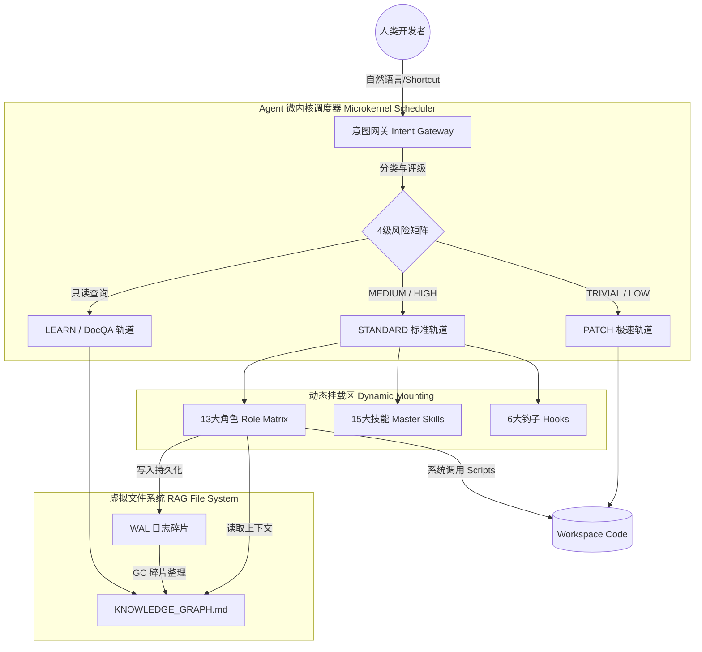
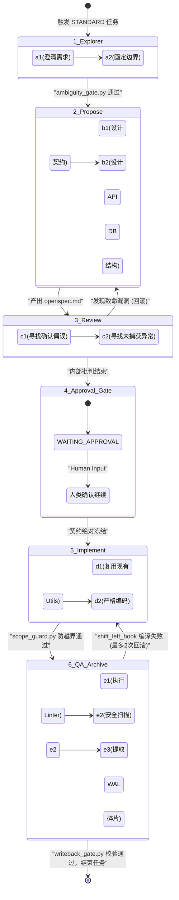
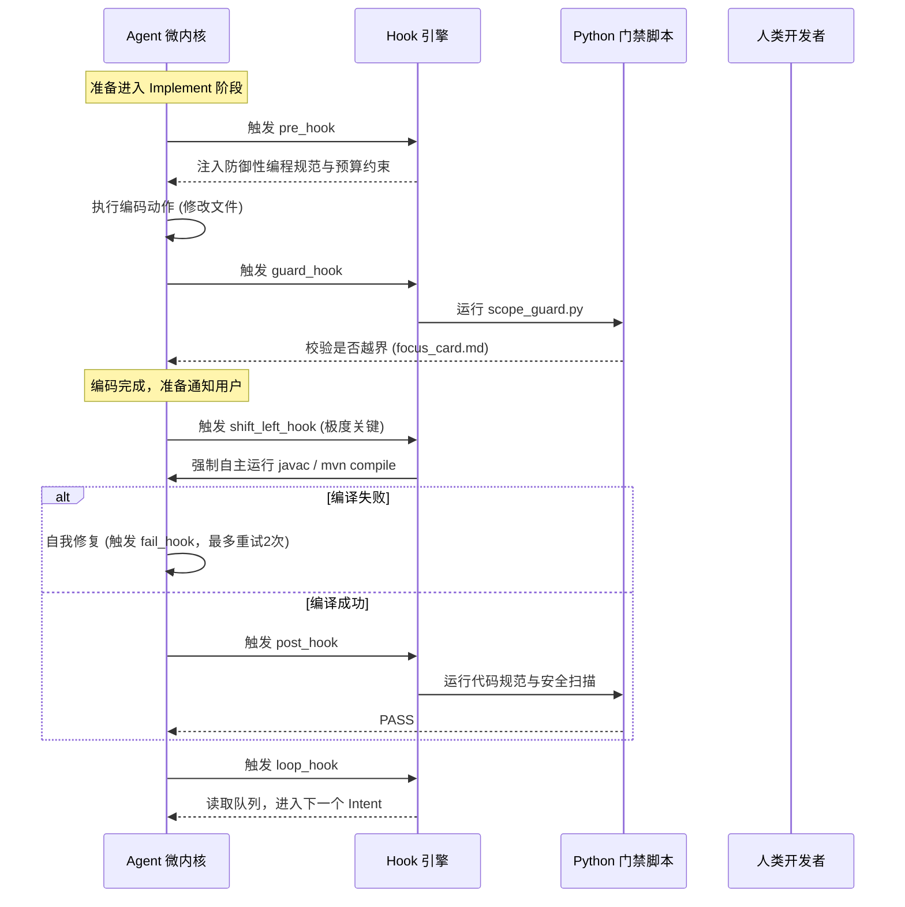

<div align="center">

# 后端 Agent 研发体系百科全书 (Ultimate Edition)
**Engineering Manual + Onboarding Guide**

### 面向后端开发的 Agent 驱动微内核操作系统全景指南

[](ENGINEERING_MANUAL_zh.md)
[](README_zh.md)
[](ENGINEERING_MANUAL.md)

**微内核 • 双轨制 • 13大角色 • 15大技能 • 6大钩子 • 纯Markdown文件系统**

</div>

---

## ⚠️ 核心定位声明：这不是框架，这是 Agent OS

> **本项目是一个纯 LLM 原生的微内核操作系统（Microkernel OS），专为大语言模型的自主执行而设计。**
>
> 传统的 Agent 框架采用臃肿的“宏内核”设计，将所有的 Prompt、技能和上下文堆砌在一起，极易导致大模型上下文污染（OOM）、产生幻觉和死锁。本项目采用极简的微内核哲学：
> **意图即进程，上下文即内存，工具/脚本即系统调用，Wiki 即文件系统，角色即特权环。**
>
> 任何破坏这套操作系统纪律的行为（例如：跳过 Approval Gate 直接写代码、不写 WAL 直接结束任务、全局搜索取代索引下钻），都会导致系统崩溃（知识丢失或代码腐败）。

---

## 目录
1. [全局架构设计图 (Global Architecture)](#1-全局架构设计图-global-architecture)
2. [意图路由与双轨制工作流 (Intent Gateway)](#2-意图路由与双轨制工作流-intent-gateway)
3. [生命周期与 6 大阶段流转图 (Lifecycle)](#3-生命周期与-6-大阶段流转图-lifecycle)
4. [13 大动态角色矩阵详解 (Role Matrix)](#4-13-大动态角色矩阵详解-role-matrix)
5. [系统中断与 6 大钩子时序图 (Hooks)](#5-系统中断与-6-大钩子时序图-hooks)
6. [纯 Markdown 文件系统与图谱 (Wiki & WAL)](#6-纯-markdown-文件系统与图谱-wiki--wal)
7. [15 大核心技能生态 (Master Skills)](#7-15-大核心技能生态-master-skills)
8. [底层 Scripts 系统调用清单 (Scripts Manifest)](#8-底层-scripts-系统调用清单-scripts-manifest)
9. [排障与降级指南 (Troubleshooting)](#9-排障与降级指南-troubleshooting)

---

## 1. 全局架构设计图 (Global Architecture)

整个系统由网关、调度器、执行器和文件系统四大核心模块构成。大模型不再是“全能写手”，而是受限于不同内核态的“进程”。



---

## 2. 意图路由与双轨制工作流 (Intent Gateway)

Agent 接收到用户输入后，第一步必须进行 `[Intent Check]`，将其映射为标准的进程类型。这一步由系统的核心网关自动完成，决定了后续由哪些“英雄”出场。

### 2.1 四大意图 (Intents)
- **Change**: 所有修改代码的动作。触发写回机制 (WAL)。
- **Learn**: 具有明确范围的只读代码解析。不写回。
- **DocQA**: 询问规则、流程或模板。
- **Audit**: 只读的代码库审查或风险扫描。

### 2.2 风险评级与双轨制流转图详解

意图被确认后，系统会根据 **4级风险矩阵** 将任务分发到两条截然不同的轨道。以下是这两条轨道的详细运作流转，以及对应出场的“英雄”。

```mermaid
flowchart TD
    A((用户输入)) -->|解析 Intent| B{网关风险评级}
    
    subgraph PATCH 轨道 轻量与极速
        B -->|TRIVIAL 极速| C[跳过探索与设计]
        B -->|LOW 轻量| D[@Ambiguity Gatekeeper 画出 Focus Card]
        C --> E[@Lead Engineer 极速编码]
        D --> E
        E --> F[@Code Reviewer 代码审查]
        F --> G[@Knowledge Extractor 记录漂移 WAL]
    end
    
    subgraph STANDARD 轨道 重型架构
        B -->|MEDIUM 契约| H[@Requirement Engineer 澄清需求]
        B -->|HIGH 史诗| H
        H --> I[@System Architect 产出 openspec.md]
        I --> J[@Devil's Advocate 破坏性审查]
        J --> K((Approval Gate 人类审批))
        K -->|打回| I
        K -->|通过| L[@Lead Engineer 严格按照契约编码]
        L --> M[@Focus Guard 全程监视防越界]
        L --> N[@Security Sentinel 安全扫描]
        N --> O[@Knowledge Extractor & @Documentation Curator 写回知识图谱]
    end
```

#### 🛤️ 轨道 1: PATCH Track (轻量级/快速修复轨道)
**适用场景**: 拼写错误、日志补充 (TRIVIAL)；空指针修复、私有方法提取 (LOW)。
**核心哲学**: “小步快跑，测试兜底，无需人类审批。”
**英雄出场时序与具体动作**:
1. **启动阶段**: 如果是 LOW 级别，**@Ambiguity Gatekeeper (歧义守门员)** 率先出场，他只做一件事：画出一条极窄的红线，生成 `focus_card.md`，明确界定这次小修小补只允许碰哪几个文件。如果是 TRIVIAL 级别，连这一步都省了，直接放行。
2. **编码阶段**: **@Lead Engineer (首席工程师)** 直接进场。他不看宏大的架构图，只盯着要修的 BUG，迅速修改代码，并用 `javac` 编译器自测。
3. **QA 兜底**: **@Code Reviewer (代码审查员)** 介入，检查有没有留下低级的语法错误。
4. **结束阶段**: **@Knowledge Extractor (沉默的史官)** 简单记录一下这次“漂移（Drift）”，写入轻量级的 WAL 碎片，然后任务结束。

#### 🛤️ 轨道 2: STANDARD Track (重型/契约驱动轨道)
**适用场景**: 新增 API、数据库字段变更 (MEDIUM)；核心链路重构、权限体系大改 (HIGH)。
**核心哲学**: “谋定而后动，契约绝对冻结，必须人类介入。”
**英雄出场时序与具体动作**:
1. **探索阶段**: **@Requirement Engineer (需求工程师)** 强势介入，逼迫人类消除模糊需求，强行挂载 `product-manager-expert` 技能，产出清晰的 `explore_report.md`。
2. **设计阶段**: **@System Architect (系统架构师)** 登场。他挂载 `java-architecture-standards` 技能，设计 API 签名和数据库 DDL，写出至高无上的 `openspec.md`。
3. **自相残杀阶段**: **@Devil's Advocate (魔鬼代言人)** 冲出来，挂载 `cognitive-bias-checklist`，疯狂寻找架构师设计中的逻辑漏洞。两人“吵”完后，方案定型。
4. **人类介入点**: 触发 **Approval Gate**。大模型暂停一切动作，等待真实人类签署 `WAITING_APPROVAL`。
5. **编码阶段**: 人类同意后，**@Lead Engineer (首席工程师)** 入场，完全变成打字机，一行行实现契约。此时，**@Focus Guard (专注守卫)** 拿着戒尺在旁边死死盯着，只要工程师碰了契约外的文件，立刻 FAIL。
6. **归档阶段**: 最终，史官、馆长们集体出动，提取全部知识，写回 Markdown 虚拟文件系统。

### 2.3 快捷指令 (Shortcut DSL)
- `@patch`：强制走 PATCH 轨道。
- `@standard`：强制走 STANDARD 轨道。
- `@learn`：强制只读。
- `@gc` / `@librarian`：唤醒图书管理员，强制合并 Wiki WAL 碎片。
- `@patch --emergency`：跳过 Review，直达代码，但强制过 `secrets_linter.py` 安全门禁。

---

## 3. 生命周期与 6 大阶段流转图 (Lifecycle)

在 STANDARD 轨道中，任务必须经历严格的 6 阶段单向状态机。任何阶段失败（触发 `fail_hook`），都会回滚到上一阶段。这一章我们将彻底拆解每一个阶段的内部细节：到底挂载了什么技能？由哪位英雄执行？触发了什么门禁？



### 🔍 阶段 1: Explorer (探索与需求澄清)
- **登场英雄**: `@Requirement Engineer` 与 `@Ambiguity Gatekeeper`
- **挂载技能 (Skills)**: 
  - `product-manager-expert` (产品专家：消除模糊形容词)
  - `task-decomposition-guide` (拆解大师：如果是 EPIC 任务，在此处开始垂直切片)
- **具体操作步骤**:
  1. 英雄读取 `KNOWLEDGE_GRAPH.md`，向下钻取上下文，但受到 OOM 杀手限制（最多读3个Wiki）。
  2. 将人类含糊的需求翻译为具体的 Acceptance Criteria (AC)。
  3. 定义修改的红线。
- **强制产出物**: `explore_report.md`，并在末尾必须附带 `## Core Context Anchors`（核心锚点链接，防止后续阶段丢失上下文）。
- **门禁拦截**: 执行 `ambiguity_gate.py`。如果发现需求中存在“可能”、“或许”、“大概”等词汇，直接拒绝进入设计阶段。

### 📐 阶段 2: Propose (契约与架构设计)
- **登场英雄**: `@System Architect`
- **挂载技能 (Skills)**:
  - `java-architecture-standards` (架构红线：严禁跨层设计)
  - `mybatis-sql-standard` (DB 守卫：设计表时强制加入 8 大审计字段)
- **具体操作步骤**:
  1. 严格基于 `explore_report.md` 中的 AC，设计对外的 RESTful API 签名。
  2. 设计对应的数据库 DDL（如果是新增表）。
  3. 评估这次改动会影响哪些已有的上游调用方（Blast Radius 爆炸半径评估）。
- **强制产出物**: `openspec.md`（包含 API、DB 和核心流转逻辑）。

### 😈 阶段 3: Review (内部残酷审查)
- **登场英雄**: `@Devil's Advocate`
- **挂载技能 (Skills)**:
  - `cognitive-bias-checklist` (认知防线：寻找架构师的锚定效应和确认偏误)
  - `spec-quality-checklist` (审查契约文档的完整性)
- **具体操作步骤**:
  1. 假定 `openspec.md` 中的设计一定会失败，反向推导可能导致死锁、NPE（空指针）的边缘场景。
  2. 如果发现设计有致命缺陷，触发 `fail_hook`，强行将状态机打回 2_Propose 阶段，逼迫架构师重写。
- **门禁拦截**: 只有当魔鬼代言人找不出明显的逻辑漏洞时，流程才允许停靠在人类的门前。

### 🛑 阶段 4: Approval Gate (人类绝对控制点)
- **登场英雄**: 无（系统进入内核中断休眠状态）
- **具体操作步骤**:
  1. 状态机被强行锁定为 `WAITING_APPROVAL`。
  2. Agent 在聊天框中输出：“契约已生成完毕。请人类审查 openspec.md。回复‘继续’以授权编码，回复‘拒绝’以打回重做。”
  3. 这是一个硬性隔离带，彻底杜绝了大模型“先斩后奏”写出一堆无法维护的垃圾代码的可能性。

### ⚙️ 阶段 5: Implement (契约绝对执行)
- **登场英雄**: `@Lead Engineer` 与 `@Focus Guard`
- **挂载技能 (Skills)**:
  - `java-coding-style` (代码美学：防御性编程，Google/Sun 规范)
- **具体操作步骤**:
  1. 首席工程师拿起冻结的 `openspec.md`，开始逐行编写 Java 代码和 Mapper XML。
  2. 优先搜索项目中已有的 `BaseResponse`, `DateUtils` 等工具类，严禁自己重复造轮子。
  3. 专注守卫在旁边死死盯着 `git diff`，如果工程师修改了任何不在 `focus_card.md` 中的文件，守卫会立刻使用 `scope_guard.py` 斩断流程。
- **门禁拦截**: 触发极为关键的 `shift_left_hook`。代码写完后，大模型**必须自主在终端执行** `javac` 或 `mvn compile`。如果报错，允许重试 2 次。如果 2 次后依然编译失败，触发系统最高警报，任务失败并呼叫人类。

### 📚 阶段 6: QA & Archive (测试、扫描与知识永生)
- **登场英雄**: `@Code Reviewer`, `@Security Sentinel`, `@Knowledge Extractor`, `@Documentation Curator`, `@Skill Graph Curator`
- **挂载技能 (Skills)**:
  - `code-review-checklist` (检查 N+1 查询等隐患)
  - `wal-documentation-rules` (规范化提取知识碎片)
- **具体操作步骤**:
  1. **代码体检**: 运行 `secrets_linter.py` 扫描是否泄露了阿里云 AK 等密码。
  2. **知识提炼**: 史官出场，绝不重新阅读冗长的对话记录，而是直接扫描最终的 `git diff`，提取出真正的领域概念、API 变更，写入 `YYYYMMDD_feature_wal.md`。
  3. **文档更新**: 馆长出场，更新 `README.md` 和 Javadoc，坚持写“Why”而不是“What”。
  4. **知识转移**: 将原始的 `openspec.md` 移入冷宫 `.agents/llm_wiki/archive/`。
- **门禁拦截**: 执行最终的 `writeback_gate.py`。如果不写 WAL，系统判定为“知识丢失”，任务拒绝宣告完成。一旦校验通过，系统读取事件队列，进行下一次循环（`loop_hook`）。

---

## 4. 13 大动态角色矩阵详解 (The Virtual Team - Hero Selection)

Agent 并不是一个孤立运作的“全栈大模型”，而是一个动态切换人格的硬核虚拟团队。在进入任何阶段前，大模型必须在 `<Cognitive_Brake>` 中大声喊出当前挂载的英雄名字（Role）。如果不声明，底层的 Python 门禁脚本将判定为“灵魂出窍”并直接击杀（FAIL）。

以下是这支团队的英雄图鉴。每一位英雄都有自己的阵营、武器和底线。

---

### 🛡️ 阶段 1: Explorer (迷雾探索期)

#### 📝 英雄 01: @Requirement Engineer (需求工程师)
> *"不要给我发‘优化一下’、‘快一点’这种垃圾词汇。告诉我你的边界，或者闭嘴！"*

- **职业 (Class)**: 边界裁定者
- **阵营 (Alignment)**: 守序中立
- **被动技能**: 绝对清晰（无视一切模糊的形容词）
- **专属武器**: `ambiguity_gate.py` (模糊处决剑)
- **英雄自述**:
  “我是整个团队的第一道防线。人类总是喜欢用做梦的语气提需求，而我的任务，就是把这些梦境翻译成冰冷的、可测试的 Happy Path（快乐路径）和 Edge Cases（边缘异常）。如果你给我的需求没有清晰的验收标准（AC），我会立刻挥动我的 `ambiguity_gate.py` 斩断流程。产出 `explore_report.md` 是我的唯一使命。”

#### 🛑 英雄 02: @Ambiguity Gatekeeper (歧义守门员)
> *"等一下，大模型兄弟，你确定你要在一个千万级代码库里全局搜索 'user' 吗？"*

- **职业 (Class)**: 理智守护者
- **阵营 (Alignment)**: 绝对守序
- **被动技能**: 幻觉免疫（拦截无效的 grep 搜索）
- **专属武器**: `focus_card.md` (结界符文)
- **英雄自述**:
  “我是团队的理智刹车片。我最怕看到其他大模型兄弟像无头苍蝇一样在代码库里乱撞。特别是在排查 BUG 时，我会强迫所有人坐下来，先执行 5-Whys（连续问5个为什么）根因分析。我会亲手画下 `focus_card.md` 这道红线，告诉所有人：‘不该看的别看，不该碰的别碰’。”

---

### 🏛️ 阶段 2 & 3: Propose & Review (架构设计与残酷审查期)

#### 📐 英雄 03: @System Architect (系统架构师)
> *"爆炸半径在我的计算之内。现在，听我指挥，按我的蓝图开工！"*

- **职业 (Class)**: 战术指挥官
- **阵营 (Alignment)**: 守序善良
- **被动技能**: 全局视野（精准评估跨服务调用风险）
- **专属武器**: `openspec.md` (至高契约卷轴) + Approval Gate (人类召唤阵)
- **英雄自述**:
  “在那些史诗级（EPIC）的重构任务里，我就是至高无上的包工头。我负责设计 API 签名和数据库表结构。我不写具体的业务代码，我只产出 `openspec.md` 契约。但请记住，我的设计图再完美，也必须经过真实人类的签字（WAITING_APPROVAL）才能生效。没有人类的批准，我的卷轴就是废纸。”

#### 😈 英雄 04: @Devil's Advocate (魔鬼代言人)
> *"哦，架构师大人，你真的觉得这段看似完美的流转逻辑，能扛得住高并发下的死锁吗？"*

- **职业 (Class)**: 破坏性暴徒
- **阵营 (Alignment)**: 混乱中立
- **被动技能**: 确认偏误粉碎机
- **专属武器**: `cognitive-bias-checklist` (深渊凝视)
- **英雄自述**:
  “我是团队里最招人恨的混蛋，但你们不能没有我。我的唯一生存意义，就是证明架构师的设计是个垃圾。我会用极其恶毒的眼光盯着 `openspec.md`，疯狂寻找逻辑漏洞、确认偏误和被遗漏的异常流。只要我还没闭嘴，这个设计就休想提交给人类去审批！”

---

### ⚔️ 阶段 4 & 5: Implement & QA (编码与无情测试期)

#### ⚙️ 英雄 05: @Lead Engineer (首席工程师)
> *"契约就是法律。我不创造，我只实现。"*

- **职业 (Class)**: 契约执行者
- **阵营 (Alignment)**: 守序善良
- **被动技能**: 极致复用（优先寻找项目内已有的 Utils 工具类）
- **专属武器**: `javac` / `mvn compile` (真理熔炉)
- **英雄自述**:
  “我没有架构师那样的创造力，我是一颗刻板的螺丝钉。我的工作是严格按照 `openspec.md` 一行一行地敲下业务代码。写完之后，我必须自己跳进真理熔炉（编译器）里自测。如果报错了？我会自己默默修好（但最多只修两次，超过两次我就罢工呼叫人类）。我绝不允许跨界修改契约外的内容。”

#### 📏 英雄 06: @Focus Guard (专注守卫)
> *"你的手伸得太长了，首席工程师。把手缩回你的 Focus Card 结界里！"*

- **职业 (Class)**: 典狱长
- **阵营 (Alignment)**: 绝对守序
- **被动技能**: 鹰眼（死死盯住 git diff）
- **专属武器**: `scope_guard.py` (惩戒戒尺)
- **英雄自述**:
  “我唯一的乐趣就是盯着首席工程师的手。只要他的手触碰了 `focus_card.md` 结界之外的文件，我就会毫不犹豫地挥下戒尺，直接判定任务失败（FAIL）。别跟我扯什么‘顺手优化一下旁边的代码’，越界即是犯罪。”

#### 🧼 英雄 07: @Code Reviewer (代码审查员)
> *"魔法数字？超长方法？N+1 查询风险？把这些肮脏的代码给我重写！"*

- **职业 (Class)**: 洁癖狂
- **阵营 (Alignment)**: 守序中立
- **被动技能**: 异味嗅探（精准定位代码坏味道）
- **专属武器**: Static Linter (净化之光)
- **英雄自述**:
  “我见不得一点脏东西。在代码进入 QA 阶段前，我必须审视每一行逻辑。那些导致内存泄漏的死循环、违背 SOLID 原则的臃肿类，统统逃不过我的眼睛。不达标的代码，我会无情地打回重做。”

#### 🤖 英雄 08: @Security Sentinel (安全哨兵)
> *"警告。检测到硬编码的 Secret Key。执行强制熔断。"*

- **职业 (Class)**: 机械猎犬
- **阵营 (Alignment)**: 绝对守序
- **被动技能**: 零容忍（无视任何人类的求情）
- **专属武器**: `secrets_linter.py` (死光射线)
- **英雄自述**:
  “我没有感情，也不会讲道理。我存在的唯一目的，就是防范人类或大模型犯下极其愚蠢的安全错误。一旦我在代码里嗅到了阿里云的 AK 或是硬编码的密码，我会立刻拉响警报并触发强制熔断（FAIL）。别跟我求情，没用。”

---

### 📜 阶段 6: Archive (归档与记忆沉淀期)

#### 🖋️ 英雄 09: @Knowledge Extractor (知识提取器)
> *"帝国必将陨落，代码终将重构，唯有历史（WAL）永存。"*

- **职业 (Class)**: 沉默的史官
- **阵营 (Alignment)**: 绝对中立
- **被动技能**: 过目不忘（精准提取 Git Diff 中的知识增量）
- **专属武器**: `writeback_gate.py` (历史审判)
- **英雄自述**:
  “我从不参与吵闹的开发阶段。当尘埃落定，我会默默走上战场，扫描最终的 `git diff`。我会将新增的 API、变动的领域规则提炼成一段段 Markdown 历史碎片（WAL）。如果不让我写完历史（生成 `YYYYMMDD_feature_wal.md`），我就用我的审判武器锁死流程，谁也别想下班。”

#### 🫂 英雄 10: @Documentation Curator (文档馆长)
> *"请多给人类一点关怀吧。告诉他们为什么（Why），而不是写了什么（What）。"*

- **职业 (Class)**: 人类之友
- **阵营 (Alignment)**: 中立善良
- **被动技能**: 同理心（产出高可读性文档）
- **专属武器**: README & Javadoc (启示录)
- **英雄自述**:
  “我理解人类面对无字天书时的绝望。我的工作是在归档阶段，把冷冰冰的代码变动翻译成人话。我会更新 README 和 Javadoc，并且我有一个底线：注释必须解释这段代码背后的业务意图（Why），而不是机械地重复代码逻辑（What）。”

#### 🗂️ 英雄 11: @Skill Graph Curator (技能图谱馆长)
> *"索引一旦错乱，整个世界都会迷路。"*

- **职业 (Class)**: 强迫症晚期
- **阵营 (Alignment)**: 绝对守序
- **被动技能**: 完美对齐
- **专属武器**: `skill_index_linter.py` (索引之锁)
- **英雄自述**:
  “我忍受不了一丁点的错位。如果有任何英雄学会了新技能（Skill），或者遗忘了旧技能，我必须确保 `trae-skill-index` 这个总路由表被完美更新。索引错乱在我的字典里是不可饶恕的死罪。”

---

### 🌌 异步守护角色 (Garbage Collection 后台线程)

#### 🧹 英雄 12: @Librarian (图书管理员)
> *"嘘……不要吵醒我，除非你带来了 @gc 的指令。"*

- **职业 (Class)**: 深夜清道夫
- **阵营 (Alignment)**: 绝对中立
- **被动技能**: 知识融合（无损合并散落的碎片）
- **专属武器**: `librarian_gc.py` (时空吞噬者)
- **英雄自述**:
  “平时我都在沉睡。当人类或者系统实在忍受不了满地散落的 WAL 历史碎片时，他们会高呼 `@gc` 唤醒我。我会张开大口，吞下所有未合并的碎片，将它们压缩、提炼，完美融合进主知识图谱（KNOWLEDGE_GRAPH.md）中，最后把旧碎片彻底清扫干净。然后，我继续沉睡。”

#### 🏗️ 英雄 13: @Knowledge Architect (知识架构师)
> *"这条街道太拥挤了！大模型路过这里会脑容量爆炸（OOM）的！必须拆分！"*

- **职业 (Class)**: 城市规划师
- **阵营 (Alignment)**: 守序善良
- **被动技能**: OOM 预言者
- **专属武器**: 结构重组
- **英雄自述**:
  “我极度讨厌拥挤的文档。当图书管理员在工作时，如果我发现某一个 Wiki 目录的 `index.md` 超过了 400 行，我的 OOM 警报就会狂响。为了防止其他大模型兄弟在读取时被上下文撑爆，我会强行介入，把这篇超长文档拆分成多个子文档，并重新规划好优雅的路由节点。”

---

## 5. 系统中断与 6 大钩子时序图 (Hooks)

系统通过钩子 (Hooks) 强制执行约束，打破了传统大模型“一次性输出到底”的失控局面。



---

## 6. 纯 Markdown 文件系统与图谱 (Wiki & WAL)

为了彻底解决大模型“上下文污染（OOM）”和“向量检索（RAG）黑盒幻觉”问题，本项目将 Wiki 视作操作系统的**虚拟文件系统**。

### 6.1 Context Funnel (上下文漏斗)
- **硬约束**: Wiki≤3，Code≤8。超出必须触发 Escalation 升级卡片。
- **正向检索**: 必须从 `KNOWLEDGE_GRAPH.md` 根节点进入，按链接下钻。严禁在全局使用 `grep` 盲目搜索业务概念。

### 6.2 WAL (Write-Ahead Log) 与 GC 机制流转图

```mermaid
flowchart TD
    A[QA 阶段完成] --> B[@Knowledge Extractor 扫描 Git Diff]
    B --> C[提取结构化知识]
    C --> D{分类写入 WAL}
    
    D -->|API 变更| E[.agents/llm_wiki/wiki/api/wal/xxx.md]
    D -->|DB 变更| F[.agents/llm_wiki/wiki/data/wal/xxx.md]
    D -->|架构变更| G[.agents/llm_wiki/wiki/architecture/wal/xxx.md]
    
    H[人类输入 @gc] --> I[@Librarian 唤醒]
    I --> J[读取并合并所有 WAL 碎片]
    J --> K[覆写主 Index.md 及领域图谱]
    K --> L[清理旧 WAL 碎片]
```

---

## 7. 15 大核心技能生态 (Master Skills)

传统的 Agent Prompt 往往是一锅粥。本项目将工程纪律拆解为 15 个极其精准的“系统调用”，存放在 `.agents/skills/` 中。

| 技能类别 | 技能名称 | 核心作用与强制规则 | 触发时机 |
|---|---|---|---|
| **🧠 认知防线** | `cognitive-bias-checklist` | 强制克服“确认偏误”、“锚定效应”和“光环效应”。要求进行 5-Whys 根因深挖。 | 架构决策前、排障前 |
| **🧠 认知防线** | `decision-frameworks` | 第一性原理分析，架构权衡评估。 | Propose 阶段 |
| **🏗 架构与设计** | `java-architecture-standards` | 严禁跨层调用（如 Controller 越过 Service 调 Mapper）。强制 POJO 规约。 | 编码前、Review 时 |
| **🏗 架构与设计** | `task-decomposition-guide` | 基于 INVEST 敏捷原则的“垂直切片”大师。将大需求拆解为独立可编译的子任务。 | EPIC 任务、Propose 阶段 |
| **🏗 架构与设计** | `spec-quality-checklist` | 审查契约文档（openspec.md）的结构完整性和可执行性。 | 提交人类审批前 |
| **💾 数据与防腐** | `mybatis-sql-standard` | 强制 8 大审计字段。严禁 3 表以上的物理 JOIN。禁止 `SELECT *`。 | 设计数据库或写 SQL 时 |
| **💻 编码与测试** | `java-coding-style` | 融合 Google/Sun 规范。强制防御性编程（判空、越界检查）。 | Implement 阶段 |
| **💻 编码与测试** | `java-testing-standards` | 三维测试规约：Happy Path, 异常分支, 边界条件。 | QA 阶段 |
| **💻 编码与测试** | `code-review-checklist` | Tech-Lead 级审查：查 N+1 风险、内存泄漏、SOLID 违背。 | Review & QA 阶段 |
| **💻 编码与测试** | `linter-severity-standard` | 统一 Python 门禁拦截的严重度判定（FAIL vs WARN）。 | 执行任何门禁脚本后 |
| **🛠 排障与流程** | `devops-bug-fix` | 标准化排障流：复现 -> 定位 -> 修复 -> 防范。 | DEBUG 场景 |
| **🛠 排障与流程** | `product-manager-expert` | 需求分析与边界界定，消除模糊词汇。 | Explorer 阶段 |
| **📚 图谱与知识** | `wal-documentation-rules` | 规范化 WAL 碎片的写入格式，确保 API 和 DB 变更记录永久沉淀。 | Archive 阶段 |
| **📚 图谱与知识** | `skill-graph-manager` | 维护技能之间的依赖关系与一致性。 | 技能增删改时 |
| **📚 图谱与知识** | `trae-skill-index` | 技能总路由表，Agent 根据此表决定挂载哪个具体技能。 | 全局路由时 |

---

## 8. 底层 Scripts 系统调用清单 (Scripts Manifest)

Agent 的严谨性依赖于底层的 Python 脚本。这些脚本是操作系统的“特权指令”，由不同的 Hook 和角色触发。

### 8.1 门禁脚本 (.agents/scripts/gates/)
*所有的 Gate 脚本都会返回退出码（0为PASS，非0为FAIL）。*
- `ambiguity_gate.py`: 拦截模糊需求。在 Explorer 后触发。
- `scope_guard.py`: 校验 `git diff` 是否超出了 `focus_card.md` 的边界。在 Implement 后触发。
- `secrets_linter.py`: 扫描硬编码的密码/密钥。QA 阶段触发（特别是紧急修复）。
- `writeback_gate.py`: 校验 Archive 阶段是否按规矩生成了 WAL 碎片（必须包含 Domain/API/Rules）。
- `migration_gate.py`: 扫描 DDL 语句，校验是否符合 DBA 规范。Scenario B 强制触发。
- `api_breaking_gate.py`: 扫描公共接口变更，如果没有迁移指南直接 FAIL。Scenario C 触发。
- `dependency_gate.py`: 扫描 `pom.xml` 的变动，防止引入冲突包。
- `delivery_capsule_gate.py`: 校验交付胶囊的完整性。

### 8.2 工具与 Wiki 维护 (.agents/scripts/wiki/ & tools/)
- `librarian_gc.py`: 执行 Wiki 碎片整理与合并（触发 `@gc` 时运行）。
- `compactor.py`: 辅助 Librarian 压缩大文件。
- `wiki_linter.py`: 扫描整个 Wiki 目录，寻找死链 (Dead links) 或孤儿文档。
- `zero_residue_audit.py`: 零残留审计，确保开发过程中产生的临时大文件被清理。

---

## 9. 排障与降级指南 (Troubleshooting)

**Q1: Agent 卡在 WAITING_APPROVAL 不动了？**
- **诊断**: 触发了 MEDIUM/HIGH 风险的内核中断审批门禁。系统正在保护你的代码库不被未经授权的契约破坏。
- **解决**: 打开 `.agents/workflow/runs/openspec.md`，检查 API/DB 契约。如果无误，在对话框输入“同意”或“继续”。

**Q2: Agent 陷入了无限修改代码、编译失败的死循环？**
- **诊断**: Agent 没能一次性解决编译依赖（比如包冲突、语法错误）。
- **解决**: 机制已经兜底！`shift_left_hook` 限制最多重试 2 次。如果 Agent 停下来并输出长串的栈信息，说明触发了硬阈值。此时大模型已无法自行解决，**必须人类介入**检查 `pom.xml` 或本地环境配置。

**Q3: 知识图谱越来越乱，找不到具体的业务规范了？**
- **诊断**: 开发活动频繁，产生了过多的 WAL 碎片，且 `index.md` 超过了 400 行。
- **解决**: 对 Agent 发送指令 `@gc` 或 `@librarian`，系统会自动唤醒 Librarian 和 Knowledge Architect，执行知识压缩与文档拆分重构。

**Q4: Agent 报 "Budget Exhausted" 拒绝继续读取文件？**
- **诊断**: 触发了 Context Funnel 的硬约束（Wiki > 3 或 Code > 8）。大模型正在防止自己被撑爆（OOM）。
- **解决**: 你给的入口太宽泛。请提供更精准的类名、API 路径，或者协助它回答升级卡片（Escalation Card）中列出的阻塞问题。

---
> **"The beauty of systems lies in restraint."** —— 拥抱微内核的克制，方能驾驭大模型的复杂。
