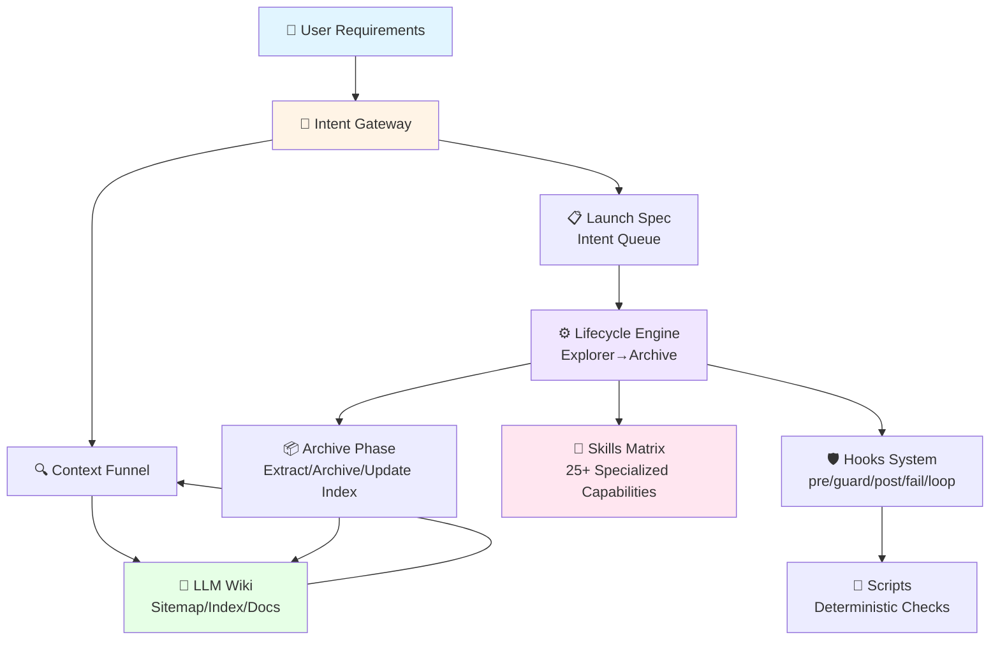
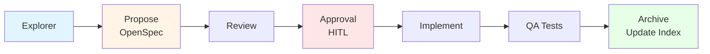
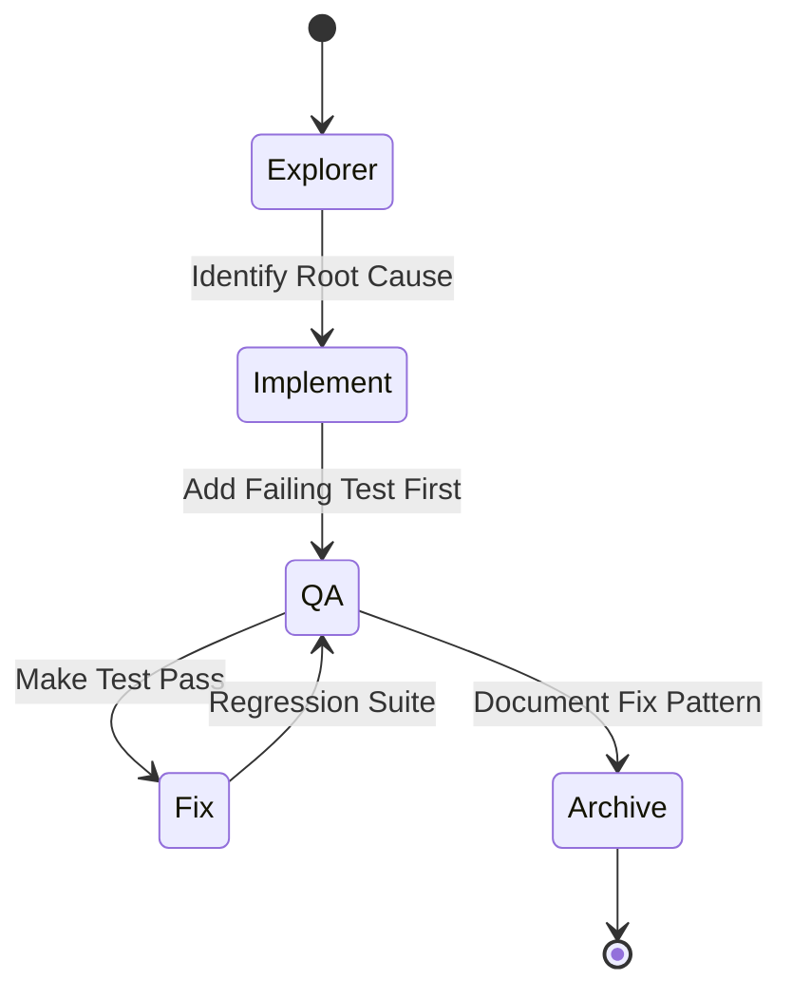
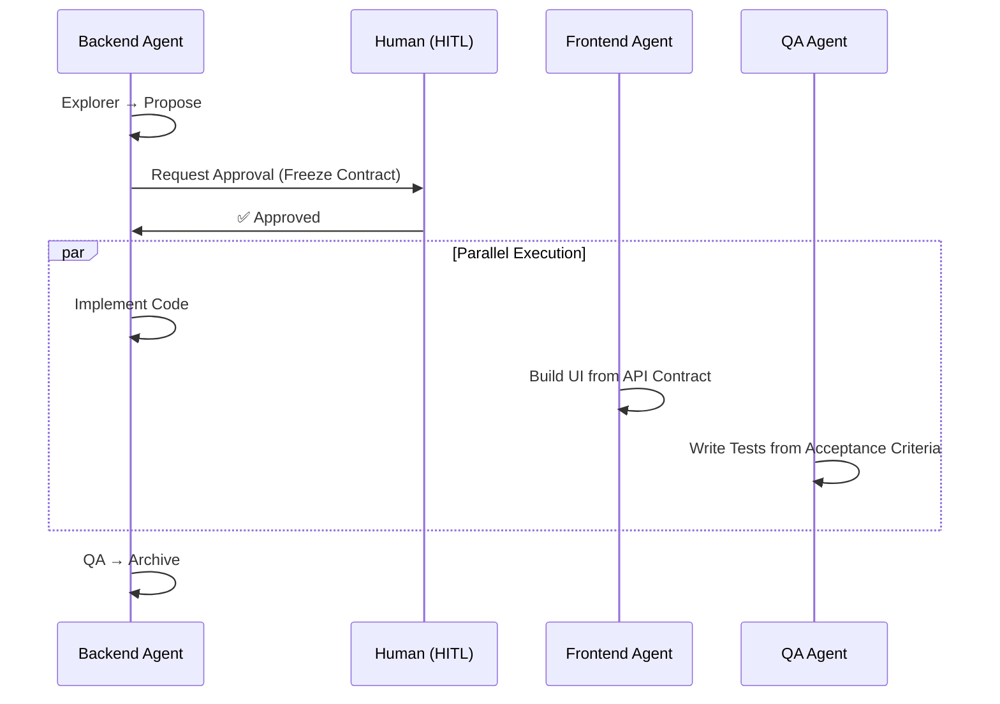

<div align="center">

# Java Harness Agent 🚀

> **A Production-Grade Agent-Driven Development Framework for Backend Engineering**

[](README_zh.md)
[](LICENSE)
[](https://www.oracle.com/java/)
[](README.md)
[](harness/lifecycle.md)

**Transforming Natural Language Requirements into Production-Ready Code through Intent-Driven Architecture**

[Engineering Manual](ENGINEERING_MANUAL.md) | [Quick Start](#-quick-start)

</div>

---

## 📖 Overview

**Java Harness Agent** is an innovative agent-driven development framework that bridges the gap between natural language requirements and production-ready backend code. Built on a foundation of **Intent Gateway**, **Lifecycle State Machine**, **Knowledge Graph (LLM Wiki)**, and **Specialized Skills**, it enables sustainable, interruptible, self-correcting, and anti-bloat engineering workflows.

### ✨ Key Features

- 🎯 **Intent-Driven**: Natural language → Structured intent queues → Executable tasks
- 🔄 **Lifecycle State Machine**: Explorer → Propose → Review → Approval → Implement → QA → Archive
- 🧠 **Knowledge Graph**: Hierarchical wiki system with bidirectional navigation
- 🛡️ **Self-Correcting**: Automatic guard hooks, failure recovery, and human-in-the-loop checkpoints
- 📊 **Contract-First**: OpenSpec-based design before implementation
- 🔌 **Skill Matrix**: 25+ specialized skills for domain-specific expertise
- 📈 **Anti-Bloat**: Automatic knowledge extraction and archival to prevent information overload

---

## 🏗️ Architecture



### Core Components

| Component | Purpose | Location |
|-----------|---------|----------|
| **Intent Gateway** | Converts natural language to executable intent queues | [`intent/`](intent/) |
| **Context Funnel** | Bidirectional knowledge retrieval & write-back system | [`intent/context-funnel.md`](intent/context-funnel.md) |
| **Lifecycle Engine** | 6-phase state machine with automatic transitions | [`harness/lifecycle.md`](harness/lifecycle.md) |
| **Hooks System** | Pre/post guards, failure recovery, loop control | [`harness/hooks.md`](harness/hooks.md) |
| **LLM Wiki** | Hierarchical knowledge graph with sitemap root | [`llm_wiki/`](llm_wiki/) |
| **Skills Matrix** | 25+ domain-specific expert capabilities | [`skills/`](skills/) |
| **Scripts** | Deterministic quality checks & tooling | [`scripts/`](scripts/) |

---

## 🚀 Quick Start

### Prerequisites

- Java 17+
- Python 3.8+ (for optional scripts)
- Git

### 3-Minute Onboarding

#### Step 1: Read Project Rules ⚡

Start with the [Project Rules](project-rules.md) - the master entry point that defines execution discipline.

#### Step 2: Navigate Knowledge Graph 🗺️

Begin at the [Sitemap Root](llm_wiki/sitemap.md) and drill down to your target domain:
- **API Design** → [`wiki/api/index.md`](llm_wiki/wiki/api/index.md)
- **Data Models** → [`wiki/data/index.md`](llm_wiki/wiki/data/index.md)
- **Domain Logic** → [`wiki/domain/index.md`](llm_wiki/wiki/domain/index.md)
- **Architecture** → [`wiki/architecture/index.md`](llm_wiki/wiki/architecture/index.md)
- **Active Specs** → [`wiki/specs/index.md`](llm_wiki/wiki/specs/index.md)
- **Testing Strategy** → [`wiki/testing/index.md`](llm_wiki/wiki/testing/index.md)

#### Step 3: Run Your First Cycle 🔄

Follow the [Lifecycle](harness/lifecycle.md) to complete a full task:
```
Explorer → Propose → Review → Approval → Implement → QA → Archive
```

---

## 💡 Usage Scenarios

### Scenario A: New Query API (No DB Changes)

**Goal**: Create a read-only endpoint with DTOs/Controller/Service



**Key Deliverables**:
- ✅ `explore_report.md` - Scope & impact analysis
- ✅ `openspec.md` - API contract with JSON examples
- ✅ Implementation following contract (no over-engineering)
- ✅ Unit tests with coverage evidence
- ✅ API index update in `wiki/api/`

---

### Scenario B: API + Database Schema Changes

**Goal**: New endpoint with table structure & index modifications

**Critical Path**:
1. **Propose**: Freeze both API & Data contracts simultaneously
2. **Review**: SQL risk assessment, index utilization, implicit conversion checks
3. **QA**: Regression tests covering core queries & edge cases
4. **Archive**: Update both `wiki/api/` and `wiki/data/` indices

**Skills Activated**:
- `devops-system-design` - Schema modeling
- `mybatis-sql-standard` - SQL performance guards
- `database-documentation-sync` - ER diagram updates

---

### Scenario C: Bug Fix with Reproduction

**Goal**: Fix defect with reproducibility, regression testing, and traceability



**Workflow**:
1. **Explorer**: Minimal reproduction path + root cause hypothesis
2. **QA**: Write failing test BEFORE fix (TDD approach)
3. **Implement**: Fix implementation to pass test
4. **Archive**: Record pattern in `wiki/testing/` or `reviews/`

---

### Scenario D: Performance Optimization

**Goal**: Optimize SQL/performance without changing external behavior

**Focus Areas**:
- **Propose**: Document "behavior unchanged" constraints + rollback strategy
- **Review**: SQL standards & index utilization as top priority
- **QA**: Comparative evidence (performance benchmarks + correctness)
- **Archive**: Extract reusable performance rules to `preferences/`

---

### Scenario E: Refactoring with Boundary Guards

**Goal**: Improve maintainability without requirement drift

**Guardrails**:
- Explicit "what's in / what's out" scope definition
- Cross-domain modifications require explicit authorization
- Architecture decisions written back to `wiki/architecture/`

---

### Scenario F: Parallel Collaboration

**Goal**: Backend-led delivery with optional frontend/QA parallel work



**Key Handoff Points**:
- **Approval Phase**: Frozen OpenSpec becomes single source of truth
- **Minimal Handoff**: API Contract (JSON examples), Acceptance Criteria (Given/When/Then), Error Codes
- **Backend Cohesion**: Other details remain backend-internal (not forced outward)

---

## 📚 Lifecycle Phases

### Phase 1: Explorer 🔍
**Purpose**: Clarify requirements, define scope, identify risks

**Skills**: `product-manager-expert`, `devops-requirements-analysis`, `prd-task-splitter`

**Output**: `explore_report.md` with:
- Requirement boundaries & non-goals
- Impact analysis across domains
- Exception branches & edge cases

---

### Phase 2: Propose 📝
**Purpose**: Design solution with frozen contracts

**Skills**: `devops-system-design`, `devops-task-planning`

**Output**: `openspec.md` containing:
- API signatures & data models
- Database schema & indexes
- Business logic flows
- Acceptance criteria
- JSON request/response examples

**Template**: [OpenSpec Schema](llm_wiki/schema/openspec_schema.md)

---

### Phase 3: Review 🔬
**Purpose**: Automated technical review against standards

**Skills**: `devops-review-and-refactor`, `global-backend-standards`, `java-*`, `mybatis-sql-standard`

**Review Matrix**:
- ✅ Architecture & engineering standards
- ✅ API design patterns
- ✅ SQL performance & safety
- ✅ Security & data permissions
- ✅ Error handling consistency

**Failure**: Triggers `fail_hook` → Return to Propose

---

### Phase 3.5: Approval (HITL) 👥
**Purpose**: Human checkpoint before implementation

**Action**: Present OpenSpec summary to human reviewer

**Question**: *"Design passed automated review. Proceed to implementation?"*

**Outcomes**:
- ✅ **YES** → Enter Implement phase (contract frozen)
- ❌ **NO + Feedback** → Return to Propose for revision

**Parallel Trigger**: Frozen contract enables frontend/QA agents to start work

---

### Phase 4: Implement 💻
**Purpose**: Code implementation within contract boundaries

**Skills**: `devops-feature-implementation`, `utils-usage-standard`, `aliyun-oss`

**Discipline**:
- No over-engineering beyond spec
- Must pass Checkstyle validation
- Apply defensive programming guidelines
- Respect domain boundaries (`guard_hook`)

---

### Phase 5: QA Test 🧪
**Purpose**: Quality assurance with TDD principles

**Skills**: `devops-testing-standard`, `code-review-checklist`

**Requirements**:
- Test coverage ≥ 100% for critical paths
- All checklist items must be green
- Regression tests for bug fixes
- Performance benchmarks for optimizations

**Test Evidence Standard**: Generate `test_evidence_{feature}.md` with:
- Execution environment & commands
- Objective log snippets
- Covered edge cases ([Pass]/[Fail] markers)
- Coverage metrics (optional)

**Failure**: Triggers `fail_hook` → Return to Implement

---

### Phase 6: Archive 📦
**Purpose**: Knowledge extraction & cleanup

**Actions**:
1. **Document Sync**: Auto-trigger API & DB documentation updates
2. **Knowledge Extraction**: Merge stable specs into domain indices
   - API contracts → `wiki/api/index.md`
   - Data models → `wiki/data/index.md`
   - Domain terms → `wiki/domain/index.md`
   - Architecture decisions → `wiki/architecture/index.md`
3. **Cold Storage**: Move original `openspec.md` to `llm_wiki/archive/`
4. **Evolution**: Request human rating (1-10) for preference learning
5. **Loop Check**: Read `launch_spec.md` → Next intent or complete

**Anti-Bloat Rules**:
- Index files > 500 lines → Split into subdirectories
- Unmountable content → Archive instead of active zone
- All knowledge must have mount point in sitemap tree

---

## 🛡️ Self-Correction Mechanisms

| Mechanism | Trigger | Condition | Effect | Evaluation |
|-----------|---------|-----------|--------|------------|
| **guard_hook** | During implementation | Style violations, permission breaches, cross-domain pollution | Immediate block, require rewrite or authorization | Standard skill review |
| **fail_hook** | Any phase failure | Compilation/test/review failures | State downgrade, log reason, retry counter | Objective logs |
| **Max Retries** | Inside fail_hook | Same phase fails 3 times consecutively | Force stop, request human intervention | Retry count threshold |
| **Approval (HITL)** | After Review | Before entering Implement | Freeze contract, human authorizes proceed | Human YES/NO + feedback |
| **Archive Write-back** | Task completion | New/changed knowledge needs persistence | Extract stable knowledge, archive hot docs, update indices | Rule validation, connectivity check |
| **Preferences Memory** | Before/after Archive | Representative human ratings/feedback |沉淀经验为偏好/禁忌，下一轮 pre_hook 生效 | Human rating + reasoning |

---

## 🔧 Skills Matrix

### Available Skills (25+)

#### Intent & Lifecycle
- **[intent-gateway](skills/intent-gateway/SKILL.md)** - Intent entry capability, starts "read graph first" workflow
- **[devops-lifecycle-master](skills/devops-lifecycle-master/SKILL.md)** - Lifecycle orchestration, enforces phase boundaries
- **[skill-graph-manager](skills/skill-graph-manager/SKILL.md)** - Maintains skill knowledge graph bidirectional links
- **[trae-skill-index](skills/trae-skill-index/SKILL.md)** - Master skill index for quick capability discovery

#### Requirements & Design
- **[product-manager-expert](skills/product-manager-expert/SKILL.md)** - Requirement clarification, scope definition, acceptance criteria
- **[prd-task-splitter](skills/prd-task-splitter/SKILL.md)** - PRD decomposition into structured development tasks
- **[devops-requirements-analysis](skills/devops-requirements-analysis/SKILL.md)** - PDD/SDD boundary梳理, executable requirement specs
- **[devops-system-design](skills/devops-system-design/SKILL.md)** - System design & data modeling (FDD/SDD)
- **[devops-task-planning](skills/devops-task-planning/SKILL.md)** - Design decomposition into implementation task lists

#### Implementation
- **[devops-feature-implementation](skills/devops-feature-implementation/SKILL.md)** - Feature coding with TDD emphasis
- **[devops-bug-fix](skills/devops-bug-fix/SKILL.md)** - Defect localization, reproduction, fix & regression
- **[utils-usage-standard](skills/utils-usage-standard/SKILL.md)** - Unified utility class/framework usage patterns
- **[aliyun-oss](skills/aliyun-oss/SKILL.md)** - Object storage (multi-bucket/env isolation/presigned URLs)

#### Code Standards
- **[global-backend-standards](skills/global-backend-standards/SKILL.md)** - Global backend standards index entry
- **[java-engineering-standards](skills/java-engineering-standards/SKILL.md)** - Java layering & package structure norms
- **[java-backend-guidelines](skills/java-backend-guidelines/SKILL.md)** - Defensive programming, complete assembly, pagination
- **[java-backend-api-standard](skills/java-backend-api-standard/SKILL.md)** - API design patterns (verbs/paths/response structures)
- **[java-javadoc-standard](skills/java-javadoc-standard/SKILL.md)** - Unified Javadoc style & annotation norms
- **[java-data-permissions](skills/java-data-permissions/SKILL.md)** - Data permission constraints (query filtering/action validation)
- **[mybatis-sql-standard](skills/mybatis-sql-standard/SKILL.md)** - MyBatis SQL performance & safety guards
- **[error-code-standard](skills/error-code-standard/SKILL.md)** - Unified error codes & exception expression
- **[checkstyle](skills/checkstyle/SKILL.md)** - Java code style enforcement (Google/Sun hybrid)

#### Testing & Review
- **[devops-testing-standard](skills/devops-testing-standard/SKILL.md)** - Testing norms & TDD phase guidance
- **[code-review-checklist](skills/code-review-checklist/SKILL.md)** - Mandatory review checklist (security/performance/maintainability)

#### Documentation
- **[api-documentation-rules](skills/api-documentation-rules/SKILL.md)** - Mandatory API doc generation & archival
- **[database-documentation-sync](skills/database-documentation-sync/SKILL.md)** - DB structure change sync (tables/lists/ER diagrams)

### Phase → Skills Mapping

| Phase | Recommended Skills |
|-------|-------------------|
| **Explorer** | product-manager-expert, devops-requirements-analysis, prd-task-splitter |
| **Propose** | devops-system-design, devops-task-planning |
| **Review** | devops-review-and-refactor, global-backend-standards, java-\*/mybatis-sql-standard/error-code-standard |
| **Implement** | devops-feature-implementation, devops-bug-fix, utils-usage-standard, aliyun-oss |
| **QA** | devops-testing-standard, code-review-checklist |
| **Archive** | api-documentation-rules, database-documentation-sync |

---

## 📂 Project Structure

```
java-harness-agent/
├── intent/                  # Intent gateway & context funnel
│   ├── catalog/             # Launch specs (intent queues)
│   ├── intent-gateway.md    # Intent mapping & queue assembly
│   └── context-funnel.md    # Bidirectional knowledge navigation
│
├── harness/                 # Lifecycle state machine & hooks
│   ├── lifecycle.md         # 6-phase state machine definition
│   ├── hooks.md             # Interceptor specifications
│   └── compaction-rules.md  # Knowledge compaction rules
│
├── llm_wiki/                # Knowledge graph (sitemap/index/docs)
│   ├── sitemap.md           # 🗺️ Root node (mandatory entry point)
│   ├── purpose.md           # System philosophy & design principles
│   ├── schema/              # Contract templates & schemas
│   │   ├── index.md
│   │   └── openspec_schema.md
│   ├── wiki/                # Active knowledge domains
│   │   ├── api/             # API contracts & endpoint signatures
│   │   ├── data/            # Data models, schemas & indexes
│   │   ├── domain/          # Domain models & business dictionary
│   │   ├── architecture/    # Architecture decisions (ADR)
│   │   ├── specs/           # Active requirements (openspec files)
│   │   ├── testing/         # Testing strategies & evidence standards
│   │   └── preferences/     # Dynamic preferences & taboos
│   └── archive/             # Cold storage (extracted specs)
│       └── *.md             # Archived openspec documents
│
├── skills/                  # Specialized capabilities (25+)
│   ├── intent-gateway/
│   ├── devops-lifecycle-master/
│   ├── product-manager-expert/
│   ├── java-backend-api-standard/
│   ├── mybatis-sql-standard/
│   └── ... (20+ more)
│
├── scripts/                 # Deterministic tools (optional)
│   ├── wiki/
│   │   ├── wiki_linter.py       # Graph health check (dead links/islands)
│   │   ├── schema_checker.py    # Contract structure validation
│   │   └── pref_tag_checker.py  # Preference tag规范检查
│   └── harness/
│       └── engine.py            # Queue state辅助 (optional)
│
├── project-rules.md         # 📌 Project-level rule entry point
├── README.md                # This file - English overview
├── README_zh.md             # Chinese version of this README
└── ENGINEERING_MANUAL.md    # Detailed engineering manual (English)
```

---

## 🔍 Optional Diagnostic Tools

These scripts provide deterministic quality checks (they report but don't modify files):

### Graph Health Check
```bash
python scripts/wiki/wiki_linter.py
```
**Checks**: Dead links, orphaned files, index length warnings

### Contract Structure Validation
```bash
python scripts/wiki/schema_checker.py
```
**Checks**: Missing key sections, JSON example presence

### Preference Tag Inspection
```bash
python scripts/wiki/pref_tag_checker.py
```
**Checks**: Rule tag规范 for precise retrieval

---

## 🎯 Engineering Red Lines

### 🚫 No Blind Search
Always start from [Sitemap](llm_wiki/sitemap.md) → drill down through indices. Fallback search only when indices fail.

### 🚫 No Unauthorized Cross-Domain Changes
Cross-domain modifications require explicit authorization in `openspec.md` and confirmation during Review/HITL phases.

### 🚫 No Runaway Loops
Failure rollback + max retry threshold (3 attempts). Stop and request human intervention when threshold reached.

### 🚫 No Knowledge Bloat
- Specs must be archived after extraction to `llm_wiki/archive/`
- Stable knowledge must be extracted to domain indices
- Indices exceeding 500 lines must be split into subdirectories

---

## 📖 Related Documentation

- **📘 Engineering Manual**: [ENGINEERING_MANUAL.md](ENGINEERING_MANUAL.md) - Comprehensive English guide with detailed workflows
- **🇨🇳 Chinese README**: [README_zh.md](README_zh.md) - Complete Chinese version of this README
- **📌 Project Rules**: [project-rules.md](project-rules.md) - Master rule entry point
- **🗺️ Knowledge Graph**: [llm_wiki/sitemap.md](llm_wiki/sitemap.md) - Root navigation
- **📝 Contract Template**: [llm_wiki/schema/openspec_schema.md](llm_wiki/schema/openspec_schema.md)
- **🎯 Intent Gateway**: [intent/intent-gateway.md](intent/intent-gateway.md)
- **🔍 Context Funnel**: [intent/context-funnel.md](intent/context-funnel.md)
- **⚙️ Lifecycle**: [harness/lifecycle.md](harness/lifecycle.md)
- **🛡️ Hooks**: [harness/hooks.md](harness/hooks.md)

---

## 🤝 Contributing

Contributions are welcome! Please follow these guidelines:

1. **Read First**: Study [ENGINEERING_MANUAL.md](ENGINEERING_MANUAL.md) and [project-rules.md](project-rules.md)
2. **Follow Lifecycle**: All changes must go through the 6-phase lifecycle
3. **Update Knowledge**: Extract stable knowledge to appropriate domain indices
4. **Run Diagnostics**: Execute optional scripts to verify graph health
5. **Submit PR**: Include `openspec.md` for significant changes

---

## 📄 License

This project is licensed under the MIT License - see the [LICENSE](LICENSE) file for details.

---

## 🙏 Acknowledgments

This framework draws inspiration from:
- **OpenSpec**: Contract-first development methodology
- **Harness**: Lifecycle state machines & hook systems
- **LLM Wiki**: Evolvable knowledge graphs with anti-bloat mechanisms
- **Agentic Patterns**: Autonomous agent workflows with human-in-the-loop checkpoints

---

<div align="center">

**Built with ❤️ for sustainable, intelligent backend development**

[⬆ Back to Top](#java-harness-agent-)

</div>
