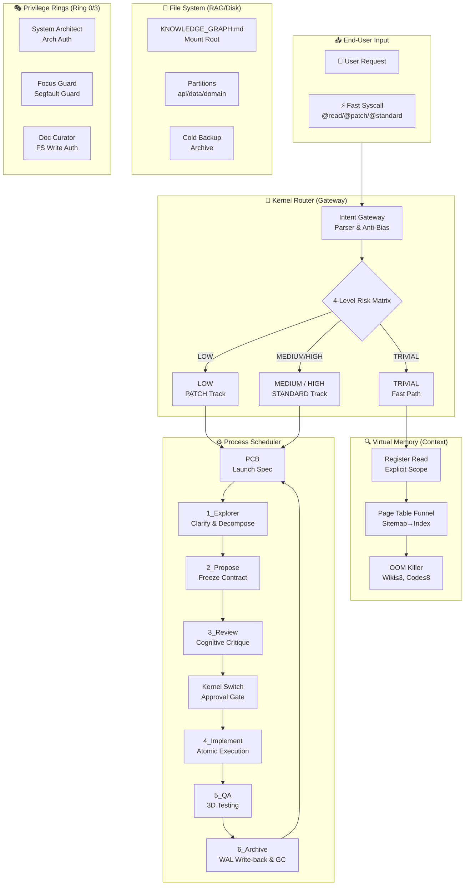

<div align="center">

# Java Harness Agent 🚀

**An Agent-Driven "Microkernel" Operating System for Backend Engineering**

[](README_zh.md)
[](LICENSE)
[](https://www.oracle.com/java/)
[](.agents/workflow/LIFECYCLE.md)

[Engineering Manual](ENGINEERING_MANUAL.md) · [Quick Start](#-quick-start)


</div>

## ⚠️ Critical Positioning Statement

> **"Learning Agent architecture is like re-learning Operating Systems. History doesn't repeat, but it rhymes!"**

This repository is a **machine-to-machine (M2M) infrastructure**. It is a **Cognitive Harness**—an executable protocol designed *by* humans, but read, interpreted, and executed *exclusively by* Large Language Models (LLMs).

Unlike traditional Agent frameworks that act as bloated "Macro-kernels," Java Harness Agent adopts an extremely restrained **Microkernel OS Philosophy**:
- **Process = Intent Boundary**: Cross-intent requires explicit communication (WAL Write-back).
- **RAM = Context Window**: Strictly scheduled by the architecture.
- **System Calls = Tool Use**: Traps into the kernel via system calls, authenticated by the Role Matrix.
- **File System = RAG & Wiki**: Mounted on demand, burned after use.

**Java Harness Agent** is an agent-driven backend engineering workflow designed for sustainable software evolution. It deeply integrates **Cognitive Philosophy** (counter-intuitive bias checks, first-principles thinking) and pioneers a **Dual-Track Flow** with a **4-Level Risk Matrix**. Driven by 15 high-density Master Skills, it completely eliminates "runaway code" and "architecture rot" common in traditional Agent development.

## 📖 Overview

**Java Harness Agent** fuses the "Contract-First" OpenSpec design philosophy with a Microkernel architecture. Through its Intent Gateway, Dual-Track Lifecycle, Vector-less Knowledge Graph (LLM Wiki), and Cognitive Brakes, it achieves a sustainable, interruptible, and self-correcting engineering closed-loop.

### ✨ Key Features

- 🎯 **OS-Level Intent Driven**: Natural language → Structured intent queues → Process-level task scheduling
- 🧠 **Cognitive Philosophy**: Built-in cognitive bias correction and 5-Whys decision frameworks, forcing the Agent to "think thrice" (Cognitive Brake) before acting.
- 🛤️ **Dual-Track & 4-Level Risk Matrix**: Differentiates between TRIVIAL (Fast-path), LOW (PATCH track), and MEDIUM/HIGH (STANDARD full 6-phase), abandoning one-size-fits-all cumbersome processes.
- 📚 **Microkernel Knowledge Graph**: Completely discards the "black box" of vector databases, utilizing a pure Markdown hierarchical mounting system to ensure 100% context determinism.
- 🛡️ **Self-Correcting & Gating**: Automatic guard hooks, failure recovery, and mandatory human-in-the-loop checkpoints (Approval Gate).
- 🔌 **15 Master Skills Ecosystem**: Refined from 30 fragmented, bloated skills down to 15 high-density, scenario-specific core engineering disciplines.

---

## 💰 Token Economics & Cost Model

Given that Java Harness Agent is a strongly-constrained framework, its architecture shifts costs from **"Trial & Error / Blind Search"** to **"Upfront Planning & Gating Defenses"**, resulting in highly predictable and stable overall costs for complex tasks.

### 1. The "Thinking Tax"
- Each turn requires the LLM to output the `<Cognitive_Brake>` and read mandatory system contexts. This adds a fixed baseline "thinking tax" of **~500 Output Tokens and ~2000 Input Tokens** per interaction.
- With the integration of the **Cognitive Framework**, the Agent must first self-reflect (anti-bias check), adding a few hundred tokens upfront but saving tens of thousands of tokens otherwise wasted on architectural rewrites.

### 2. The ROI: Comparing 3 Paradigms

| Paradigm | Behavior | Input Tokens | Output Tokens | Hidden Costs / Risks | Verdict |
|----------|----------|--------------|---------------|----------------------|---------|
| **Pure Chat / Copilot** | Jumps straight to coding with limited context. | ~5k | ~1k | **High Rework Rate.** Misses transaction boundaries, forgets existing enums. Requires human prompt corrections. | Cheap in Tokens, Expensive in Human Time. |
| **Macro-kernel Auto-Agent** | Blindly searches, loads all skills at once, loops endlessly on compile errors. | **100k+** | 10k+ | **Disastrous.** Burns through budget via massive context bloat and infinite loops. | Unpredictable & Dangerous. |
| **Microkernel Harness Agent** | Pays the "Thinking Tax", utilizes Dual-Track and funnel throttling, STOPs at high-risk gates. | **~30k** | **~6k** | **Highly predictable.** Architectural errors intercepted early; syntax errors digested by Shift-Left Validation. | **The Sweet Spot.** Optimized for high-quality delivery with controlled spend. |

---

## 🏗️ Architecture: Microkernel OS Philosophy

### Core Philosophy

**Three Fundamental Problems Solved:**

1. **Context Bloat (OOM)**: LLM blind searching wastes tokens → Solved via pure-text mounted File System and "burn-after-reading".
2. **Requirement Drift (Privilege Escalation)**: Agent free-play corrupts contracts → Solved via Microkernel Intent Gateway + strict Role Matrix guards.
3. **Knowledge Fragmentation (Memory Leaks)**: Conversation memory loss → Solved via WAL (Write-Ahead Logging) write-backs and agile Garbage Collection (GC).

### 🎭 The 13 Virtual Heroes (Role Matrix)

The Agent is not an isolated "full-stack LLM," but a hardcore virtual team of 13 heroes with vastly different personalities. The LLM must dynamically mount these roles and use their exclusive weapons (Python Gate Scripts) to defend system discipline.

#### 🛡️ Phase 1: Explorer (The Fog of War)
* **@Requirement Engineer**: "Do not send me garbage words like 'optimize'. Give me boundaries, or stay quiet!" (Weapon: `ambiguity_gate.py`)
* **@Ambiguity Gatekeeper**: "Wait, you want to global grep? Draw the `focus_card.md` red lines first!" (Weapon: `focus_card.md` Rune)

#### 🏛️ Phase 2 & 3: Propose & Review (Architecture & The Crucible)
* **@System Architect**: "The blast radius is calculated. Build according to my `openspec.md` blueprint!" (Weapon: `Approval Gate` Summoning Circle)
* **@Devil's Advocate**: "Oh Architect, do you really think this logic survives high concurrency deadlocks?" (Weapon: `cognitive-bias-checklist`)

#### ⚔️ Phase 4 & 5: Implement & QA (Coding & Relentless Testing)
* **@Lead Engineer**: "The contract is the law. I only implement `openspec.md`." (Weapon: `javac` Furnace of Truth)
* **@Focus Guard**: "Your hands reach too far! Pull back inside the Focus Card ward!" (Weapon: `scope_guard.py` Ruler of Discipline)
* **@Code Reviewer**: "Magic Numbers? N+1 query risks? Rewrite this filthy code!" (Weapon: `Static Linter` Light of Purification)
* **@Security Sentinel**: "Warning. Hardcoded Secret Key detected. Executing forced meltdown." (Weapon: `secrets_linter.py` Death Ray)

#### 📜 Phase 6: Archive (Memory Persistence)
* **@Knowledge Extractor (Silent Historian)**: "Empires fall, but History (WAL) is eternal." (Weapon: `writeback_gate.py` Judgment of History)
* **@Documentation Curator (Friend of Humanity)**: "Show humans some care. Comments must explain Why, not What." (Weapon: `README & Javadoc`)
* **@Skill Graph Curator (OCD Librarian)**: "Once the index is messed up, the whole world loses its way." (Weapon: `skill_index_linter.py`)

#### 🌌 Background Daemons (Garbage Collection)
* **@Librarian (Midnight Scavenger)**: "Shh... Do not wake me unless you bring the `@gc` command to merge fragments." (Weapon: `librarian_gc.py`)
* **@Knowledge Architect (Urban Planner)**: "This document exceeds 400 lines! LLMs will suffer OOM reading this! Split it!" (Weapon: Structural Reorganization)

### System Architecture Diagram



---

## 🚦 Core Workflow: Dual-Track & 4-Level Risk Matrix

No more one-size-fits-all red tape. The framework assesses tasks at the Kernel entry point (Router) and routes them to different tracks:

### 4-Level Risk Matrix

| Risk Level | Characteristics | Authorization | Testing | Rollback Cost |
|------------|-----------------|---------------|---------|---------------|
| **TRIVIAL** | Queries, logging, typos, reading | **Auto-Approve** | Optional | Zero |
| **LOW** | Single-method bugfix, internal refactor (no API/DB change) | **Implicit (PATCH)** | Unit Tests | Very Low |
| **MEDIUM** | New APIs, DB column additions, cross-module calls | **Explicit (Approval Gate)** | Integration | High |
| **HIGH** | Core flow modifications, state machine changes | **Explicit + Arch Review** | Full Regression | Disastrous |

### Dual-Track Flow

#### 1. PATCH Track (For TRIVIAL & LOW)
**The Fast Path. Zero bureaucracy.**
- Skips the lengthy `Propose` and `Review` phases.
- No heavy `openspec.md` generated; uses a lightweight `focus_card.md`.
- Straight to implementation and testing.
- Extremely low token cost, ideal for high-frequency, small iterations.

#### 2. STANDARD Track (For MEDIUM & HIGH)
**Heavy Armor. Defending the engineering baseline.**
- Strictly follows the full 6-phase lifecycle (Explorer → Propose → Review → Implement → QA → Archive).
- Mandates the generation of `openspec.md` and triggers the **Approval Gate** (Human-in-the-loop) before writing any code.
- Injects cognitive critique to interrogate the architectural design.

---

## 🔧 15 Master Skills Ecosystem

To resolve "skill bloat" and context confusion, the original 30 fragmented skills have been forged into 15 high-density Master Skills, strictly mounted by lifecycle phase:

### Core Master Skills

1. **`cognitive-bias-checklist`**: **The Core Brain**. Provides anti-bias checks to prevent AI hallucination and short-sightedness.
2. **`decision-frameworks`**: Employs 5-Whys root cause analysis and structural decision frameworks.
3. **`task-decomposition-guide`**: Agile decomposition master. Enforces INVEST criteria and Vertical Slicing.
4. **`spec-quality-checklist`**: Validates the rigor and completeness of OpenSpec contracts.
5. **`java-architecture-standards`**: Backend red lines (Layering, POJO models, Anti-corruption layers).
6. **`java-coding-style`**: Code aesthetics. Enforces Google/Sun standards and defensive functional programming.
7. **`java-testing-standards`**: 3D testing rule (Happy Path, Exception Path, Edge Cases).
8. **`mybatis-sql-standard`**: DB Guard. Includes 8 standard audit columns check and Anti-JOIN rules.
9. **`wal-documentation-rules`**: WAL File System. Standardizes write-backs for API/DB changes to prevent knowledge loss.
10. **`code-review-checklist`**: Standardizes code review process, ensuring security and maintainability.
11. **`devops-bug-fix`**: Systematic debugging and issue resolution protocol.
12. **`linter-severity-standard`**: Defines rules for linting severity and code quality gates.
13. **`product-manager-expert`**: Bridges the gap between technical implementation and business requirements.
14. **`skill-graph-manager`**: Orchestrates and manages relationships between various agent skills.
15. **`trae-skill-index`**: The global routing table for skills.

---

## 🚀 Quick Start

### 3-Minute Onboarding Guide

#### Step 1: Read the "Constitution" ⚡
Start with [AGENTS.md](AGENTS.md) - the master entry point defining execution discipline and OS mounting rules.
- **OOM Killer**: Wiki ≤ 3 docs, Code ≤ 8 files (Trigger Escalation if exceeded).
- **Cognitive Brake**: Mandatory XML block before any action to enforce Process, Scope, Budget, and bias reflection.

#### Step 2: Make a System Call (Shortcuts DSL) 🎯
Use explicit commands to force the framework into a specific track:

```text
@read / @learn     → Enter Read-Only Process (TRIVIAL, no side effects)
@patch / @quickfix → Mount PATCH Track (LOW, lightweight fix)
@standard          → Mount STANDARD Track (MEDIUM/HIGH, full heavy lifecycle)
```

**Example:**
```text
@learn --scope src/foo/bar.ts -- explain this file
@patch --risk low --test "mvn test" -- fix NPE in createOrder
@standard --risk high -- implement tenant permission checks for order list API
```

#### Step 3: Understand Breakpoint Resume 🔄
- Launch Spec is persisted at `router/runs/launch_spec_*.md` (Acts as the PCB - Process Control Block).
- First action after session interruption: read this file to restore state.
- If stuck at `WAITING_APPROVAL`, the Agent will wait for you to review `openspec.md` and say "Approved" before switching to kernel mode to write code.

---

## 🛡️ Self-Correction & Gating Mechanisms

| Mechanism | Trigger Point | Effect | OS Metaphor |
|-----------|--------------|--------|-------------|
| **Cognitive_Brake** | Before any action | Forces LLM reasoning (roles, boundaries, bias reflection) | **Kernel Privilege Check** |
| **pre_hook** | Before new phase | Load rules + output preflight | **Context Switch** |
| **guard_hook** | During code edit | Blocks style/auth violations immediately | **Memory Segfault Guard** |
| **Approval Gate** | After Review | Freezes contract, waits for human | **User-to-Kernel Switch** |
| **Archive Write-back** | Task end | Appends stable specs to Wiki Index (WAL) | **fsync (Dirty Page Write)** |

---

## 📖 Related Documentation

- **📘 Engineering Manual (Chinese)**: [ENGINEERING_MANUAL_zh.md](ENGINEERING_MANUAL_zh.md)
- **📘 Engineering Manual (English)**: [ENGINEERING_MANUAL.md](ENGINEERING_MANUAL.md)
- **🇨🇳 Chinese README**: [README_zh.md](README_zh.md)
- **📌 Project Rules**: [AGENTS.md](AGENTS.md) - Master rule entry & constitution
- **🗺️ Knowledge Graph**: [.agents/llm_wiki/KNOWLEDGE_GRAPH.md](.agents/llm_wiki/KNOWLEDGE_GRAPH.md) - Virtual FS Root

---

## 🤝 Contributing

Welcome to co-build this pure M2M engineering infrastructure!
1. **Read First**: Deeply understand the Microkernel philosophy in [ENGINEERING_MANUAL.md](ENGINEERING_MANUAL.md).
2. **Follow Lifecycle**: Architectural changes must go through the `STANDARD` track.
3. **Restraint**: We pursue high density and orthogonality in skills. Refuse adding "spaghetti" single-instruction skills.

---

## 📄 License

This project is licensed under the MIT License - see the [LICENSE](LICENSE) file for details.

<div align="center">

**Built with ❤️ for sustainable, non-bloating backend development**

[⬆ Back to Top](#java-harness-agent-)

</div>
