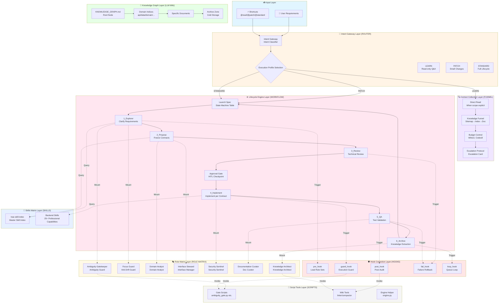
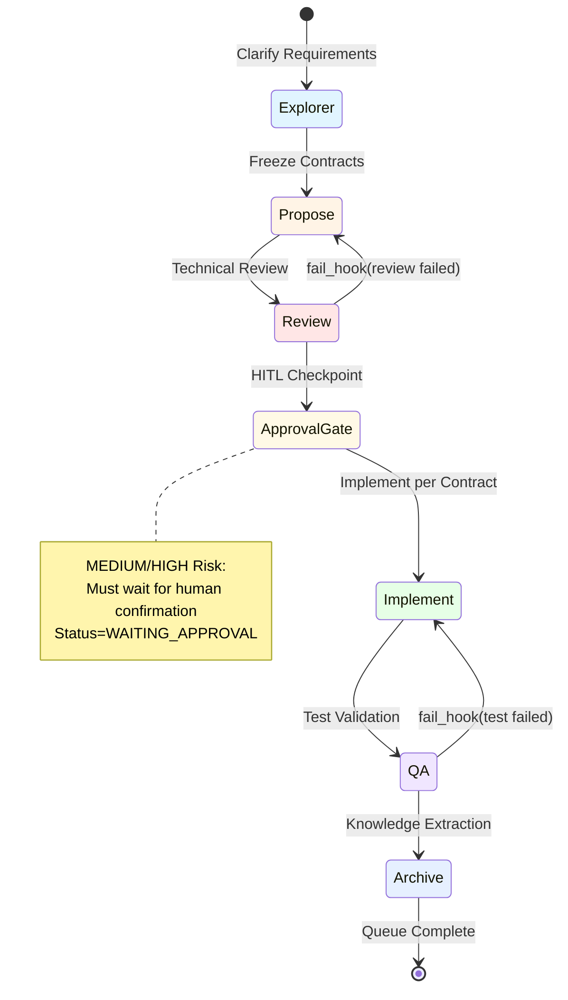
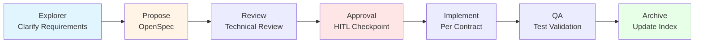
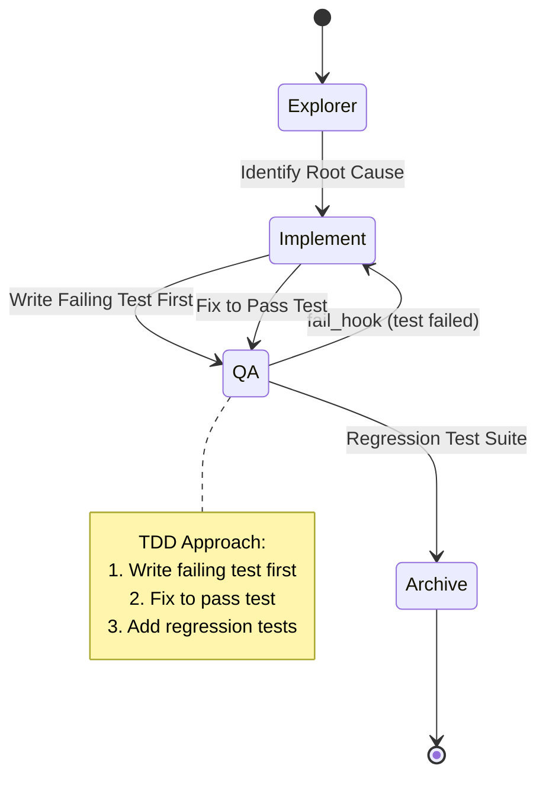
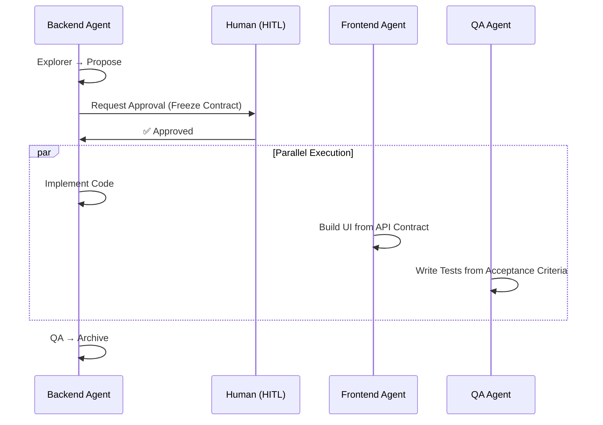

<div align="center">

# Java Harness Agent 🚀

### An Agent-Driven Engineering Framework for Backend Development

[](README_zh.md)
[](LICENSE)
[](https://www.oracle.com/java/)
[](README.md)
[](.agents/workflow/LIFECYCLE.md)

## ⚠️ Critical Positioning Statement

> **This project is NOT a traditional development framework or human-facing tool.**
>
> **It is a pure LLM-native specification harness designed exclusively for autonomous execution by large language models.**
>
> From day one, this system was architected to be **driven entirely by AI agents**, not humans. Every component—from the Intent Gateway to the Lifecycle State Machine, from the Knowledge Graph to the Skills Matrix—is engineered as executable protocol for LLMs to self-navigate, self-correct, and self-evolve.
>
> **If you're evaluating this with "human developer tool" standards, you will fundamentally misunderstand its design philosophy.** This is infrastructure for machine-to-machine coordination in software engineering workflows.

**Java Harness Agent** is an agent-driven backend engineering framework designed for sustainable software development. It integrates an Intent Gateway, a 6-phase Lifecycle State Machine, Contract-first OpenSpec design, and a drill-down LLM Wiki (Knowledge Graph) to prevent context bloat, enabling AI agents to autonomously build, test, and self-correct production-ready code.

[Engineering Manual](ENGINEERING_MANUAL.md) | [Quick Start](#-quick-start)

</div>


## 📖 Overview

**Java Harness Agent** is an innovative agent-driven development workflow that bridges the gap between natural language requirements and production-ready backend code. Built on **Intent Gateway**, **Lifecycle State Machine**, **Knowledge Graph (LLM Wiki)**, and **Specialized Skills Matrix**, it enables sustainable, interruptible, self-correcting, and anti-bloat engineering closed-loops.

### ✨ Key Features

- 🎯 **Intent-Driven**: Natural language → Structured intent queues → Executable tasks
- 🔄 **Lifecycle State Machine**: Explorer → Propose → Review → Approval Gate (HITL) → Implement → QA → Archive
- 🧠 **Knowledge Graph**: Hierarchical wiki system with bidirectional navigation
- 🛡️ **Self-Correcting**: Automatic guard hooks, failure recovery, human-in-the-loop checkpoints
- 📊 **Contract-First**: OpenSpec-based design before implementation
- 🔌 **Skills Matrix**: 25+ specialized skills providing domain expert capabilities
- 📈 **Anti-Bloat Mechanism**: Automatic knowledge extraction and archival to prevent information overload

---

## 🏗️ Architecture

### Core Philosophy

**Three Fundamental Problems Solved by Java Harness Agent:**

1. **Context Bloat Out of Control**: LLM blind searching in large codebases leads to token waste and attention dispersion → Solved through Knowledge Graph + Budgeted Navigation
2. **Requirement Drift & Unauthorized Modifications**: Agent free-play causes cross-domain pollution and contract corruption → Solved through Intent Gateway + Role Matrix Guards
3. **Knowledge Fragmentation & Unsustainability**: Conversation memory loss, documentation desynchronization, index bloat → Solved through WAL Write-back + Auto-Refactoring

**Design Philosophy**: Encode engineering discipline into LLM-executable protocols, enabling machine-to-machine self-coordination, self-correction, and self-evolution.

### System Architecture Diagram



### Core Components Breakdown

| Layer | Component | Responsibility | Key File |
|-------|-----------|----------------|----------|
| **Input** | Intent Gateway | Natural language → Structured intents + Execution profiles | [ROUTER.md](.agents/router/ROUTER.md) |
| **Context** | Knowledge Funnel | Bidirectional navigation (forward retrieval + reverse write-back) | [CONTEXT_FUNNEL.md](.agents/router/CONTEXT_FUNNEL.md) |
| **Knowledge** | LLM Wiki | Fractal knowledge graph (Sitemap/Index/Docs/Archive) | [KNOWLEDGE_GRAPH.md](.agents/llm_wiki/KNOWLEDGE_GRAPH.md) |
| **Process** | Lifecycle Engine | 6-phase state machine + breakpoint resume | [LIFECYCLE.md](.agents/workflow/LIFECYCLE.md) |
| **Roles** | Role Matrix | Dynamic virtual role mounting + gate guards | [ROLE_MATRIX.md](.agents/workflow/ROLE_MATRIX.md) |
| **Correction** | Hooks System | Pre/guard/post/fail/loop interception | [HOOKS.md](.agents/workflow/HOOKS.md) |
| **Capability** | Skills Matrix | 25+ domain-specific expert capabilities | [trae-skill-index](.agents/skills/trae-skill-index/SKILL.md) |
| **Tools** | Script Tools | Deterministic quality checks + auxiliary tools | [scripts/](.agents/scripts/) |

---

## 🚀 Quick Start

### Prerequisites

- Java 17+
- Python 3.8+ (for script tools)
- Git

### 3-Minute Onboarding Guide

#### Step 1: Read Project Rules ⚡

Start with [AGENTS.md](AGENTS.md) - the master entry point defining execution discipline with hard constraints and navigation rules.

**Core Constraints Quick Reference:**
- **Budget Limits**: Wiki ≤ 3 docs, Code ≤ 8 files (same-file pagination doesn't count)
- **Approval Gate**: MEDIUM/HIGH risk must stop at `WAITING_APPROVAL` for human confirmation
- **Anti-Looping**: Any script/test/linter max 3 retries; exceed threshold must request human intervention
- **Scope Guard**: Cannot modify files outside `focus_card.md` agreed scope without explicit authorization

#### Step 2: Understand Intent Gateway 🎯

The Intent Gateway transforms natural language into executable queues, supporting three execution profiles:

| Profile | Use Case | Lifecycle Entry | Artifacts |
|---------|----------|-----------------|-----------|
| **LEARN** | Read-only explanation, code understanding | ❌ No | None |
| **PATCH** | Small changes, bug fixes (LOW risk) | ✅ Minimal | Slim Spec + Change Log |
| **STANDARD** | MEDIUM/HIGH risk, wide blast radius | ✅ Full 6-phase | Full OpenSpec + Approval Gate |

**Shortcuts (Explicit Routing):**
```text
@read / @learn     → Force LEARN mode (read-only)
@patch / @quickfix → Force PATCH mode (small changes)
@standard          → Force STANDARD mode (full lifecycle)
```

**Shortcut DSL Examples:**
```text
@learn --scope src/foo/bar.ts --direct --depth deep -- explain this file
@patch --risk low --slim --test "mvn test -Dtest=OrderServiceTest" -- fix NPE in createOrder
@standard --risk high --launch -- implement tenant permission checks for order list API
```

#### Step 3: Navigate Knowledge Graph 🗺️

**Rule 0: Direct Read when scope is explicit (MUST)**
- If user provides explicit scope (file path, class/method name, pasted snippet) and goal is learning:
  - ✅ Do direct read first
  - ❌ Do NOT start with Knowledge Graph drill-down

**Rule 1: Otherwise, use Knowledge Funnel (MUST)**
1. Read root: [KNOWLEDGE_GRAPH.md](.agents/llm_wiki/KNOWLEDGE_GRAPH.md)
2. Drill down via: [CONTEXT_FUNNEL.md](.agents/router/CONTEXT_FUNNEL.md)
3. If unsure which skill to use, consult: [trae-skill-index](.agents/skills/trae-skill-index/SKILL.md)

**Common Domain Indices:**
- **API Design** → [`.agents/llm_wiki/wiki/api/index.md`](.agents/llm_wiki/wiki/api/index.md)
- **Data Models** → [`.agents/llm_wiki/wiki/data/index.md`](.agents/llm_wiki/wiki/data/index.md)
- **Domain Logic** → [`.agents/llm_wiki/wiki/domain/index.md`](.agents/llm_wiki/wiki/domain/index.md)
- **Architecture** → [`.agents/llm_wiki/wiki/architecture/index.md`](.agents/llm_wiki/wiki/architecture/index.md)

#### Step 4: Run Your First Complete Cycle 🔄

Complete one STANDARD task following the [Lifecycle](.agents/workflow/LIFECYCLE.md):



**Breakpoint Resume Mechanism:**
- Launch Spec persisted at `router/runs/launch_spec_*.md`
- First action after session interruption: read this file to restore state
- Status enum: `PENDING`, `IN_PROGRESS`, `DONE`, `WAITING_APPROVAL`, `FAILED`

---

## 💡 Usage Scenarios

### Scenario A: New Query API (No DB Changes)

**Goal**: Create read-only endpoints (DTO/Controller/Service) without table structure changes



**Key Deliverables**:
- ✅ `explore_report.md` - Scope & impact analysis + Core Context Anchors
- ✅ `openspec.md` - API contract with JSON examples, acceptance criteria
- ✅ Implementation following contract (no over-engineering)
- ✅ Unit tests with coverage evidence
- ✅ Update API index in `wiki/api/` (WAL mechanism)

**Activated Skills**:
- Explorer: `product-manager-expert`, `devops-requirements-analysis`
- Propose: `devops-system-design`, `java-backend-api-standard`
- Review: `global-backend-standards`, `mybatis-sql-standard`
- Implement: `devops-feature-implementation`, `checkstyle`
- QA: `devops-testing-standard`, `code-review-checklist`
- Archive: `api-documentation-rules`

---

### Scenario B: API + Database Schema Changes

**Goal**: New endpoint with table structure & index modifications

**Critical Path**:
1. **Propose**: Freeze both API & Data contracts simultaneously (field semantics, constraints, index design, compatibility strategy)
2. **Review**: SQL risk assessment, index utilization, implicit conversion checks, authorization risks
3. **QA**: Regression tests covering core queries & edge cases
4. **Archive**: Update both `wiki/api/` and `wiki/data/` indices, synchronize ER diagrams

**Activated Skills**:
- `devops-system-design` - Schema modeling
- `mybatis-sql-standard` - SQL performance guards
- `database-documentation-sync` - ER diagram updates

---

### Scenario C: Bug Fix (Reproduce First, Then Test)

**Goal**: Fix defects ensuring reproducibility, regressability, and traceability



**Workflow**:
1. **Explorer**: Minimal reproduction path + root cause hypothesis + impact analysis (whether Propose/contract update needed)
2. **QA**: Write failing test BEFORE fix (TDD approach)
3. **Implement**: Fix implementation to pass test
4. **Archive**: Record pattern in `wiki/testing/` or `reviews/`, update related API/Domain indices if necessary

**Profile**: PATCH (LOW risk) or STANDARD (MEDIUM/HIGH risk)

---

### Scenario D: Performance Optimization

**Goal**: Optimize SQL/performance without changing external behavior

**Focus Areas**:
- **Propose**: Document "behavior unchanged" constraints + rollback strategy
- **Review**: SQL standards & index utilization as top priority
- **QA**: Comparative evidence (performance benchmarks + correctness)
- **Archive**: Extract reusable performance rules to `preferences/`

**Activated Skills**:
- `mybatis-sql-standard` - SQL performance guards (top priority)
- `devops-review-and-refactor` - Refactoring suggestions

---

### Scenario E: Refactoring (With Boundary Guards)

**Goal**: Improve maintainability without introducing requirement drift

**Guardrails**:
- Explicit "what's in / what's out" scope definition (Focus Card)
- Cross-domain modifications require explicit authorization (guard_hook)
- Architecture decisions written back to `wiki/architecture/`

**Activated Roles**:
- Ambiguity Gatekeeper - Ambiguity guard
- Focus Guard - Anti-drift guard
- Knowledge Architect - Knowledge architect (if Wiki refactoring needed)

---

### Scenario F: Parallel Collaboration

**Goal**: Backend-led delivery with optional frontend/QA parallel work



**Key Handoff Points**:
- **Approval Gate Phase**: Frozen OpenSpec becomes single source of truth, acts as "starting gun" for parallel collaboration
- **Minimal Handoff**: API Contract (JSON examples), Acceptance Criteria (Given/When/Then), Error Codes
- **Backend Cohesion**: Other details remain backend-internal (not forced outward)

---

### Scenario G: Read-Only Audit (Audit.Codebase)

**Goal**: Perform read-only analysis and assessment of the codebase, producing structured audit reports

**Constraints**:
- ❌ No code modifications
- ❌ No Wiki writes
- ❌ No launch spec generation
- ❌ No lifecycle entry

**Allowed Operations**:
- ✅ Read-only retrieval and reading
- ✅ Run tests/builds (but do not modify any tracked files)

**Output Requirements**: Each conclusion must include evidence (file path + line range) and impact/recommendations

**Typical Scenarios**: Architecture review, code quality scanning, technical debt assessment

---

### Scenario H: Documentation Q&A (QA.Doc / QA.Doc.Actionize)

#### QA.Doc (Pure Q&A)
- **Goal**: Answer questions based on Wiki/requirement documents
- **Method**: Drill down through knowledge funnel, output answers with citations
- **Citations**: Wiki/requirement paragraphs, supplement with code references when needed
- **Does NOT trigger lifecycle**

#### QA.Doc.Actionize (Q&A to Action)
- **Goal**: Convert Q&A conclusions into executable intent queues
- **Critical Step**: Must ask user whether to "launch" first
- **After Confirmation**: Generate launch spec and enter lifecycle
- **Without Confirmation**: Output answer only, no side effects

**Typical Scenarios**: Query business rules, understand API usage, confirm architecture decisions

---

## 🚦 Intent Gateway: From Natural Language to Executable Queues

The Intent Gateway transforms natural language requirements into structured intent queues that drive the entire lifecycle.

### Execution Profiles

Not every request needs the full lifecycle. The gateway selects an execution profile:

| Profile | When to Use | Lifecycle Entry | Artifacts |
|---------|-------------|-----------------|-----------|
| **LEARN** | Read-only explanation, code understanding | No | None |
| **PATCH** | Small changes, bug fixes (LOW risk) | Minimal | Slim Spec or Change Log |
| **STANDARD** | MEDIUM/HIGH risk, wide blast radius | Full 6-phase | Full OpenSpec + Approval Gate |

### Shortcuts (Explicit Routing)

Users can override automatic routing with explicit shortcuts:

- `@read` / `@learn`: Force Profile `LEARN` (read-only, no write-back)
- `@patch` / `@quickfix`: Force Profile `PATCH` (small change mode)
- `@standard`: Force Profile `STANDARD` (full lifecycle)

#### Shortcut DSL (Composable)

Shortcuts can be composed with flags to express common workflows as a small DSL.

Syntax:
```text
@<profile> <flags...> -- <natural language request or question>
```

Flags (order-independent):
- Scope / read:
    - `--scope <path|glob|symbol>`: explicit scope (file/dir/symbol)
    - `--direct`: force direct reads (do not start with Knowledge Graph drill-down)
    - `--funnel`: force the funnel even if scope is explicit
    - `--depth shallow|normal|deep`: explanation depth (LEARN only)
- Risk / artifacts:
    - `--risk low|medium|high`: explicit risk override
    - `--slim`: force Slim Spec (PATCH only, or STANDARD with `--risk low`)
    - `--changelog`: use Change Log only (PATCH only)
    - `--evidence required|optional|none`: evidence requirement (default: PATCH=required)
- Launch / write-back:
    - `--launch`: force lifecycle launch (STANDARD only)
    - `--no-launch`: force no launch
    - `--writeback`: allow wiki/WAL write-back (not allowed for LEARN)
    - `--no-writeback`: forbid write-back (default)
- Verification:
    - `--test "<cmd>"`: required verification command + evidence
    - `--no-test`: skip tests (LEARN only; PATCH requires an explicit justification)
- DocQA actionize:
    - `--actionize`: convert DocQA into an executable STANDARD queue (requires confirmation)
    - `--yes`: auto-confirm `--actionize` / `--launch` (team use with caution)

Conflict rules (MUST enforce):
- `@learn` MUST NOT be combined with `--launch` or `--writeback`.
- `--launch` MUST be used with `@standard` only.
- `--slim` requires `--risk low` (or implied low risk in PATCH).
- `--actionize` MUST ask for confirmation unless `--yes` is present.

Examples:
```text
@learn --scope src/foo/bar.ts --direct --depth deep -- explain this file
@patch --risk low --slim --test "mvn test -Dtest=OrderServiceTest" -- fix NPE in createOrder
@standard --risk high --launch -- implement tenant permission checks for order list API
@learn --funnel -- what is the API design standard? --actionize
```

### Core Intent Types

The gateway maps requests to a small set of top-level intents:

| Intent | When to Use | Default Profile | Launch Spec | Write-back |
|--------|-------------|-----------------|-------------|------------|
| `Learn` | "Explain/read/understand this code" with explicit scope | LEARN | No | No |
| `Change` | "Modify code" (feature, refactor, bugfix) | PATCH or STANDARD | Yes (STANDARD only) | Optional (Archive) |
| `DocQA` | "What is the rule/process/template?" | LEARN | No | No (unless actionized) |
| `Audit` | "Assess the codebase" (read-only review/risk scan) | LEARN | No | No |

### Context Collection Rules

**Rule 0: Direct Read when scope is explicit (MUST)**
- If user provides explicit scope (file path, class/method name, pasted snippet) and goal is learning:
  - ✅ Do direct read first
  - ❌ Do NOT start with Knowledge Graph drill-down
  - Use funnel only if background context needed after first read

**Rule 1: Otherwise, use Knowledge Funnel (MUST)**
1. Read root: [KNOWLEDGE_GRAPH.md](.agents/llm_wiki/KNOWLEDGE_GRAPH.md)
2. Drill down via: [CONTEXT_FUNNEL.md](.agents/router/CONTEXT_FUNNEL.md)
3. If unsure which skill to use, consult: [trae-skill-index](.agents/skills/trae-skill-index/SKILL.md)

### Budgeted Navigation & Escalation

**Budgeted Navigation (MUST)**
For `Change` and `Audit` intents, uncontrolled exploration is forbidden.

Default budgets:
- Wiki budget: 3 documents
- Code budget: 8 files
- Pagination reads within the same file do NOT count as additional file reads

**Saturation Gate (Stop Reading When Enough)**
Stop reading and move to decision/implementation when ANY is met:
- Template acquired: any 2 of (route shape, DTO validation style, service entry pattern, mapper/sql pattern, table field pattern)
- Integration point acquired: a concrete example of the dependency usage
- Executable chain acquired: a known good call chain exists and the remaining work is a mechanical extension

**Stop-Wiki (MUST)**
If 3 consecutive wiki reads are "no-gain", the Agent MUST stop wiki navigation and proceed with a minimal, standards-compliant decision.

**Stop-Code (MUST)**
Code reading must monotonically shrink scope. If scope does not shrink for 2 consecutive code reads, the Agent MUST stop reading and trigger Escalation Protocol.

**Escalation Protocol (MUST)**
If budgets are exhausted OR stop rules trigger and success criteria are not met, the Agent MUST request human help instead of continuing to read.

Escalation Card format:
- Consumed: `wiki X/3`, `code Y/8`
- Confirmed facts (<= 5 bullets)
- Missing info (<= 2 bullets, must be specific)
- Why it is blocking (one sentence)
- Proposed next targets (<= 5 file paths / keywords)
- Request: `wiki +1` or `code +2` (small step)
- Fallback if still missing: pick one of:
  - ask 1 critical question
  - request a concrete anchor (class/table/entrypoint) from human
  - deliver a minimal viable plan with explicit risks

When escalation blocks the workflow, set the intent row in `launch_spec_*.md` to `WAITING_APPROVAL` and include a link to the relevant artifact.

### Internal Lifecycle Queue Codes (STANDARD Profile Only)

When Profile is `STANDARD`, the `Change` intent expands into:

| Code | Phase | Notes |
|------|-------|-------|
| `Explore.Req` | Explorer | Clarify requirements + scope anchors |
| `Propose.API` | Propose → Review | API contract and design |
| `Propose.Data` | Propose → Review | Database schema changes |
| `Implement.Code` | Implement → QA | Code changes |
| `QA.Test` | QA | Tests + evidence |

### Launch Spec Template (Machine-Friendly, Supports Breakpoint Resume)

Status values: `PENDING`, `IN_PROGRESS`, `DONE`, `WAITING_APPROVAL`, `FAILED`

```markdown
# Launch Spec - {YYYYMMDD_HHMMSS}

## State Machine
| Intent | Status | Phase | Artifact/Log | Failed_Reason |
|---|---|---|---|---|
| Explore.Req | IN_PROGRESS | 1_Explorer | `explore_report.md` | - |
| Propose.API | PENDING | - | - | - |
| Implement.Code | PENDING | - | - | - |

## Breakpoint Resume
- If session interrupted/human delayed: First action is to read this file upon wake-up.
- If `WAITING_APPROVAL` exists: Enter Approval checkpoint, read corresponding `openspec.md`, wait for human confirmation, then switch status to `IN_PROGRESS` and proceed to Implement.
- If `FAILED` exists: Stop automatic progression, report `Failed_Reason` to human and request intervention.
```

**Key Discipline**: The state machine table drives workflow progression. Only update `Status/Phase/Failed_Reason` fields to avoid checkbox matching failures and state confusion.

---

## 🛡️ Self-Correction Mechanisms

| Mechanism | Trigger Point | Trigger Condition | Effect | Evaluation Method |
|-----------|--------------|-------------------|--------|-------------------|
| **pre_hook** | Before entering new phase | Phase transition | Load relevant rule sets + output Decision-First Preflight + budgets | Required output format |
| **guard_hook** | During implementation/modification | Style violations, permission breaches, cross-domain pollution, budget exhaustion | Immediate block, require rewrite or authorization; enforce Anti-runaway guard | Standard skill review + Budget rules |
| **fail_hook** | Any phase failure | Compilation/test/review failures | State downgrade rollback; log failure reason to `openspec.md`; trigger retry count | Objective logs (compilation/test output) |
| **Max Retries** | Inside fail_hook | Same phase consecutive failures reach threshold (3 times) | Force stop and request human intervention | Failure count reaches threshold |
| **Approval Gate (HITL)** | After Review passes | Need to enter Implement | "Freeze contract", human authorizes whether to proceed | Human confirmation (YES/NO + modification feedback) |
| **Doc Consistency Gate** | post_hook / Archive | Wiki hallucination & contract corruption risk | Read-only validation (`schema_checker.py` + `wiki_linter.py`), trigger `fail_hook` on FAIL | Script exit codes (non-zero = FAIL) |
| **Archive Write-back** | Task completion | New/changed knowledge needs persistence | Extract stable knowledge from Spec, archive hot documents, update indices (WAL mechanism) | Rule validation, connectivity check |
| **Preferences Memory** | Before/after Archive | Representative human ratings/feedback |沉淀 experience as preferences/taboos to `wiki/preferences/index.md`, effective in next pre_hook | Human rating + textual reasoning |
| **Non-Convergence Fallback** | Workflow stuck repeating same action | Doc rewrite or linter failure loop | Stop repeating, run deterministic verification, report mismatch, request human intervention | Evidence-based mismatch detection |

---

## 🔧 Skills Matrix

### Available Skills (25+)

#### Intent & Lifecycle
- **[intent-gateway](.agents/skills/intent-gateway/SKILL.md)** - Intent entry capability, starts "read graph first" workflow
- **[devops-lifecycle-master](.agents/skills/devops-lifecycle-master/SKILL.md)** - Lifecycle orchestration, enforces phase boundaries
- **[skill-graph-manager](.agents/skills/skill-graph-manager/SKILL.md)** - Maintains skill knowledge graph bidirectional links
- **[trae-skill-index](.agents/skills/trae-skill-index/SKILL.md)** - Master skill index for quick capability discovery

#### Read-Only & Q&A
- **[intent-gateway](.agents/skills/intent-gateway/SKILL.md)** - Supports `Audit.Codebase` (code audit), `QA.Doc` (doc Q&A), `QA.Doc.Actionize` (Q&A to action)

#### Requirements & Design
- **[product-manager-expert](.agents/skills/product-manager-expert/SKILL.md)** - Requirement clarification, scope definition, acceptance criteria refinement
- **[prd-task-splitter](.agents/skills/prd-task-splitter/SKILL.md)** - PRD decomposition into structured development tasks
- **[devops-requirements-analysis](.agents/skills/devops-requirements-analysis/SKILL.md)** - PDD/SDD boundary梳理, executable requirement specs
- **[devops-system-design](.agents/skills/devops-system-design/SKILL.md)** - System design & data modeling (FDD/SDD)
- **[devops-task-planning](.agents/skills/devops-task-planning/SKILL.md)** - Design decomposition into implementation task lists

#### Implementation
- **[devops-feature-implementation](.agents/skills/devops-feature-implementation/SKILL.md)** - Feature coding with TDD emphasis
- **[devops-bug-fix](.agents/skills/devops-bug-fix/SKILL.md)** - Defect localization, reproduction, fix & regression
- **[utils-usage-standard](.agents/skills/utils-usage-standard/SKILL.md)** - Unified utility class/framework usage patterns
- **[aliyun-oss](.agents/skills/aliyun-oss/SKILL.md)** - Object storage (multi-bucket/env isolation/presigned URLs)

#### Code Standards
- **[global-backend-standards](.agents/skills/global-backend-standards/SKILL.md)** - Global backend standards index entry
- **[java-engineering-standards](.agents/skills/java-engineering-standards/SKILL.md)** - Java layering & package structure norms
- **[java-backend-guidelines](.agents/skills/java-backend-guidelines/SKILL.md)** - Defensive programming, complete assembly, pagination
- **[java-backend-api-standard](.agents/skills/java-backend-api-standard/SKILL.md)** - API design patterns (verbs/paths/response structures)
- **[java-javadoc-standard](.agents/skills/java-javadoc-standard/SKILL.md)** - Unified Javadoc style & annotation norms

- **[mybatis-sql-standard](.agents/skills/mybatis-sql-standard/SKILL.md)** - MyBatis SQL performance & safety guards
- **[error-code-standard](.agents/skills/error-code-standard/SKILL.md)** - Unified error codes & exception expression
- **[checkstyle](.agents/skills/checkstyle/SKILL.md)** - Java code style enforcement (Google/Sun hybrid)

#### Testing & Review
- **[devops-testing-standard](.agents/skills/devops-testing-standard/SKILL.md)** - Testing norms & TDD phase guidance
- **[code-review-checklist](.agents/skills/code-review-checklist/SKILL.md)** - Mandatory review checklist (security/performance/maintainability)

#### Documentation
- **[api-documentation-rules](.agents/skills/api-documentation-rules/SKILL.md)** - Mandatory API doc generation & archival
- **[database-documentation-sync](.agents/skills/database-documentation-sync/SKILL.md)** - DB structure change sync (tables/lists/ER diagrams)

### Phase → Skills Mapping

| Phase | Recommended Skills |
|-------|-------------------|
| **Explorer** | product-manager-expert, devops-requirements-analysis, prd-task-splitter |
| **Propose** | devops-system-design, devops-task-planning |
| **Review** | devops-review-and-refactor, global-backend-standards, java-\*/mybatis-sql-standard/error-code-standard |
| **Implement** | devops-feature-implementation, devops-bug-fix, utils-usage-standard, aliyun-oss |
| **QA** | devops-testing-standard, code-review-checklist |
| **Archive** | api-documentation-rules, database-documentation-sync |
| **Audit/QA.Doc** | intent-gateway, devops-review-and-refactor |

---

## 📂 Project Structure

```
java-harness-agent/
├── .agents/
│   ├── router/                  # Intent gateway & context funnel
│   │   ├── runs/                # Launch specs (intent queues)
│   │   ├── ROUTER.md            # Intent mapping & queue assembly
│   │   └── CONTEXT_FUNNEL.md    # Bidirectional knowledge navigation
│   │
│   ├── workflow/                # Lifecycle state machine & hooks
│   │   ├── LIFECYCLE.md         # 6-phase state machine definition
│   │   ├── HOOKS.md             # Interceptor specifications
│   │   ├── ROLE_MATRIX.md       # Role matrix & dynamic mounting
│   │   └── runs/                # Runtime state (not committed)
│   │
│   ├── llm_wiki/                # Knowledge graph (sitemap/index/docs)
│   │   ├── KNOWLEDGE_GRAPH.md   # 🗺️ Root node (mandatory entry)
│   │   ├── purpose.md           # System philosophy & design principles
│   │   ├── schema/              # Contract templates & schemas
│   │   │   ├── index.md
│   │   │   └── openspec_schema.md
│   │   ├── wiki/                # Active knowledge domains
│   │   │   ├── api/             # API contracts
│   │   │   ├── data/            # Data models & schemas
│   │   │   ├── domain/          # Domain models & business dictionary
│   │   │   ├── architecture/    # Architecture decisions (ADR)
│   │   │   ├── specs/           # Active requirements
│   │   │   ├── testing/         # Testing strategies
│   │   │   └── preferences/     # Dynamic preferences & taboos
│   │   └── archive/             # Cold storage (extracted specs)
│   │
│   ├── skills/                  # Specialized capabilities (25+)
│   │   ├── intent-gateway/
│   │   ├── devops-lifecycle-master/
│   │   ├── product-manager-expert/
│   │   ├── java-backend-api-standard/
│   │   ├── mybatis-sql-standard/
│   │   └── ... (20+ more)
│   │
│   └── scripts/                 # Deterministic tools (optional)
│       ├── gates/               # Gate scripts
│       │   ├── ambiguity_gate.py
│       │   ├── schema_checker.py
│       │   ├── wiki_linter.py
│       │   └── run.py           # Unified runner
│       ├── wiki/                # Wiki tools
│       │   ├── compactor.py     # WAL compactor
│       │   └── pref_tag_checker.py
│       └── harness/
│           └── engine.py        # Queue state helper (optional)
│
├── AGENTS.md                # 📌 Project-level rule entry
├── ENGINEERING_MANUAL.md    # Detailed engineering manual (English)
├── ENGINEERING_MANUAL_zh.md # Detailed engineering manual (Chinese)
└── README_zh.md             # Project overview (Chinese)
```

---

## 🔍 Optional Diagnostic Tools

These scripts provide deterministic quality checks (report only, don't modify files):

### Graph Health Check
```bash
python .agents/scripts/wiki/wiki_linter.py
```
**Checks**: Dead links, orphaned files, index length warnings

### Contract Structure Validation
```bash
python .agents/scripts/wiki/schema_checker.py
```
**Checks**: Missing key sections, JSON example presence

### Preference Tag Inspection
```bash
python .agents/scripts/wiki/pref_tag_checker.py
```
**Checks**: Rule tag规范 for precise retrieval

### Unified Gate Runner
```bash
python .agents/scripts/gates/run.py --intent <intent> --profile <profile> --phase <phase>
```
**Function**: Automatically run relevant gate scripts based on current phase

---

## 🎯 Engineering Red Lines

### 🚫 No Blind Search
Always start from [Knowledge Graph Root](.agents/llm_wiki/KNOWLEDGE_GRAPH.md) → drill down through indices. Fallback search only when indices fail.

### 🚫 No Unauthorized Access
Cross-domain modifications require explicit authorization in `openspec.md` and confirmation during Review/HITL phases.

### 🚫 No Runaway Loops
Failure rollback + max retry threshold (3 attempts). Stop and request human intervention when threshold reached.

### 🚫 No Knowledge Bloat
- Specs must be archived after extraction
- Stable knowledge must be extracted to indices
- Indices exceeding 500 lines must be split into subdirectories

---

## 📖 Related Documentation

- **📘 Engineering Manual (Chinese)**: [ENGINEERING_MANUAL_zh.md](ENGINEERING_MANUAL_zh.md) - Detailed Chinese engineering guide & workflows
- **📘 Engineering Manual (English)**: [ENGINEERING_MANUAL.md](ENGINEERING_MANUAL.md) - Detailed English engineering guide & workflows
- **🇨🇳 Chinese README**: [README_zh.md](README_zh.md) - Complete Chinese version of this README
- **📌 Project Rules**: [AGENTS.md](AGENTS.md) - Master rule entry point
- **🗺️ Knowledge Graph**: [.agents/llm_wiki/KNOWLEDGE_GRAPH.md](.agents/llm_wiki/KNOWLEDGE_GRAPH.md) - Root navigation
- **📝 Contract Template**: [.agents/llm_wiki/schema/openspec_schema.md](.agents/llm_wiki/schema/openspec_schema.md)
- **🎯 Intent Gateway**: [.agents/router/ROUTER.md](.agents/router/ROUTER.md)
- **🔍 Context Funnel**: [.agents/router/CONTEXT_FUNNEL.md](.agents/router/CONTEXT_FUNNEL.md)
- **⚙️ Lifecycle**: [.agents/workflow/LIFECYCLE.md](.agents/workflow/LIFECYCLE.md)
- **🛡️ Hooks**: [.agents/workflow/HOOKS.md](.agents/workflow/HOOKS.md)
- **🎭 Role Matrix**: [.agents/workflow/ROLE_MATRIX.md](.agents/workflow/ROLE_MATRIX.md)

---

## 🤝 Contributing

Contributions are welcome! Please follow these guidelines:

1. **Read First**: Study [ENGINEERING_MANUAL_zh.md](ENGINEERING_MANUAL_zh.md) and [AGENTS.md](AGENTS.md)
2. **Follow Lifecycle**: All changes must go through the 6-phase lifecycle
3. **Update Knowledge**: Extract stable knowledge to appropriate domain indices
4. **Run Diagnostics**: Execute optional scripts to verify graph health
5. **Submit PR**: Include `openspec.md` for significant changes

---

## 📄 License

This project is licensed under the MIT License - see the [LICENSE](LICENSE) file for details.

---

## 🙏 Acknowledgments

This framework draws inspiration from:
- **OpenSpec**: Contract-first development methodology
- **Harness**: Lifecycle state machines & hook systems
- **LLM Wiki**: Evolvable knowledge graphs with anti-bloat mechanisms
- **Agentic Patterns**: Autonomous agent workflows with human-in-the-loop checkpoints

---

<div align="center">

**Built with ❤️ for sustainable, intelligent backend development**

[⬆ Back to Top](#java-harness-agent-)

</div>
