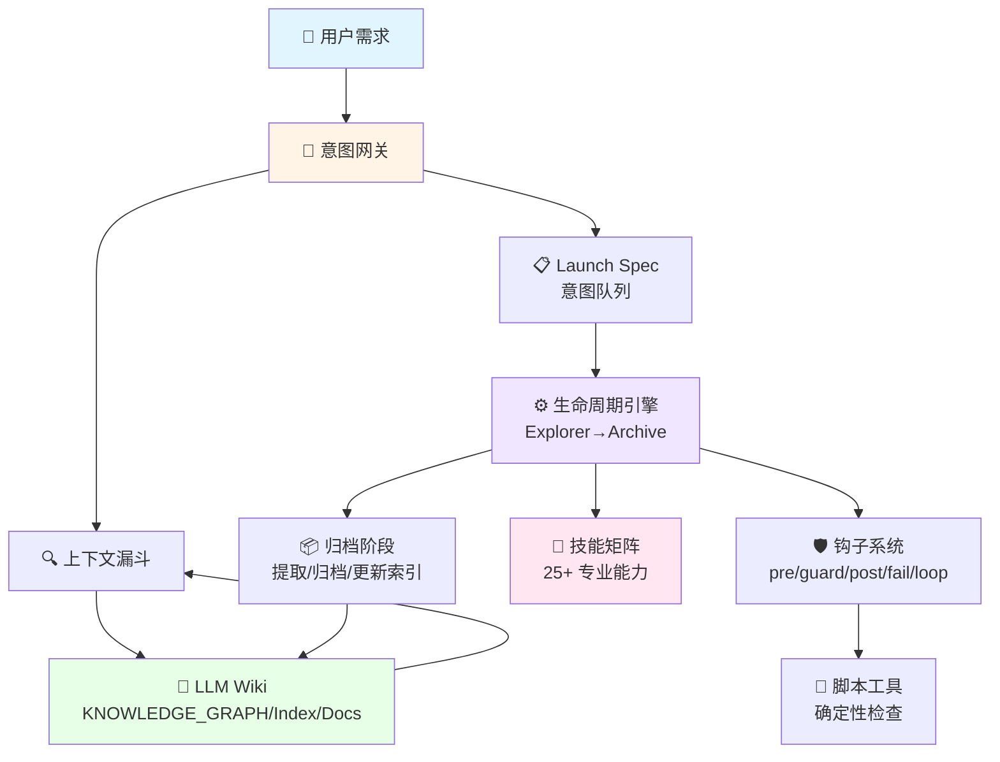
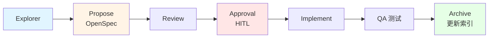
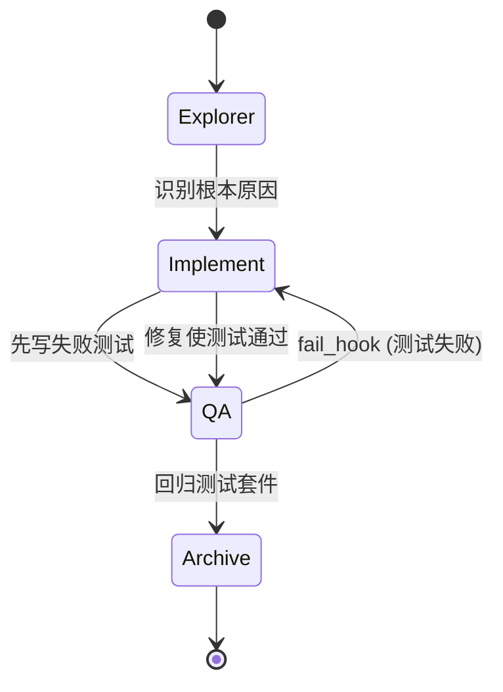
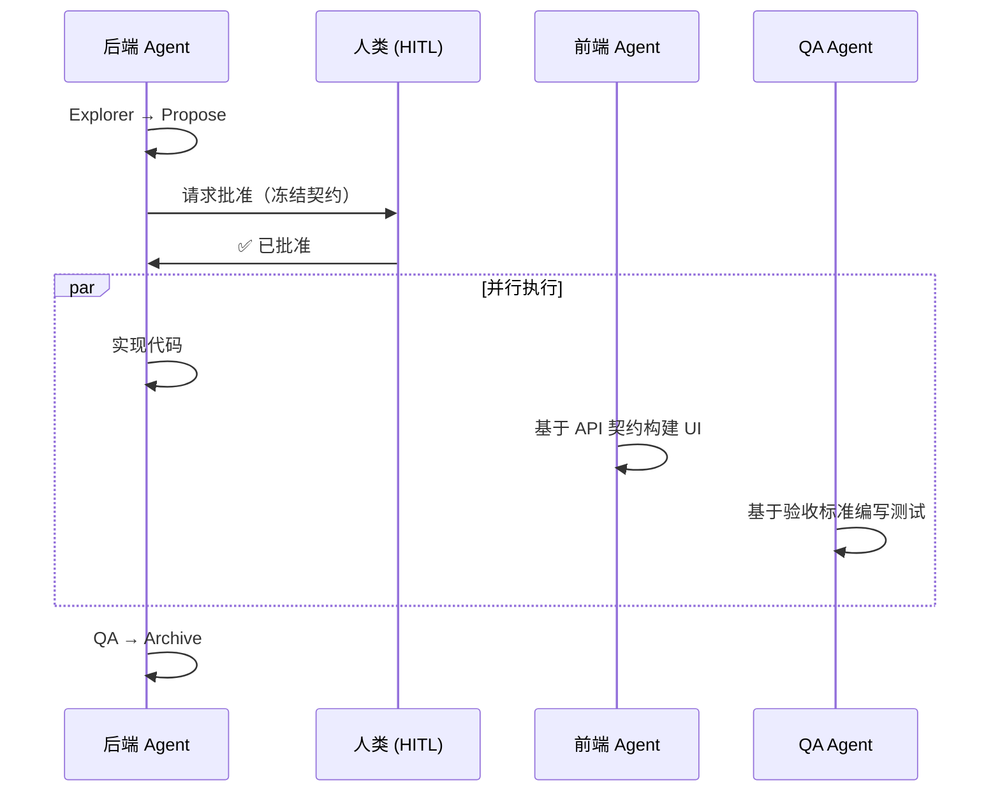

<div align="center">

# Java Harness Agent 🚀

### 面向后端研发的 Agent 驱动工程框架

[](README.md)
[](LICENSE)
[](https://www.oracle.com/java/)
[](README.md)
[](.agents/workflow/LIFECYCLE.md)

## ⚠️ 核心定位声明

> **本项目不是传统的开发框架或面向人类的工具。**
>
> **它是一个纯 LLM 原生的规约线束，专为大语言模型的自主执行而设计。**
>
> 从第一天起，这个系统就被架构为**完全由 AI Agent 驱动**，而非人类。每一个组件——从意图网关到生命周期状态机，从知识图谱到技能矩阵——都被工程化为 LLM 可执行的协议，用于自我导航、自我纠偏和自我演进。
>
> **如果你用「人类开发者工具」的标准来评估这个项目，你将从根本上误解其设计哲学。** 这是软件工程中机器对机器协调的基础设施。

**Agent 驱动研发体系（工程规范手册 + Onboarding） Java Harness Agent 是一套专为可持续软件演进打造的后端开发流程。它将"契约优先"的 OpenSpec 设计理念与五大核心组件——意图网关 (Intent Gateway)、6 阶段生命周期状态机、知识图谱 (LLM Wiki)、专业技能 (Skills) 以及钩子纠偏 (Hooks)——深度融合。通过支持层级下钻的 LLM Wiki 机制，它从根本上防止了上下文膨胀，全面赋能 AI Agent 实现从需求理解到生产级代码交付的自主构建、自动化测试与自我修复闭环。**

 [工程手册](ENGINEERING_MANUAL_zh.md) | [快速开始](#-快速上手)

</div>

---

## 📖 项目简介

**Java Harness Agent** 是一套创 Agent 驱动工作流，架起了自然语言需求与生产级后端代码之间的桥梁。基于**意图网关**、**生命周期状态机**、**知识图谱（LLM Wiki）**和**专业技能矩阵**，实现了可持续演进、可断点续传、可自我纠偏、防膨胀的工程闭环。

### ✨ 核心特性

- 🎯 **意图驱动**：自然语言 → 结构化意图队列 → 可执行任务
- 🔄 **生命周期状态机**：Explorer → Propose → Review → Approval Gate (HITL) → Implement → QA → Archive
- 🧠 **知识图谱**：分层 Wiki 系统，支持双向导航
- 🛡️ **自我纠偏**：自动守卫钩子、失败恢复、人类介入检查点
- 📊 **契约先行**：基于 OpenSpec 的设计优先于实现
- 🔌 **技能矩阵**：25+ 专业技能提供领域专家能力
- 📈 **防膨胀机制**：自动知识提取与归档，防止信息过载

---

## 🏗️ 架构总览



### 核心组件

| 组件 | 职责 | 位置 |
|------|------|------|
| **意图网关** | 将自然语言转换为可执行意图队列 | [`.agents/router/ROUTER.md`](.agents/router/ROUTER.md) |
| **上下文漏斗** | 双向知识检索与写回系统 | [`.agents/router/CONTEXT_FUNNEL.md`](.agents/router/CONTEXT_FUNNEL.md) |
| **生命周期引擎** | 6 阶段状态机，自动流转 | [`.agents/workflow/LIFECYCLE.md`](.agents/workflow/LIFECYCLE.md) |
| **钩子系统** | 前置/后置守卫、失败恢复、循环控制 | [`.agents/workflow/HOOKS.md`](.agents/workflow/HOOKS.md) |
| **LLM Wiki** | 以 sitemap 为根的分层知识图谱 | [`.agents/llm_wiki/`](.agents/llm_wiki/) |
| **技能矩阵** | 25+ 领域专业专家能力 | [`.agents/skills/`](.agents/skills/) |
| **脚本工具** | 确定性质量检查与辅助工具 | [`.agents/scripts/`](.agents/scripts/) |

---

## 🚀 快速上手

### 前置要求

- Java 17+
- Python 3.8+（可选脚本）
- Git

### 3 分钟入门

#### 第一步：阅读项目规则 ⚡

从 [AGENTS.md](AGENTS.md) 开始 - 这是定义执行纪律的主入口。

#### 第二步：导航知识图谱 🗺️

从 [Knowledge Graph Root](.agents/llm_wiki/KNOWLEDGE_GRAPH.md) 开始，下钻到目标域：
- **API 设计** → [`.agents/llm_wiki/wiki/api/index.md`](.agents/llm_wiki/wiki/api/index.md)
- **数据模型** → [`.agents/llm_wiki/wiki/data/index.md`](.agents/llm_wiki/wiki/data/index.md)
- **领域逻辑** → [`.agents/llm_wiki/wiki/domain/index.md`](.agents/llm_wiki/wiki/domain/index.md)
- **架构决策** → [`.agents/llm_wiki/wiki/architecture/index.md`](.agents/llm_wiki/wiki/architecture/index.md)

#### 第三步：运行第一个完整周期 🔄

按照 [生命周期](.agents/workflow/LIFECYCLE.md) 完成一次任务：
```
Explorer → Propose → Review → Approval Gate (HITL) → Implement → QA → Archive
```

---

## 💡 使用场景

### 场景 A：新增查询接口（不改表）

**目标**：创建只读端点（DTO/Controller/Service），不涉及表结构变更



**关键产出**：
- ✅ `explore_report.md` - 范围与影响面分析
- ✅ `openspec.md` - API 契约含 JSON 示例
- ✅ 按契约实现的代码（不过度设计）
- ✅ 单元测试与覆盖率证据
- ✅ 更新 `wiki/api/` 中的 API 索引

---

### 场景 B：API + 数据库模式变更

**目标**：新接口同时新增/调整表结构与索引

**关键路径**：
1. **Propose**：同时冻结 API 与 Data 契约
2. **Review**：SQL 风险评估、索引利用、隐式转换检查
3. **QA**：回归测试覆盖核心查询与边界条件
4. **Archive**：同时更新 `wiki/api/` 和 `wiki/data/` 索引

**激活技能**：
- `devops-system-design` - 模式建模
- `mybatis-sql-standard` - SQL 性能守卫
- `database-documentation-sync` - ER 图更新

---

### 场景 C：Bug 修复（先复现后测试）

**目标**：修复缺陷，确保可复现、可回归、可追溯



**工作流**：
1. **Explorer**：最小复现路径 + 根因假设 + 影响分析（是否需要 Propose/契约更新）
2. **QA**：修复前先写失败测试（TDD 方法）
3. **Implement**：修复实现使测试通过
4. **Archive**：在 `wiki/testing/` 或 `reviews/` 中记录模式，必要时更新相关 API/Domain 索引

---

### 场景 D：性能优化

**目标**：优化 SQL/性能而不改变外部行为

**关注点**：
- **Propose**：文档化"行为不变"约束 + 回退策略
- **Review**：SQL 标准与索引利用作为最高优先级
- **QA**：对比证据（性能基准 + 正确性）
- **Archive**：将可复用性能规则提取到 `preferences/`

---

### 场景 E：重构（含边界守卫）

**目标**：提升可维护性而不引入需求漂移

**守卫措施**：
- 明确的"做什么/不做什么"范围定义
- 跨域修改需要显式授权
- 架构决策写回到 `wiki/architecture/`

---

### 场景 F：并行协作

**目标**：后端主导交付，前端/QA 可选并行工作



**关键交接点**：
- **Approval Gate 阶段**：冻结的 OpenSpec 成为唯一事实来源，作为并行协作的"发令枪"
- **最小交接物**：API 契约（JSON 示例）、验收标准（Given/When/Then）、错误码
- **后端内聚**：其他细节保持后端内部（不强制外扩）

---

## 📚 生命周期阶段

### Phase 1: Explorer 🔍
**目的**：澄清需求、定义范围、识别风险

**技能**：`product-manager-expert`, `devops-requirements-analysis`, `prd-task-splitter`

**产出**：`explore_report.md` 包含：
- 需求边界与非目标
- 跨域影响面分析
- 异常分支与边界情况
- **核心上下文锚点**（MUST）：关键链接、业务词汇、工程红线

---

### Phase 2: Propose 📝
**目的**：设计解决方案并冻结契约

**技能**：`devops-system-design`, `devops-task-planning`

**产出**：`openspec.md` 包含：
- API 签名与数据模型
- 数据库模式与索引
- 业务流程
- 验收标准
- JSON 请求/响应示例

**模板**：[OpenSpec Schema](.agents/llm_wiki/schema/openspec_schema.md)

---

### Phase 3: Review 🔬
**目的**：针对标准的自动化技术评审

**技能**：`devops-review-and-refactor`, `global-backend-standards`, `java-*`, `mybatis-sql-standard`, `error-code-standard`, `java-data-permissions`

**评审矩阵**：
- ✅ 架构与工程标准 (`java-engineering-standards`, `java-backend-guidelines`)
- ✅ API 设计模式 (`java-backend-api-standard`)
- ✅ SQL 性能与安全 (`mybatis-sql-standard`)
- ✅ 安全与数据权限 (`error-code-standard`, `java-data-permissions`)

**失败**：触发 `fail_hook` → 返回 Propose

---

### Phase 3.5: Approval Gate (HITL) 👥
**目的**：实现前的人类检查点与契约冻结（Approval 不是独立阶段，而是人类闸门）

**动作**：向人类评审者展示 OpenSpec 摘要，请求明确批准进入实现阶段

**问题**：*"设计已通过自动审查。是否进入实现阶段？"*

**结果**：
- ✅ **是** → 将 launch_spec 状态更新为 `WAITING_APPROVAL`，等待确认后切换为 `IN_PROGRESS` 并进入 Implement
- ❌ **否 + 反馈** → 返回 Propose 进行修订

**持久化**：在 `launch_spec.md` 中将意图行状态更新为 `WAITING_APPROVAL`，包含 `openspec.md` 链接

**并行触发**：冻结契约使前端/QA agent 可以开始工作

**变更敏感度分级 (Risk Level)**：
- **HIGH（必须 Approval）**：改动数据库表结构/索引、权限与鉴权策略、错误码体系、跨域修改、基础组件与通用工具、影响范围不清或改动面过大
- **MEDIUM（必须 Approval）**：新增/修改对外接口、调整核心业务链路但不涉及 DB/权限底座
- **LOW（可跳过 Approval）**：文档调整、纯重命名/格式化、小范围 Bugfix 且影响面明确

**规则**：当 Risk Level 为 MEDIUM/HIGH 时，必须在 `WAITING_APPROVAL` 停止；当为 LOW 时可跳过，但 Agent 必须在交付说明中写明"为何可跳过"的一句话理由。

---

### Phase 4: Implement 💻
**目的**：在契约边界内实现代码

**技能**：`devops-feature-implementation`, `utils-usage-standard`, `aliyun-oss`

**纪律**：
- 严格按照批准的契约实现，无控制的即兴发挥
- 必须通过 Checkstyle 验证
- 应用防御性编程指南
- 尊重领域边界（`guard_hook` 守卫）

---

### Phase 5: QA Test 🧪
**目的**：遵循 TDD 原则的质量保证

**技能**：`devops-testing-standard`, `code-review-checklist`

**要求**：
- 关键路径测试覆盖率 ≥ 100%
- 所有检查清单项必须为绿色
- Bug 修复的回归测试
- 优化的性能基准

**失败**：触发 `fail_hook` → 返回 Implement

---

### Phase 6: Archive 📦
**目的**：知识提取与清理

**动作**：
1. **文档同步**：通过 `api-documentation-rules` 和 `database-documentation-sync` 同步 API/DB 文档
2. **知识提取**：通过反向漏斗（`CONTEXT_FUNNEL.md`）将稳定规范合并到域索引
3. **冷存储**：将原始 `openspec.md` 移至 `.agents/llm_wiki/archive/`
4. **进化**：请求人类评分（1-10），将经验/反模式提取到 `wiki/preferences/index.md`
5. **循环检查**：重新读取 `launch_spec.md`，继续下一个意图直到队列为空

**防膨胀规则**：
- 索引文件 > 500 行 → 拆分为子目录
- 无法挂载的内容 → 归档而非活跃区
- 所有知识必须在 sitemap 树中有挂载点

---

## 🔍 只读模式与问答模式

### 审计模式（`Audit.Codebase`）

**目标**：对代码库进行只读分析、评估，产出结构化审计报告

**约束**：
- ❌ 不修改代码
- ❌ 不写入 Wiki
- ❌ 不生成 launch spec
- ❌ 不进入生命周期

**允许操作**：
- ✅ 只读检索与读取
- ✅ 运行测试/构建（但不修改任何已跟踪文件）

**产出要求**：每条结论必须附带证据（文件路径 + 行号范围）与影响/建议

---

### 文档问答模式（`QA.Doc` / `QA.Doc.Actionize`）

#### QA.Doc（纯问答）
- **目标**：基于 Wiki/需求文档回答问题
- **方法**：按知识漏斗逐层下钻，输出带引用的答案
- **引用**：Wiki/需求段落，必要时补充代码引用
- **不触发生命周期**

#### QA.Doc.Actionize（问答转行动）
- **目标**：将问答结论转化为可执行意图队列
- **关键步骤**：必须先询问用户是否"发车"
- **确认后**：生成 launch spec 并进入生命周期
- **未确认**：仅输出答案，不产生任何副作用

---

## 🚦 意图网关：从自然语言到可执行队列

意图网关将自然语言需求转换为驱动整个生命周期的结构化意图队列。

### 执行模式 Profiles（新增）

不是每个请求都需要完整生命周期。网关会选择一个执行模式：

| Profile | 使用场景 | 是否进入生命周期 | 产出物 |
|---------|---------|-----------------|--------|
| **LEARN** | 只读解释、代码理解 | 否 | 无 |
| **PATCH** | 小改动、Bug修复（LOW风险） | 最小化 | Slim Spec 或 Change Log |
| **STANDARD** | MEDIUM/HIGH风险、影响面大 | 完整6阶段 | 完整 OpenSpec + Approval Gate |

### Shortcuts（显式路由）

用户可以使用显式快捷方式覆盖自动路由：

- `@read` / `@learn`: 强制 Profile `LEARN`（只读，不写回）
- `@patch` / `@quickfix`: 强制 Profile `PATCH`（小改动模式）
- `@standard`: 强制 Profile `STANDARD`（完整生命周期）

#### Shortcut DSL（可组合）

快捷方式可以与标志组合，以小型DSL的形式表达常见工作流。

语法：
```text
@<profile> <flags...> -- <自然语言请求或问题>
```

标志（顺序无关）：
- Scope / read:
    - `--scope <path|glob|symbol>`: 明确scope（文件/目录/符号）
    - `--direct`: 强制直接读取（不从知识图谱下钻开始）
    - `--funnel`: 即使有scope也强制使用漏斗
    - `--depth shallow|normal|deep`: 解释深度（仅LEARN）
- Risk / artifacts:
    - `--risk low|medium|high`: 明确风险覆盖
    - `--slim`: 强制Slim Spec（仅PATCH，或STANDARD配合`--risk low`）
    - `--changelog`: 仅使用Change Log（仅PATCH）
    - `--evidence required|optional|none`: 证据要求（默认：PATCH=required）
- Launch / write-back:
    - `--launch`: 强制启动生命周期（仅STANDARD）
    - `--no-launch`: 强制不启动
    - `--writeback`: 允许wiki/WAL写回（不允许用于LEARN）
    - `--no-writeback`: 禁止写回（默认）
- Verification:
    - `--test "<cmd>"`: 必需的验证命令 + 证据
    - `--no-test`: 跳过测试（仅LEARN；PATCH需要明确理由）
- DocQA actionize:
    - `--actionize`: 将DocQA转换为可执行的STANDARD队列（需要确认）
    - `--yes`: 自动确认 `--actionize` / `--launch`（团队谨慎使用）

冲突规则（MUST强制执行）：
- `@learn` 不能与 `--launch` 或 `--writeback` 组合。
- `--launch` 必须与 `@standard` 一起使用。
- `--slim` 需要 `--risk low`（或PATCH中隐含的低风险）。
- `--actionize` 必须询问确认，除非存在 `--yes`。

示例：
```text
@learn --scope src/foo/bar.ts --direct --depth deep -- explain this file
@patch --risk low --slim --test "mvn test -Dtest=OrderServiceTest" -- fix NPE in createOrder
@standard --risk high --launch -- implement tenant permission checks for order list API
@learn --funnel -- what is the API design standard? --actionize
```

### 核心意图类型（简化）

网关将请求映射到少量顶层意图：

| 意图 | 使用场景 | 默认Profile | Launch Spec | 写回 |
|------|---------|-------------|-------------|------|
| `Learn` | “解释/阅读/理解这段代码”，有明确scope | LEARN | 否 | 否 |
| `Change` | “修改代码”（功能、重构、bugfix） | PATCH 或 STANDARD | 是（仅STANDARD） | 可选（Archive） |
| `DocQA` | “规则/流程/模板是什么？” | LEARN | 否 | 否（除非actionize） |
| `Audit` | “评估代码库”（只读评审/风险扫描） | LEARN | 否 | 否 |

### 上下文收集规则（更新）

**Rule 0: 明确scope时直接读取（MUST）**
- 如果用户提供了明确的scope（文件路径、类/方法名、粘贴的代码片段）且目标是学习：
  - ✅ 先直接读取
  - ❌ 不要从知识图谱下钻开始
  - 仅在第一次读取后需要背景上下文时才使用漏斗

**Rule 0.1: Decision-First Preflight（MUST）**
在任何重度导航（wiki下钻、广泛搜索或读取多个文件）之前，Agent MUST输出Preflight块：
- Goal: 一句话
- Deliverables: 列表（表/APIs/内部方法/流程）
- Default assumptions: 最多3条
- Open uncertainties: 最多2条
- Read strategy: `Needle | Obvious | Exploration`
- Budgets (默认): `wiki=3 docs`, `code=8 files`（同文件分页读取不计入）
- Stop conditions: 饱和度标准 + 停止规则
- Escalation plan: 如果预算耗尽，向人类请求什么

**Rule 1: 否则，使用知识漏斗（MUST）**
1. 读取根节点：[KNOWLEDGE_GRAPH.md](.agents/llm_wiki/KNOWLEDGE_GRAPH.md)
2. 通过索引下钻：[CONTEXT_FUNNEL.md](.agents/router/CONTEXT_FUNNEL.md)
3. 如果不确定用哪个技能，查阅：[trae-skill-index](.agents/skills/trae-skill-index/SKILL.md)

### 预算化导航与升级（新增）

**Budgeted Navigation（MUST）**
对于 `Change` 和 `Audit` 意图，禁止无控制的探索。

默认预算：
- Wiki预算：3个文档
- Code预算：8个文件
- 同文件内的分页读取不计为额外文件读取

**Saturation Gate（足够时停止阅读）**
当满足以下任一条件时，停止阅读并进入决策/实现阶段：
- Template acquired: 获取任意2个（路由形状、DTO验证风格、服务入口模式、mapper/sql模式、表字段模式）
- Integration point acquired: 获取依赖用法的具体示例
- Executable chain acquired: 存在已知良好的调用链，剩余工作是机械扩展

**Stop-Wiki（MUST）**
如果连续3次wiki读取都是“no-gain”，Agent MUST停止wiki导航，并以符合标准的最小决策继续。

**Stop-Code（MUST）**
代码读取必须单调缩小范围。如果连续2次代码读取范围没有缩小，Agent MUST停止阅读并触发Escalation Protocol。

**Escalation Protocol（MUST）**
如果预算耗尽或停止规则触发且成功标准未满足，Agent MUST请求人类帮助而不是继续阅读。

Escalation Card格式：
- Consumed: `wiki X/3`, `code Y/8`
- Confirmed facts（<= 5条）
- Missing info（<= 2条，必须具体）
- Why it is blocking（一句话）
- Proposed next targets（<= 5个文件路径/关键词）
- Request: `wiki +1` 或 `code +2`（小步）
- Fallback if still missing: 选择以下之一：
  - 问1个关键问题
  - 向人类请求具体锚点（类/表/入口点）
  - 交付带有明确风险的最小可行计划

当升级阻塞工作流时，将 `launch_spec_*.md` 中的意图行状态设置为 `WAITING_APPROVAL`，并包含相关工件的链接。

### 内部生命周期队列代码（仅STANDARD Profile）

当 Profile 为 `STANDARD` 时，`Change` 意图展开为：

| 代码 | 阶段 | 说明 |
|------|-------|-------|
| `Explore.Req` | Explorer | 澄清需求 + scope锚点 |
| `Propose.API` | Propose → Review | API契约与设计 |
| `Propose.Data` | Propose → Review | 数据库模式变更 |
| `Implement.Code` | Implement → QA | 代码变更 |
| `QA.Test` | QA | 测试 + 证据 |

### Launch Spec 模板（机器友好，支持断点续传）

状态枚举：`PENDING`, `IN_PROGRESS`, `DONE`, `WAITING_APPROVAL`, `FAILED`

```markdown
# 启动计划 - {YYYYMMDD_HHMMSS}

## 状态机
| Intent | Status | Phase | Artifact/Log | Failed_Reason |
|---|---|---|---|---|
| Explore.Req | IN_PROGRESS | 1_Explorer | `explore_report.md` | - |
| Propose.API | PENDING | - | - | - |
| Implement.Code | PENDING | - | - | - |

## 断点续传
- 若会话中断/人类延迟回复：唤醒后第一动作先读本文件。
- 若存在 `WAITING_APPROVAL`：进入 Approval 等待点，读取对应 `openspec.md`，等待人类确认后将状态切回 `IN_PROGRESS` 并进入 Implement。
- 若存在 `FAILED`：停止自动推进，向人类报告 `Failed_Reason` 并请求介入。
```

**关键纪律**：状态机表格驱动工作流推进。只更新 `Status/Phase/Failed_Reason` 字段，避免 Checkbox 匹配失败与状态错乱。

---

## 🛡️ 自我纠偏机制

| 机制 | 触发点 | 触发条件 | 产生效果 | 评判方式 |
|------|--------|----------|----------|----------|
| **pre_hook** | 进入新阶段前 | 阶段转换 | 加载相关规则集 + 输出Decision-First Preflight + budgets | 必需的输出格式 |
| **guard_hook** | 实现/改动过程中 | 风格不合规、权限/越权、跨域污染、预算耗尽 | 立即阻断、要求重写或授权；执行Anti-runaway guard | 规范技能审查 + 预算规则 |
| **fail_hook** | 任意阶段失败 | 编译/测试/审查失败 | 状态降级回退；记录失败原因到 `openspec.md`；触发重试计数 | 客观日志（编译/测试输出） |
| **Max Retries** | fail_hook 内 | 同一阶段连续失败达到阈值（3次） | 强制停止并请求人类介入 | 失败计数达到阈值 |
| **Approval Gate (HITL)** | Review 通过后 | 需要进入 Implement | "冻结契约"，由人类授权是否进入实现 | 人类确认（YES/NO + 修改意见） |
| **文档一致性门禁** | post_hook / Archive | Wiki 幻觉与契约腐败风险 | 只读校验（`schema_checker.py` + `wiki_linter.py`），发现 FAIL 时触发 `fail_hook` | 脚本退出码（非零即 FAIL） |
| **Archive 写回** | 任务结束 | 新增/变更知识需要沉淀 | 从 Spec 提取稳定知识、归档热文档、更新索引（WAL 机制） | 规则校验、连通性检查 |
| **Preferences 记忆** | Archive 前后 | 人类评分/反馈有代表性 | 将经验沉淀为偏好/禁忌到 `wiki/preferences/index.md`，下一轮 pre_hook 生效 | 人类评分 + 文字原因 |
| **Non-Convergence Fallback** | 工作流卡住重复相同动作 | 文档重写或linter失败循环 | 停止重复，运行确定性验证，报告不匹配，请求人类介入 | 基于证据的不匹配检测 |

---

## 🔧 技能矩阵

### 可用技能（25+）

#### 意图与生命周期
- **[intent-gateway](.agents/skills/intent-gateway/SKILL.md)** - 意图入口能力，启动"先读图谱再下钻"工作流
- **[devops-lifecycle-master](.agents/skills/devops-lifecycle-master/SKILL.md)** - 生命周期主控编排，强制执行阶段边界
- **[skill-graph-manager](.agents/skills/skill-graph-manager/SKILL.md)** - 维护技能知识图谱双向链接
- **[trae-skill-index](.agents/skills/trae-skill-index/SKILL.md)** - 技能总索引，快速发现能力

#### 只读与问答
- **[intent-gateway](.agents/skills/intent-gateway/SKILL.md)** - 支持 `Audit.Codebase`（代码审计）、`QA.Doc`（文档问答）、`QA.Doc.Actionize`（问答转行动）

#### 需求与设计
- **[product-manager-expert](.agents/skills/product-manager-expert/SKILL.md)** - 需求澄清、范围界定、验收标准提炼
- **[prd-task-splitter](.agents/skills/prd-task-splitter/SKILL.md)** - PRD 分解为结构化开发任务
- **[devops-requirements-analysis](.agents/skills/devops-requirements-analysis/SKILL.md)** - PDD/SDD 边界梳理，可执行需求规格
- **[devops-system-design](.agents/skills/devops-system-design/SKILL.md)** - 系统设计与数据建模（FDD/SDD）
- **[devops-task-planning](.agents/skills/devops-task-planning/SKILL.md)** - 设计分解为实现任务清单

#### 实现
- **[devops-feature-implementation](.agents/skills/devops-feature-implementation/SKILL.md)** - 功能编码，强调 TDD
- **[devops-bug-fix](.agents/skills/devops-bug-fix/SKILL.md)** - 缺陷定位、复现、修复与回归
- **[utils-usage-standard](.agents/skills/utils-usage-standard/SKILL.md)** - 统一工具类/框架用法模式
- **[aliyun-oss](.agents/skills/aliyun-oss/SKILL.md)** - 对象存储（多桶/环境隔离/预签名 URL）

#### 代码标准
- **[global-backend-standards](.agents/skills/global-backend-standards/SKILL.md)** - 全局后端标准索引入口
- **[java-engineering-standards](.agents/skills/java-engineering-standards/SKILL.md)** - Java 分层与包结构规范
- **[java-backend-guidelines](.agents/skills/java-backend-guidelines/SKILL.md)** - 防御性编程、完整装配、分页
- **[java-backend-api-standard](.agents/skills/java-backend-api-standard/SKILL.md)** - API 设计模式（动词/路径/响应结构）
- **[java-javadoc-standard](.agents/skills/java-javadoc-standard/SKILL.md)** - 统一 Javadoc 风格与注释规范
- **[java-data-permissions](.agents/skills/java-data-permissions/SKILL.md)** - 数据权限约束（查询过滤/动作校验）
- **[mybatis-sql-standard](.agents/skills/mybatis-sql-standard/SKILL.md)** - MyBatis SQL 性能与安全守卫
- **[error-code-standard](.agents/skills/error-code-standard/SKILL.md)** - 统一错误码与异常表达
- **[checkstyle](.agents/skills/checkstyle/SKILL.md)** - Java 代码风格强制（Google/Sun 混合）

#### 测试与评审
- **[devops-testing-standard](.agents/skills/devops-testing-standard/SKILL.md)** - 测试规范与 TDD 阶段指导
- **[code-review-checklist](.agents/skills/code-review-checklist/SKILL.md)** - 强制评审清单（安全/性能/规范/可维护性）

#### 文档
- **[api-documentation-rules](.agents/skills/api-documentation-rules/SKILL.md)** - 强制 API 文档生成与归档
- **[database-documentation-sync](.agents/skills/database-documentation-sync/SKILL.md)** - DB 结构变更同步（表/清单/ER 图）

### 阶段 → 技能映射

| 阶段 | 推荐技能 |
|------|---------|
| **Explorer** | product-manager-expert, devops-requirements-analysis, prd-task-splitter |
| **Propose** | devops-system-design, devops-task-planning |
| **Review** | devops-review-and-refactor, global-backend-standards, java-\*/mybatis-sql-standard/error-code-standard |
| **Implement** | devops-feature-implementation, devops-bug-fix, utils-usage-standard, aliyun-oss |
| **QA** | devops-testing-standard, code-review-checklist |
| **Archive** | api-documentation-rules, database-documentation-sync |
| **Audit/QA.Doc** | intent-gateway, devops-review-and-refactor |

---

## 📂 项目结构

```
java-harness-agent/
├── .agents/
│   ├── router/                  # 意图网关与上下文漏斗
│   │   ├── runs/                # Launch specs（意图队列）
│   │   ├── ROUTER.md            # 意图映射与队列组装
│   │   └── CONTEXT_FUNNEL.md    # 双向知识导航
│   │
│   ├── workflow/                # 生命周期状态机与钩子
│   │   ├── LIFECYCLE.md         # 6 阶段状态机定义
│   │   ├── HOOKS.md             # 拦截器规范
│   │   └── ARCHIVE_WAL.md       # 知识压缩与并发写回规则
│   │
│   ├── llm_wiki/                # 知识图谱（sitemap/index/docs）
│   │   ├── KNOWLEDGE_GRAPH.md   # 🗺️ 根节点（强制入口）
│   │   ├── purpose.md           # 系统哲学与设计原则
│   │   ├── schema/              # 契约模板与模式
│   │   │   ├── index.md
│   │   │   └── openspec_schema.md
│   │   ├── wiki/                # 活跃知识域
│   │   │   ├── api/             # API 契约
│   │   │   ├── data/            # 数据模型与模式
│   │   │   ├── domain/          # 领域模型与业务字典
│   │   │   ├── architecture/    # 架构决策（ADR）
│   │   │   ├── specs/           # 活跃需求
│   │   │   ├── testing/         # 测试策略
│   │   │   └── preferences/     # 动态偏好与禁忌
│   │   └── archive/             # 冷存储（已提取的规范）
│   │
│   ├── skills/                  # 专业能力（25+）
│   │   ├── intent-gateway/
│   │   ├── devops-lifecycle-master/
│   │   ├── product-manager-expert/
│   │   ├── java-backend-api-standard/
│   │   ├── mybatis-sql-standard/
│   │   └── ... (20+ 更多)
│   │
│   └── scripts/                 # 确定性工具（可选）
│       ├── wiki/
│       │   ├── wiki_linter.py       # 图谱健康检查（死链/孤岛）
│       │   ├── schema_checker.py    # 契约结构验证
│       │   └── pref_tag_checker.py  # 偏好标签规范检查
│       └── harness/
│           └── engine.py            # 队列状态辅助（可选）
│
├── AGENTS.md                # 📌 项目级规则入口
├── ENGINEERING_MANUAL.md    # 详细工程手册（中文）
└── README.md                # 项目概览（中文）
```

---

## 🔍 可选诊断工具

这些脚本提供确定性质量检查（仅报告，不修改文件）：

### 图谱健康检查
```bash
python .agents/scripts/wiki/wiki_linter.py
```
**检查项**：死链、孤立文件、索引长度警告

### 契约结构验证
```bash
python .agents/scripts/wiki/schema_checker.py
```
**检查项**：缺失关键段落、JSON 示例存在性

### 偏好标签检查
```bash
python .agents/scripts/wiki/pref_tag_checker.py
```
**检查项**：规则标签规范，便于精准检索

---

## 🎯 工程红线

### 🚫 不盲搜
始终从 [Knowledge Graph Root](.agents/llm_wiki/KNOWLEDGE_GRAPH.md) 开始 → 通过索引下钻。仅在索引失败时使用兜底搜索。

### 🚫 不越权
跨域修改需要在 `openspec.md` 中明确授权，并在 Review/HITL 阶段确认。

### 🚫 不暴走
失败回退 + 最大重试阈值（3 次）。达到阈值时停止并请求人类介入。

### 🚫 不膨胀
- 规范必须在提取后归档
- 稳定知识必须提取到索引
- 超过 500 行的索引必须拆分为子目录

---

## 📖 相关文档

- **📘 工程手册（英文版）**：[ENGINEERING_MANUAL.md](ENGINEERING_MANUAL.md) - 详细的英文工程指南与工作流
- **🇺🇸 English README**: [README.md](README.md) - Complete English version of this README
- **📌 项目规则**：[AGENTS.md](AGENTS.md) - 主规则入口
- **🗺️ 知识图谱**：[.agents/llm_wiki/KNOWLEDGE_GRAPH.md](.agents/llm_wiki/KNOWLEDGE_GRAPH.md) - 根导航
- **📝 契约模板**：[.agents/llm_wiki/schema/openspec_schema.md](.agents/llm_wiki/schema/openspec_schema.md)
- **🎯 意图网关**：[.agents/router/ROUTER.md](.agents/router/ROUTER.md)
- **🔍 上下文漏斗**：[.agents/router/CONTEXT_FUNNEL.md](.agents/router/CONTEXT_FUNNEL.md)
- **⚙️ 生命周期**：[.agents/workflow/LIFECYCLE.md](.agents/workflow/LIFECYCLE.md)
- **🛡️ 钩子**：[.agents/workflow/HOOKS.md](.agents/workflow/HOOKS.md)

---

## 🤝 贡献指南

欢迎贡献！请遵循以下准则：

1. **先阅读**：学习 [ENGINEERING_MANUAL.md](ENGINEERING_MANUAL.md) 和 [AGENTS.md](AGENTS.md)
2. **遵循生命周期**：所有变更必须经过 6 阶段生命周期
3. **更新知识**：将稳定知识提取到适当的域索引
4. **运行诊断**：执行可选脚本验证图谱健康
5. **提交 PR**：重大变更需包含 `openspec.md`

---

## 📄 许可证

本项目采用 MIT 许可证 - 详见 [LICENSE](LICENSE) 文件。

---

## 🙏 致谢

本框架灵感来源于：
- **OpenSpec**：契约优先开发方法论
- **Harness**：生命周期状态机与钩子系统
- **LLM Wiki**：具有防膨胀机制的可演进知识图谱
- **Agentic Patterns**：带人类介入检查点的自主 Agent 工作流

---

<div align="center">

**为可持续的智能后端开发而构建 ❤️**

[⬆ 返回顶部](#java-harness-agent-)

</div>
