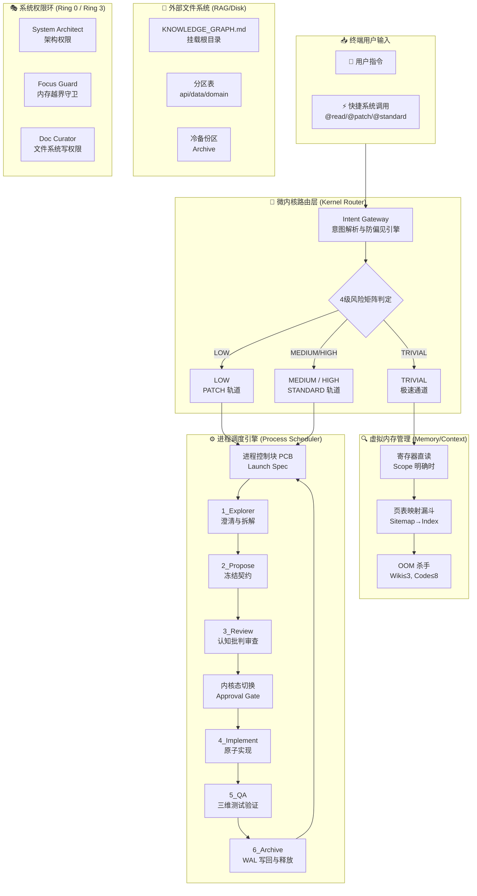

<div align="center">

# Java Harness Agent 🚀

**面向后端研发的 Agent 驱动“微内核”操作系统**

[](README.md)
[](LICENSE)
[](https://www.oracle.com/java/)
[](.agents/workflow/LIFECYCLE.md)

[工程手册](ENGINEERING_MANUAL_zh.md) · [快速开始](#-快速上手)


</div>

## ⚠️ 核心定位声明

> **“学习 Agent，越学越像在重新理解操作系统。历史不会重复，但会押韵！”**

这是一个**机器对机器（M2M）的基础设施**。它是一个**认知线束 (Cognitive Harness)**——由人类设计，但**专供大语言模型（LLM）阅读、解析和执行**的工程协议。

与传统臃肿的“宏内核”（Macro-kernel）Agent 框架不同，Java Harness Agent 采用了极其克制的**微内核 OS 哲学**：
- **进程 = 意图边界**：同进程共享内存，跨意图必须显式通信（WAL 写回）。
- **RAM = 上下文窗口**：Agent 最稀缺的资源，由架构严格调度寄存器与磁盘换页。
- **系统调用 = Tool Use**：必须通过系统调用陷入内核（Harness），由角色矩阵代为鉴权与执行。
- **文件系统 = RAG 与 Wiki**：廉价的大容量磁盘按需挂载，用完即焚。

**Java Harness Agent** 是一套专为可持续软件演进打造的 Agent 驱动后端开发流程。它深度融入了 **认知哲学**（反直觉偏见、第一性原理思考），并首创了 **双轨制 (Dual-Track)** 与 **4级风险矩阵 (4-Level Risk Matrix)**。通过 15 个高密度的核心 Master 技能，彻底杜绝了传统 Agent 开发中的“失控狂奔”与“代码腐败”现象。

## 📖 项目简介

**Java Harness Agent** 将"契约优先"的 OpenSpec 设计理念与微内核架构深度融合。通过意图网关、双轨制生命周期、无向量知识图谱（LLM Wiki）以及认知刹车系统，实现了可持续演进、可断点续传、可自我纠偏的工程闭环。

### ✨ 核心特性

- 🎯 **OS级意图驱动**：自然语言 → 结构化意图队列 → 进程级任务调度
- 🧠 **认知哲学**：内置认知偏见纠正与 5-Whys 决策框架，强制 Agent 在动手前“三思”（Cognitive Brake）
- 🛤️ **双轨制与4级风险矩阵**：区分 TRIVIAL（极速通道）、LOW（PATCH 轨道）、MEDIUM/HIGH（STANDARD 完整6阶段），告别一刀切的繁琐流程
- 📚 **微内核知识图谱**：彻底摒弃向量数据库的“黑盒”检索，采用纯 Markdown 的分层挂载系统，确保 100% 的上下文确定性
- 🛡️ **自我纠偏与门控**：自动守卫钩子、失败恢复、强制的人类介入检查点（Approval Gate）
- 🔌 **15项 Master 技能生态**：从过去臃肿的 30 个碎片化技能，淬炼为 15 个高密度、场景化的核心工程法则

---

## 💰 Token 经济学与成本模型

鉴于 Java Harness Agent 是一个强约束的 Agent 框架，它的架构将成本从**“试错与盲目搜索”**转移到了**“前期规划与门控防御”**上，从而使复杂任务的全局成本变得极其稳定和可预期。

### 1. 哪里产生了额外的“思考税” (The Thinking Tax)
- 每次对话，Agent 都必须输出 `<Cognitive_Brake>` 并阅读强制性的系统上下文（如 `LIFECYCLE.md`, `AGENTS.md`）。这导致每一轮都会产生大约 **~500 个输出 Token 和 ~2000 个输入 Token** 的硬性基线损耗。
- 尤其是融入了 **认知框架**后，Agent 必须先进行自我反思（防偏见），这增加了几百 Token 的开销，但省下了后续由于方向错误导致的几万 Token 的重写成本。

### 2. ROI 盘点：三种工程模式的终极对比

| 开发范式 | 行为特征 | 输入 Tokens | 输出 Tokens | 隐性成本与风险 | 最终评价 |
|----------|----------|--------------|---------------|----------------------|---------|
| **纯对话 / Copilot** | 缺乏上下文，直接生成代码。 | ~5k | ~1k | **极高的返工率**。忘记加事务、漏字段。需要人类反复写 Prompt 去纠正。 | Token 极省，但极其消耗人类时间。 |
| **宏内核 Auto-Agent** | 盲目扫库，所有技能一次性加载，遇到编译报错陷入死循环重试。 | **10万+** | 10k+ | **灾难级损耗**。因上下文过载和死循环，迅速烧光 Token 预算。 | 不可控，高风险。 |
| **微内核 Harness Agent** | 缴纳适量的“思考税”，利用双轨制与漏斗限流，在高风险操作前强制停下。 | **~30k** | **~6k** | **成本确定且可控**。架构错误在前期被人类拦截，语法错误被左移验证消化。 | **甜点位 (The Sweet Spot)**。用可控的 Token 消耗换取了高质量交付。 |

---

## 🏗️ 架构总览：微内核 OS 哲学

### 核心思想

**Java Harness Agent 解决的三大根本问题:**

1. **上下文膨胀失控 (OOM)**: LLM 在大型代码库中盲目搜索导致 Token 浪费 → 通过纯文本挂载文件系统与“即用即焚”解决
2. **需求漂移与越权修改 (越权)**: Agent 自由发挥导致跨域污染 → 通过微内核意图网关 + 严格的角色矩阵守卫解决
3. **知识碎片化与不可持续 (内存泄漏)**: 对话记忆丢失、索引膨胀 → 通过 WAL 写回日志与敏捷的垃圾回收 (GC) 机制解决

### 🎭 13 大虚拟英雄图鉴 (The Virtual Team)

Agent 并不是一个孤立运作的大模型，而是一个由 13 位性格迥异的“虚拟英雄”组成的硬核团队。在执行任务时，大模型必须动态挂载这些角色，并使用他们专属的武器（Python 门禁脚本）来捍卫系统纪律。

#### 🛡️ 阶段 1: Explorer (迷雾探索期)
* **@Requirement Engineer (需求工程师)**: “不要给我发‘优化一下’这种垃圾词汇。告诉我你的边界，或者闭嘴！” (武器: `ambiguity_gate.py`)
* **@Ambiguity Gatekeeper (歧义守门员)**: “等一下，你确定你要全局 grep 吗？先画好 `focus_card.md` 的红线！” (武器: `focus_card.md` 结界)

#### 🏛️ 阶段 2 & 3: Propose & Review (架构设计与残酷审查期)
* **@System Architect (系统架构师)**: “爆炸半径在我的计算之内。按我的 `openspec.md` 蓝图开工！” (武器: `Approval Gate` 人类召唤阵)
* **@Devil's Advocate (魔鬼代言人)**: “哦，架构师大人，你真的觉得这逻辑能扛得住高并发死锁吗？” (武器: `cognitive-bias-checklist`)

#### ⚔️ 阶段 4 & 5: Implement & QA (编码与无情测试期)
* **@Lead Engineer (首席工程师)**: “契约就是法律。我不创造，我只按 `openspec.md` 实现代码。” (武器: `javac` 真理熔炉)
* **@Focus Guard (专注守卫)**: “你的手伸得太长了！把手缩回 Focus Card 结界里！” (武器: `scope_guard.py` 惩戒戒尺)
* **@Code Reviewer (代码审查员)**: “魔法数字？N+1 查询风险？把这些肮脏的代码给我重写！” (武器: `Static Linter` 净化之光)
* **@Security Sentinel (安全哨兵)**: “警告。检测到硬编码的 Secret Key。执行强制熔断。” (武器: `secrets_linter.py` 死光射线)

#### 📜 阶段 6: Archive (归档与记忆沉淀期)
* **@Knowledge Extractor (沉默的史官)**: “帝国必将陨落，唯有历史 (WAL) 永存。” (武器: `writeback_gate.py` 历史审判)
* **@Documentation Curator (人类之友)**: “请多给人类一点关怀。注释要写 Why，而不是 What。” (武器: `README & Javadoc`)
* **@Skill Graph Curator (强迫症馆长)**: “索引一旦错乱，整个世界都会迷路。” (武器: `skill_index_linter.py`)

#### 🌌 后台守护进程 (Garbage Collection)
* **@Librarian (深夜清道夫)**: “嘘……不要吵醒我，除非你带来了 `@gc` 的指令来合并碎片。” (武器: `librarian_gc.py`)
* **@Knowledge Architect (城市规划师)**: “这篇文档超过 400 行了！大模型路过会脑容量爆炸的！必须拆分！” (武器: 结构重组)

### 系统架构图



---

## 🚦 核心工作流：双轨制与 4 级风险矩阵

不再是一刀切的繁杂流程。框架在内核入口处（Router）对任务进行定性，分配到不同的处理轨道：

### 4 级风险矩阵 (Risk Matrix)

| 风险等级 | 判定特征 | 授权策略 | 测试要求 | 回滚成本 |
|---------|----------|----------|----------|----------|
| **TRIVIAL** | 纯查询、打日志、修拼写、读代码 | **免授权 (Auto-Approve)** | 无强制要求 | 零 |
| **LOW** | 单一方法的 Bugfix、内部重构，不改接口，不改表 | **隐式授权 (PATCH)** | 单元测试 | 极低 |
| **MEDIUM** | 新增 API、表字段扩充、跨模块调用 | **显式授权 (Approval Gate)** | 集成与契约测试 | 高 |
| **HIGH** | 核心主干流修改、状态机变更、权限拦截器重写 | **高级显式授权 + 架构审查** | 全量回归测试 | 灾难性 |

### 双轨制 (Dual-Track Flow)

#### 1. PATCH 轨道 (针对 TRIVIAL & LOW)
**极速通道，拒绝官僚主义。**
- 跳过冗长的 `Propose` 和 `Review` 阶段。
- 不生成笨重的 `openspec.md`，仅在 `.agents/workflow/runs/` 中生成轻量级的 `focus_card.md`。
- 直接进入代码修改与测试。
- 极低的 Token 消耗，适合高频的小型迭代。

#### 2. STANDARD 轨道 (针对 MEDIUM & HIGH)
**重型装甲，捍卫工程底线。**
- 严格遵循完整的 6 阶段生命周期 (Explorer → Propose → Review → Implement → QA → Archive)。
- 强制生成 `openspec.md` 并触发 **Approval Gate**，必须由人类审核架构契约后才能写代码。
- 引入认知批判框架，对架构设计进行深度拷问。

---

## 🔧 15 项 Master 技能生态系统

为解决“技能膨胀”导致的上下文混乱，本框架将原有的 30 个零散技能淬炼为 15 个高密度的 Master 技能，按生命周期严格挂载：

### 核心技能清单

1. **`cognitive-bias-checklist`**：**核心大脑**。提供认知偏见自查，防止 AI 的幻觉与短视。
2. **`decision-frameworks`**：提供 5-Whys 根因分析与结构化决策框架。
3. **`task-decomposition-guide`**：敏捷拆解大师。执行 INVEST 原则与垂直切片（Vertical Slicing），防止单次任务上下文爆炸。
4. **`spec-quality-checklist`**：验证 OpenSpec 契约的严谨性与完整性。
5. **`java-architecture-standards`**：后端红线。涵盖层级调用规约、POJO 转换模型、防腐层设计。
6. **`java-coding-style`**：代码美学。强制执行 Google/Sun 规范与防御性函数式编程。
7. **`java-testing-standards`**：三维测试法则（快乐路径、异常路径、边界条件）。
8. **`mybatis-sql-standard`**：DB 守卫。包含 8 大标准审计字段强制检查、Anti-JOIN 规约。
9. **`wal-documentation-rules`**：日志文件系统（WAL）。规范化写回 API 与 DB 的变动记录，防止知识丢失。
10. **`code-review-checklist`**：标准化代码审查流程，确保安全与可维护性。
11. **`devops-bug-fix`**：系统化的调试与问题解决协议。
12. **`linter-severity-standard`**：定义代码质量门控与静态检查严重度规则。
13. **`product-manager-expert`**：弥合技术实现与业务需求之间的鸿沟。
14. **`skill-graph-manager`**：编排与管理各 Agent 技能之间的依赖关系。
15. **`trae-skill-index`**：全局技能大纲路由表。

---

## 🚀 快速上手

### 3 分钟入门指南

#### 第一步：阅读“宪法” ⚡
从 [AGENTS.md](AGENTS.md) 开始 - 它是定义执行纪律的主入口，包含硬约束和 OS 挂载规则。
- **OOM 杀手**: Wiki ≤ 3 文档, Code ≤ 8 文件（超限立即触发 Escalation 抛出异常）。
- **认知刹车 (Cognitive Brake)**: 在任何操作前必须输出该 XML 块，强制校验当前所在的进程、边界和预算。

#### 第二步：发起系统调用 (Shortcuts DSL) 🎯
使用显式的命令强制切入对应轨道：

```text
@read / @learn     → 进入只读进程（TRIVIAL 级，无副作用）
@patch / @quickfix → 挂载 PATCH 轨道（LOW 级，轻量级修复）
@standard          → 挂载 STANDARD 轨道（MEDIUM/HIGH，全生命周期重型组装）
```

**示例：**
```text
@learn --scope src/foo/bar.ts -- explain this file
@patch --risk low --test "mvn test" -- fix NPE in createOrder
@standard --risk high -- implement tenant permission checks for order list API
```

#### 第三步：理解断点续传 (Breakpoint Resume) 🔄
- Launch Spec 持久化在 `router/runs/launch_spec_*.md` (相当于 PCB 进程控制块)。
- 会话中断或休眠后，唤醒的第一动作是读取该文件恢复状态。
- 如果卡在 `WAITING_APPROVAL`，Agent 会等待您检查完 `openspec.md` 并说“同意”后，才会进入内核态执行代码。

---

## 🛡️ 自我纠偏与门控机制

| 机制 | 触发点 | 产生效果 | OS 隐喻 |
|------|--------|----------|----------|
| **Cognitive_Brake** | 任何行动前 | 迫使LLM在行动前，显式推理角色、边界、预算和反思偏见 | **内核特权级检查** |
| **pre_hook** | 进入新阶段前 | 加载相关规则集 + 输出决策清单 | **进程上下文切换** |
| **guard_hook** | 实现/改动过程中 | 风格不合规、越权、跨域污染立即阻断 | **内存越界保护 (Segfault)** |
| **Approval Gate** | Review 通过后 | "冻结契约"，由人类授权是否进入实现 | **用户态切内核态确认** |
| **Archive 写回** | 任务结束 | 将 Spec 提取的稳定知识追加到 Wiki 索引（WAL） | **脏页写回磁盘 (fsync)** |

---

## 📖 相关文档

- **📘 工程手册（中文版）**：[ENGINEERING_MANUAL_zh.md](ENGINEERING_MANUAL_zh.md) - 详细的中文工程指南与工作流
- **📘 工程手册（英文版）**：[ENGINEERING_MANUAL.md](ENGINEERING_MANUAL.md) - 详细的英文工程指南与工作流
- **🇺🇸 English README**: [README.md](README.md) - Complete English version of this README
- **📌 项目规则**：[AGENTS.md](AGENTS.md) - 主规则入口与宪法
- **🗺️ 知识图谱**：[.agents/llm_wiki/KNOWLEDGE_GRAPH.md](.agents/llm_wiki/KNOWLEDGE_GRAPH.md) - 虚拟文件系统根目录

---

## 🤝 贡献指南

欢迎参与共同打造这个纯粹的 M2M 工程基建！
1. **先阅读**：深刻理解 [ENGINEERING_MANUAL_zh.md](ENGINEERING_MANUAL_zh.md) 中的微内核理念。
2. **遵循生命周期**：所有针对架构自身的修改，必须走 `STANDARD` 轨道。
3. **保持克制**：我们追求技能的高密度与正交性，拒绝随意添加“面条式”的单一指令技能。

---

## 📄 许可证

本项目采用 MIT 许可证 - 详见 [LICENSE](LICENSE) 文件。

<div align="center">

**为可持续的、不膨胀的智能后端开发而构建 ❤️**

[⬆ 返回顶部](#java-harness-agent-)

</div>
