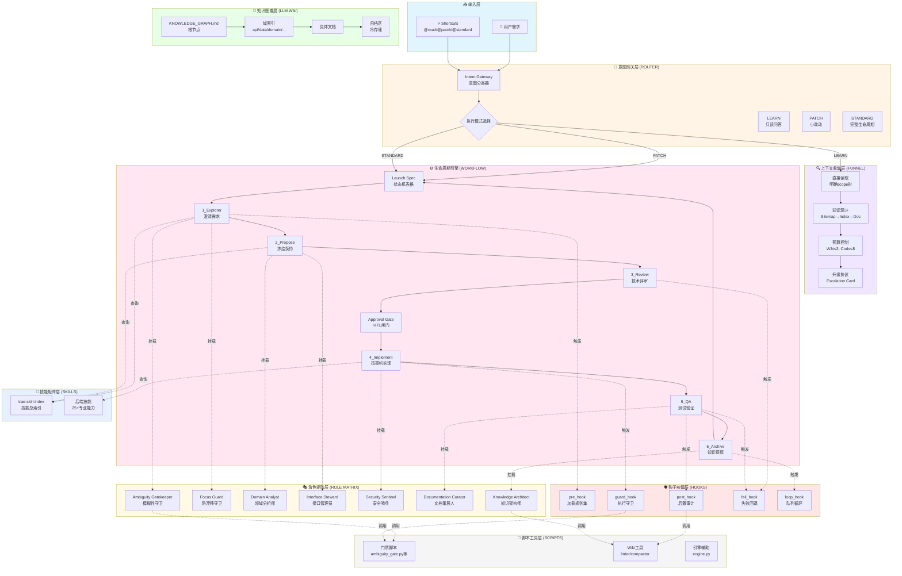
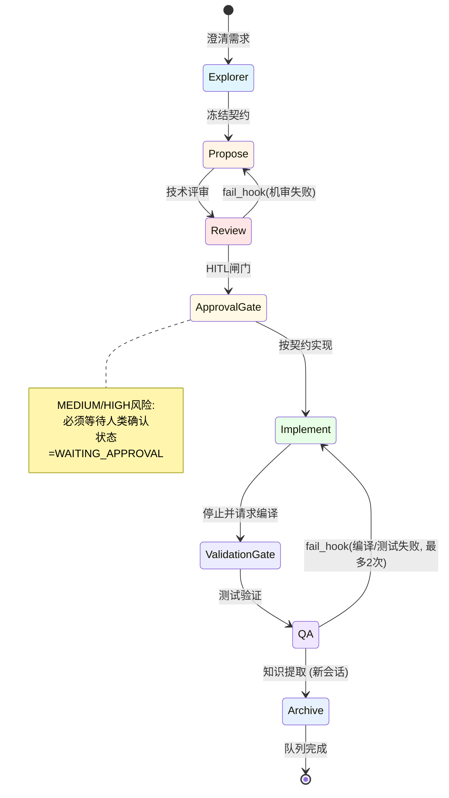
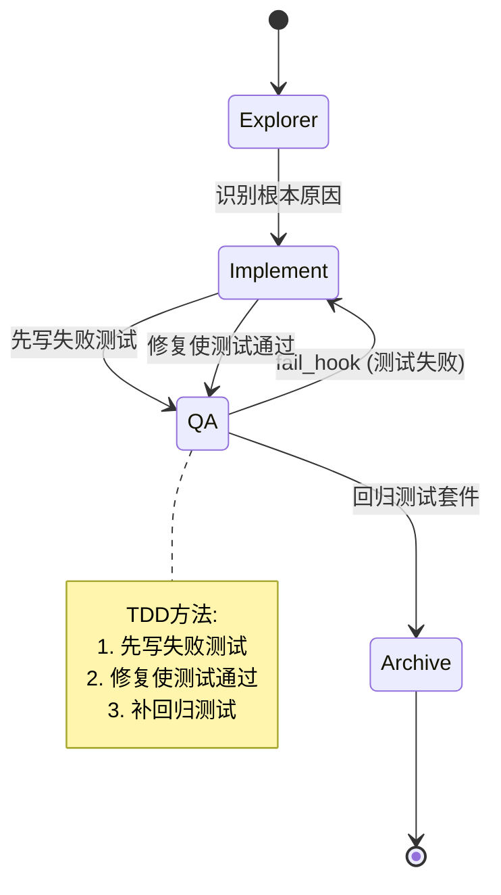
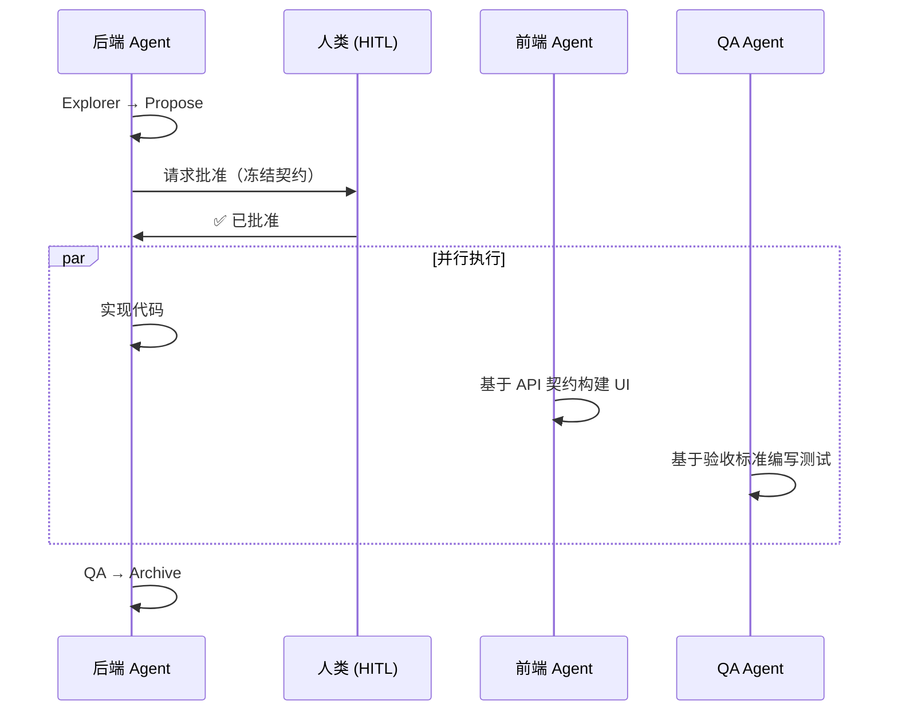

<div align="center">

# Java Harness Agent 🚀

### 面向后端研发的 Agent 驱动工程框架

[](README.md)
[](LICENSE)
[](https://www.oracle.com/java/)
[](README.md)
[](.agents/workflow/LIFECYCLE.md)

## ⚠️ 核心定位声明：一个 LLM 原生的操作环境

> **“不要把方向盘交给引擎。”**
>
> 这是一个**机器对机器（M2M）的基础设施**。它不是 Spring Boot 那样给人类调用的 Java 框架，也不是 CLI 开发者脚手架。它是一个**认知线束 (Cognitive Harness)**——由人类设计，但**专供大语言模型（LLM）阅读、解析和执行**的工程协议。
>
> 通过将工程纪律（生命周期状态机、角色矩阵、无向量知识图谱）编码为 LLM 原生的格式，它将 AI 从一个简单的“代码补全机”重塑为了一个能够自我导航、自我纠偏的自主工程实体。

**Java Harness Agent** 是一套专为可持续软件演进打造的 Agent 驱动后端开发流程。它将"契约优先"的 OpenSpec 设计理念与五大核心组件——意图网关 (Intent Gateway)、6 阶段生命周期状态机、知识图谱 (LLM Wiki)、专业技能 (Skills) 以及钩子纠偏 (Hooks)——深度融合。通过支持层级下钻的 LLM Wiki 机制，它从根本上防止了上下文膨胀，全面赋能 AI Agent 实现从需求理解到生产级代码交付的自主构建、自动化测试与自我修复闭环。

 [工程手册](ENGINEERING_MANUAL_zh.md) | [快速开始](#-快速上手)

</div>


## 📖 项目简介

**Java Harness Agent** 是一套创新的 Agent 驱动工作流，架起了自然语言需求与生产级后端代码之间的桥梁。基于**意图网关**、**生命周期状态机**、**知识图谱（LLM Wiki）**和**专业技能矩阵**，实现了可持续演进、可断点续传、可自我纠偏、防膨胀的工程闭环。

### ✨ 核心特性

- 🎯 **意图驱动**：自然语言 → 结构化意图队列 → 可执行任务
- 🔄 **生命周期状态机**：Explorer → Propose → Review → Approval Gate (HITL) → Implement → Validation Gate → QA → Archive
- 🧠 **知识图谱**：分层 Wiki 系统，支持双向导航
- 🛡️ **自我纠偏**：自动守卫钩子、失败恢复、人类介入检查点
- 📊 **契约先行**：基于 OpenSpec 的设计优先于实现
- 🔌 **技能矩阵**：25+ 专业技能提供领域专家能力
- 📈 **防膨胀机制**：自动知识提取与归档，防止信息过载

---

## 💰 Token 经济学与成本模型

鉴于 Java Harness Agent 是一个强约束的 Agent 框架，它天生比简单的“代码补全工具”消耗更多的 Token。然而，它的架构将成本从**“试错与盲目搜索”**转移到了**“前期规划与门控防御”**上，从而使复杂任务的全局成本变得极其稳定和可预期。

### 1. 哪里产生了额外的“思考税” (The Thinking Tax)
- 每次对话，Agent 都必须输出 `<Cognitive_Brake>` 并阅读强制性的系统上下文（如 `LIFECYCLE.md`, `AGENTS.md`）。这导致每一轮都会产生大约 **~500 个输出 Token 和 ~2000 个输入 Token** 的硬性基线损耗。
- 在 `Propose` 阶段，架构强制要求撰写 `explore_report.md` 和 `openspec.md`，这会在写哪怕一行代码之前，额外消耗掉约 ~1500 个输出 Token。

### 2. ROI 盘点：三种工程模式的终极对比 (以开发跨表事务功能为例)

*注：以下估算基于当前主流旗舰模型（如 GPT-4o, Claude 3.5/3.7 Sonnet, Gemini 1.5 Pro）的实际消耗水平。*

| 开发范式 | 行为特征 | 输入 Tokens | 输出 Tokens | 隐性成本与风险 | 最终评价 |
|----------|----------|--------------|---------------|----------------------|---------|
| **纯对话 / Copilot** | 缺乏上下文，直接生成代码。 | ~5k | ~1k | **极高的返工率**。忘记加事务、漏字段、甚至引错包。需要人类反复写 Prompt 去纠正。 | Token 极省，但极其消耗人类时间。 |
| **无约束的 Auto-Agent** | 盲目调用 `SearchCodebase` 或 `Grep` 扫库，遇到编译报错陷入死循环重试。 | **10万+** | 10k+ | **灾难级损耗**。因上下文过载和死循环，迅速烧光 Token 预算，且极易触发平台熔断。 | 不可控，高风险。 |
| **Java Harness Agent (本架构)** | 缴纳适量的“思考税”，利用漏斗限流（`Wiki≤3, Code≤8`），写好 `openspec.md` 并在 Approval Gate 停下。 | **~30k** | **~6k** | **成本确定且可控**。架构错误在前期被人类拦截，语法错误被左移验证（Shift-Left Validation）消化。 | **甜点位 (The Sweet Spot)**。用可控的 Token 消耗换取了高质量的交付。 |

### 3. 不同场景的 Token 消耗预期计算 (基于最新旗舰模型)

| 场景模式 (Profile) | 典型交互轮数 | 输入 Tokens | 输出 Tokens | 预期成本 / 任务 |
|------------------|---------------|--------------|---------------|----------------------|
| **`@patch` (小型 Bug 修复)** | 1-2 轮 | ~5k - 8k | ~1k - 2k | **$0.05 - $0.15** |
| **`@standard` (新功能开发)** | 4-6 轮 | ~20k - 40k | ~4k - 8k | **$0.30 - $0.80** |
| **`@learn` (文档问答)** | 1 轮 | ~3k - 5k | ~500 | **$0.02 - $0.05** |

### 4. Token 优化公式与建议
**总 Token 成本 = (基础上下文 + 漏斗收集的负载) × 轮数 + (规范生成 + 代码生成 + 认知刹车输出)**

为了最大化性价比：
1. **善用快捷指令**：对于琐碎的修改，使用 `@patch` 替代默认的 `@standard`，从而跳过 Phase 1-3，直接省下几千 Token。
2. **提供明确的作用域**：在提示词中带上 `--scope src/Foo.java`。这会触发 **Rule 0**（直接读取），跳过整个知识图谱的下钻检索过程，立省海量输入 Token。
3. **尊重刹车点**：当 Agent 在 Validation Gate（编译前）停下时，请确保您本地的依赖或环境没问题后再允许它编译，防止它陷入重试循环。

---

## 🏗️ 架构总览

### 核心思想

**Java Harness Agent 解决的三大根本问题:**

1. **上下文膨胀失控**: LLM 在大型代码库中盲目搜索导致 Token 浪费和注意力分散 → 通过知识图谱 + 预算化导航解决
2. **需求漂移与越权修改**: Agent 自由发挥导致跨域污染和契约腐败 → 通过意图网关 + 角色矩阵守卫解决
3. **知识碎片化与不可持续**: 对话记忆丢失、文档不同步、索引膨胀 → 通过 WAL 写回 + 自动重构解决

**设计哲学**: 将工程纪律编码为 LLM 可执行的协议，实现机器对机器的自我协调、自我纠偏和自我演进。

### 系统架构图



### 核心组件详解

| 层级 | 组件 | 职责 | 关键文件 |
|------|------|------|----------|
| **输入层** | 意图网关 | 自然语言 → 结构化意图 + 执行模式 | [ROUTER.md](.agents/router/ROUTER.md) |
| **上下文层** | 知识漏斗 | 双向导航（正向检索 + 反向写回） | [CONTEXT_FUNNEL.md](.agents/router/CONTEXT_FUNNEL.md) |
| **知识层** | LLM Wiki | 分形知识图谱（Sitemap/Index/Docs/Archive） | [KNOWLEDGE_GRAPH.md](.agents/llm_wiki/KNOWLEDGE_GRAPH.md) |
| **流程层** | 生命周期引擎 | 6阶段状态机 + 断点续传 | [LIFECYCLE.md](.agents/workflow/LIFECYCLE.md) |
| **角色层** | 角色矩阵 | 动态挂载虚拟角色 + 门禁守卫 | [ROLE_MATRIX.md](.agents/workflow/ROLE_MATRIX.md) |
| **纠偏层** | 钩子系统 | 前置/守卫/后置/失败/循环拦截 | [HOOKS.md](.agents/workflow/HOOKS.md) |
| **能力层** | 技能矩阵 | 25+ 领域专业专家能力 | [trae-skill-index](.agents/skills/trae-skill-index/SKILL.md) |
| **工具层** | 脚本工具 | 确定性质量检查 + 辅助工具 | [scripts/](.agents/scripts/) |

---

## 🚀 快速上手

### 前置要求

- Java 17+
- Python 3.8+（脚本工具）
- Git

### 3 分钟入门指南

#### 第一步：阅读项目规则 ⚡

从 [AGENTS.md](AGENTS.md) 开始 - 这是定义执行纪律的主入口，包含硬约束和导航规则。

**核心约束速览:**
- **预算限制**: Wiki ≤ 3 文档, Code ≤ 8 文件（同文件分页不计）
- **认知刹车 (Cognitive Brake)**: 在任何操作前必须输出 `<Cognitive_Brake>` XML 块，强制校验角色、边界和预算
- **双重人类门控**: 必须在写代码前 (`Approval Gate`) 和执行重度编译前 (`Validation Gate`) 停止并等待人类确认
- **防循环**: 脚本/linter最多重试3次；编译/测试**严格最多重试2次**。超限必须请求人类介入，严禁死循环
- **范围守卫**: 未经明确授权不得修改 `focus_card.md` 约定范围外的文件

#### 第二步：理解意图网关 🎯

意图网关将自然语言转换为可执行队列，支持三种执行模式：

| Profile | 使用场景 | 是否进入生命周期 | 产出物 |
|---------|---------|-----------------|--------|
| **LEARN** | 只读解释、代码理解 | ❌ 否 | 无 |
| **PATCH** | 小改动、Bug修复（LOW风险） | ✅ 最小化 | Slim Spec + Change Log |
| **STANDARD** | MEDIUM/HIGH风险、影响面大 | ✅ 完整6阶段 | 完整 OpenSpec + Approval Gate |

**Shortcuts (显式路由):**
```text
@read / @learn     → 强制 LEARN 模式（只读）
@patch / @quickfix → 强制 PATCH 模式（小改动）
@standard          → 强制 STANDARD 模式（完整生命周期）
```

**Shortcut DSL 示例:**
```text
@learn --scope src/foo/bar.ts --direct --depth deep -- explain this file
@patch --risk low --slim --test "mvn test -Dtest=OrderServiceTest" -- fix NPE in createOrder
@standard --risk high --launch -- implement tenant permission checks for order list API
```

#### 第三步：导航知识图谱 🗺️

**Rule 0: 明确scope时直接读取（MUST）**
- 如果用户提供了明确的scope（文件路径、类/方法名、粘贴的代码片段）且目标是学习：
  - ✅ 先直接读取
  - ❌ 不要从知识图谱下钻开始

**Rule 1: 否则，使用知识漏斗（MUST）**
1. 读取根节点：[KNOWLEDGE_GRAPH.md](.agents/llm_wiki/KNOWLEDGE_GRAPH.md)
2. 通过索引下钻：[CONTEXT_FUNNEL.md](.agents/router/CONTEXT_FUNNEL.md)
3. 如果不确定用哪个技能，查阅：[trae-skill-index](.agents/skills/trae-skill-index/SKILL.md)

**常用域索引:**
- **API 设计** → [`.agents/llm_wiki/wiki/api/index.md`](.agents/llm_wiki/wiki/api/index.md)
- **数据模型** → [`.agents/llm_wiki/wiki/data/index.md`](.agents/llm_wiki/wiki/data/index.md)
- **领域逻辑** → [`.agents/llm_wiki/wiki/domain/index.md`](.agents/llm_wiki/wiki/domain/index.md)
- **架构决策** → [`.agents/llm_wiki/wiki/architecture/index.md`](.agents/llm_wiki/wiki/architecture/index.md)

#### 第四步：运行第一个完整周期 🔄

按照 [生命周期](.agents/workflow/LIFECYCLE.md) 完成一次 STANDARD 任务：



**断点续传机制:**
- Launch Spec 持久化在 `router/runs/launch_spec_*.md`
- 会话中断后第一动作：读取该文件恢复状态
- 状态枚举：`PENDING`, `IN_PROGRESS`, `DONE`, `WAITING_APPROVAL`, `FAILED`

---

## 💡 使用场景

### 场景 A：新增查询接口（不改表）

**目标**：创建只读端点（DTO/Controller/Service），不涉及表结构变更


**关键产出**:
- ✅ `explore_report.md` - 范围与影响面分析 + Core Context Anchors
- ✅ `openspec.md` - API 契约含 JSON 示例、验收标准
- ✅ 按契约实现的代码（不过度设计）
- ✅ 单元测试与覆盖率证据
- ✅ 更新 `wiki/api/` 中的 API 索引（WAL 机制）

**激活技能**:
- Explorer: `product-manager-expert`, `devops-requirements-analysis`
- Propose: `devops-system-design`, `java-backend-api-standard`
- Review: `global-backend-standards`, `mybatis-sql-standard`
- Implement: `devops-feature-implementation`, `checkstyle`
- QA: `devops-testing-standard`, `code-review-checklist`
- Archive: `api-documentation-rules`

---

### 场景 B：API + 数据库模式变更

**目标**：新接口同时新增/调整表结构与索引

**关键路径**:
1. **Propose**：同时冻结 API 与 Data 契约（字段语义、约束、索引设计、兼容性策略）
2. **Review**：SQL 风险评估、索引利用、隐式转换检查、越权风险
3. **QA**：回归测试覆盖核心查询与边界条件
4. **Archive**：同时更新 `wiki/api/` 和 `wiki/data/` 索引，同步 ER 图

**激活技能**:
- `devops-system-design` - 模式建模
- `mybatis-sql-standard` - SQL 性能守卫
- `database-documentation-sync` - ER 图更新

---

### 场景 C：Bug 修复（先复现后测试）

**目标**：修复缺陷，确保可复现、可回归、可追溯



**工作流**:
1. **Explorer**：最小复现路径 + 根因假设 + 影响分析（是否需要 Propose/契约更新）
2. **QA**：修复前先写失败测试（TDD 方法）
3. **Implement**：修复实现使测试通过
4. **Archive**：在 `wiki/testing/` 或 `reviews/` 中记录模式，必要时更新相关 API/Domain 索引

**Profile**: PATCH（LOW风险）或 STANDARD（MEDIUM/HIGH风险）

---

### 场景 D：性能优化

**目标**：优化 SQL/性能而不改变外部行为

**关注点**:
- **Propose**：文档化"行为不变"约束 + 回退策略
- **Review**：SQL 标准与索引利用作为最高优先级
- **QA**：对比证据（性能基准 + 正确性）
- **Archive**：将可复用性能规则提取到 `preferences/`

**激活技能**:
- `mybatis-sql-standard` - SQL 性能守卫（第一优先级）
- `devops-review-and-refactor` - 重构建议

---

### 场景 E：重构（含边界守卫）

**目标**：提升可维护性而不引入需求漂移

**守卫措施**:
- 明确的"做什么/不做什么"范围定义（Focus Card）
- 跨域修改需要显式授权（guard_hook 守卫）
- 架构决策写回到 `wiki/architecture/`

**激活角色**:
- Ambiguity Gatekeeper - 模糊性守卫
- Focus Guard - 防漂移守卫
- Knowledge Architect - 知识架构师（如需重构 Wiki）

---

### 场景 F：并行协作

**目标**：后端主导交付，前端/QA 可选并行工作



**关键交接点**:
- **Approval Gate 阶段**：冻结的 OpenSpec 成为唯一事实来源，作为并行协作的"发令枪"
- **最小交接物**：API 契约（JSON 示例）、验收标准（Given/When/Then）、错误码
- **后端内聚**：其他细节保持后端内部（不强制外扩）

---

### 场景 G：只读审计（Audit.Codebase）

**目标**：对代码库进行只读分析、评估，产出结构化审计报告

**约束**:
- ❌ 不修改代码
- ❌ 不写入 Wiki
- ❌ 不生成 launch spec
- ❌ 不进入生命周期

**允许操作**:
- ✅ 只读检索与读取
- ✅ 运行测试/构建（但不修改任何已跟踪文件）

**产出要求**: 每条结论必须附带证据（文件路径 + 行号范围）与影响/建议

**典型场景**: 架构评审、代码质量扫描、技术债务评估

---

### 场景 H：文档问答（QA.Doc / QA.Doc.Actionize）

#### QA.Doc（纯问答）
- **目标**：基于 Wiki/需求文档回答问题
- **方法**：按知识漏斗逐层下钻，输出带引用的答案
- **引用**：Wiki/需求段落，必要时补充代码引用
- **不触发生命周期**

#### QA.Doc.Actionize（问答转行动）
- **目标**：将问答结论转化为可执行意图队列
- **关键步骤**：必须先询问用户是否"发车"
- **确认后**：生成 launch spec 并进入生命周期
- **未确认**：仅输出答案，不产生任何副作用

**典型场景**: 查询业务规则、了解 API 用法、确认架构决策

---

## 🚦 意图网关：从自然语言到可执行队列

意图网关将自然语言需求转换为驱动整个生命周期的结构化意图队列。

### 执行模式 Profiles

不是每个请求都需要完整生命周期。网关会选择一个执行模式：

| Profile | 使用场景 | 是否进入生命周期 | 产出物 |
|---------|---------|-----------------|--------|
| **LEARN** | 只读解释、代码理解 | 否 | 无 |
| **PATCH** | 小改动、Bug修复（LOW风险） | 最小化 | Slim Spec 或 Change Log |
| **STANDARD** | MEDIUM/HIGH风险、影响面大 | 完整6阶段 | 完整 OpenSpec + Approval Gate |

### Shortcuts（显式路由）

用户可以使用显式快捷方式覆盖自动路由：

- `@read` / `@learn`: 强制 Profile `LEARN`（只读，不写回）
- `@patch` / `@quickfix`: 强制 Profile `PATCH`（小改动模式）
- `@standard`: 强制 Profile `STANDARD`（完整生命周期）

#### Shortcut DSL（可组合）

快捷方式可以与标志组合，以小型DSL的形式表达常见工作流。

语法：
```text
@<profile> <flags...> -- <自然语言请求或问题>
```

标志（顺序无关）：
- Scope / read:
    - `--scope <path|glob|symbol>`: 明确scope（文件/目录/符号）
    - `--direct`: 强制直接读取（不从知识图谱下钻开始）
    - `--funnel`: 即使有scope也强制使用漏斗
    - `--depth shallow|normal|deep`: 解释深度（仅LEARN）
- Risk / artifacts:
    - `--risk low|medium|high`: 明确风险覆盖
    - `--slim`: 强制Slim Spec（仅PATCH，或STANDARD配合`--risk low`）
    - `--changelog`: 仅使用Change Log（仅PATCH）
    - `--evidence required|optional|none`: 证据要求（默认：PATCH=required）
- Launch / write-back:
    - `--launch`: 强制启动生命周期（仅STANDARD）
    - `--no-launch`: 强制不启动
    - `--writeback`: 允许wiki/WAL写回（不允许用于LEARN）
    - `--no-writeback`: 禁止写回（默认）
- Verification:
    - `--test "<cmd>"`: 必需的验证命令 + 证据
    - `--no-test`: 跳过测试（仅LEARN；PATCH需要明确理由）
- DocQA actionize:
    - `--actionize`: 将DocQA转换为可执行的STANDARD队列（需要确认）
    - `--yes`: 自动确认 `--actionize` / `--launch`（团队谨慎使用）

冲突规则（MUST强制执行）：
- `@learn` 不能与 `--launch` 或 `--writeback` 组合。
- `--launch` 必须与 `@standard` 一起使用。
- `--slim` 需要 `--risk low`（或PATCH中隐含的低风险）。
- `--actionize` 必须询问确认，除非存在 `--yes`。

示例：
```text
@learn --scope src/foo/bar.ts --direct --depth deep -- explain this file
@patch --risk low --slim --test "mvn test -Dtest=OrderServiceTest" -- fix NPE in createOrder
@standard --risk high --launch -- implement tenant permission checks for order list API
@learn --funnel -- what is the API design standard? --actionize
```

### 核心意图类型

网关将请求映射到少量顶层意图：

| 意图 | 使用场景 | 默认Profile | Launch Spec | 写回 |
|------|---------|-------------|-------------|------|
| `Learn` | "解释/阅读/理解这段代码"，有明确scope | LEARN | 否 | 否 |
| `Change` | "修改代码"（功能、重构、bugfix） | PATCH 或 STANDARD | 是（仅STANDARD） | 可选（Archive） |
| `DocQA` | "规则/流程/模板是什么？" | LEARN | 否 | 否（除非actionize） |
| `Audit` | "评估代码库"（只读评审/风险扫描） | LEARN | 否 | 否 |

### 上下文收集规则

**Rule 0: 明确scope时直接读取（MUST）**
- 如果用户提供了明确的scope（文件路径、类/方法名、粘贴的代码片段）且目标是学习：
  - ✅ 先直接读取
  - ❌ 不要从知识图谱下钻开始
  - 仅在第一次读取后需要背景上下文时才使用漏斗

**Rule 1: 否则，使用知识漏斗（MUST）**
1. 读取根节点：[KNOWLEDGE_GRAPH.md](.agents/llm_wiki/KNOWLEDGE_GRAPH.md)
2. 通过索引下钻：[CONTEXT_FUNNEL.md](.agents/router/CONTEXT_FUNNEL.md)
3. 如果不确定用哪个技能，查阅：[trae-skill-index](.agents/skills/trae-skill-index/SKILL.md)

### 预算化导航与升级

**Budgeted Navigation（MUST）**
对于 `Change` 和 `Audit` 意图，禁止无控制的探索。

默认预算：
- Wiki预算：3个文档
- Code预算：8个文件
- 同文件内的分页读取不计为额外文件读取

**Saturation Gate（足够时停止阅读）**
当满足以下任一条件时，停止阅读并进入决策/实现阶段：
- Template acquired: 获取任意2个（路由形状、DTO验证风格、服务入口模式、mapper/sql模式、表字段模式）
- Integration point acquired: 获取依赖用法的具体示例
- Executable chain acquired: 存在已知良好的调用链，剩余工作是机械扩展

**Stop-Wiki（MUST）**
如果连续3次wiki读取都是"no-gain"，Agent MUST停止wiki导航，并以符合标准的最小决策继续。

**Stop-Code（MUST）**
代码读取必须单调缩小范围。如果连续2次代码读取范围没有缩小，Agent MUST停止阅读并触发Escalation Protocol。

**Escalation Protocol（MUST）**
如果预算耗尽或停止规则触发且成功标准未满足，Agent MUST请求人类帮助而不是继续阅读。

Escalation Card格式：
- Consumed: `wiki X/3`, `code Y/8`
- Confirmed facts（<= 5条）
- Missing info（<= 2条，必须具体）
- Why it is blocking（一句话）
- Proposed next targets（<= 5个文件路径/关键词）
- Request: `wiki +1` 或 `code +2`（小步）
- Fallback if still missing: 选择以下之一：
  - 问1个关键问题
  - 向人类请求具体锚点（类/表/入口点）
  - 交付带有明确风险的最小可行计划

当升级阻塞工作流时，将 `launch_spec_*.md` 中的意图行状态设置为 `WAITING_APPROVAL`，并包含相关工件的链接。

### 内部生命周期队列代码（仅STANDARD Profile）

当 Profile 为 `STANDARD` 时，`Change` 意图展开为：

| 代码 | 阶段 | 说明 |
|------|-------|-------|
| `Explore.Req` | Explorer | 澄清需求 + scope锚点 |
| `Propose.API` | Propose → Review | API契约与设计 |
| `Propose.Data` | Propose → Review | 数据库模式变更 |
| `Implement.Code` | Implement → QA | 代码变更 |
| `QA.Test` | QA | 测试 + 证据 |

### Launch Spec 模板（机器友好，支持断点续传）

状态枚举：`PENDING`, `IN_PROGRESS`, `DONE`, `WAITING_APPROVAL`, `FAILED`

```markdown
# 启动计划 - {YYYYMMDD_HHMMSS}

## 状态机
| Intent | Status | Phase | Artifact/Log | Failed_Reason |
|---|---|---|---|---|
| Explore.Req | IN_PROGRESS | 1_Explorer | `explore_report.md` | - |
| Propose.API | PENDING | - | - | - |
| Implement.Code | PENDING | - | - | - |

## 断点续传
- 若会话中断/人类延迟回复：唤醒后第一动作先读本文件。
- 若存在 `WAITING_APPROVAL`：进入 Approval 等待点，读取对应 `openspec.md`，等待人类确认后将状态切回 `IN_PROGRESS` 并进入 Implement。
- 若存在 `FAILED`：停止自动推进，向人类报告 `Failed_Reason` 并请求介入。
```

**关键纪律**：状态机表格驱动工作流推进。只更新 `Status/Phase/Failed_Reason` 字段，避免 Checkbox 匹配失败与状态错乱。

---

## 🛡️ 自我纠偏机制

| 机制 | 触发点 | 触发条件 | 产生效果 | 评判方式 |
|------|--------|----------|----------|----------|
| **Cognitive_Brake** | 任何行动前 | 协议强制执行 | 迫使LLM在调用工具或写代码前，显式推理角色、边界、预算和下一步动作 | XML CoT解析 |
| **pre_hook** | 进入新阶段前 | 阶段转换 | 加载相关规则集 + 输出Decision-First Preflight + budgets | 必需的输出格式 |
| **guard_hook** | 实现/改动过程中 | 风格不合规、权限/越权、跨域污染、预算耗尽 | 立即阻断、要求重写或授权；执行Anti-runaway guard | 规范技能审查 + 预算规则 |
| **fail_hook** | 任意阶段失败 | 编译/测试/审查失败 | 状态降级回退；记录失败原因到 `openspec.md`；触发重试计数 | 客观日志（编译/测试输出） |
| **Max Retries** | fail_hook 内 | 同一阶段连续失败达到阈值 | 强制停止并请求人类介入（脚本最多3次，编译严格最多2次） | 失败计数达到阈值 |
| **Approval Gate (HITL)** | Review 通过后 | 需要进入 Implement | "冻结契约"，由人类授权是否进入实现 | 人类确认（YES/NO + 修改意见） |
| **文档一致性门禁** | post_hook / Archive | Wiki 幻觉与契约腐败风险 | 只读校验（`schema_checker.py` + `wiki_linter.py`），发现 FAIL 时触发 `fail_hook` | 脚本退出码（非零即 FAIL） |
| **Archive 写回** | 任务结束 | 新增/变更知识需要沉淀 | 从 Spec 提取稳定知识、归档热文档、更新索引（WAL 机制） | 规则校验、连通性检查 |
| **Preferences 记忆** | Archive 前后 | 人类评分/反馈有代表性 | 将经验沉淀为偏好/禁忌到 `wiki/preferences/index.md`，下一轮 pre_hook 生效 | 人类评分 + 文字原因 |
| **Non-Convergence Fallback** | 工作流卡住重复相同动作 | 文档重写或linter失败循环 | 停止重复，运行确定性验证，报告不匹配，请求人类介入 | 基于证据的不匹配检测 |

---

## 🔧 技能矩阵

### 可用技能（25+）

#### 意图与生命周期
- **[intent-gateway](.agents/skills/intent-gateway/SKILL.md)** - 意图入口能力，启动"先读图谱再下钻"工作流
- **[devops-lifecycle-master](.agents/skills/devops-lifecycle-master/SKILL.md)** - 生命周期主控编排，强制执行阶段边界
- **[skill-graph-manager](.agents/skills/skill-graph-manager/SKILL.md)** - 维护技能知识图谱双向链接
- **[trae-skill-index](.agents/skills/trae-skill-index/SKILL.md)** - 技能总索引，快速发现能力

#### 只读与问答
- **[intent-gateway](.agents/skills/intent-gateway/SKILL.md)** - 支持 `Audit.Codebase`（代码审计）、`QA.Doc`（文档问答）、`QA.Doc.Actionize`（问答转行动）

#### 需求与设计
- **[product-manager-expert](.agents/skills/product-manager-expert/SKILL.md)** - 需求澄清、范围界定、验收标准提炼
- **[prd-task-splitter](.agents/skills/prd-task-splitter/SKILL.md)** - PRD 分解为结构化开发任务
- **[devops-requirements-analysis](.agents/skills/devops-requirements-analysis/SKILL.md)** - PDD/SDD 边界梳理，可执行需求规格
- **[devops-system-design](.agents/skills/devops-system-design/SKILL.md)** - 系统设计与数据建模（FDD/SDD）
- **[devops-task-planning](.agents/skills/devops-task-planning/SKILL.md)** - 设计分解为实现任务清单

#### 实现
- **[devops-feature-implementation](.agents/skills/devops-feature-implementation/SKILL.md)** - 功能编码，强调 TDD
- **[devops-bug-fix](.agents/skills/devops-bug-fix/SKILL.md)** - 缺陷定位、复现、修复与回归
- **[utils-usage-standard](.agents/skills/utils-usage-standard/SKILL.md)** - 统一工具类/框架用法模式
- **[aliyun-oss](.agents/skills/aliyun-oss/SKILL.md)** - 对象存储（多桶/环境隔离/预签名 URL）

#### 代码标准
- **[global-backend-standards](.agents/skills/global-backend-standards/SKILL.md)** - 全局后端标准索引入口
- **[java-engineering-standards](.agents/skills/java-engineering-standards/SKILL.md)** - Java 分层与包结构规范
- **[java-backend-guidelines](.agents/skills/java-backend-guidelines/SKILL.md)** - 防御性编程、完整装配、分页
- **[java-backend-api-standard](.agents/skills/java-backend-api-standard/SKILL.md)** - API 设计模式（动词/路径/响应结构）
- **[java-javadoc-standard](.agents/skills/java-javadoc-standard/SKILL.md)** - 统一 Javadoc 风格与注释规范
- **[mybatis-sql-standard](.agents/skills/mybatis-sql-standard/SKILL.md)** - MyBatis SQL 性能与安全守卫
- **[error-code-standard](.agents/skills/error-code-standard/SKILL.md)** - 统一错误码与异常表达
- **[checkstyle](.agents/skills/checkstyle/SKILL.md)** - Java 代码风格强制（Google/Sun 混合）

#### 测试与评审
- **[devops-testing-standard](.agents/skills/devops-testing-standard/SKILL.md)** - 测试规范与 TDD 阶段指导
- **[code-review-checklist](.agents/skills/code-review-checklist/SKILL.md)** - 强制评审清单（安全/性能/规范/可维护性）

#### 文档
- **[api-documentation-rules](.agents/skills/api-documentation-rules/SKILL.md)** - 强制 API 文档生成与归档
- **[database-documentation-sync](.agents/skills/database-documentation-sync/SKILL.md)** - DB 结构变更同步（表/清单/ER 图）

### 阶段 → 技能映射

| 阶段 | 推荐技能 |
|------|---------|
| **Explorer** | product-manager-expert, devops-requirements-analysis, prd-task-splitter |
| **Propose** | devops-system-design, devops-task-planning |
| **Review** | devops-review-and-refactor, global-backend-standards, java-\*/mybatis-sql-standard/error-code-standard |
| **Implement** | devops-feature-implementation, devops-bug-fix, utils-usage-standard, aliyun-oss |
| **QA** | devops-testing-standard, code-review-checklist |
| **Archive** | api-documentation-rules, database-documentation-sync |
| **Audit/QA.Doc** | intent-gateway, devops-review-and-refactor |

---

## 📂 项目结构

```
java-harness-agent/
├── .agents/
│   ├── router/                  # 意图网关与上下文漏斗
│   │   ├── runs/                # Launch specs（意图队列）
│   │   ├── ROUTER.md            # 意图映射与队列组装
│   │   └── CONTEXT_FUNNEL.md    # 双向知识导航
│   │
│   ├── workflow/                # 生命周期状态机与钩子
│   │   ├── LIFECYCLE.md         # 6 阶段状态机定义
│   │   ├── HOOKS.md             # 拦截器规范
│   │   ├── ROLE_MATRIX.md       # 角色矩阵与动态挂载
│   │   └── runs/                # 运行时状态（不提交）
│   │
│   ├── llm_wiki/                # 知识图谱（sitemap/index/docs）
│   │   ├── KNOWLEDGE_GRAPH.md   # 🗺️ 根节点（强制入口）
│   │   ├── purpose.md           # 系统哲学与设计原则
│   │   ├── schema/              # 契约模板与模式
│   │   │   ├── index.md
│   │   │   └── openspec_schema.md
│   │   ├── wiki/                # 活跃知识域
│   │   │   ├── api/             # API 契约
│   │   │   ├── data/            # 数据模型与模式
│   │   │   ├── domain/          # 领域模型与业务字典
│   │   │   ├── architecture/    # 架构决策（ADR）
│   │   │   ├── specs/           # 活跃需求
│   │   │   ├── testing/         # 测试策略
│   │   │   └── preferences/     # 动态偏好与禁忌
│   │   └── archive/             # 冷存储（已提取的规范）
│   │
│   ├── skills/                  # 专业能力（25+）
│   │   ├── intent-gateway/
│   │   ├── devops-lifecycle-master/
│   │   ├── product-manager-expert/
│   │   ├── java-backend-api-standard/
│   │   ├── mybatis-sql-standard/
│   │   └── ... (20+ 更多)
│   │
│   └── scripts/                 # 确定性工具（可选）
│       ├── gates/               # 门禁脚本
│       │   ├── ambiguity_gate.py
│       │   ├── schema_checker.py
│       │   ├── wiki_linter.py
│       │   └── run.py           # 统一运行器
│       ├── wiki/                # Wiki工具
│       │   ├── compactor.py     # WAL压缩器
│       │   └── pref_tag_checker.py
│       └── harness/
│           └── engine.py        # 队列状态辅助（可选）
│
├── AGENTS.md                # 📌 项目级规则入口
├── ENGINEERING_MANUAL.md    # 详细工程手册（英文）
├── ENGINEERING_MANUAL_zh.md # 详细工程手册（中文）
└── README.md                # 项目概览（英文）
```

---

## 🔍 可选诊断工具

这些脚本提供确定性质量检查（仅报告，不修改文件）：

### 图谱健康检查
```bash
python .agents/scripts/wiki/wiki_linter.py
```
**检查项**：死链、孤立文件、索引长度警告

### 契约结构验证
```bash
python .agents/scripts/wiki/schema_checker.py
```
**检查项**：缺失关键段落、JSON 示例存在性

### 偏好标签检查
```bash
python .agents/scripts/wiki/pref_tag_checker.py
```
**检查项**：规则标签规范，便于精准检索

### 统一门禁运行器
```bash
python .agents/scripts/gates/run.py --intent <intent> --profile <profile> --phase <phase>
```
**功能**：根据当前阶段自动运行相关门禁脚本

---

## 🎯 工程红线

### 🚫 不盲搜
始终从 [Knowledge Graph Root](.agents/llm_wiki/KNOWLEDGE_GRAPH.md) 开始 → 通过索引下钻。仅在索引失败时使用兜底搜索。

### 🚫 不越权
跨域修改需要在 `openspec.md` 中明确授权，并在 Review/HITL 阶段确认。

### 🚫 不暴走
失败回退 + 严格的最大重试阈值（脚本3次，编译严格2次）。达到阈值时必须停止并请求人类介入，严禁死循环。

### 🚫 不膨胀
- 规范必须在提取后归档
- 稳定知识必须提取到索引
- 超过 500 行的索引必须拆分为子目录
- **强烈建议在全新的干净会话中执行 Archive 归档**，以避免上下文窗口过载和幻觉

---

## 📖 相关文档

- **📘 工程手册（中文版）**：[ENGINEERING_MANUAL_zh.md](ENGINEERING_MANUAL_zh.md) - 详细的中文工程指南与工作流
- **📘 工程手册（英文版）**：[ENGINEERING_MANUAL.md](ENGINEERING_MANUAL.md) - 详细的英文工程指南与工作流
- **🇺🇸 English README**: [README.md](README.md) - Complete English version of this README
- **📌 项目规则**：[AGENTS.md](AGENTS.md) - 主规则入口
- **🗺️ 知识图谱**：[.agents/llm_wiki/KNOWLEDGE_GRAPH.md](.agents/llm_wiki/KNOWLEDGE_GRAPH.md) - 根导航
- **📝 契约模板**：[.agents/llm_wiki/schema/openspec_schema.md](.agents/llm_wiki/schema/openspec_schema.md)
- **🎯 意图网关**：[.agents/router/ROUTER.md](.agents/router/ROUTER.md)
- **🔍 上下文漏斗**：[.agents/router/CONTEXT_FUNNEL.md](.agents/router/CONTEXT_FUNNEL.md)
- **⚙️ 生命周期**：[.agents/workflow/LIFECYCLE.md](.agents/workflow/LIFECYCLE.md)
- **🛡️ 钩子**：[.agents/workflow/HOOKS.md](.agents/workflow/HOOKS.md)
- **🎭 角色矩阵**：[.agents/workflow/ROLE_MATRIX.md](.agents/workflow/ROLE_MATRIX.md)

---

## 🤝 贡献指南

欢迎贡献！请遵循以下准则：

1. **先阅读**：学习 [ENGINEERING_MANUAL_zh.md](ENGINEERING_MANUAL_zh.md) 和 [AGENTS.md](AGENTS.md)
2. **遵循生命周期**：所有变更必须经过 6 阶段生命周期
3. **更新知识**：将稳定知识提取到适当的域索引
4. **运行诊断**：执行可选脚本验证图谱健康
5. **提交 PR**：重大变更需包含 `openspec.md`

---

## 📄 许可证

本项目采用 MIT 许可证 - 详见 [LICENSE](LICENSE) 文件。

---

## 🙏 致谢

本框架灵感来源于：
- **OpenSpec**：契约优先开发方法论
- **Harness**：生命周期状态机与钩子系统
- **LLM Wiki**：具有防膨胀机制的可演进知识图谱
- **Agentic Patterns**：带人类介入检查点的自主 Agent 工作流

---

<div align="center">

**为可持续的智能后端开发而构建 ❤️**

[⬆ 返回顶部](#java-harness-agent-)

</div>
